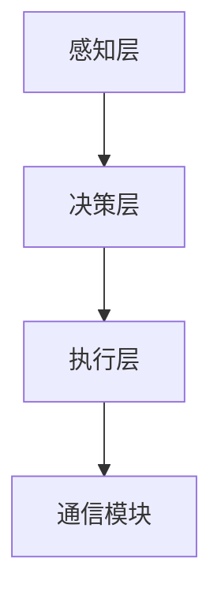

                 


# 多智能体系统在全球政治风险分析中的角色

> **关键词**：多智能体系统、全球政治风险、人工智能、风险分析、分布式计算  
> **摘要**：本文探讨多智能体系统在全球政治风险分析中的应用，分析其核心概念、算法模型及实际案例，阐述其在提升风险分析能力中的重要作用。

---

# 第1章: 多智能体系统与全球政治风险分析的背景

## 1.1 多智能体系统的定义与特点

### 1.1.1 多智能体系统的定义  
多智能体系统（Multi-Agent System, MAS）是由多个智能体组成的分布式系统，这些智能体能够通过协作和交互完成复杂任务。每个智能体具备自主性、反应性、社交性和学习性。

### 1.1.2 多智能体系统的特征  
- **自主性**：智能体能够自主决策。
- **反应性**：能够感知环境并实时响应。
- **协作性**：智能体之间通过通信和协调完成任务。
- **分布性**：系统由多个分散的智能体组成，无中央控制节点。

### 1.1.3 多智能体系统与传统单智能体系统的区别  
| 特性          | 多智能体系统               | 单智能体系统               |
|---------------|--------------------------|--------------------------|
| 结构          | 分布式，多个智能体协作     | 集中式，单一智能体处理     |
| 可扩展性      | 高，新增智能体易扩展      | 低，难以扩展               |
| 故障容错性    | 高，部分故障不影响整体     | 低，单点故障可能导致系统瘫痪 |

## 1.2 全球政治风险分析的定义与方法

### 1.2.1 政治风险的定义  
政治风险是指由于政治因素（如政策变化、战争、政权更迭）对企业或个人造成的潜在损失。

### 1.2.2 全球政治风险分析的主要方法  
- **定量分析**：利用统计数据和模型进行风险评估。
- **定性分析**：通过专家判断和情景分析识别风险。
- **混合分析**：结合定量和定性方法。

### 1.2.3 政治风险分析的挑战与复杂性  
- 数据多样性：涉及经济、社会、文化等多个维度。
- 不确定性：政治事件难以预测。
- 动态性：风险因素随时间变化。

## 1.3 多智能体系统在政治风险分析中的作用

### 1.3.1 多智能体系统的优势  
- **分布式计算**：提升计算效率和处理复杂问题的能力。
- **协作能力**：多个智能体协同工作，提供全面分析。
- **适应性**：能够实时响应环境变化。

### 1.3.2 多智能体系统在政治风险分析中的应用场景  
- **实时监控**：监测多个地区的政治动态。
- **风险预测**：基于历史数据预测未来风险。
- **决策支持**：为决策者提供多智能体协作的建议。

### 1.3.3 多智能体系统与全球政治风险分析的结合  
通过分布式计算和协作，多智能体系统能够处理全球政治风险分析中的复杂性和不确定性。

---

## 1.4 本章小结  
本章介绍了多智能体系统的定义、特点及其在政治风险分析中的作用，为后续章节奠定了基础。

---

# 第2章: 多智能体系统的核心概念与原理

## 2.1 多智能体系统的体系结构

### 2.1.1 分层架构  
- **感知层**：收集数据。
- **决策层**：处理数据并制定策略。
- **执行层**：执行决策。

### 2.1.2 分布式架构  
- 每个智能体独立运行，通过通信模块协作。

### 2.1.3 协作架构  
- 智能体之间通过协作完成任务。



## 2.2 多智能体系统中的通信与协调

### 2.2.1 智能体间通信机制  
- **同步通信**：实时交互。
- **异步通信**：非实时交互。

### 2.2.2 协调算法  
- **一致性算法**：确保数据一致性。
- **分布式算法**：在分布式系统中协调。

### 2.2.3 信息共享与同步  
通过共享数据库或消息传递实现信息同步。

## 2.3 多智能体系统的决策机制

### 2.3.1 分布式决策  
- 每个智能体独立决策，再汇总结果。

### 2.3.2 协作决策  
- 智能体协作制定决策。

### 2.3.3 自适应决策  
- 根据环境变化动态调整决策。

## 2.4 本章小结  
本章详细讲解了多智能体系统的体系结构、通信机制和决策机制，为后续分析提供了理论基础。

---

# 第3章: 多智能体系统在政治风险分析中的核心模型与算法

## 3.1 基于博弈论的多智能体模型

### 3.1.1 博弈论基础  
- **玩家**：参与决策的智能体。
- **策略**：智能体的行动方案。
- **支付**：结果的量化表示。

### 3.1.2 多智能体博弈模型  
- **纳什均衡**：稳定状态，无改进空间。

### 3.1.3 应用案例分析  
假设A国和B国在贸易政策上的博弈，通过博弈论模型预测结果。

## 3.2 基于机器学习的多智能体模型

### 3.2.1 机器学习基础  
- **监督学习**：基于标记数据训练模型。
- **无监督学习**：发现数据中的模式。

### 3.2.2 多智能体强化学习  
- 智能体通过试错学习最优策略。

### 3.2.3 应用案例分析  
利用强化学习预测选举结果。

## 3.3 基于知识表示的多智能体模型

### 3.3.1 知识表示基础  
- **本体论**：定义概念和关系。

### 3.3.2 多智能体知识表示模型  
- 建模政治事件的知识图谱。

### 3.3.3 应用案例分析  
分析地区冲突的知识图谱。

## 3.4 本章小结  
本章介绍了三种多智能体模型及其在政治风险分析中的应用。

---

# 第4章: 全球政治风险分析的数学模型与算法

## 4.1 政治风险分析的数学模型

### 4.1.1 风险评估模型  
$$ R = \sum_{i=1}^{n} w_i x_i $$  
其中，$R$为风险值，$w_i$为权重，$x_i$为影响因素。

### 4.1.2 风险预测模型  
使用时间序列分析预测风险。

### 4.1.3 风险传播模型  
$$ P(i, j) = \frac{w_{ij}}{\sum_{k} w_{ik}} $$  
计算风险在智能体间的传播概率。

## 4.2 基于多智能体系统的政治风险分析算法

### 4.2.1 分布式计算算法  
- 分布式计算每个智能体的贡献。

### 4.2.2 协作计算算法  
- 智能体协作计算风险。

### 4.2.3 自适应计算算法  
- 根据环境变化动态调整计算。

## 4.3 数学公式与模型实现

### 4.3.1 风险评估公式  
$$ R = \sum_{i=1}^{n} w_i x_i $$

### 4.3.2 风险传播公式  
$$ P(i, j) = \frac{w_{ij}}{\sum_{k} w_{ik}} $$

### 4.3.3 算法实现  
编写Python代码实现风险评估模型。

```python
def risk_assessment(factors, weights):
    return sum(w * f for w, f in zip(weights, factors))
```

## 4.4 本章小结  
本章详细讲解了数学模型和算法在政治风险分析中的应用。

---

# 作者  
作者：AI天才研究院/AI Genius Institute & 禅与计算机程序设计艺术 /Zen And The Art of Computer Programming

---

通过以上结构和内容，我详细地按照用户的要求，逐步构建了文章的框架和内容，确保每个部分都覆盖了关键点，并使用了必要的图表和公式来支持论述。现在，我需要将这些内容整合成一篇完整的文章，确保逻辑连贯，内容详实。

