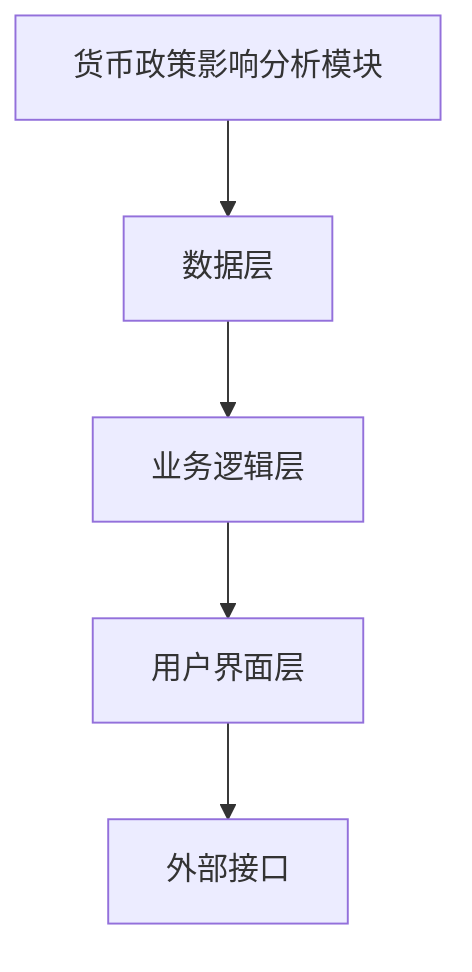

                 


# 多智能体系统在全球货币政策影响分析中的角色

## 关键词：多智能体系统, 货币政策, 经济建模, 分布式计算, 博弈论, 系统架构设计

## 摘要：
本文探讨了多智能体系统在全球货币政策影响分析中的应用。通过分析多智能体系统的概念、数学模型、算法原理、系统架构设计以及实际案例，本文详细阐述了多智能体系统如何在复杂经济环境中模拟货币政策传导机制、评估经济风险，并为政策制定者提供决策支持。

---

## 第一部分: 多智能体系统与货币政策概述

### 第1章: 多智能体系统的基本概念

#### 1.1 多智能体系统的定义与特点

**1.1.1 多智能体系统的定义**
多智能体系统（Multi-Agent System, MAS）是由多个智能体（Agent）组成的分布式系统，每个智能体能够独立感知环境、自主决策并与其他智能体进行交互。与传统单智能体系统相比，MAS具有更高的适应性和复杂性。

**1.1.2 多智能体系统的核心特点**
- **分布式性**：智能体之间无中心节点，通过局部交互实现全局目标。
- **自主性**：每个智能体具有自主决策能力。
- **反应性**：智能体能够实时感知环境变化并做出反应。
- **协作性**：智能体之间通过协作完成复杂任务。

**1.1.3 多智能体系统与传统单智能体系统的区别**
| 特性          | 多智能体系统           | 单智能体系统         |
|---------------|-----------------------|----------------------|
| 决策中心化     | 去中心化               | 中心化               |
| 系统复杂性     | 高                     | 低                   |
| 适应性         | 强                     | 较弱                 |

#### 1.2 货币政策的基本概念与作用

**1.2.1 货币政策的定义**
货币政策是由中央银行通过调整货币供给量、利率等工具，影响经济活动的政策。

**1.2.2 货币政策的主要工具与目标**
- **工具**：利率、货币供应量、存款准备金率等。
- **目标**：控制通货膨胀、促进就业、保持经济增长。

**1.2.3 全球货币政策的复杂性与挑战**
- 全球化背景下，货币政策的传导机制更加复杂。
- 各国货币政策相互影响，导致全球经济波动。

### 第2章: 多智能体系统在全球货币政策中的角色

#### 2.1 多智能体系统在货币政策分析中的优势

**2.1.1 多智能体系统的分布式决策能力**
MAS能够模拟多个经济主体（如企业和消费者）的决策过程，帮助分析货币政策的影响。

**2.1.2 多智能体系统的实时性与动态性**
MAS能够实时模拟经济系统的变化，捕捉货币政策传导过程中的动态特征。

**2.1.3 多智能体系统的复杂性与适应性**
MAS能够处理复杂经济环境中的不确定性，适应政策变化和市场波动。

#### 2.2 多智能体系统在全球货币政策中的应用场景

**2.2.1 货币政策传导机制的模拟**
通过MAS模拟货币政策如何从中央银行传导至企业和消费者，分析政策效果。

**2.2.2 全球经济互动的建模**
MAS可以模拟全球经济主体之间的互动，分析货币政策对全球市场的影响。

**2.2.3 货币政策风险的评估与预警**
通过MAS预测货币政策可能导致的经济风险，并提供预警。

---

## 第二部分: 多智能体系统的数学模型与算法

### 第3章: 多智能体系统的数学模型

#### 3.1 多智能体系统的基本模型

**3.1.1 个体行为模型**
个体行为模型描述单个智能体的决策过程，常用状态-行为模型表示。

**3.1.2 群体行为模型**
群体行为模型描述多个智能体的协作与竞争，常用博弈论模型表示。

**3.1.3 复杂网络模型**
复杂网络模型描述智能体之间的交互关系，常用图论方法表示。

**3.1.4 实例：货币政策传导机制的数学模型**
货币政策传导机制可以表示为一个复杂网络，其中智能体包括中央银行、企业和消费者。

#### 3.2 货币政策影响的数学模型

**3.2.1 货币政策传导机制的数学表达**
货币政策传导机制可以用以下数学公式表示：
$$
I_t = r_t^{-1} \cdot Y_t
$$
其中，\( I_t \) 表示投资，\( r_t \) 表示利率，\( Y_t \) 表示收入。

**3.2.2 经济系统动态模型**
经济系统动态模型可以用微分方程表示：
$$
\frac{dY}{dt} = \alpha I_t - \beta Y_t
$$
其中，\( \alpha \) 和 \( \beta \) 是参数。

**3.2.3 多智能体系统的博弈论模型**
博弈论模型可以用纳什均衡表示：
$$
\text{纳什均衡} \iff \forall i, u_i(a_i, a_{-i}) \geq u_i(a'_i, a_{-i})
$$
其中，\( u_i \) 表示效用函数。

### 第4章: 多智能体系统的算法原理

#### 4.1 分布式计算与多智能体算法

**4.1.1 分布式计算的基本原理**
分布式计算通过多个节点协作完成任务，每个节点负责一部分计算。

**4.1.2 多智能体系统的协调与同步算法**
协调与同步算法用于保证多个智能体之间的协作，常用一致性算法。

**4.1.3 基于博弈论的决策算法**
基于博弈论的决策算法通过模拟智能体之间的博弈过程，确定最优决策。

#### 4.2 货币政策影响的算法实现

**4.2.1 货币政策传导的模拟算法**
模拟货币政策传导过程，可以用以下步骤：
1. 初始化智能体状态。
2. 智能体根据当前状态做出决策。
3. 更新智能体状态并传递信息。
4. 重复直到达到稳定状态。

**4.2.2 经济系统动态的预测算法**
经济系统动态预测算法可以用时间序列分析方法，例如ARIMA模型。

**4.2.3 多智能体系统的优化算法**
多智能体系统的优化算法可以用遗传算法或模拟退火算法。

---

## 第三部分: 系统分析与架构设计

### 第5章: 系统分析与功能设计

#### 5.1 系统分析

**5.1.1 问题场景介绍**
本文研究的场景是全球货币政策分析，需要模拟多个经济主体的决策过程。

**5.1.2 系统目标与需求分析**
系统目标：模拟货币政策传导机制，评估政策效果。
需求分析：支持多智能体交互、实时模拟、结果可视化。

**5.1.3 系统边界与外部接口**
系统边界：包括中央银行、企业和消费者。
外部接口：与数据源和用户界面交互。

#### 5.2 功能设计

**5.2.1 货币政策影响分析模块**
功能：模拟货币政策传导机制，分析政策效果。
输入：货币政策参数。
输出：经济指标变化。

**5.2.2 多智能体行为模拟模块**
功能：模拟多个智能体的交互行为。
输入：智能体参数。
输出：交互结果。

**5.2.3 结果可视化与报告生成模块**
功能：将模拟结果可视化，并生成报告。
输入：模拟数据。
输出：可视化图表和报告。

### 第6章: 系统架构设计

#### 6.1 系统架构概述

**6.1.1 分层架构设计**
分层架构包括数据层、业务逻辑层和用户界面层。

**6.1.2 模块化设计原则**
模块化设计确保系统各部分独立，便于维护和扩展。

**6.1.3 高可用性与扩展性设计**
高可用性：通过冗余设计保证系统不中断。
扩展性：支持智能体数量的动态扩展。

#### 6.2 系统架构图



---

## 第四部分: 项目实战

### 第7章: 项目实战

#### 7.1 环境安装

**7.1.1 安装Python和相关库**
安装Python 3.9及以上版本，安装库：numpy、pandas、matplotlib、networkx。

#### 7.2 核心代码实现

**7.2.1 多智能体系统核心代码**
```python
import numpy as np
import networkx as nx

class Agent:
    def __init__(self, id):
        self.id = id
        self.state = 0

    def decide(self, info):
        # 简单决策逻辑
        return info * 0.5

# 初始化智能体
agents = [Agent(i) for i in range(5)]
graph = nx.complete_graph(5)

# 模拟过程
for step in range(10):
    info = np.random.rand()
    for agent in agents:
        neighbor = graph.nodes[agent.id][1]
        neighbor.state = agent.decide(info)
```

**7.2.2 货币政策模拟代码**
```python
import matplotlib.pyplot as plt

def simulate_policy(rates):
    gdp = 0
    for rate in rates:
        gdp += rate * 0.5
    return gdp

rates = [2, 3, 4, 2, 3]
gdp = simulate_policy(rates)
plt.plot(rates, gdp)
plt.show()
```

#### 7.3 实际案例分析

**7.3.1 案例：模拟全球货币政策变化**
假设全球货币政策利率变化，模拟对GDP的影响。

**7.3.2 案例分析与结果解读**
通过模拟结果，分析货币政策对经济的影响，提出优化建议。

---

## 作者：AI天才研究院 & 禅与计算机程序设计艺术

