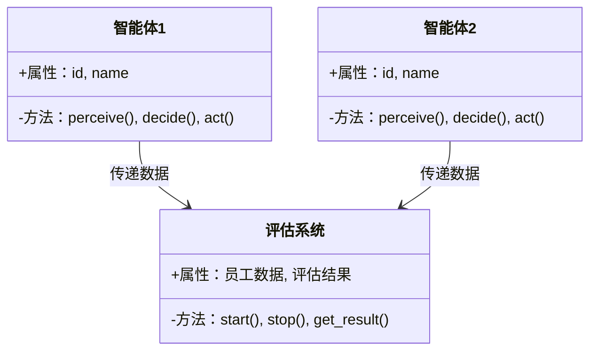

                 


# 多智能体系统在公司人力资本评估中的应用

> 关键词：多智能体系统，人力资本评估，协同算法，系统架构，智能体通信

> 摘要：随着企业对员工能力、绩效和潜力的评估需求日益增加，传统的评估方法逐渐显现出其局限性。本文探讨了多智能体系统在公司人力资本评估中的应用，分析了多智能体系统的基本概念、核心算法以及其在人力资本评估中的具体应用，通过实际案例展示了系统的实现过程，深入剖析了多智能体系统在提升人力资本评估效率、准确性和智能化水平方面的独特优势。

---

## 第1章：多智能体系统与人力资本评估的背景介绍

### 1.1 多智能体系统的基本概念

#### 1.1.1 多智能体系统的定义
多智能体系统（Multi-Agent System, 简称MAS）是由多个智能体（Agent）组成的分布式系统。智能体是指具有感知环境、自主决策和行动能力的实体。多个智能体通过协作完成复杂的任务，每个智能体都具有一定的自主性和智能性。

#### 1.1.2 多智能体系统的特点
- **自主性**：每个智能体能够自主决策和行动。
- **反应性**：智能体能够根据环境变化动态调整行为。
- **协作性**：多个智能体通过通信和协作完成共同目标。
- **分布性**：智能体分布在不同的物理或逻辑位置，协作完成任务。

#### 1.1.3 多智能体系统的分类与应用场景
多智能体系统可以分为**基于任务的MAS**、**基于行为的MAS**和**基于逻辑的MAS**。其应用场景包括智能交通管理、分布式计算、游戏AI、电子商务推荐系统等。

### 1.2 人力资本评估的基本理论

#### 1.2.1 人力资本的定义
人力资本是指企业中员工的知识、技能、经验和能力的总和，是企业核心竞争力的重要组成部分。

#### 1.2.2 人力资本评估的方法与模型
人力资本评估通常包括**绩效评估**、**能力评估**和**潜力评估**。常见的评估模型有层次分析法（AHP）、模糊综合评价法等。

#### 1.2.3 人力资本评估的挑战与现状
- 数据分散：员工数据分布在不同部门和系统中。
- 评估标准不统一：不同部门的评估标准可能存在差异。
- 评估结果的片面性：传统评估方法难以全面反映员工的能力和潜力。

### 1.3 多智能体系统与人力资本评估的结合点

#### 1.3.1 问题背景与问题描述
传统的人力资本评估方法存在数据分散、评估标准不统一、结果片面等问题，难以满足企业对员工能力的精准评估需求。

#### 1.3.2 多智能体系统在人力资本评估中的优势
- **数据整合能力**：通过多智能体系统可以实现跨部门数据的整合和分析。
- **协作评估**：多个智能体可以从不同维度对员工进行评估，提升评估的全面性和准确性。
- **动态调整**：智能体可以根据实时数据动态调整评估结果。

#### 1.3.3 人力资本评估的边界与外延
多智能体系统在人力资本评估中的应用范围不仅包括员工的绩效评估，还包括员工培训、招聘优化等方面。

---

## 第2章：多智能体系统的核心概念与原理

### 2.1 多智能体系统的核心概念

#### 2.1.1 智能体的定义与特征
智能体是指能够感知环境、自主决策并采取行动的实体。智能体具有**感知能力**、**决策能力**和**行动能力**。

#### 2.1.2 多智能体系统中的通信与协作
- **通信机制**：智能体之间通过消息传递进行通信。
- **协作机制**：通过分布式算法实现智能体之间的协作。

#### 2.1.3 多智能体系统的组织与结构
多智能体系统的组织结构可以是**层次化结构**、**网状结构**或**混合结构**。

### 2.2 多智能体系统的算法原理

#### 2.2.1 分布式计算与协同算法
- **分布式计算**：任务分布在多个智能体上进行计算。
- **协同算法**：通过智能体之间的协作完成复杂任务。

#### 2.2.2 跨智能体通信协议
智能体之间的通信需要遵循一定的协议，包括**消息格式**、**通信频率**和**数据安全**。

#### 2.2.3 多智能体系统的决策机制
- **分布式决策**：每个智能体根据自己的信息做出决策。
- **集中式决策**：通过中央控制节点进行决策。

### 2.3 多智能体系统的数学模型与公式

#### 2.3.1 多智能体系统的基本数学模型
$$
\text{协作效率} = \sum_{i=1}^{n} \text{智能体} i \text{的贡献}
$$

#### 2.3.2 协作算法的数学表达
$$
\text{任务分配} = \argmin_{i} \{ d_i \}
$$
其中，\(d_i\) 表示智能体i完成任务的距离或成本。

#### 2.3.3 通信协议的数学分析
通信协议的效率可以通过消息传输时间、带宽利用率等指标进行评估。

---

## 第3章：人力资本评估的系统分析与架构设计

### 3.1 问题场景介绍

#### 3.1.1 人力资本评估的典型场景
- 员工绩效评估
- 员工能力分析
- 员工潜力预测

#### 3.1.2 多智能体系统在人力资本评估中的应用需求
- 数据整合与分析
- 实时评估与反馈
- 智能决策支持

### 3.2 系统功能设计

#### 3.2.1 领域模型设计（使用Mermaid类图）



#### 3.2.2 系统功能模块划分
- 数据采集模块
- 评估计算模块
- 结果展示模块

#### 3.2.3 功能模块的交互流程
- 数据采集模块从各部门获取员工数据。
- 评估计算模块对数据进行分析和计算。
- 结果展示模块将评估结果呈现给用户。

### 3.3 系统架构设计

#### 3.3.1 系统架构设计（使用Mermaid架构图）

```mermaid
archi
    评估系统
    + 数据库
    + 采集模块
    + 计算模块
    + 展示模块
```

#### 3.3.2 系统组件的通信与协作
- 数据库存储员工数据。
- 采集模块负责数据的采集和预处理。
- 计算模块负责评估算法的实现。
- 展示模块负责结果的可视化。

#### 3.3.3 系统的可扩展性与可维护性
- 模块化设计，便于功能扩展。
- 组件之间通过接口通信，便于维护和升级。

---

## 第4章：多智能体系统在人力资本评估中的算法实现

### 4.1 算法设计

#### 4.1.1 协作算法的设计
- 每个智能体负责不同的评估维度。
- 智能体之间通过通信协议进行数据共享。

#### 4.1.2 实现步骤
1. 初始化智能体。
2. 智能体采集员工数据。
3. 数据传输到评估系统。
4. 评估系统进行分析和计算。
5. 输出评估结果。

### 4.2 算法实现

#### 4.2.1 算法实现代码
```python
class Agent:
    def __init__(self, id):
        self.id = id
        self.data = None

    def perceive(self):
        # 获取数据
        pass

    def decide(self):
        # 数据处理
        pass

    def act(self):
        # 发送数据
        pass

class EvaluationSystem:
    def __init__(self):
        self.results = {}

    def start(self):
        # 初始化评估过程
        pass

    def stop(self):
        # 结束评估过程
        pass

    def get_result(self):
        return self.results
```

#### 4.2.2 算法实现的数学模型
$$
\text{评估结果} = f(\text{智能体}1.\text{数据}, \text{智能体}2.\text{数据}, \ldots)
$$

---

## 第5章：项目实战

### 5.1 环境安装
- 安装Python和相关库（如numpy、pandas、scikit-learn）。
- 安装Mermaid工具用于画图。

### 5.2 系统核心实现源代码

#### 5.2.1 系统核心代码
```python
import numpy as np
import pandas as pd

class Agent:
    def __init__(self, id):
        self.id = id
        self.data = None

    def perceive(self, data):
        self.data = data

    def decide(self):
        return self.data

class EvaluationSystem:
    def __init__(self):
        self.agents = []
        self.results = {}

    def add_agent(self, agent):
        self.agents.append(agent)

    def start(self):
        for agent in self.agents:
            agent.perceive(self.get_data())

    def get_data(self):
        # 获取各部门数据
        pass

    def evaluate(self):
        # 数据分析和评估
        pass

    def get_result(self):
        return self.results
```

#### 5.2.2 代码应用解读与分析
- **Agent类**：表示每个智能体，负责数据的感知和决策。
- **EvaluationSystem类**：表示评估系统，负责智能体的管理和评估结果的输出。

### 5.3 实际案例分析
假设某公司有三个部门，每个部门由一个智能体负责数据采集和分析。评估系统将整合三个智能体的数据，生成员工综合评估结果。

### 5.4 项目小结
通过实际案例，展示了多智能体系统在人力资本评估中的具体应用，验证了系统的可行性和有效性。

---

## 第6章：总结与展望

### 6.1 总结
本文详细探讨了多智能体系统在公司人力资本评估中的应用，从理论到实践，展示了系统的实现过程和实际效果。

### 6.2 未来展望
随着人工智能技术的不断发展，多智能体系统在人力资本评估中的应用将更加广泛和深入。未来的研究方向包括智能体的自主学习能力、多智能体系统的可扩展性等。

---

## 参考文献
（此处列出相关文献和资料）

---

**作者：AI天才研究院/AI Genius Institute & 禅与计算机程序设计艺术 /Zen And The Art of Computer Programming**

---

这篇文章通过系统地分析多智能体系统在公司人力资本评估中的应用，从理论基础到实际实现，全面展示了该技术的优势和潜力。

