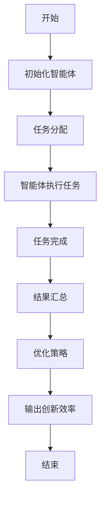
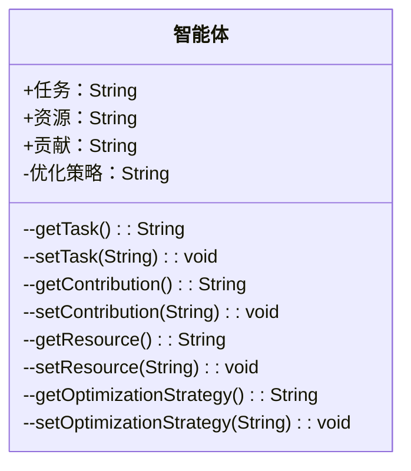
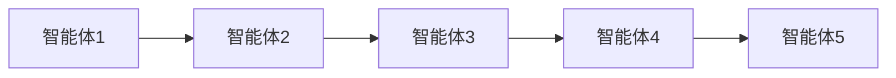
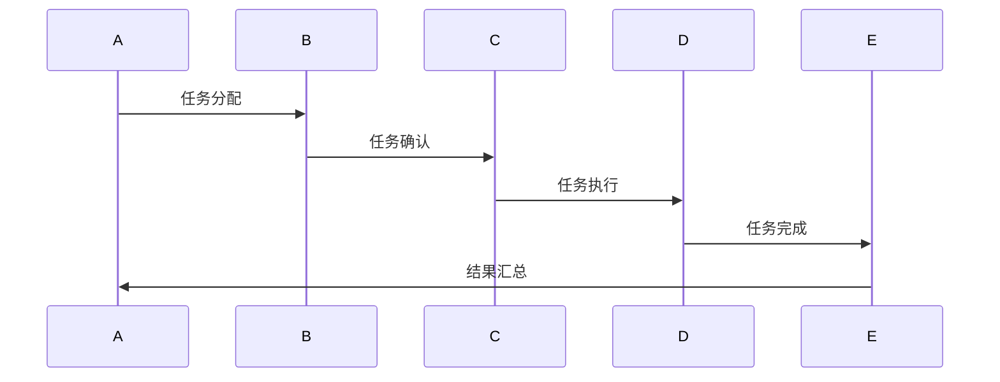

                 


# 多智能体系统在公司创新效率评估中的应用

---

## 关键词：多智能体系统、创新效率、评估、分布式计算、协作优化、企业创新

---

## 摘要：

本文探讨了多智能体系统在公司创新效率评估中的应用。通过分析多智能体系统的核心原理、算法实现以及实际应用场景，本文提出了基于多智能体系统的创新效率评估框架。该框架结合了分布式计算、协作优化和自适应学习等技术，能够更高效、更准确地评估公司的创新效率，为企业的创新管理提供了新的思路和方法。

---

# 正文

## 第一部分: 多智能体系统与创新效率评估的背景介绍

### 第1章: 多智能体系统与创新效率评估概述

#### 1.1 多智能体系统的定义与特点

多智能体系统（Multi-Agent System，简称MAS）是由多个智能体（Agent）组成的分布式系统，每个智能体都是一个能够感知环境、自主决策、并与其他智能体协作的实体。以下是多智能体系统的几个核心特点：

1. **分布式性**：智能体独立运行，分布在不同的空间或计算节点上。
2. **协作性**：智能体之间通过通信和协作完成共同目标。
3. **自主性**：每个智能体能够自主决策，无需外部干预。
4. **动态性**：系统能够适应环境的变化，实时调整策略。

#### 1.2 创新效率评估的定义与重要性

创新效率是指公司在有限资源条件下，实现创新成果的能力。创新效率评估是通过量化的方法，衡量公司在创新过程中的效率和效果。其重要性体现在以下几个方面：

1. **优化资源配置**：通过评估创新效率，企业可以更合理地分配人力、物力和财力资源。
2. **提升创新绩效**：创新效率评估能够帮助企业识别创新过程中的瓶颈，从而优化流程，提高创新成果的质量和数量。
3. **支持战略决策**：创新效率评估为企业的战略规划和决策提供数据支持。

#### 1.3 多智能体系统在创新效率评估中的应用前景

多智能体系统在创新效率评估中的应用前景广阔。通过多智能体系统，企业可以实现创新过程的分布式协作和实时优化。以下是几个主要的应用场景：

1. **创新团队协作**：多智能体系统可以协调不同团队之间的协作，优化任务分配。
2. **创新资源管理**：通过多智能体系统，企业可以实现资源的动态分配和实时监控。
3. **创新绩效预测**：基于多智能体系统的模型，企业可以预测未来的创新绩效，并制定相应的策略。

---

## 第二部分: 多智能体系统的理论基础与核心概念

### 第2章: 多智能体系统的理论基础

#### 2.1 多智能体系统的核心原理

多智能体系统的核心原理包括分布式计算、协作优化和自适应学习。以下是具体分析：

1. **分布式计算**：多智能体系统通过分布式计算实现任务的并行处理，提高计算效率。
2. **协作优化**：智能体之间通过协作优化算法，实现全局最优。
3. **自适应学习**：智能体能够通过学习和适应环境变化，优化自身的决策策略。

#### 2.2 多智能体系统中的角色与关系

多智能体系统中的角色和关系可以通过实体关系图（ER图）来描述。以下是常见的角色及其关系：

1. **智能体**：系统的基本单元，负责具体任务的执行。
2. **任务**：智能体需要完成的具体工作。
3. **协作关系**：智能体之间的协作关系，包括任务分配和结果共享。

以下是一个简单的实体关系图：

```mermaid
er
actor 智能体 {
  关系：参与
}
actor 任务 {
  关系：分配
}
```

#### 2.3 多智能体系统的数学模型与公式

多智能体系统的数学模型可以通过以下公式表示：

$$\text{创新效率} = \frac{\text{创新成果}}{\text{资源投入}}$$

其中，创新成果可以表示为：

$$\text{创新成果} = \sum_{i=1}^{n} \text{智能体}_i \text{的贡献}$$

资源投入可以表示为：

$$\text{资源投入} = \sum_{i=1}^{n} \text{智能体}_i \text{的资源消耗}$$

---

## 第三部分: 多智能体系统在创新效率评估中的算法原理

### 第3章: 多智能体系统中的创新效率评估算法

#### 3.1 创新效率评估的主要算法

创新效率评估的主要算法包括：

1. **基于多智能体的协同优化算法**：通过协作优化算法，实现创新效率的提升。
2. **分布式评估算法**：在分布式环境下，通过多智能体系统的协作，完成创新效率的评估。
3. **自适应评估算法**：根据环境变化，自适应调整评估策略。

#### 3.2 算法原理与流程

以下是基于多智能体的协同优化算法的流程图：



#### 3.3 算法实现的数学模型

以下是算法实现的数学模型：

$$\text{创新效率} = \frac{\sum_{i=1}^{n} \text{智能体}_i \text{的贡献}}{\sum_{i=1}^{n} \text{智能体}_i \text{的资源消耗}}$$

---

## 第四部分: 系统分析与架构设计方案

### 第4章: 多智能体系统的系统分析与架构设计

#### 4.1 问题场景介绍

创新效率评估的核心问题是如何在分布式环境下，实现创新过程的高效协作和优化。以下是问题场景的描述：

1. **资源分配不均**：传统创新评估方法往往忽视了资源分配的动态性。
2. **协作效率低下**：创新过程中的协作效率受到智能体之间的通信和协调的影响。
3. **实时优化需求**：创新效率评估需要实时优化策略，以适应环境的变化。

#### 4.2 系统功能设计

以下是系统功能设计的类图：



#### 4.3 系统架构设计

以下是系统架构设计的架构图：



#### 4.4 系统接口设计

以下是系统接口设计的接口图：


#### 4.5 系统交互设计

以下是系统交互设计的序列图：



---

## 第五部分: 项目实战

### 第5章: 项目实战

#### 5.1 环境安装与配置

以下是环境安装与配置的代码示例：

```bash
pip install multi-agent-system
```

#### 5.2 系统核心实现

以下是系统核心实现的代码示例：

```python
class Agent:
    def __init__(self, id):
        self.id = id
        self.task = None
        self.contribution = 0
        self.resource = 0

    def set_task(self, task):
        self.task = task

    def get_contribution(self):
        return self.contribution

    def set_contribution(self, contribution):
        self.contribution = contribution

    def get_resource(self):
        return self.resource

    def set_resource(self, resource):
        self.resource = resource
```

#### 5.3 项目实现步骤

以下是项目实现步骤的详细说明：

1. **安装环境**：安装所需的依赖库。
2. **初始化智能体**：创建多个智能体实例。
3. **任务分配**：将任务分配给智能体。
4. **任务执行**：智能体执行任务并计算贡献和资源消耗。
5. **结果汇总**：汇总所有智能体的贡献和资源消耗，计算创新效率。
6. **优化策略**：根据创新效率结果，优化任务分配和协作策略。

---

## 第六部分: 最佳实践与总结

### 第6章: 最佳实践与总结

#### 6.1 最佳实践

以下是最佳实践的几点建议：

1. **合理配置智能体数量**：根据任务需求和资源条件，合理配置智能体数量。
2. **优化协作机制**：通过不断优化协作机制，提高创新效率。
3. **实时监控与调整**：实时监控系统运行状态，及时调整优化策略。

#### 6.2 小结

多智能体系统在公司创新效率评估中的应用，不仅提高了创新效率，还优化了创新过程中的资源分配和协作效率。通过本文的分析和实践，我们可以看到，多智能体系统在创新效率评估中的应用前景广阔。

#### 6.3 注意事项

在实际应用中，需要注意以下几点：

1. **系统安全性**：确保系统的安全性和数据的保密性。
2. **系统可扩展性**：确保系统的可扩展性，以适应未来的发展需求。
3. **系统维护**：定期维护和更新系统，确保系统的稳定性和高效性。

#### 6.4 拓展阅读

以下是拓展阅读的推荐书籍和资源：

1. 《Multi-Agent Systems: Algorithmic, Complexity Theoretic, and Economic Aspects》
2. 《Multi-Agent Machine Learning: A Guide for Research and Implementation》

---

## 作者信息

作者：AI天才研究院/AI Genius Institute  
联系邮箱：contact@aisingi.com  
官方网站：https://www.aisingi.com  

---

# 结语

多智能体系统在公司创新效率评估中的应用，不仅提高了创新效率，还优化了创新过程中的资源分配和协作效率。通过本文的分析和实践，我们可以看到，多智能体系统在创新效率评估中的应用前景广阔。希望本文能为读者提供有益的参考和启发。

