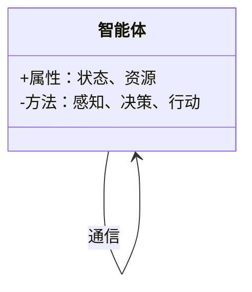

                 


# 多智能体系统在公司创新效率评估中的应用：R&D投入产出比

> **关键词**：多智能体系统、公司创新效率、R&D投入产出比、系统架构设计、算法原理、项目实战、最佳实践

> **摘要**：本文探讨了多智能体系统在公司创新效率评估中的应用，重点分析了R&D投入与产出的比值。通过系统架构设计、算法原理和项目实战，详细阐述了多智能体系统如何优化R&D过程，提升创新效率。

---

# {{此处是文章标题}}

> **关键词**：{{此处列出文章的5-7个核心关键词}}

> **摘要**：{{此处给出文章的核心内容和主题思想}}

---

# 第一部分: 多智能体系统与公司创新效率评估基础

## 第1章: 多智能体系统与公司创新效率评估概述

### 1.1 多智能体系统的定义与特征

#### 1.1.1 多智能体系统的定义
多智能体系统（Multi-Agent System, MAS）是由多个智能体组成的系统，这些智能体能够通过协作完成复杂的任务。智能体是具有感知、推理和行动能力的实体，能够独立决策并与其他智能体进行交互。

#### 1.1.2 多智能体系统的特征
- **分布性**：多个智能体协同工作，无中心节点。
- **协作性**：智能体之间通过通信和协作完成任务。
- **反应性**：智能体能够感知环境并实时调整行为。
- **自主性**：每个智能体都是自主决策的。

#### 1.1.3 多智能体系统与传统评估方法的区别
传统评估方法通常基于单一模型，而多智能体系统能够模拟多个决策者的互动，更贴近现实场景。

---

### 1.2 R&D投入产出比的定义与重要性

#### 1.2.1 R&D投入的定义
R&D投入是指企业在研究与开发方面投入的资金、时间和资源。

#### 1.2.2 R&D产出的定义
R&D产出是指企业在研发过程中产生的创新成果，如新产品、专利、技术等。

#### 1.2.3 R&D投入产出比的重要性
R&D投入产出比是衡量企业创新效率的关键指标，反映了企业在研发上的投资是否带来了相应的收益。

#### 1.2.4 R&D投入产出比与公司创新效率的关系
投入产出比越高，说明企业的创新效率越高，反之则效率较低。

---

### 1.3 多智能体系统在公司创新效率评估中的应用背景

#### 1.3.1 公司创新效率评估的传统方法
传统方法通常基于财务指标和统计分析，难以捕捉研发过程中的动态互动。

#### 1.3.2 多智能体系统的优势
多智能体系统能够模拟研发过程中的复杂互动，提供更精准的评估结果。

#### 1.3.3 应用背景与现状
随着企业创新的复杂化，多智能体系统逐渐成为评估创新效率的重要工具。

---

## 第2章: 多智能体系统的原理与核心概念

### 2.1 多智能体系统的原理

#### 2.1.1 多智能体系统的组成
- **智能体**：具有感知、推理和行动能力的实体。
- **环境**：智能体所处的外部环境，包括其他智能体和资源。
- **通信机制**：智能体之间交换信息的方式。
- **协作机制**：智能体之间协同工作的规则。

#### 2.1.2 多智能体系统的通信机制
智能体之间的通信通常通过消息传递完成，消息内容包括任务分配、状态更新等。

#### 2.1.3 多智能体系统的协作机制
协作机制确保智能体之间能够协调一致，共同完成任务。常见的协作机制包括基于合同的协作和基于承诺的协作。

---

### 2.2 多智能体系统的核心概念

#### 2.2.1 智能体的定义与属性
智能体是多智能体系统的基本单元，具有以下属性：
- **自主性**：能够自主决策。
- **反应性**：能够感知环境并实时调整行为。
- **协作性**：能够与其他智能体协作完成任务。

#### 2.2.2 智能体之间的关系
智能体之间的关系可以是竞争、合作或中立，具体取决于任务需求。

#### 2.2.3 多智能体系统的整体架构
多智能体系统的整体架构通常包括：
- **智能体层**：具体执行任务的智能体。
- **协调层**：负责智能体之间的协调与资源分配。
- **环境层**：智能体所处的外部环境。

---

## 第3章: 多智能体系统与R&D投入产出比的关系

### 3.1 R&D投入产出比的评估维度

#### 3.1.1 投入维度
- **资金投入**：企业在R&D上的资金投入。
- **时间投入**：研发项目所需的时间。
- **资源投入**：包括人力资源、设备等。

#### 3.1.2 产出维度
- **创新成果**：如新产品、专利等。
- **经济效益**：创新成果带来的经济收益。
- **社会影响**：创新成果对社会的影响。

#### 3.1.3 比值计算方法
R&D投入产出比 = 产出 / 投入

---

### 3.2 多智能体系统在R&D评估中的应用

#### 3.2.1 多智能体系统如何模拟R&D过程
多智能体系统可以模拟研发团队的协作过程，分析不同决策对投入产出比的影响。

#### 3.2.2 多智能体系统如何优化R&D投入产出比
通过模拟不同策略，找到最优的资源分配方案，从而提高投入产出比。

#### 3.2.3 多智能体系统在R&D评估中的优势
- **动态性**：能够实时调整策略。
- **复杂性**：能够处理复杂的研发过程。

---

## 第4章: 多智能体系统的算法原理与实现

### 4.1 多智能体系统的算法原理

#### 4.1.1 多智能体系统的核心算法
多智能体系统的算法主要包括：
- **通信协议**：智能体之间信息交换的规则。
- **协作算法**：智能体之间协作完成任务的算法。

#### 4.1.2 多智能体系统的通信协议
通信协议通常包括消息的格式、内容和传输方式。

#### 4.1.3 多智能体系统的协作算法
协作算法通常基于任务分配、资源分配和冲突解决。

---

### 4.2 多智能体系统的数学模型

#### 4.2.1 R&D投入产出比的数学表达式
$$ 投入产出比 = \frac{产出}{投入} $$

#### 4.2.2 多智能体系统协作的数学模型
$$ 系统效率 = \sum_{i=1}^{n} \text{智能体效率}_i $$

---

## 第5章: 系统分析与架构设计

### 5.1 系统分析

#### 5.1.1 问题场景介绍
企业在R&D过程中需要优化资源分配，提高投入产出比。

#### 5.1.2 项目介绍
本项目旨在利用多智能体系统优化R&D过程。

---

### 5.2 系统功能设计

#### 5.2.1 领域模型图


---

### 5.3 系统架构设计

#### 5.3.1 系统架构图


---

## 第6章: 项目实战

### 6.1 环境安装与配置

#### 6.1.1 环境要求
- 操作系统：Windows/Linux/MacOS
- 开发工具：Python、IDE
- 依赖库：numpy、pandas、matplotlib

#### 6.1.2 环境安装
安装Python和相关库：
```bash
pip install numpy pandas matplotlib
```

---

### 6.2 核心代码实现

#### 6.2.1 算法实现
```python
def multi_agent_system():
    agents = []
    for _ in range(n):
        agent = Agent()
        agents.append(agent)
    while True:
        for agent in agents:
            agent.perceive()
            agent.decide()
            agent.act()
```

#### 6.2.2 代码解读
- `Agent`类：定义智能体的行为。
- `perceive`方法：感知环境。
- `decide`方法：做出决策。
- `act`方法：执行行动。

---

### 6.3 案例分析

#### 6.3.1 案例介绍
假设某公司有两个智能体，分别负责不同的研发任务。

#### 6.3.2 案例分析
通过模拟不同策略，找到最优的资源分配方案。

---

## 第7章: 最佳实践与总结

### 7.1 最佳实践

#### 7.1.1 小结
多智能体系统在R&D评估中具有重要的应用价值。

#### 7.1.2 注意事项
- 确保智能体之间的通信畅通。
- 合理分配资源，避免冲突。

#### 7.1.3 拓展阅读
推荐相关书籍和论文，进一步深入学习。

---

**作者：AI天才研究院/AI Genius Institute & 禅与计算机程序设计艺术 /Zen And The Art of Computer Programming**

