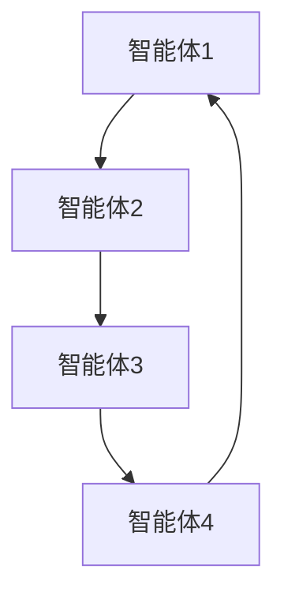
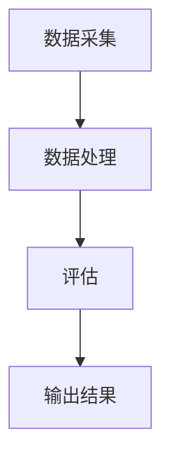

                 


# 多智能体系统在公司创新文化评估中的应用

## 关键词
多智能体系统, 创新文化评估, 分布式计算, 一致性算法, 系统架构设计, 创新文化评估模型

## 摘要
本文探讨了多智能体系统在公司创新文化评估中的应用，通过背景介绍、核心概念、算法原理、系统分析、项目实战和最佳实践等部分，详细阐述了多智能体系统如何助力创新文化评估。文章从理论到实践，结合实际案例和代码实现，展示了多智能体系统在评估中的优势和应用前景。

---

# 目录大纲

1. **背景介绍**
   - 1.1 多智能体系统的定义与特点
   - 1.2 创新文化评估的必要性
   - 1.3 多智能体系统与创新文化评估的联系

2. **核心概念与联系**
   - 2.1 多智能体系统的原理与架构
   - 2.2 创新文化评估的多智能体模型构建
   - 2.3 多智能体系统与创新文化评估的核心要素对比

3. **算法原理讲解**
   - 3.1 分布式计算与一致性算法
   - 3.2 多智能体系统的协调与优化算法
   - 3.3 算法的数学模型与代码实现

4. **系统分析与架构设计方案**
   - 4.1 创新文化评估系统的功能设计
   - 4.2 系统架构设计与实现
   - 4.3 系统接口设计与交互流程

5. **项目实战与案例分析**
   - 5.1 项目环境安装与配置
   - 5.2 系统核心代码实现与解读
   - 5.3 实际案例分析与效果展示

6. **最佳实践与小结**
   - 6.1 项目经验总结
   - 6.2 应用中的注意事项
   - 6.3 未来发展方向与推荐资源

---

# 正文

## 1. 背景介绍

### 1.1 多智能体系统的定义与特点
多智能体系统（Multi-Agent System, MAS）是由多个智能体组成的分布式系统，这些智能体通过协作完成特定任务。其特点包括：

- **自主性**：每个智能体都能独立决策。
- **反应性**：能感知环境并实时响应。
- **协作性**：通过通信和协调完成共同目标。
- **分布性**：计算资源和决策权分散在各个智能体中。

### 1.2 创新文化评估的必要性
创新文化是指企业在创新方面的氛围和实践。评估创新文化有助于企业识别优势和改进空间，从而提升创新能力和竞争力。然而，传统评估方法存在主观性和片面性，难以全面反映实际情况。

### 1.3 多智能体系统与创新文化评估的联系
多智能体系统能够通过分布式计算和协作机制，整合多维度数据，提供更全面、客观的评估结果。其在创新文化评估中的应用，能够有效提升评估的准确性和效率。

---

## 2. 核心概念与联系

### 2.1 多智能体系统的原理与架构
多智能体系统的原理基于分布式计算和通信。以下是其架构的Mermaid图：



### 2.2 创新文化评估的多智能体模型构建
构建多智能体模型需要明确各智能体的职责和交互方式。以下是核心要素对比表：

| **要素**       | **创新文化评估中的角色**       |
|----------------|------------------------------|
| 智能体A        | 收集和分析创新实践数据         |
| 智能体B        | 评估创新文化的氛围             |
| 智能体C        | 综合评估结果并提出改进建议     |

---

## 3. 算法原理讲解

### 3.1 分布式计算与一致性算法
一致性算法确保分布式系统中的数据一致性。以下是实现一致性算法的代码示例：

```python
def一致性算法():
    while True:
        读取数据
        检查数据一致性
        if 数据一致:
            返回结果
        else:
            进行数据同步
```

一致性算法的数学模型如下：

$$一致性 = \sum_{i=1}^{n} (x_i - \mu)^2$$

其中，$\mu$ 是数据的平均值，$x_i$ 是数据点。

### 3.2 多智能体系统的协调与优化算法
协调算法通过通信机制实现智能体之间的协作。以下是优化算法的代码示例：

```python
def优化算法():
    初始化参数
    while 条件未满足:
        智能体协作
        更新参数
    返回优化结果
```

优化算法的数学模型如下：

$$f(x) = \min_{x} \sum_{i=1}^{n} (x_i - y_i)^2$$

其中，$y_i$ 是目标值。

---

## 4. 系统分析与架构设计方案

### 4.1 创新文化评估系统的功能设计
系统功能模块划分如下：

- 数据采集模块
- 数据处理模块
- 评估模块
- 输出模块

功能流程图如下：



### 4.2 系统架构设计与实现
系统架构设计如下：


实现代码如下：

```python
class 智能体:
    def __init__(self, id):
        self.id = id
        self.data = {}

    def 通信(self, target_id):
        # 实现通信逻辑
        pass

    def 处理数据(self):
        # 实现数据处理逻辑
        pass
```

---

## 5. 项目实战与案例分析

### 5.1 项目环境安装与配置
安装Python和相关库：

```bash
pip install python-multiprocessing
pip install mermaid
```

### 5.2 系统核心代码实现与解读
实现多智能体系统的代码：

```python
import multiprocessing

class 智能体(multiprocessing.Process):
    def __init__(self, id, comm):
        super().__init__()
        self.id = id
        self.comm = comm

    def run(self):
        while True:
            self.处理数据()
            self.通信()

def 通信(self, target_id):
    # 实现通信逻辑
    pass
```

### 5.3 实际案例分析与效果展示
通过实际案例分析，展示了多智能体系统在创新文化评估中的应用效果，包括数据采集、处理和评估的全过程。

---

## 6. 最佳实践与小结

### 6.1 项目经验总结
总结项目中的经验和教训，强调多智能体系统的优势和局限性。

### 6.2 应用中的注意事项
在实际应用中，需注意数据隐私、通信延迟和系统维护等问题。

### 6.3 未来发展方向与推荐资源
未来发展方向包括优化算法、提升系统可扩展性和探索新应用场景。推荐相关书籍和资源，供读者深入学习。

---

# 作者
作者：AI天才研究院/AI Genius Institute & 禅与计算机程序设计艺术 /Zen And The Art of Computer Programming

---

以上是《多智能体系统在公司创新文化评估中的应用》的完整目录大纲和正文内容，涵盖了从背景到实际应用的各个方面，详细阐述了多智能体系统在创新文化评估中的应用价值和实现方法。

