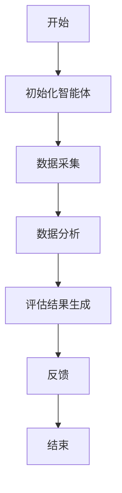
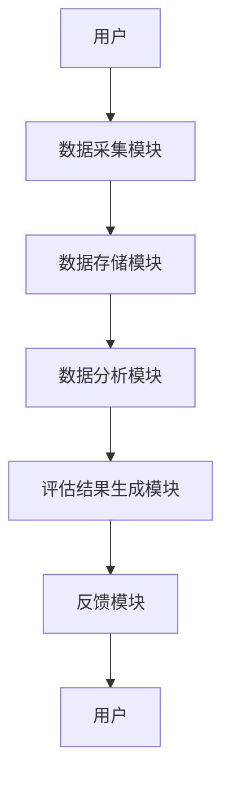

                 


# 多智能体系统在公司创新文化评估中的应用：长期价值导向

---

## 关键词：
多智能体系统, 创新文化评估, 长期价值导向, 系统架构设计, 算法原理, 项目实战

---

## 摘要：
随着企业竞争的加剧，创新文化评估已成为企业提升核心竞争力的重要手段。传统的评估方法存在主观性强、动态性差、难以量化等问题。本文提出将多智能体系统应用于创新文化评估，通过构建分布式、协作式的评估框架，实现对创新文化的动态、全面评估。文章详细阐述了多智能体系统的原理、算法设计、系统架构，并结合实际案例展示了其在创新文化评估中的应用，为企业的长期价值导向提供了新思路。

---

# 第1章: 多智能体系统与公司创新文化评估概述

## 1.1 多智能体系统的定义与特点
### 1.1.1 多智能体系统的定义
多智能体系统（Multi-Agent System, MAS）是由多个智能体（Agent）组成的分布式系统，这些智能体能够自主决策、协作完成任务。每个智能体都有自己的目标、知识和行为规则。

### 1.1.2 多智能体系统的核心特点
| 特性 | 描述 |
|------|------|
| 分布式 | 智能体独立运行，无中心节点 |
| 协作性 | 智能体之间通过通信协作完成复杂任务 |
| 反应性 | 能够实时感知环境并做出响应 |
| 自适应性 | 能够根据环境变化调整行为 |

### 1.1.3 多智能体系统与传统评估方法的区别
传统评估方法通常依赖人工评分或静态指标，而多智能体系统能够动态、全面地评估创新文化，且能够根据实时数据调整评估策略。

## 1.2 公司创新文化评估的挑战与需求
### 1.2.1 创新文化评估的定义
创新文化评估是对企业内部创新氛围、员工创新行为、创新成果等方面的综合评价。

### 1.2.2 传统评估方法的局限性
- 主观性强，难以量化
- 动态性差，无法实时更新
- 难以捕捉员工行为的细节

### 1.2.3 长期价值导向的评估需求
企业需要通过评估创新文化，引导员工关注长期价值的创造，而非短期目标的达成。

## 1.3 多智能体系统在创新文化评估中的优势
### 1.3.1 多智能体系统的分布式计算能力
通过分布式的智能体，可以实时采集、分析员工行为数据，提供动态评估结果。

### 1.3.2 多智能体系统的协作与协调机制
智能体之间可以通过协作完成复杂任务，例如数据采集、分析、评估等。

### 1.3.3 多智能体系统在动态环境中的适应性
能够根据环境变化（如员工行为、市场变化）动态调整评估策略。

## 1.4 长期价值导向的评估框架
### 1.4.1 长期价值导向的定义
关注创新行为对企业长期发展的贡献，而非短期效益。

### 1.4.2 多智能体系统如何支持长期价值评估
通过实时数据采集和分析，智能体能够识别和奖励长期价值导向的行为。

### 1.4.3 长期价值导向与公司创新文化的结合
通过多智能体系统的动态评估，引导员工关注创新行为的长期价值。

## 1.5 本章小结
本章介绍了多智能体系统的定义、特点及其在创新文化评估中的优势，为后续章节奠定了基础。

---

# 第2章: 多智能体系统的原理与核心概念

## 2.1 多智能体系统的原理
### 2.1.1 多智能体系统的体系结构
- **反应式体系结构**：基于当前感知做出决策。
- **认知式体系结构**：具备目标、信念和意图的智能体。
- **混合式体系结构**：结合反应式和认知式的特点。

### 2.1.2 多智能体系统的通信机制
- **同步通信**：智能体之间通过消息传递协作。
- **异步通信**：智能体可以在不同时间发送和接收消息。

### 2.1.3 多智能体系统的协作与协调算法
- **协商算法**：智能体通过协商分配任务。
- **协调算法**：通过协商达成一致的行动方案。

## 2.2 多智能体系统的核心概念
### 2.2.1 智能体的定义与属性
- **智能体**：具备自主性、反应性、目标导向的实体。
- **属性**：知识、目标、行为规则。

### 2.2.2 智能体之间的关系与交互
- **协作关系**：智能体之间通过协作完成任务。
- **竞争关系**：智能体之间可能存在竞争，但目标一致。

### 2.2.3 多智能体系统的复杂性与可扩展性
- **复杂性**：随着智能体数量增加，系统复杂性呈指数增长。
- **可扩展性**：通过模块化设计，系统具备良好的扩展性。

## 2.3 多智能体系统与创新文化评估的关系
### 2.3.1 创新文化评估中的多智能体角色
- **数据采集智能体**：实时采集员工行为数据。
- **分析智能体**：对数据进行分析，生成评估结果。
- **反馈智能体**：向员工提供反馈，引导长期价值导向。

### 2.3.2 多智能体系统如何量化创新文化
- 通过数据采集和分析，量化员工创新行为的频率、质量等指标。

### 2.3.3 多智能体系统的动态评估能力
- 系统能够根据实时数据动态调整评估策略，捕捉创新文化的细微变化。

## 2.4 本章小结
本章详细讲解了多智能体系统的原理和核心概念，为后续章节的算法设计和系统实现奠定了理论基础。

---

# 第3章: 多智能体系统的算法原理

## 3.1 多智能体系统的算法概述
### 3.1.1 分布式评估算法
- **分布式计算**：通过多智能体协同完成评估任务。
- **局部决策**：每个智能体基于局部信息做出决策。

### 3.1.2 协作与协调算法
- **协商算法**：智能体通过协商分配任务。
- **协调算法**：通过协商达成一致的行动方案。

## 3.2 多智能体系统的数学模型
### 3.2.1 创新文化评估的数学模型
$$评估分数 = \sum_{i=1}^{n} w_i x_i$$
其中，$w_i$是指标权重，$x_i$是指标值。

### 3.2.2 分布式计算的数学模型
$$f(x) = \sum_{j=1}^{m} f_j(x_j)$$
其中，$f_j(x_j)$是每个智能体的计算函数。

## 3.3 多智能体系统的算法实现
### 3.3.1 算法流程图（使用Mermaid）



### 3.3.2 算法代码实现
```python
class Agent:
    def __init__(self, id):
        self.id = id
        self.data = []

    def collect_data(self):
        # 采集数据
        self.data.append(random.uniform(0, 1))

    def analyze_data(self):
        # 分析数据
        return sum(self.data) / len(self.data)

    def communicate(self, other_agent):
        # 与其他智能体通信
        self.data.extend(other_agent.data)

# 初始化智能体
agents = [Agent(i) for i in range(5)]

# 数据采集
for agent in agents:
    agent.collect_data()

# 数据分析
for agent in agents:
    result = agent.analyze_data()
    print(f"Agent {agent.id} 的评估结果为：{result}")

# 通信与协作
for i in range(len(agents)):
    for j in range(i+1, len(agents)):
        agents[i].communicate(agents[j])
```

## 3.4 本章小结
本章详细讲解了多智能体系统的算法原理，包括分布式计算、协作与协调算法，并通过代码实现展示了算法的具体应用。

---

# 第4章: 系统架构设计与实现

## 4.1 系统架构设计
### 4.1.1 系统功能需求
- 数据采集：实时采集员工行为数据。
- 数据分析：对数据进行处理和分析。
- 评估结果生成：生成创新文化评估报告。
- 反馈：向员工提供反馈，引导长期价值导向。

### 4.1.2 系统架构图（使用Mermaid）



### 4.1.3 系统接口设计
- 数据采集接口：`collect_behavior()`
- 数据分析接口：`analyze_data()`
- 评估结果生成接口：`generate_report()`
- 反馈接口：`provide_feedback()`

## 4.2 系统实现
### 4.2.1 数据采集模块
```python
class DataCollector:
    def collect_behavior(self):
        # 采集员工行为数据
        pass
```

### 4.2.2 数据分析模块
```python
class DataAnalyzer:
    def analyze(self, data):
        # 分析数据并返回评估结果
        pass
```

### 4.2.3 评估结果生成模块
```python
class ReportGenerator:
    def generate_report(self, result):
        # 生成评估报告
        pass
```

### 4.2.4 反馈模块
```python
class FeedbackProvider:
    def provide_feedback(self, result):
        # 提供反馈
        pass
```

## 4.3 本章小结
本章详细讲解了系统架构设计与实现，包括模块划分、接口设计和系统交互流程。

---

# 第5章: 项目实战与案例分析

## 5.1 项目实战
### 5.1.1 环境安装
- 安装Python和相关库（如numpy、pandas、scikit-learn）。

### 5.1.2 核心代码实现
```python
class InnovationCultureEvaluator:
    def __init__(self):
        self.agents = []
        self.results = []

    def add_agent(self, agent):
        self.agents.append(agent)

    def evaluate(self):
        for agent in self.agents:
            result = agent.analyze_data()
            self.results.append(result)

    def generate_report(self):
        # 生成评估报告
        pass
```

### 5.1.3 代码解读
- `InnovationCultureEvaluator`类用于管理多个智能体，协调评估过程。
- 每个智能体通过`analyze_data`方法生成评估结果。

## 5.2 案例分析
### 5.2.1 案例背景
某高科技公司希望通过多智能体系统评估创新文化，引导员工关注长期价值。

### 5.2.2 数据采集与分析
- 数据采集：智能体实时采集员工行为数据。
- 数据分析：智能体通过协作生成评估结果。

### 5.2.3 评估结果与反馈
- 评估结果：员工创新行为的频率、质量等指标。
- 反馈：向员工提供反馈，引导长期价值导向。

## 5.3 本章小结
本章通过实际案例展示了多智能体系统在创新文化评估中的应用，验证了系统的可行性和有效性。

---

# 第6章: 最佳实践与总结

## 6.1 最佳实践
### 6.1.1 系统设计
- 模块化设计，便于扩展和维护。
- 确保智能体之间的通信高效可靠。

### 6.1.2 算法优化
- 优化协商算法，提高协作效率。
- 引入机器学习算法，提升评估精度。

## 6.2 未来展望
- 研究更复杂的多智能体协作算法。
- 探索多智能体系统在其他领域的应用。

## 6.3 总结
本文详细讲解了多智能体系统在公司创新文化评估中的应用，通过理论分析、算法设计和项目实战，展示了系统的可行性和有效性。未来，随着技术的发展，多智能体系统将在更多领域发挥重要作用。

---

# 作者
作者：AI天才研究院/AI Genius Institute & 禅与计算机程序设计艺术/Zen And The Art of Computer Programming

