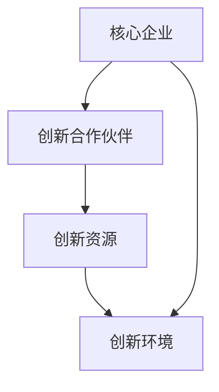
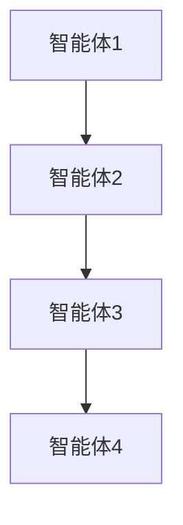

                 


# 多智能体系统在公司创新生态系统评估中的应用

> 关键词：多智能体系统、创新生态系统、协同算法、系统架构、创新评估

> 摘要：本文探讨了多智能体系统（MAS）在公司创新生态系统评估中的应用。通过分析MAS的基本概念、创新生态系统的核心要素，以及两者之间的关系，本文提出了一种基于MAS的创新生态系统评估框架。文章详细介绍了MAS的协同算法、数学模型、系统架构设计，并通过实际案例展示了如何在公司中应用这些方法进行创新评估。最后，本文总结了MAS在创新生态系统评估中的优势，并提出了未来的研究方向。

---

## 第1章: 多智能体系统与公司创新生态系统概述

### 1.1 多智能体系统的基本概念

#### 1.1.1 多智能体系统的定义
多智能体系统（Multi-Agent System, MAS）是由多个智能体组成的分布式系统，这些智能体能够通过交互和协作完成复杂任务。每个智能体都具有一定的自主性、反应性和社会性。

#### 1.1.2 多智能体系统的特征
- **自主性**：智能体能够独立决策。
- **反应性**：智能体能够感知环境并做出实时反应。
- **社会性**：智能体之间能够通过通信和协作完成任务。

#### 1.1.3 多智能体系统与传统单智能体系统的区别
| 特性            | 单智能体系统                | 多智能体系统                |
|-----------------|-----------------------------|-----------------------------|
| 系统结构        | 中央式结构                  | 分布式结构                  |
| 任务处理        | 单点处理任务                | 分布式协作处理任务          |
| 系统复杂度      | 系统复杂度较低              | 系统复杂度较高              |

### 1.2 公司创新生态系统的基本概念

#### 1.2.1 创新生态系统的定义
创新生态系统是一个由核心企业、合作伙伴、创新资源和环境共同构成的系统，旨在通过协同创新实现价值最大化。

#### 1.2.2 创新生态系统的构成要素
- **核心企业**：公司本身。
- **创新合作伙伴**：供应商、客户、研发机构等。
- **创新资源**：技术、资金、人才等。
- **创新环境**：政策、市场、文化等。

#### 1.2.3 创新生态系统与公司战略的关系
创新生态系统是公司战略的重要组成部分，通过优化创新生态系统，公司可以提升创新能力，增强竞争力。

---

## 第2章: 多智能体系统在公司创新生态系统中的应用背景

### 2.1 公司创新生态系统评估的重要性

#### 2.1.1 创新生态系统对企业竞争力的影响
创新生态系统能够促进企业内部和外部的协同创新，提高企业的创新效率和创新能力。

#### 2.1.2 创新生态系统评估的必要性
通过对创新生态系统进行评估，可以发现系统中的瓶颈和不足，进而进行优化和改进。

### 2.2 多智能体系统在创新生态系统评估中的优势

#### 2.2.1 多智能体系统的分布式计算优势
MAS能够将复杂的任务分解为多个子任务，由不同的智能体分别处理，提高系统的并行处理能力。

#### 2.2.2 多智能体系统的协同优势
通过智能体之间的协作，MAS能够实现复杂系统的优化和协同创新。

#### 2.2.3 多智能体系统的动态适应性优势
MAS能够根据环境的变化实时调整智能体的行为，具有良好的动态适应性。

---

## 第3章: 多智能体系统的原理与核心概念

### 3.1 多智能体系统的原理

#### 3.1.1 分布式计算原理
分布式计算通过将任务分配给多个计算节点，利用每个节点的计算能力完成任务。

#### 3.1.2 智能体之间的通信与协作
智能体之间通过通信协议进行信息交换，实现协作。

#### 3.1.3 多智能体系统的自组织与涌现性
MAS具有自组织特性，能够在没有中央控制的情况下自行组织和优化。

### 3.2 多智能体系统的属性特征对比

| 特性            | 分布式系统               | 集中式系统               |
|-----------------|--------------------------|--------------------------|
| 系统结构        | 分布式结构              | 集中式结构              |
| 资源分配        | 分散式资源分配          | 集中式资源分配          |
| 故障容错性      | 高                      | 低                      |

---

## 第4章: 公司创新生态系统的核心要素

### 4.1 创新生态系统的构成要素

#### 4.1.1 核心企业
核心企业是创新生态系统的核心，负责制定战略和协调各方资源。

#### 4.1.2 创新合作伙伴
创新合作伙伴包括供应商、客户、研发机构等，共同参与创新活动。

#### 4.1.3 创新资源
创新资源包括技术、资金、人才等，是创新活动的基础。

#### 4.1.4 创新环境
创新环境包括政策、市场、文化等，影响创新活动的开展。

### 4.2 创新生态系统的核心功能

#### 4.2.1 创新资源整合功能
整合内部和外部资源，优化资源配置。

#### 4.2.2 创新协同功能
促进企业内部和外部的协同创新。

#### 4.2.3 创新扩散功能
将创新成果扩散到市场，实现价值最大化。

---

## 第5章: 多智能体系统与创新生态系统的关系

### 5.1 多智能体系统在创新生态系统中的角色

#### 5.1.1 智能体作为创新主体
智能体可以代表公司内部的不同部门或外部合作伙伴，参与创新活动。

#### 5.1.2 智能体作为创新资源的整合者
智能体负责整合创新资源，优化资源配置。

#### 5.1.3 智能体作为创新协同的执行者
智能体通过协作完成创新任务，实现协同创新。

### 5.2 多智能体系统与创新生态系统的关系图



---

## 第6章: 多智能体协同算法

### 6.1 多智能体协同的基本算法

#### 6.1.1 分布式计算算法



#### 6.1.2 通信协议

```python
class Agent:
    def __init__(self, id):
        self.id = id
        self.status = 'idle'
    
    def send_message(self, message, recipient):
        print(f"Message sent to {recipient}: {message}")
```

---

## 总结

本文详细探讨了多智能体系统在公司创新生态系统评估中的应用，从MAS的基本概念到创新生态系统的核心要素，再到MAS在创新评估中的优势，层层展开，为读者提供了全面的视角。通过实际案例的分析，展示了MAS在创新生态系统评估中的实际应用价值。

---

**作者：AI天才研究院 & 禅与计算机程序设计艺术**

---

（注：以上为文章的框架和部分内容，实际撰写时需要进一步扩展每个章节的具体内容，包括详细的算法描述、数学模型、系统架构设计等。）

