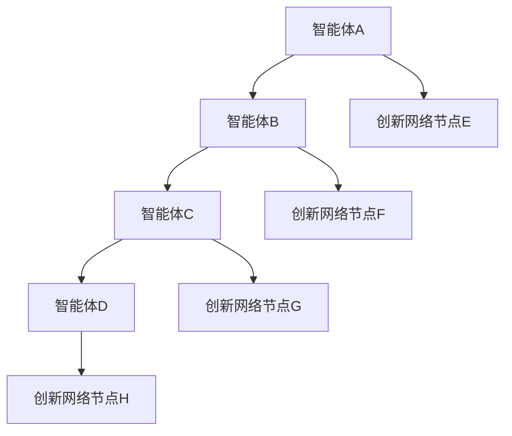
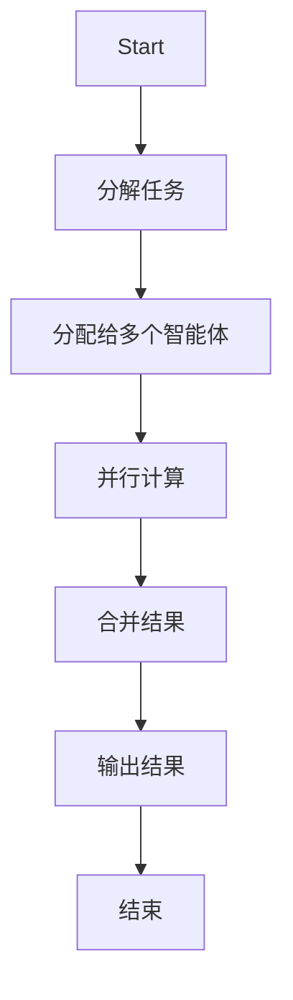
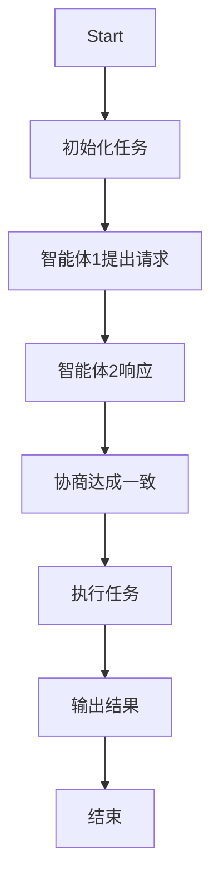
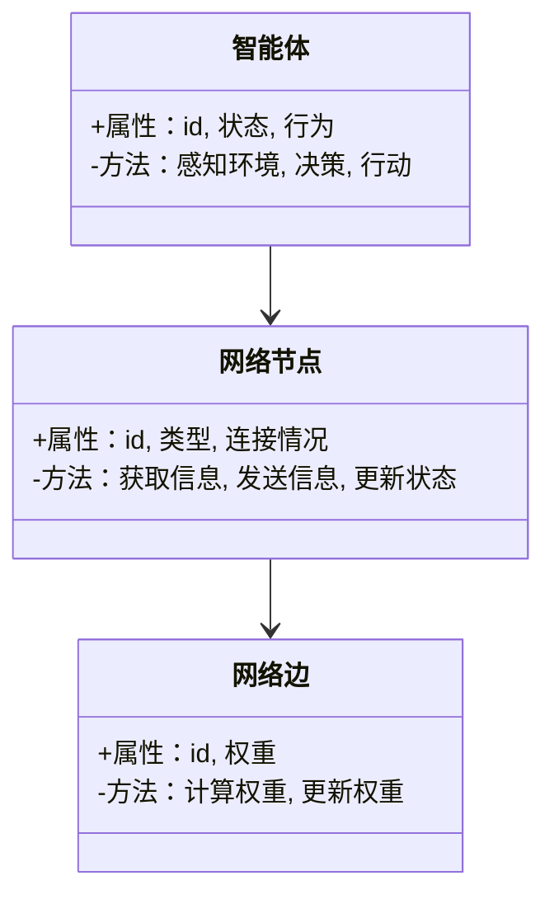

                 


# 多智能体系统在公司创新网络评估中的应用

> 关键词：多智能体系统, 创新网络, 企业评估, 协作机制, 算法实现, 网络分析, 系统架构

> 摘要：随着企业创新活动的日益复杂化和网络化，传统的创新评估方法已难以满足现代企业的需求。多智能体系统（Multi-Agent Systems, MAS）作为一种新兴的分布式计算范式，能够通过多个智能体的协作，对企业创新网络进行全面、动态的评估。本文系统性地探讨了多智能体系统在公司创新网络评估中的应用，从基础概念、核心原理、算法实现、系统架构到实际案例，逐一展开分析，并结合具体代码和数学模型，深入阐述了多智能体系统如何赋能企业创新网络评估。

---

# 第一部分: 引言

## # 第1章: 背景介绍与核心概念

### ## 1.1 多智能体系统的定义与特点

#### ### 1.1.1 多智能体系统的定义

多智能体系统（Multi-Agent Systems, MAS）是由多个智能体（Agent）组成的分布式系统，这些智能体能够通过感知环境、自主决策并协同工作，共同完成复杂任务。与传统的单智能体系统相比，MAS具有以下特点：

1. **分布式性**：多个智能体协同工作，而非集中式控制。
2. **自主性**：每个智能体都能自主决策，无需外部干预。
3. **协作性**：智能体之间通过通信与协作完成共同目标。
4. **反应性**：智能体能够实时感知环境并做出响应。

#### ### 1.1.2 创新网络的定义与构成

创新网络是指由企业内部不同部门、外部合作伙伴（如供应商、客户、研发机构等）以及生态系统中的其他参与者组成的网络。创新网络的构成包括以下几个方面：

1. **节点**：企业内部部门、外部合作伙伴、客户等。
2. **边**：节点之间的关系，包括信息流、资金流、知识共享等。
3. **网络结构**：网络的拓扑结构，如星型网络、网状网络等。

#### ### 1.1.3 多智能体系统与创新网络评估的结合

通过将多智能体系统应用于创新网络评估，可以实现对网络中各个节点的行为、关系和整体网络的动态变化进行实时监测和评估。多智能体系统的协作性和反应性特点，使其成为创新网络评估的理想工具。

---

## # 第2章: 多智能体系统的核心原理

### ## 2.1 智能体的定义与分类

#### ### 2.1.1 智能体的定义

智能体（Agent）是指具有自主性、反应性、社会性等特性的实体。智能体可以通过感知环境、自主决策并采取行动来实现目标。

#### ### 2.1.2 智能体的分类

根据智能体的智能水平和行为模式，可以将智能体分为以下几类：

1. **反应式智能体**：基于当前感知做出反应，不依赖于内部状态。
2. **认知式智能体**：具有复杂的状态表示和推理能力，能够进行规划和决策。
3. **协作式智能体**：能够与其他智能体协作完成共同目标。

#### ### 2.1.3 智能体之间的协作机制

智能体之间的协作可以通过以下机制实现：

1. **通信**：智能体之间通过消息传递进行信息共享。
2. **协商**：智能体之间通过协商确定各自的任务和角色。
3. **协调**：通过协调机制确保智能体之间的行为一致性和整体目标的实现。

---

## # 第3章: 创新网络评估中的多智能体系统模型

### ## 3.1 创新网络的实体关系图

以下是一个创新网络的实体关系图，展示了节点之间的关系：

```mermaid
erDiagram
    actor 顾客
    actor 供应商
    actor 竞争对手
    actor 合作伙伴
    node 企业
    node 研发机构
    node 政府机构
    node 行业协会
    node 市场
    node 技术
    node 知识
    node 资金
    顾客 --> 市场
    供应商 --> 市场
    竞争对手 --> 市场
    合作伙伴 --> 企业
    企业 --> 研发机构
    企业 --> 政府机构
    企业 --> 行业协会
    研发机构 --> 技术
    技术 --> 知识
    知识 --> 资金
    资金 --> 企业
```

### ## 3.2 多智能体系统与创新网络的映射关系

以下是一个多智能体系统与创新网络的映射关系图：



---

## # 第4章: 多智能体系统在创新网络评估中的算法原理

### ## 4.1 多智能体系统中的典型算法

#### ### 4.1.1 分布式计算算法

分布式计算算法用于在多智能体系统中实现任务的分布式计算。以下是分布式计算的流程图：



#### ### 4.1.2 协商算法

协商算法用于智能体之间的任务分配和资源协调。以下是协商算法的流程图：



---

## # 第5章: 创新网络评估的数学模型与公式

### ## 5.1 创新网络的度量指标

创新网络的度量指标可以通过以下公式进行计算：

$$C(i) = \sum_{j} a_{ij}$$

其中，$C(i)$ 表示节点 $i$ 的中心性，$a_{ij}$ 表示节点 $i$ 和节点 $j$ 之间的连接情况。

### ## 5.2 创新网络的权重计算

创新网络的权重计算可以通过以下公式进行：

$$W(i) = \sum_{j} w_{ij} \times a_{ij}$$

其中，$W(i)$ 表示节点 $i$ 的权重，$w_{ij}$ 表示节点 $i$ 和节点 $j$ 之间的权重，$a_{ij}$ 表示节点 $i$ 和节点 $j$ 之间的连接情况。

---

## # 第6章: 多智能体系统在创新网络评估中的系统架构设计

### ## 6.1 系统功能设计

以下是多智能体系统在创新网络评估中的系统功能设计图：



---

## # 第7章: 项目实战与案例分析

### ## 7.1 环境安装与配置

以下是环境安装与配置的代码示例：

```bash
pip install numpy
pip install networkx
pip install matplotlib
```

### ## 7.2 核心代码实现

以下是核心代码实现的Python代码示例：

```python
import networkx as nx
import matplotlib.pyplot as plt

# 创建创新网络图
G = nx.Graph()
G.add_nodes_from(["企业", "研发机构", "政府机构", "行业协会", "供应商", "客户", "竞争对手"])
G.add_edges_from([("企业", "研发机构"), ("企业", "政府机构"), ("企业", "行业协会"), ("企业", "供应商"), ("企业", "客户"), ("企业", "竞争对手")])

# 绘制图
nx.draw(G, with_labels=True, node_color="red", edge_color="blue")
plt.show()
```

---

## # 第8章: 总结与展望

### ## 8.1 总结

多智能体系统在公司创新网络评估中的应用，通过智能体的协作和网络分析，能够帮助企业更好地理解创新网络的结构和动态，从而制定更有效的创新策略。

### ## 8.2 展望

未来，随着人工智能和分布式计算技术的进一步发展，多智能体系统在创新网络评估中的应用将更加广泛和深入，为企业创新提供更强大的支持。

---

# 作者：AI天才研究院 & 禅与计算机程序设计艺术

---

本文通过系统性地分析多智能体系统在公司创新网络评估中的应用，从基础概念、核心原理、算法实现、系统架构到实际案例，逐一展开分析，并结合具体代码和数学模型，深入阐述了多智能体系统如何赋能企业创新网络评估。

