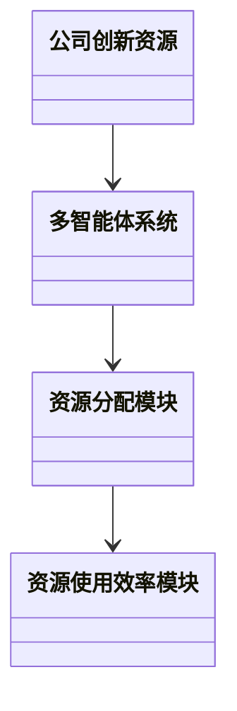

                 


# 多智能体系统在公司创新资源配置效率评估中的应用

## 关键词：多智能体系统、创新资源配置、效率评估、分布式计算、协作学习

## 摘要：本文探讨了多智能体系统在公司创新资源配置效率评估中的应用。通过分析多智能体系统的原理和算法，结合实际案例，展示了如何利用多智能体系统优化资源配置，提高创新效率。

---

# 第一部分：多智能体系统与创新资源配置效率概述

## 第1章：多智能体系统的基本概念

### 1.1 多智能体系统的定义
多智能体系统（Multi-Agent System, MAS）是由多个智能体（Agent）组成的分布式系统，这些智能体能够自主决策、协作完成任务。

### 1.2 多智能体系统的特征
- **自主性**：每个智能体都有自己的目标和决策能力。
- **反应性**：智能体能够根据环境变化做出反应。
- **协作性**：多个智能体协同工作，共同完成任务。

### 1.3 多智能体系统与传统单智能体系统的区别
| 特性        | 多智能体系统         | 单智能体系统       |
|-------------|---------------------|-------------------|
| 结构         | 分布式             | 集中式           |
| 协作         | 强调协作           | 单一控制         |
| 效率         | 更高效             | 较低             |

## 第2章：创新资源配置效率的定义与重要性

### 2.1 创新资源配置的定义
创新资源配置是指将公司资源（如资金、人才、技术）合理分配到创新项目中，以实现最大价值。

### 2.2 资源配置效率的衡量标准
- **资源利用率**：资源被充分利用的程度。
- **项目成功率**：创新项目按时完成的比例。
- **成本效益**：投入资源与产出成果的比率。

### 2.3 提高资源配置效率的意义
- **提升创新能力**：优化资源配置，推动创新项目成功。
- **降低成本**：避免资源浪费，提高使用效率。
- **增强竞争力**：在市场竞争中占据优势。

## 第3章：多智能体系统在创新资源配置中的作用

### 3.1 多智能体系统如何优化资源配置
- **分布式计算**：智能体协同处理任务，提高效率。
- **协作学习**：智能体共享知识，提升决策能力。
- **动态调整**：根据实时数据优化资源配置。

### 3.2 多智能体系统在公司创新中的应用前景
- **智能化决策**：利用多智能体系统进行资源分配，提高决策效率。
- **实时监控**：动态跟踪项目进展，及时调整资源分配。
- **数据驱动**：基于数据分析优化资源配置。

### 3.3 多智能体系统与公司创新资源配置效率的关系
多智能体系统通过优化资源分配流程，显著提高资源配置效率，从而提升公司创新能力和竞争力。

---

# 第二部分：多智能体系统的核心概念与联系

## 第4章：多智能体系统的原理

### 4.1 多智能体系统的组成要素
- **智能体**：具备感知和决策能力的个体。
- **通信机制**：智能体之间的信息交互方式。
- **协作机制**：智能体协同工作的规则和流程。

### 4.2 多智能体系统的通信机制
- **直接通信**：智能体间直接交换信息。
- **间接通信**：通过中间媒介传递信息。

### 4.3 多智能体系统的协作机制
- **协商协议**：智能体通过协商达成一致。
- **任务分配**：根据智能体能力分配任务。

## 第5章：多智能体系统的核心概念对比

### 5.1 多智能体系统与分布式系统对比
| 特性        | 多智能体系统         | 分布式系统         |
|-------------|---------------------|-------------------|
| 组件         | 智能体               | 节点               |
| 协作         | 强调协作           | 强调数据分布       |
| 智能性       | 高                  | 低                |

### 5.2 多智能体系统与协作学习对比
| 特性        | 多智能体系统         | 协作学习         |
|-------------|---------------------|-----------------|
| 应用场景      | 资源分配             | 知识学习         |
| 方法         | 分布式计算           | 知识共享         |

## 第6章：多智能体系统的ER实体关系图

```mermaid
er
actor(公司创新资源) --> 多智能体系统
多智能体系统 --> 资源分配模块
资源分配模块 --> 资源使用效率模块
```

---

# 第三部分：多智能体系统的算法原理

## 第7章：多智能体系统的算法概述

### 7.1 分布式计算算法
- **定义**：在分布式系统中进行计算的算法。
- **应用**：资源分配、负载均衡。

### 7.2 协作学习算法
- **定义**：多个智能体协作学习，共享知识。
- **应用**：优化决策、提高效率。

### 7.3 资源分配算法
- **定义**：根据资源需求分配资源的算法。
- **应用**：动态调整资源分配，提高效率。

## 第8章：多智能体系统算法的数学模型

### 8.1 分布式计算的数学模型
$$
\text{计算资源分配} = \sum_{i=1}^{n} \frac{r_i}{t_i}
$$

### 8.2 协作学习的数学模型
$$
\text{学习效率} = \frac{\sum_{i=1}^{n} w_i x_i}{\sum_{i=1}^{n} w_i}
$$

---

# 第四部分：系统分析与架构设计

## 第9章：系统分析与架构设计

### 9.1 问题场景介绍
公司需要优化创新资源配置，提升项目成功率。

### 9.2 系统功能设计
- **资源分配模块**：根据需求分配资源。
- **资源使用效率模块**：监控资源使用情况，动态调整分配。

### 9.3 领域模型类图



### 9.4 系统架构设计


### 9.5 系统接口设计
- **资源分配接口**：接收资源需求，返回分配结果。
- **资源使用反馈接口**：更新资源使用情况。

### 9.6 系统交互流程

```mermaid
sequenceDiagram
客户发起资源分配请求 --> 多智能体系统接收请求
多智能体系统调用资源分配模块进行分配
资源分配模块调用资源使用效率模块获取反馈
资源分配模块返回分配结果给客户
```

---

# 第五部分：项目实战

## 第10章：环境安装与系统实现

### 10.1 环境安装
- **Python**：安装Python 3.8及以上版本。
- **库依赖**：安装numpy、pandas、scikit-learn等库。

### 10.2 核心代码实现

```python
class Agent:
    def __init__(self, resources):
        self.resources = resources

    def allocate(self, request):
        # 分配资源的算法
        pass

def multi_agent_system():
    agents = [Agent({...}), ...]
    # 初始化资源分配
    for agent in agents:
        agent.allocate(request)

if __name__ == "__main__":
    multi_agent_system()
```

### 10.3 代码解读与分析
- **Agent类**：定义智能体，管理资源分配。
- **allocate方法**：实现资源分配逻辑。
- **multi_agent_system函数**：初始化多个智能体，调用分配方法。

### 10.4 实际案例分析
通过具体案例，展示多智能体系统如何优化资源配置，提高效率。

### 10.5 项目小结
总结项目成果，提出改进建议，展望未来发展。

---

# 第六部分：最佳实践与小结

## 第11章：最佳实践 tips

### 11.1 设计原则
- **模块化设计**：提高系统的可维护性和扩展性。
- **可扩展性**：确保系统能够适应未来的发展需求。

### 11.2 注意事项
- **数据安全**：确保数据在传输和存储过程中的安全性。
- **系统容错**：设计容错机制，确保系统稳定运行。

### 11.3 拓展阅读
推荐相关书籍和论文，帮助读者深入学习多智能体系统。

---

# 结语

通过本文的详细讲解，读者可以全面了解多智能体系统在公司创新资源配置效率评估中的应用。从理论到实践，从算法到系统设计，本文为读者提供了系统的知识框架和实用的指导。

---

作者：AI天才研究院/AI Genius Institute & 禅与计算机程序设计艺术 /Zen And The Art of Computer Programming

