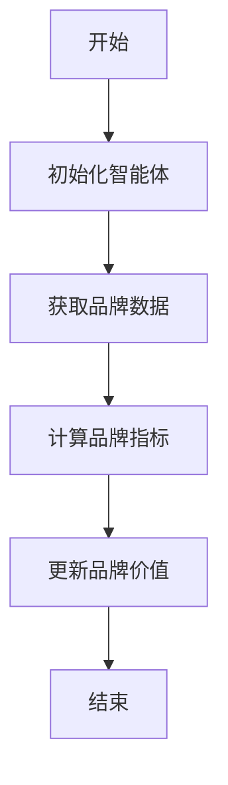
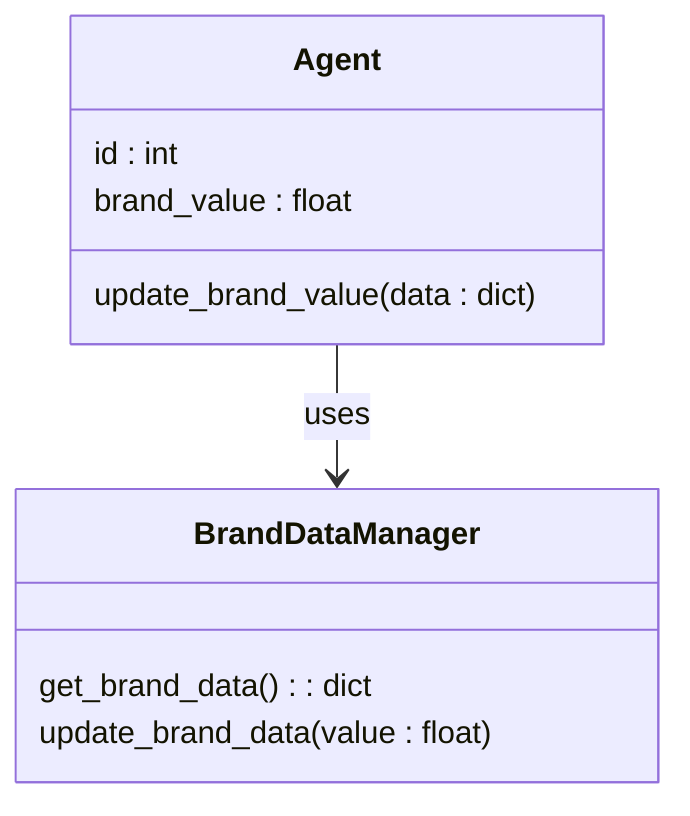
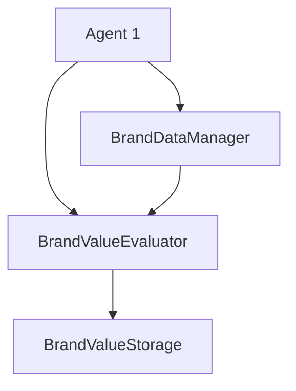
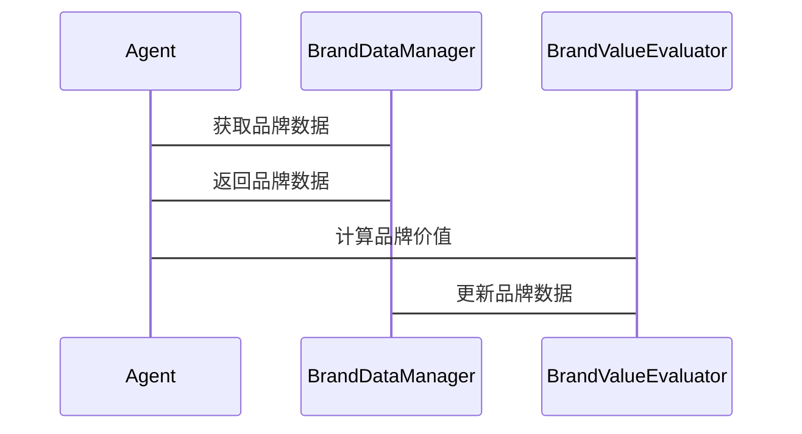

                 


# 多智能体系统在公司品牌价值量化中的应用

## 关键词：多智能体系统、品牌价值量化、协同学习、动态评估模型、企业决策支持

## 摘要：本文探讨了多智能体系统在公司品牌价值量化中的应用，详细分析了多智能体系统的原理与实现，品牌价值量化的核心要素，以及如何通过多智能体系统的协同学习机制和动态评估模型实现品牌价值的精准量化。文章结合实际案例，展示了多智能体系统在品牌价值量化中的优势，并提出了系统的架构设计和实现方案，为企业的品牌价值管理提供了新的思路和方法。

---

## 第一部分：多智能体系统与品牌价值量化背景介绍

### 第1章：多智能体系统的基本概念

#### 1.1 多智能体系统的定义与特点
##### 1.1.1 多智能体系统的定义
多智能体系统（Multi-Agent System, MAS）是由多个智能体组成的复杂系统，每个智能体都是一个具有独立性、主动性、反应性和协作性的实体。智能体之间通过通信和协作完成特定任务。

##### 1.1.2 多智能体系统的属性特征
| 特性 | 描述 |
|------|------|
| 独立性 | 每个智能体具有独立的目标和决策能力 |
| 主动性 | 智能体主动感知环境并采取行动 |
| 反应性 | 能够实时响应环境变化 |
| 协作性 | 智能体之间通过协作完成复杂任务 |

##### 1.1.3 多智能体系统与传统单智能体系统的区别
单智能体系统：任务由单一智能体完成，结构简单，但难以应对复杂任务。
多智能体系统：任务由多个智能体协作完成，能够处理复杂问题，具有更高的灵活性和扩展性。

### 第2章：品牌价值量化的重要性
#### 2.1 品牌价值的定义与构成
##### 2.1.1 品牌价值的定义
品牌价值是指品牌在市场上的影响力和盈利能力的综合体现，是企业在市场中的核心竞争力。

##### 2.1.2 品牌价值的构成要素
| 要素 | 描述 |
|------|------|
| 知名度 | 品牌在市场中的普及程度 |
| 美誉度 | 消费者对品牌的信任和满意度 |
| 忠诚度 | 消费者对品牌的长期支持程度 |
| 市场表现 | 品牌在市场中的销售表现和增长潜力 |

#### 2.2 品牌价值量化的意义
##### 2.2.1 品牌价值量化对企业决策的重要性
通过量化品牌价值，企业可以更好地制定品牌战略、优化资源配置和提升品牌影响力。

##### 2.2.2 品牌价值量化对投资决策的影响
品牌价值是企业估值的重要组成部分，影响投资者的决策和企业的融资能力。

---

## 第二部分：多智能体系统与品牌价值量化的核心概念与联系

### 第3章：多智能体系统的原理与实现
#### 3.1 多智能体系统的组成结构
##### 3.1.1 实体、行为、环境的定义
- 实体：智能体是系统的基本单元。
- 行为：智能体通过行为与环境交互。
- 环境：智能体所处的外部世界，包括其他智能体和非智能体。

##### 3.1.2 多智能体系统的层次结构
| 层次 | 描述 |
|------|------|
| 行为层 | 智能体的行为规则和动作 |
| 通信层 | 智能体之间的通信机制 |
| 协调层 | 智能体任务分配和协作 |

#### 3.2 多智能体系统的通信与协作
##### 3.2.1 智能体之间的通信机制
- 通信协议：智能体之间通过特定协议进行信息交换。
- 信息传递：通过消息队列或事件驱动的方式实现通信。

##### 3.2.2 协作任务的分配与协调
- 任务分配：根据智能体的能力和当前状态分配任务。
- 协调机制：通过协商和同步确保任务的顺利执行。

### 第4章：品牌价值量化的核心要素
#### 4.1 品牌价值的评估指标
##### 4.1.1 品牌知名度的评估
- 市场调研：通过问卷调查和数据分析评估品牌知名度。
- 媒体曝光：品牌在媒体上的曝光率和传播效果。

##### 4.1.2 品牌美誉度的评估
- 消费者反馈：通过用户评论和评分评估品牌美誉度。
- 品牌口碑：品牌在社交媒体和行业内的口碑传播。

#### 4.2 品牌价值的动态变化
##### 4.2.1 品牌价值的影响因素
- 市场环境：经济波动、行业竞争等。
- 企业行为：产品创新、营销策略等。
- 消费者行为：购买习惯、品牌忠诚度等。

##### 4.2.2 品牌价值的实时监测
- 数据采集：通过实时数据流采集品牌相关信息。
- 数据分析：利用大数据技术实时分析品牌价值变化。

---

## 第三部分：多智能体系统在品牌价值量化中的算法原理

### 第5章：基于多智能体系统的品牌价值量化算法
#### 5.1 算法原理
##### 5.1.1 多智能体系统的协同学习机制
- 分布式学习：每个智能体独立学习并共享知识。
- 协同优化：通过智能体之间的协作优化整体性能。

##### 5.1.2 品牌价值的动态评估模型
- 动态评估：根据实时数据动态调整品牌价值评估。
- 综合指标：结合多维度指标进行综合评估。

#### 5.2 算法实现
##### 5.2.1 算法流程图


##### 5.2.2 Python实现代码
```python
class Agent:
    def __init__(self, id):
        self.id = id
        self.brand_value = 0

    def update_brand_value(self, data):
        # 数据处理逻辑
        self.brand_value = data['value']

def multi_agent_system():
    agents = [Agent(1), Agent(2), Agent(3)]
    # 获取品牌数据
    data = {'value': 100}
    for agent in agents:
        agent.update_brand_value(data)
    return agents[0].brand_value

if __name__ == "__main__":
    print(multi_agent_system())
```

#### 5.3 数学模型与公式
##### 5.3.1 品牌价值评估公式
$$ brand\_value = \alpha \cdot知名度 + \beta \cdot美誉度 + \gamma \cdot忠诚度 $$

其中，$\alpha$, $\beta$, $\gamma$ 是权重系数，分别表示知名度、美誉度和忠诚度的权重。

---

## 第四部分：系统分析与架构设计

### 第6章：系统架构设计
#### 6.1 问题场景介绍
- 品牌价值量化需要实时监测和动态调整。
- 多智能体系统能够高效协作，处理复杂任务。

#### 6.2 系统功能设计
##### 6.2.1 领域模型类图


#### 6.3 系统架构设计


#### 6.4 系统接口设计
- 接口1：获取品牌数据
- 接口2：更新品牌价值
- 接口3：存储品牌价值

#### 6.5 系统交互设计


---

## 第五部分：项目实战

### 第7章：项目实战
#### 7.1 环境安装
- Python 3.8+
- pip安装必要的库：numpy, pandas, matplotlib

#### 7.2 系统核心实现源代码
##### 7.2.1 品牌数据管理模块
```python
class BrandDataManager:
    def __init__(self):
        self.data = {}

    def get_brand_data(self):
        return self.data

    def update_brand_data(self, value):
        self.data['value'] = value
```

##### 7.2.2 品牌价值评估模块
```python
class BrandValueEvaluator:
    def __init__(self):
        self.agents = []

    def add_agent(self, agent):
        self.agents.append(agent)

    def evaluate_brand_value(self):
        for agent in self.agents:
            data = BrandDataManager().get_brand_data()
            agent.update_brand_value(data)
```

#### 7.3 案例分析
##### 7.3.1 实际案例
- 某品牌通过多智能体系统实现品牌价值量化，提高了品牌管理效率。

##### 7.3.2 案例分析
- 数据采集：实时监测品牌相关数据。
- 数据分析：利用多智能体系统进行数据处理和品牌价值评估。
- 结果展示：生成品牌价值报告并提供优化建议。

#### 7.4 项目总结
- 多智能体系统能够高效协作，提升品牌价值量化效率。
- 系统具有良好的扩展性和灵活性，适用于不同规模的企业。

---

## 第六部分：最佳实践与总结

### 第8章：总结与展望
#### 8.1 小结
- 多智能体系统在品牌价值量化中的应用具有显著优势。
- 通过协同学习和动态评估，能够实现精准的品牌价值量化。

#### 8.2 注意事项
- 数据采集的准确性和实时性是关键。
- 系统的安全性和稳定性需要高度重视。

#### 8.3 拓展阅读
- 推荐阅读《多智能体系统的原理与应用》。
- 参考相关学术论文和行业报告。

---

## 作者：AI天才研究院/AI Genius Institute & 禅与计算机程序设计艺术 /Zen And The Art of Computer Programming

---

**注**：以上内容是根据用户的要求生成的目录大纲和部分正文内容，若需要完整的文章，可以继续扩展每个章节的具体内容。

