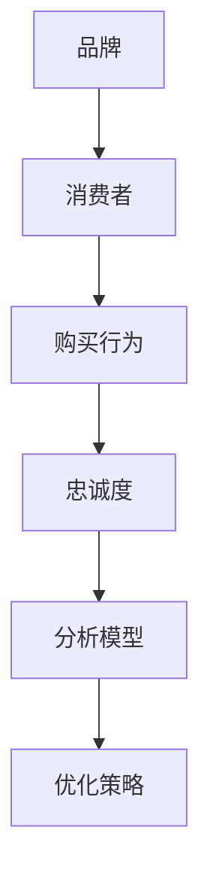
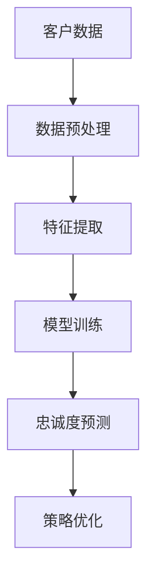

                 


# 多智能体系统在公司品牌忠诚度分析中的应用

## 关键词：多智能体系统、品牌忠诚度、协同过滤、聚类分析、分类算法

## 摘要

本文探讨了多智能体系统（Multi-Agent System, MAS）在公司品牌忠诚度分析中的应用。通过详细阐述MAS的基本概念、核心算法和系统架构，结合实际案例分析，展示了MAS如何提升品牌忠诚度分析的效率和准确性。文章从背景介绍到项目实战，系统地分析了MAS在该领域的优势，并提出了最佳实践建议。

---

### 第1章：多智能体系统概述

#### 1.1 多智能体系统的基本概念

- **1.1.1 多智能体系统的定义**
  - 多智能体系统是由多个智能体组成的分布式系统，每个智能体能够自主决策并协作完成任务。
  
- **1.1.2 多智能体系统的组成与特点**
  - 组成：智能体、通信机制、协作协议。
  - 特点：自主性、反应性、协作性、分布式。

- **1.1.3 多智能体系统的优势与挑战**
  - 优势：高效协作、适应复杂环境。
  - 挑战：通信延迟、协调困难。

- **1.1.4 多智能体系统的应用领域**
  - 电商、金融、医疗等。

#### 1.2 品牌忠诚度分析的定义与意义

- **1.2.1 品牌忠诚度的定义**
  - 消费者对品牌的情感依赖和持续购买行为。

- **1.2.2 品牌忠诚度分析的重要性**
  - 帮助企业制定精准营销策略，提升客户 retention。

- **1.2.3 品牌忠诚度分析的常用方法**
  - 数据分析、模型预测、客户调研。

---

### 第2章：多智能体系统在品牌忠诚度分析中的应用背景

#### 2.1 传统品牌忠诚度分析的局限性

- 数据分析的局限性：难以捕捉实时动态。
- 模型预测的不足：单模型预测精度有限。
- 传统方法的效率问题：处理大规模数据效率低下。

#### 2.2 多智能体系统的优势

- 分布式计算的优势：高效处理分布式数据。
- 多智能体协作的高效性：实时协作优化分析。
- 系统的灵活性：适应复杂多变的市场环境。

---

### 第3章：多智能体系统的核心概念与联系

#### 3.1 多智能体系统的原理

- **3.1.1 智能体的基本属性**
  - 感知环境、自主决策、协作通信。

- **3.1.2 智能体之间的通信机制**
  - 通过消息传递实现协作。

- **3.1.3 智能体的协作与协调**
  - 协作协议和协调机制确保系统高效运行。

#### 3.2 品牌忠诚度分析的核心要素

- **3.2.1 数据来源与特征**
  - 数据来源：销售数据、客户反馈、市场调研。
  - 数据特征：客户行为、购买频率、满意度。

- **3.2.2 模型构建与优化**
  - 使用协同过滤、聚类分析等算法构建模型。

- **3.2.3 结果分析与应用**
  - 分析结果指导营销策略优化。

#### 3.3 多智能体系统与品牌忠诚度分析的实体关系图



---

### 第4章：多智能体系统的核心算法

#### 4.1 协同过滤算法

- **4.1.1 协同过滤的基本原理**
  - 基于相似用户或物品的推荐。

- **4.1.2 基于用户的协同过滤**
  - 计算用户相似度，推荐相似用户的购买行为。

- **4.1.3 基于物品的协同过滤**
  - 分析物品相似性，推荐相关物品。

#### 4.2 聚类分析算法

- **4.2.1 K-means聚类算法**
  - 将客户分为不同群组，分析群组特征。

- **4.2.2 层次聚类算法**
  - 逐步合并客户，形成层次结构。

- **4.2.3 聚类在品牌忠诚度分析中的应用**
  - 识别高忠诚度客户群，制定精准策略。

#### 4.3 分类算法

- **4.3.1 支持向量机（SVM）**
  - 用于分类客户忠诚度等级。

- **4.3.2 随机森林（Random Forest）**
  - 多树集成方法提高分类精度。

- **4.3.3 分类算法在忠诚度预测中的应用**
  - 预测客户忠诚度，优化营销策略。

---

### 第5章：多智能体系统的数学模型与公式

#### 5.1 协同过滤的数学模型

- **用户-物品评分矩阵的构建**
  - 用户对物品的评分矩阵表示。

- **相似度计算公式**
  - 使用余弦相似度：
  $$\text{相似度} = \frac{\sum_{i=1}^{n}(r_{ui} - \bar{r}_u)(r_{vi} - \bar{r}_v)}{\sqrt{\sum_{i=1}^{n}(r_{ui} - \bar{r}_u)^2} \sqrt{\sum_{i=1}^{n}(r_{vi} - \bar{r}_v)^2}}$$

#### 5.2 聚类分析的数学模型

- **K-means算法**
  - 目标函数：
  $$\text{目标} = \sum_{i=1}^{k} \sum_{j=1}^{n_i} (x_j - \mu_i)^2$$
  - 聚类中心$\mu_i$表示第$i$个簇的中心。

#### 5.3 分类算法的数学模型

- **支持向量机（SVM）**
  - 分类函数：
  $$f(x) = \text{sign}(\sum_{i=1}^{m} \alpha_i y_i (x_i \cdot x) + b)$$
  - $\alpha_i$为拉格朗日乘子，$y_i$为类别标签。

---

### 第6章：系统架构与实现

#### 6.1 系统架构设计



#### 6.2 系统功能设计

- **数据预处理**
  - 清洗数据，处理缺失值。
- **特征提取**
  - 提取客户行为、购买频率等特征。
- **模型训练**
  - 使用协同过滤、聚类和分类算法训练模型。
- **忠诚度预测**
  - 预测客户忠诚度等级。
- **策略优化**
  - 根据预测结果优化营销策略。

---

### 第7章：项目实战

#### 7.1 环境安装

- 安装Python、NumPy、Pandas、Scikit-learn等库。

#### 7.2 核心实现代码

```python
from sklearn.cluster import KMeans
from sklearn.metrics import silhouette_score

# 数据预处理
data = pd.DataFrame(...)
data_cleaned = data.dropna()

# 特征提取
features = data_cleaned[['feature1', 'feature2']]

# 聚类分析
model = KMeans(n_clusters=3)
model.fit(features)
labels = model.labels_

# 评估
score = silhouette_score(features, labels)
print(score)
```

#### 7.3 案例分析

- 通过实际数据，展示如何使用MAS优化品牌忠诚度分析，提升客户 retention。

---

### 第8章：最佳实践与小结

#### 8.1 最佳实践 tips

- 数据预处理是关键。
- 选择合适的算法，如协同过滤和聚类分析。
- 定期更新模型，适应市场变化。

#### 8.2 小结

多智能体系统通过协作和分布式计算，显著提升了品牌忠诚度分析的效率和精度，为企业提供了更强大的决策支持。

#### 8.3 注意事项

- 确保数据隐私和安全。
- 定期评估和优化模型。

#### 8.4 拓展阅读

推荐阅读相关书籍和论文，深入学习多智能体系统和品牌忠诚度分析的最新研究成果。

---

作者：AI天才研究院 & 禅与计算机程序设计艺术

