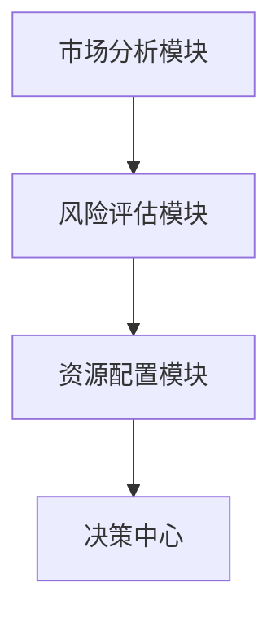
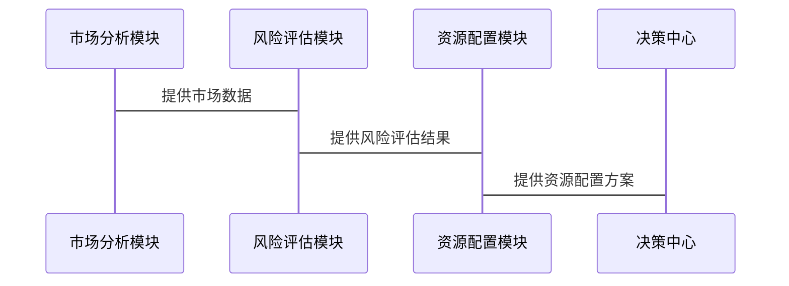

                 


# 多智能体系统在公司国际化战略评估中的应用

## 关键词：多智能体系统, 国际化战略, 战略评估, 智能体协作, 系统架构, 算法原理

## 摘要

多智能体系统（Multi-Agent Systems, MAS）作为一种分布式智能计算范式，通过多个智能体的协作和互动，能够有效解决复杂问题。在公司国际化战略评估中，多智能体系统能够模拟不同利益相关者的互动，提供更全面的评估结果。本文将从理论基础、算法原理、系统架构到实际应用，详细探讨多智能体系统在公司国际化战略评估中的应用。

---

## 第1章 多智能体系统概述

### 1.1 多智能体系统的基本概念

#### 1.1.1 智能体的定义与特点
- **智能体（Agent）**：具有感知环境、自主决策、执行动作和学习能力的实体。
- **特点**：
  - **自主性**：无需外部干预，自主决策。
  - **反应性**：能够实时感知环境并做出反应。
  - **协作性**：与其他智能体协作完成任务。
  - **学习能力**：通过经验优化自身行为。

#### 1.1.2 多智能体系统的定义与特征
- **定义**：由多个智能体组成的分布式系统，智能体之间通过通信和协作完成复杂任务。
- **特征**：
  - **分布式计算**：任务分布在多个智能体之间。
  - **协作性**：智能体之间通过协作实现目标。
  - **适应性**：能够适应动态变化的环境。

#### 1.1.3 多智能体系统与单智能体系统的区别
| 特性               | 单智能体系统                     | 多智能体系统                     |
|--------------------|----------------------------------|----------------------------------|
| 决策中心           | 单一决策中心                   | 分布式决策，多个智能体协作       |
| 适应性             | 较低，依赖中心决策              | 较高，智能体自主调整行为         |
| 应用场景           | 简单任务，如数据处理           | 复杂任务，如战略评估、资源分配   |

### 1.2 多智能体系统的组成与结构

#### 1.2.1 智能体的分类
- **按智能体类型**：
  - **反应式智能体**：基于当前感知做出反应。
  - **认知式智能体**：具有推理、规划能力。
  - **混合式智能体**：结合反应式和认知式智能体。

- **按功能角色**：
  - **执行者**：负责具体任务的执行。
  - **协调者**：负责任务分配和协调。
  - **监控者**：负责监控系统状态。

#### 1.2.2 多智能体系统的层次结构
- **感知层**：智能体通过传感器或数据接口感知环境。
- **决策层**：智能体基于感知信息做出决策。
- **执行层**：智能体根据决策执行动作。
- **通信层**：智能体之间通过通信协议交换信息。

#### 1.2.3 多智能体系统的通信机制
- **通信协议**：定义智能体之间的通信规则。
- **消息传递**：智能体之间通过消息传递信息。
- **广播机制**：所有智能体接收相同的信息。

### 1.3 多智能体系统的应用领域

#### 1.3.1 多智能体系统在企业管理中的应用
- **资源分配**：优化企业资源分配。
- **协作决策**：多部门协作决策。
- **风险管理**：预测和应对风险。

#### 1.3.2 多智能体系统在战略规划中的作用
- **模拟战略执行**：通过智能体模拟战略执行过程。
- **评估战略效果**：通过协作评估战略效果。
- **优化战略方案**：通过智能体协作优化战略方案。

#### 1.3.3 多智能体系统在国际化战略评估中的潜力
- **模拟国际市场环境**：通过智能体模拟国际市场环境。
- **评估市场风险**：通过协作评估市场风险。
- **优化资源配置**：通过优化资源配置实现战略目标。

---

## 第2章 公司国际化战略评估的背景与挑战

### 2.1 公司国际化战略的基本概念

#### 2.1.1 国际化战略的定义
- **国际化战略**：企业在全球范围内配置资源、开拓市场、建立业务的过程。

#### 2.1.2 国际化战略的主要目标
- **市场扩展**：开拓新市场。
- **资源优化**：优化资源配置。
- **竞争优势**：建立竞争优势。

#### 2.1.3 国际化战略的关键成功因素
- **市场知识**：对目标市场的深入了解。
- **资源配置**：合理配置资源。
- **风险管理**：有效管理市场风险。

### 2.2 公司国际化战略评估的核心问题

#### 2.2.1 市场分析与风险评估
- **市场分析**：分析目标市场的潜力。
- **风险评估**：评估市场风险。

#### 2.2.2 资源配置与协同效应
- **资源配置**：优化资源配置。
- **协同效应**：实现协同效应。

#### 2.2.3 竞争优势与战略定位
- **竞争优势**：建立竞争优势。
- **战略定位**：明确战略定位。

### 2.3 多智能体系统在国际化战略评估中的优势

#### 2.3.1 提高决策效率
- **分布式计算**：提高决策效率。
- **协作决策**：提高决策质量。

#### 2.3.2 增强系统适应性
- **适应性**：增强系统适应性。
- **动态调整**：动态调整战略。

#### 2.3.3 优化资源配置
- **资源配置优化**：优化资源配置。
- **协同效应**：实现协同效应。

---

## 第3章 多智能体系统的核心理论与算法

### 3.1 多智能体系统的核心理论

#### 3.1.1 智能体模型与通信协议

##### 3.1.1.1 BDI模型
- **BDI模型**：基于信念（Belief）、愿望（Desire）、意图（Intention）的模型。
- **实现方式**：通过BDI模型实现智能体的决策。

##### 3.1.1.2 通信协议
- **通信协议**：定义智能体之间的通信规则。
- **消息传递**：通过消息传递实现智能体之间的协作。

#### 3.1.2 博弈论在多智能体系统中的应用

##### 3.1.2.1 博弈论基础
- **博弈论**：研究理性决策者之间策略互动的理论。

##### 3.1.2.2 博弈论与多智能体系统
- **纳什均衡**：博弈论中的纳什均衡。
- **博弈树**：通过博弈树分析智能体的互动。

### 3.2 多智能体系统的协作算法

#### 3.2.1 分布式计算与一致性算法

##### 3.2.1.1 分布式计算
- **分布式计算**：任务分布在多个智能体之间。
- **一致性算法**：确保分布式系统的一致性。

##### 3.2.1.2 一致性算法
- **Paxos算法**：确保分布式系统的一致性。
- **Raft算法**：另一种一致性算法。

#### 3.2.2 基于多智能体的决策支持算法

##### 3.2.2.1 决策支持算法
- **决策树**：通过决策树进行决策。
- **贝叶斯网络**：通过贝叶斯网络进行决策。

##### 3.2.2.2 多智能体协作算法
- **分布式决策算法**：通过分布式决策算法实现协作。
- **协商算法**：通过协商算法实现协作。

---

## 第4章 多智能体系统在国际化战略评估中的应用

### 4.1 国际化战略评估的场景描述

#### 4.1.1 项目介绍
- **项目目标**：评估国际化战略。
- **项目范围**：国际化市场评估、资源配置优化。

#### 4.1.2 系统功能设计
- **市场分析模块**：分析目标市场。
- **风险评估模块**：评估市场风险。
- **资源配置模块**：优化资源配置。

#### 4.1.3 系统架构设计
- **模块划分**：市场分析模块、风险评估模块、资源配置模块。
- **通信机制**：智能体之间的通信机制。

### 4.2 系统架构设计

#### 4.2.1 系统架构图


#### 4.2.2 系统接口设计
- **市场分析接口**：提供市场分析数据。
- **风险评估接口**：提供风险评估结果。
- **资源配置接口**：提供资源配置方案。

#### 4.2.3 系统交互流程


### 4.3 项目实战

#### 4.3.1 环境安装
- **安装Python**：安装Python 3.8或更高版本。
- **安装依赖库**：安装必要的依赖库，如`networkx`、`matplotlib`。

#### 4.3.2 核心代码实现

##### 4.3.2.1 智能体通信代码
```python
import networkx as nx

class Agent:
    def __init__(self, name):
        self.name = name
        self.graph = nx.DiGraph()
        
    def send_message(self, receiver, message):
        self.graph.add_edge(self.name, receiver, label=message)
        
    def receive_message(self, sender, message):
        pass
        
def main():
    agent1 = Agent("Agent1")
    agent2 = Agent("Agent2")
    agent1.send_message(agent2, "Market Risk is High")
    print(agent1.graph.edges())
    
if __name__ == "__main__":
    main()
```

##### 4.3.2.2 分布式计算代码
```python
import numpy as np

def distributed_computation(data):
    return np.mean(data)

def main():
    data = [1, 2, 3, 4, 5]
    result = distributed_computation(data)
    print("Result:", result)

if __name__ == "__main__":
    main()
```

#### 4.3.3 案例分析与结果解读

##### 4.3.3.1 案例分析
- **案例背景**：某公司计划进入新兴市场。
- **市场分析**：市场潜力大，但竞争激烈。
- **风险评估**：市场风险较高。
- **资源配置**：需要优化资源配置以应对风险。

##### 4.3.3.2 结果解读
- **市场分析结果**：新兴市场潜力大。
- **风险评估结果**：市场风险较高。
- **资源配置结果**：优化资源配置以应对风险。

#### 4.3.4 项目总结
- **项目目标**：评估国际化战略。
- **项目成果**：优化资源配置，降低市场风险。
- **项目经验**：多智能体系统在国际化战略评估中的优势。

---

## 第5章 总结与展望

### 5.1 总结
- **多智能体系统的优势**：提高决策效率，增强系统适应性，优化资源配置。
- **国际化战略评估的应用**：通过多智能体系统模拟国际市场环境，评估市场风险，优化资源配置。

### 5.2 展望
- **未来发展方向**：多智能体系统在国际化战略评估中的进一步应用。
- **技术发展趋势**：智能化、协作化、适应性更强的多智能体系统。

### 5.3 最佳实践 Tips
- **系统设计**：在设计多智能体系统时，需要考虑智能体之间的通信和协作。
- **算法选择**：根据具体场景选择合适的算法。
- **系统优化**：通过优化系统架构提高系统性能。

### 5.4 小结
- **核心思想**：多智能体系统在国际化战略评估中的应用，通过智能体的协作和互动，提供更全面的评估结果。
- **未来展望**：随着技术的发展，多智能体系统在国际化战略评估中的应用将更加广泛和深入。

---

## 作者：AI天才研究院 & 禅与计算机程序设计艺术

---

以上是《多智能体系统在公司国际化战略评估中的应用》的技术博客文章的完整目录和内容框架，涵盖从理论到实践的各个方面，确保内容丰富、逻辑清晰、技术深度到位。

