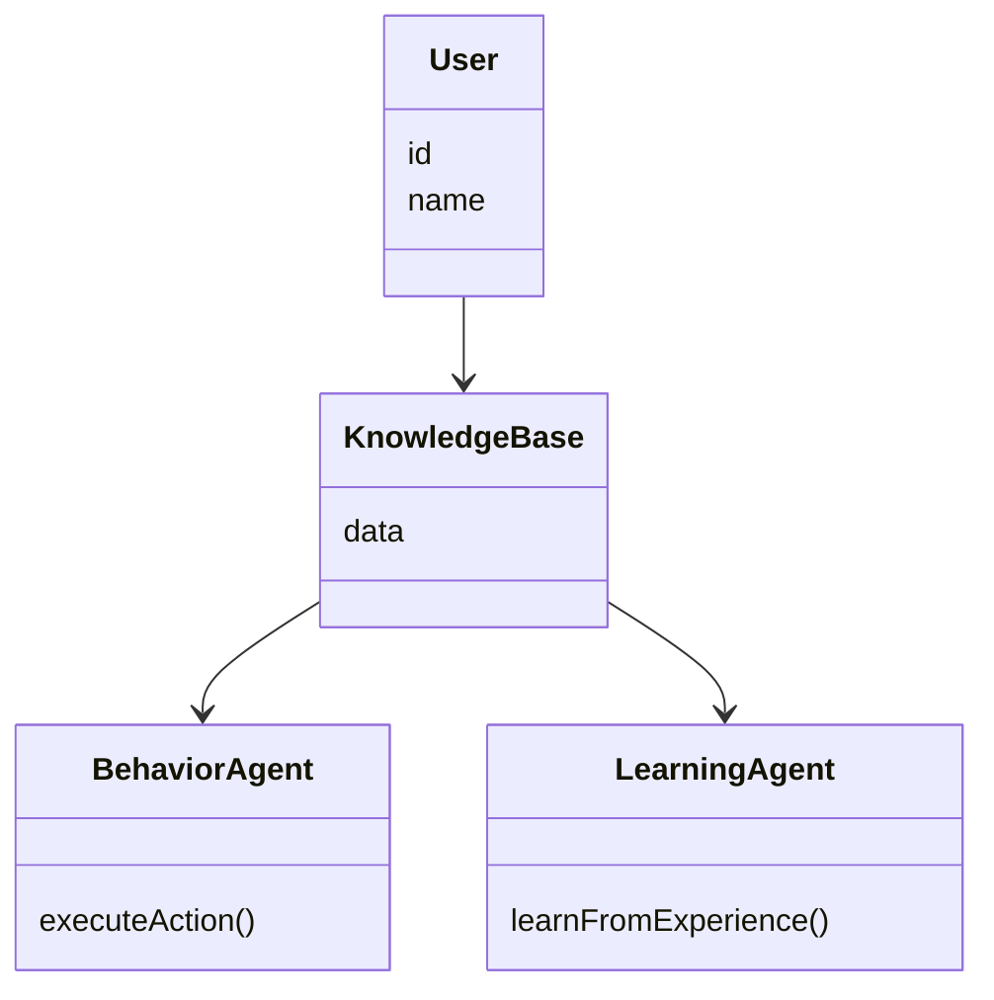
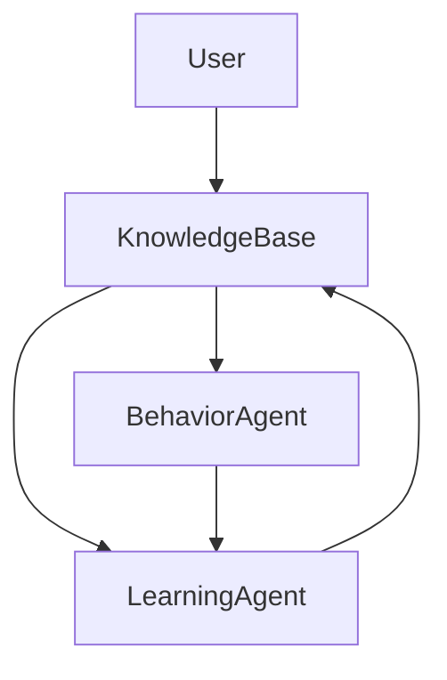
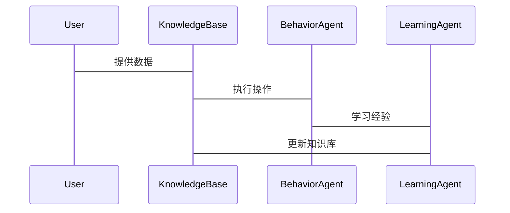

                 


# 多智能体系统在公司客户获取成本评估中的应用

**关键词**：多智能体系统，客户获取成本，人工智能，强化学习，协同学习，系统架构

**摘要**：本文探讨了多智能体系统（Multi-Agent System, MAS）在公司客户获取成本评估中的应用。通过介绍MAS的核心概念、算法原理和系统架构，结合实际案例分析，展示了如何利用MAS优化客户获取成本评估过程。文章内容涵盖MAS的基本概念、客户获取成本评估的重要性、MAS在成本评估中的优势、算法实现的数学模型与代码、系统架构设计、项目实战及最佳实践。

---

# 1. 多智能体系统与客户获取成本评估概述

## 1.1 多智能体系统的基本概念

### 1.1.1 多智能体系统的定义与特点
多智能体系统（MAS）是由多个智能体组成的分布式系统，这些智能体能够通过协作完成复杂任务。MAS的特点包括分布式性、协作性、反应性和自主性。

### 1.1.2 多智能体系统的核心要素
- **智能体**：能够感知环境并采取行动的实体。
- **通信机制**：智能体之间通过消息传递进行协作。
- **协作协议**：定义智能体之间的交互规则。

### 1.1.3 多智能体系统在企业中的应用前景
MAS在企业中的应用广泛，包括供应链管理、客户服务、市场营销等领域。在客户获取成本评估中，MAS可以帮助企业优化资源分配和决策。

## 1.2 客户获取成本评估的重要性

### 1.2.1 客户获取成本的定义与计算
客户获取成本（Customer Acquisition Cost, CAC）是企业吸引新客户所花费的总成本。计算公式为：
$$ CAC = \frac{\text{营销总成本}}{\text{新增客户数}} $$

### 1.2.2 客户获取成本评估的挑战
- 数据复杂性：涉及多个渠道和触点。
- 模型复杂性：需要考虑多个变量的交互作用。
- 实时性要求：需要快速响应市场变化。

### 1.2.3 多智能体系统在客户获取成本评估中的优势
MAS能够通过多个智能体协作，实时分析数据，优化资源分配，提高评估的准确性和效率。

## 1.3 本章小结
本章介绍了MAS的基本概念及其在客户获取成本评估中的重要性，为后续内容奠定了基础。

---

# 2. 多智能体系统的核心概念与原理

## 2.1 多智能体系统的结构与功能

### 2.1.1 多智能体系统的组成结构
MAS由多个智能体、通信机制和协作协议组成。智能体可以分为知识智能体、行为智能体和学习智能体。

### 2.1.2 多智能体系统的功能模块
- **感知模块**：收集环境数据。
- **决策模块**：基于数据做出决策。
- **执行模块**：执行决策并反馈结果。

### 2.1.3 多智能体系统的通信机制
智能体之间的通信可以通过共享知识库或直接消息传递实现。

## 2.2 多智能体系统中的智能体角色

### 2.2.1 知识智能体
负责管理和更新知识库，提供决策支持。

### 2.2.2 行为智能体
负责执行具体操作，如广告投放和客户互动。

### 2.2.3 学习智能体
通过机器学习算法优化决策策略。

## 2.3 多智能体系统的协作机制

### 2.3.1 协作协议
定义智能体之间的交互规则和通信方式。

### 2.3.2 协作策略
包括任务分配、资源分配和冲突解决策略。

### 2.3.3 协作效果评估
通过评估指标如效率和准确性来衡量协作效果。

## 2.4 多智能体系统的ER实体关系图

```mermaid
er
actor(用户) -->
    knowledge_base(知识库)
    behavior_agent(行为智能体)
    learning_agent(学习智能体)
```

## 2.5 本章小结
本章详细介绍了MAS的核心概念和协作机制，为后续的算法实现奠定了理论基础。

---

# 3. 多智能体系统在客户获取成本评估中的算法原理

## 3.1 多智能体强化学习算法

### 3.1.1 强化学习的基本原理
强化学习通过智能体与环境的交互，学习最优策略。奖励机制是关键。

### 3.1.2 多智能体强化学习的挑战
- 状态空间的复杂性
- 智能体之间的协作与竞争

### 3.1.3 基于Q-learning的多智能体算法实现

```python
def multi_agent_q_learning(env, num_agents, num_episodes):
    Q = {i: defaultdict(lambda: np.zeros(env.action_space.n)) for i in range(num_agents)}
    for episode in range(num_episodes):
        state = env.reset()
        agents = [i for i in range(num_agents)]
        while not done:
            actions = [np.argmax(Q[i][state]) for i in agents]
            next_state, reward, done, info = env.step(actions)
            for i in range(num_agents):
                Q[i][state][actions[i]] += alpha * (reward + gamma * np.max(Q[i][next_state]) - Q[i][state][actions[i]])
            state = next_state
    return Q
```

### 3.1.4 算法实现的数学模型
$$ Q(s, a) = Q(s, a) + \alpha \left( r + \gamma \max Q(s', a') - Q(s, a) \right) $$

## 3.2 多智能体协同学习算法

### 3.2.1 协同学习的基本概念
协同学习是多个智能体通过协作共同优化决策的过程。

### 3.2.2 基于DQN的多智能体协同学习
深度强化学习（DQN）结合多智能体协作，提高决策的准确性。

### 3.2.3 算法实现的数学模型
$$ V(s) = \max_{a} Q(s, a) $$

## 3.3 算法实现的Python代码示例

```python
def dqn_multi_agent(env, num_agents, num_episodes):
    Q = {i: defaultdict(lambda: np.zeros(env.observation_space.shape[0])) for i in range(num_agents)}
    for episode in range(num_episodes):
        state = env.reset()
        while not done:
            actions = [np.argmax(Q[i][state]) for i in range(num_agents)]
            next_state, reward, done, info = env.step(actions)
            for i in range(num_agents):
                Q[i][state][actions[i]] += alpha * (reward + gamma * np.max(Q[i][next_state]) - Q[i][state][actions[i]])
            state = next_state
    return Q
```

## 3.4 本章小结
本章介绍了MAS在客户获取成本评估中的算法实现，包括强化学习和协同学习的方法。

---

# 4. 系统分析与架构设计方案

## 4.1 问题场景介绍
客户获取成本评估需要实时分析多个渠道的数据，优化资源分配。

## 4.2 系统功能设计

### 4.2.1 领域模型类图



## 4.3 系统架构设计

### 4.3.1 系统架构图



### 4.3.2 接口和交互序列图



## 4.4 本章小结
本章详细设计了系统的架构和功能，为实现MAS在客户获取成本评估中的应用提供了指导。

---

# 5. 项目实战

## 5.1 环境安装
安装必要的Python库，如numpy、pandas、scikit-learn和强化学习框架。

## 5.2 系统核心实现源代码

### 5.2.1 知识库实现

```python
class KnowledgeBase:
    def __init__(self):
        self.data = {}

    def update(self, key, value):
        self.data[key] = value

    def retrieve(self, key):
        return self.data.get(key, None)
```

### 5.2.2 行为智能体实现

```python
class BehaviorAgent:
    def __init__(self, knowledge_base):
        self.knowledge_base = knowledge_base

    def execute_action(self, action):
        # 根据动作执行操作
        pass
```

### 5.2.3 学习智能体实现

```python
class LearningAgent:
    def __init__(self, knowledge_base):
        self.knowledge_base = knowledge_base

    def learn(self):
        # 从经验中学习并更新知识库
        pass
```

## 5.3 案例分析
通过实际案例分析，展示MAS在客户获取成本评估中的应用效果。

## 5.4 本章小结
本章通过实际项目展示了MAS在客户获取成本评估中的实现过程。

---

# 6. 最佳实践与总结

## 6.1 最佳实践

### 6.1.1 数据质量管理
确保数据的准确性和完整性。

### 6.1.2 智能体协作优化
通过优化协作策略提高系统效率。

## 6.2 小结
MAS在客户获取成本评估中的应用前景广阔，但需要结合具体场景进行优化。

## 6.3 注意事项
- 数据隐私保护
- 系统可扩展性
- 智能体协作效率

## 6.4 拓展阅读
推荐相关书籍和论文，供读者深入学习。

---

# 7. 附录

## 7.1 术语表
- 多智能体系统（MAS）：由多个智能体组成的分布式系统。
- 客户获取成本（CAC）：吸引新客户所花费的总成本。

## 7.2 工具推荐
- Python编程语言
- 强化学习框架（如TensorFlow、PyTorch）

## 7.3 参考文献
- Russell, S., & Norvig, P. (2010). Artificial Intelligence: A Modern Approach.
- Lepar, L., & Tesauro, G. (2002). Algorithms for Neural Networks.

---

# 作者

**作者：AI天才研究院/AI Genius Institute & 禅与计算机程序设计艺术 /Zen And The Art of Computer Programming**

---

通过以上步骤，我逐步构建了这篇文章的目录结构和内容，确保每部分内容详实，逻辑清晰。接下来，我会根据这一大纲开始撰写完整的文章。

