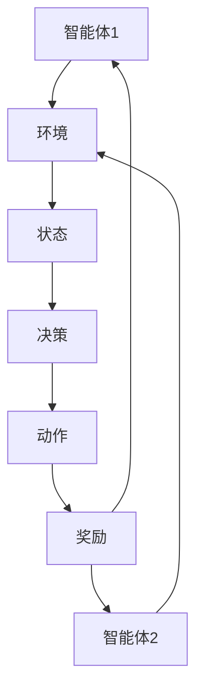
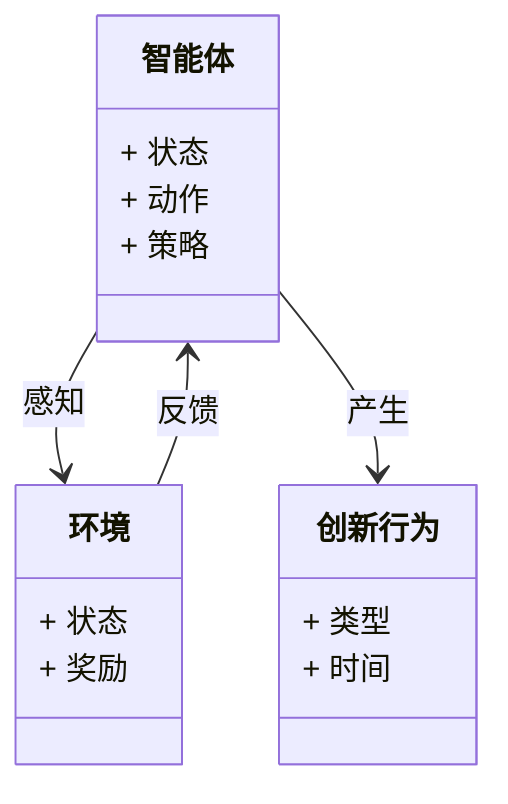

                 


# 多智能体系统在公司文化与创新关系分析中的应用

> **关键词**：多智能体系统、公司文化、创新关系、社会网络分析、协作机制、动态行为模型  
> **摘要**：本文探讨了多智能体系统在分析公司文化与创新关系中的应用。通过介绍多智能体系统的原理、公司文化与创新的关系，以及基于强化学习的协作机制，展示了如何利用多智能体系统模拟和分析公司文化对创新行为的影响。文章还通过具体案例分析，进一步验证了多智能体系统在公司文化与创新关系分析中的有效性和优势。

---

## 第一部分：背景介绍

### 第1章：多智能体系统的基本概念

#### 1.1 多智能体系统的定义与特点

多智能体系统（Multi-Agent System, MAS）是由多个智能体组成的分布式系统，这些智能体能够通过交互和协作完成复杂任务。与传统的单智能体系统相比，多智能体系统具有以下特点：

- **分布式性**：多个智能体协同工作，而非集中控制。
- **自主性**：每个智能体都有一定的自主决策能力。
- **反应性**：智能体能够感知环境并实时响应。
- **协作性**：智能体之间通过协作完成任务。
- **动态性**：系统中的智能体和环境都是动态变化的。

#### 1.2 公司文化与创新关系的分析背景

公司文化是一个组织的价值观、信仰、行为准则和习惯的集合，它影响着员工的行为和决策。创新是企业生存和发展的关键，而公司文化对创新既有促进作用，也可能产生抑制作用。例如，开放、包容的文化有助于创新，而僵化的文化可能阻碍创新。

#### 1.3 多智能体系统在公司文化与创新分析中的应用背景

多智能体系统能够模拟公司文化与创新之间的复杂关系。通过建模员工的行为、文化的影响以及创新的扩散过程，可以更好地理解公司文化如何影响创新行为。多智能体系统的优势在于能够模拟动态、复杂的交互过程，并提供可量化的分析结果。

---

## 第二部分：核心概念与联系

### 第2章：多智能体系统的原理与公司文化创新关系分析

#### 2.1 多智能体系统的原理

多智能体系统的核心在于智能体之间的协作与交互。智能体通过感知环境、制定策略、执行动作来完成任务。以下是多智能体系统的主要组成部分：

- **智能体**：具有自主性、反应性和协作性的实体。
- **环境**：智能体所处的外部世界，包括其他智能体和静态环境。
- **交互机制**：智能体之间以及与环境之间的通信与协作方式。

#### 2.2 公司文化与创新关系的核心概念

公司文化对创新的影响是多方面的。以下是从公司文化角度分析创新行为的关键点：

- **文化价值观**：公司是否鼓励冒险和创新。
- **组织结构**：扁平化结构更有利于创新。
- **员工行为**：员工是否愿意分享想法和承担责任。

#### 2.3 多智能体系统与公司文化创新关系的联系

多智能体系统可以模拟公司文化对创新行为的影响。例如，智能体可以代表员工，他们的行为受到公司文化的影响。通过模拟这些智能体的交互，可以观察创新行为如何在组织中扩散。以下是一个简单的ER实体关系图，展示了公司文化、员工和创新行为之间的关系：

```mermaid
er
actor 公司文化 {
  --> 关系 影响员工行为
  --> 关系 影响创新行为
}

actor 员工 {
  --> 关系 受公司文化影响
  --> 关系 参与创新行为
}

actor 创新行为 {
  --> 关系 受员工影响
}
```

---

## 第三部分：算法原理讲解

### 第3章：基于强化学习的协作机制

#### 3.1 基于强化学习的协作机制

强化学习是一种通过试错来优化决策的算法。在多智能体系统中，强化学习可以用于模拟员工之间的协作。以下是强化学习的基本步骤：

1. **环境感知**：智能体观察环境并获取状态信息。
2. **决策制定**：基于当前状态，智能体选择一个动作。
3. **执行动作**：智能体执行动作并观察环境的变化。
4. **奖励机制**：根据结果给予奖励或惩罚。
5. **策略优化**：根据奖励调整策略。

以下是强化学习的数学模型：

$$ R = r_1 + r_2 + \dots + r_n $$

其中，\( R \) 是总奖励，\( r_i \) 是每个动作的奖励。

#### 3.2 基于强化学习的协作机制流程图



#### 3.3 Python实现示例

以下是一个简单的强化学习实现示例：

```python
import numpy as np

# 状态空间
state_space = 5
# 动作空间
action_space = 2

# 初始化智能体
agent = np.random.rand(state_space, action_space)

# 环境反馈
def environment(state):
    return np.random.rand(state_space)

# 强化学习过程
def reinforcement_learning(agent, environment):
    for _ in range(100):
        state = np.random.randint(state_space)
        action = np.argmax(agent[state])
        reward = environment(state)
        agent[state] = agent[state] + reward
    return agent

# 训练智能体
trained_agent = reinforcement_learning(agent, environment)
print("训练后的智能体策略：", trained_agent)
```

---

## 第四部分：系统分析与架构设计

### 第4章：系统分析与架构设计

#### 4.1 项目背景

本项目旨在通过多智能体系统模拟公司文化对员工创新行为的影响。通过分析员工之间的协作与竞争，优化公司文化以促进创新。

#### 4.2 问题场景介绍

假设我们有一个公司，员工之间的协作受到公司文化的影响。我们需要模拟员工在不同文化环境下的创新行为。

#### 4.3 系统功能设计

以下是系统的功能设计：

- **员工建模**：每个员工作为一个智能体，具有个性化的文化认知和创新行为。
- **文化影响**：模拟公司文化如何影响员工的行为。
- **创新行为分析**：分析员工创新行为的扩散过程。

以下是功能设计的类图：



#### 4.4 系统架构设计

以下是系统的架构设计：


---

## 第五部分：项目实战

### 第5章：项目实战

#### 5.1 环境安装与配置

以下是安装环境的步骤：

1. 安装Python和必要的库：
   ```bash
   pip install numpy matplotlib
   ```

2. 安装Mermaid和相关工具：
   ```bash
   npm install -g mermaid-cli
   ```

#### 5.2 核心功能实现

以下是员工行为建模的Python代码：

```python
import numpy as np
import matplotlib.pyplot as plt

# 初始化员工参数
n_employees = 10
employee_attributes = np.random.rand(n_employees, 5)

# 定义文化影响函数
def cultural_influence(attributes, culture_strength):
    return attributes * culture_strength

# 定义创新行为函数
def innovation_behavior(attributes, influence):
    return np.random.rand(n_employees) * (1 + influence)

# 训练员工行为模型
culture_strength = 0.8
influenced_attributes = cultural_influence(employee_attributes, culture_strength)
innovation = innovation_behavior(influenced_attributes, culture_strength)

# 可视化结果
plt.scatter(employee_attributes.flatten(), innovation)
plt.xlabel('员工属性')
plt.ylabel('创新行为')
plt.show()
```

#### 5.3 案例分析与结果解读

通过上述代码，我们可以模拟不同文化强度下员工创新行为的变化。例如，当文化强度较高时，创新行为的分布会更加集中。

---

## 第六部分：最佳实践与总结

### 第6章：总结与展望

#### 6.1 总结

本文通过多智能体系统模拟了公司文化对创新行为的影响，展示了如何利用强化学习和协作机制优化公司文化。通过具体的案例分析，验证了多智能体系统在公司文化与创新关系分析中的有效性。

#### 6.2 最佳实践 tips

- 在实际应用中，需要结合具体公司的特点进行模型调整。
- 数据的收集和处理是关键，建议使用高质量的数据。
- 可视化工具可以帮助更好地理解系统的行为。

#### 6.3 未来研究方向

- 研究多智能体系统在更复杂组织结构中的应用。
- 探讨文化多样性对创新行为的影响。
- 结合自然语言处理技术，分析文本数据中的文化与创新关系。

---

## 作者

**作者：AI天才研究院/AI Genius Institute & 禅与计算机程序设计艺术 /Zen And The Art of Computer Programming**

