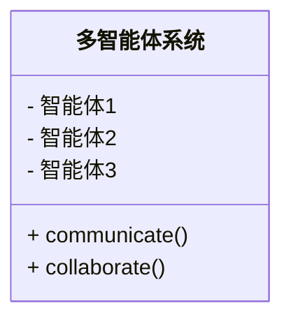
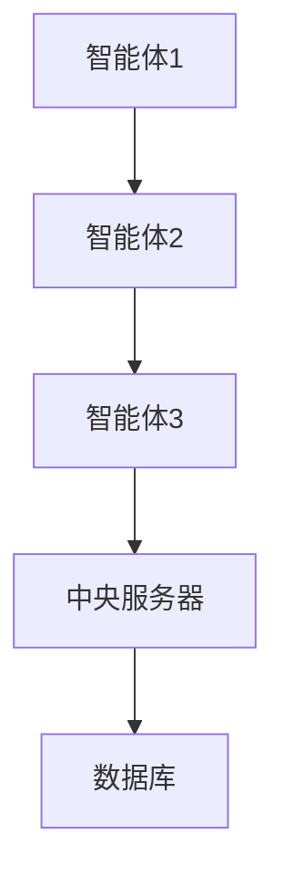
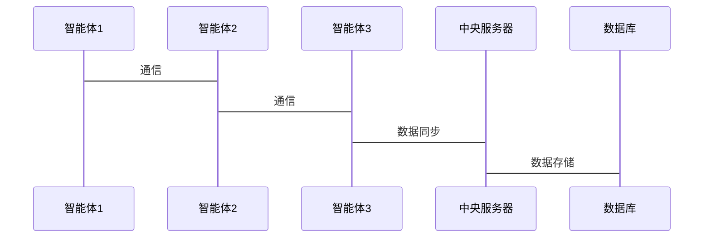

                 


# 多智能体系统在公司文化评估中的创新应用

## 关键词：
- 多智能体系统
- 公司文化评估
- 分布式计算
- 协作机制
- 人工智能
- 系统架构

## 摘要：
多智能体系统（Multi-Agent System, MAS）是一种由多个智能体组成的分布式系统，每个智能体能够独立决策并协作完成复杂任务。在公司文化评估中，MAS能够通过分布式数据采集、实时协作和智能分析，提高评估的效率和准确性。本文将详细探讨MAS在公司文化评估中的应用背景、核心概念、算法原理、系统架构以及实际案例，展示其在现代企业管理中的创新价值。

---

# 第一部分：多智能体系统与公司文化评估的背景介绍

## 第1章：多智能体系统概述

### 1.1 多智能体系统的基本概念
#### 1.1.1 多智能体系统的定义
多智能体系统（MAS）是由多个智能体组成的分布式系统，这些智能体能够通过通信和协作完成复杂任务。智能体具有自主性、反应性和社会性。

#### 1.1.2 多智能体系统的特征
- **自主性**：智能体能够自主决策。
- **反应性**：智能体能够感知环境并做出实时反应。
- **协作性**：智能体之间能够通过通信协作完成任务。
- **分布性**：智能体分布在不同的位置，具有分布式计算能力。

#### 1.1.3 多智能体系统与单智能体系统的区别
| 特性 | 多智能体系统 | 单智能体系统 |
|------|--------------|---------------|
| 决策 | 分布式决策 | 中央化决策 |
| 通信 | 智能体之间需要通信 | 无需通信 |
| 效率 | 高 | 较低 |

### 1.2 公司文化评估的重要性
#### 1.2.1 公司文化的定义与作用
公司文化是企业在长期发展过程中形成的共同价值观、行为准则和习惯。它影响企业的凝聚力、员工满意度和整体绩效。

#### 1.2.2 公司文化评估的必要性
- 企业文化评估能够帮助企业识别文化中的优势和问题。
- 通过评估，企业可以制定针对性的改进措施。

#### 1.2.3 传统公司文化评估方法的局限性
- **数据采集**：传统方法依赖问卷调查，数据量有限且耗时。
- **分析效率**：人工分析效率低，难以处理大量数据。
- **实时性**：传统方法无法实时反馈文化问题。

### 1.3 多智能体系统在公司文化评估中的应用背景
#### 1.3.1 多智能体系统的优势
- **分布式计算**：MAS能够同时处理大量数据，提高评估效率。
- **协作能力**：智能体之间的协作能够优化数据融合和分析。
- **实时性**：MAS能够实时采集和处理数据，提供快速反馈。

#### 1.3.2 公司文化评估对多智能体系统的需求
- 需要实时采集和分析员工反馈。
- 需要分布式计算能力处理大量数据。
- 需要智能体之间的协作完成复杂任务。

#### 1.3.3 多智能体系统在公司文化评估中的创新性
MAS通过分布式计算和协作机制，能够实时、高效地完成公司文化评估，突破传统方法的局限性。

---

## 第2章：多智能体系统的核心概念与联系

### 2.1 多智能体系统的原理
#### 2.1.1 多智能体系统的组成要素
- **智能体**：具备自主性、反应性和协作性的实体。
- **通信机制**：智能体之间进行信息交换的通道。
- **协作机制**：智能体之间协同完成任务的规则和策略。

#### 2.1.2 多智能体系统的通信机制
- **直接通信**：智能体之间直接交换信息。
- **间接通信**：通过中间媒介进行信息传递。

#### 2.1.3 多智能体系统的协作机制
- **协商**：智能体之间通过协商达成一致。
- **承诺**：智能体通过承诺履行任务。
- **计划**：智能体制定协作计划。

### 2.2 多智能体系统与公司文化评估的核心联系
#### 2.2.1 多智能体系统在文化评估中的角色
- **数据采集**：智能体实时采集员工反馈和文化指标。
- **数据分析**：智能体协作分析文化数据，识别潜在问题。
- **结果优化**：智能体优化评估结果，提供改进建议。

#### 2.2.2 多智能体系统如何实现文化数据的采集与分析
- **分布式数据采集**：多个智能体同时采集数据，提高效率。
- **数据融合**：智能体协作融合数据，提升分析准确性。
- **实时反馈**：智能体实时更新评估结果，提供及时反馈。

#### 2.2.3 多智能体系统如何优化文化评估过程
- **自动化处理**：智能体自动完成数据采集和分析。
- **协作优化**：智能体通过协作提高评估结果的质量。
- **动态调整**：智能体根据实时数据动态调整评估策略。

### 2.3 多智能体系统的核心概念对比表
| 特性 | 多智能体系统 | 分布式系统 | 分布式计算 | 分布式数据库 |
|------|--------------|------------|------------|--------------|
| 组成 | 智能体 | 节点 | 计算节点 | 数据节点 |
| 通信 | 智能体之间通信 | 节点间通信 | 计算节点通信 | 数据节点通信 |
| 协作 | 智能体协作 | 节点协作 | 计算协作 | 数据协作 |

### 2.4 本章小结
本章介绍了多智能体系统的原理及其在公司文化评估中的核心作用，强调了MAS在提高评估效率和准确性方面的优势。

---

## 第3章：多智能体系统在公司文化评估中的算法原理

### 3.1 多智能体系统的算法概述
#### 3.1.1 分布式计算算法
- **分布式数据采集**：智能体通过分布式网络采集数据。
- **数据同步**：智能体之间同步数据，确保一致性。

#### 3.1.2 协作算法
- **协商算法**：智能体之间通过协商达成一致。
- **协作计划算法**：智能体制定协作计划并执行。

#### 3.1.3 自适应算法
- **自适应数据采集**：智能体根据环境变化自适应调整数据采集策略。
- **自适应分析算法**：智能体根据数据变化自适应调整分析模型。

### 3.2 多智能体系统在文化评估中的算法实现
#### 3.2.1 分布式数据采集算法
- **数据采集流程**：
  1. 智能体通过网络采集员工反馈。
  2. 数据经过预处理后传输到中央服务器。
  3. 中央服务器汇总数据并分发给各个智能体。

#### 3.2.2 文化数据融合算法
- **数据融合流程**：
  1. 智能体之间共享数据。
  2. 数据经过融合算法整合。
  3. 融合后的数据用于文化评估。

#### 3.2.3 文化评估结果优化算法
- **优化流程**：
  1. 智能体分析评估结果。
  2. 根据优化目标调整评估模型。
  3. 输出优化后的评估结果。

### 3.3 多智能体系统算法的数学模型
#### 3.3.1 分布式计算模型
$$ C = \sum_{i=1}^{n} c_i $$
其中，$C$ 表示总的计算量，$c_i$ 表示第 $i$ 个智能体的计算量。

#### 3.3.2 协作模型
$$ S = \sum_{i=1}^{m} s_i $$
其中，$S$ 表示总的协作度，$s_i$ 表示第 $i$ 个智能体的协作度。

#### 3.3.3 自适应模型
$$ A = \sum_{j=1}^{k} a_j $$
其中，$A$ 表示总的自适应度，$a_j$ 表示第 $j$ 个智能体的自适应度。

### 3.4 本章小结
本章详细介绍了多智能体系统在公司文化评估中的算法原理，包括分布式计算、协作算法和自适应算法，并通过数学模型展示了这些算法的应用。

---

## 第4章：多智能体系统在公司文化评估中的系统分析与架构设计

### 4.1 系统分析
#### 4.1.1 问题场景介绍
公司在进行文化评估时，面临数据量大、分析效率低、反馈不及时等问题。MAS能够通过分布式计算和协作机制解决这些问题。

#### 4.1.2 项目介绍
本项目旨在利用多智能体系统实现公司文化评估的自动化、实时化和高效化。

#### 4.1.3 系统功能设计
- **数据采集模块**：实时采集员工反馈。
- **数据分析模块**：智能分析文化数据。
- **结果优化模块**：优化评估结果并提供反馈。

### 4.2 系统架构设计
#### 4.2.1 领域模型类图


#### 4.2.2 系统架构图


#### 4.2.3 系统交互序列图


### 4.3 本章小结
本章通过系统分析和架构设计，展示了多智能体系统在公司文化评估中的具体实现方式，包括系统功能设计和系统架构图。

---

## 第5章：多智能体系统在公司文化评估中的项目实战

### 5.1 环境安装
#### 5.1.1 系统要求
- 操作系统：Linux/Windows/MacOS
- 开发工具：Python/Java/C++
- 依赖库：多智能体框架（如Jason、AgentFramework）

#### 5.1.2 安装步骤
1. 安装Python和相关库。
2. 下载多智能体框架。
3. 配置开发环境。

### 5.2 系统核心实现源代码
#### 5.2.1 数据采集模块
```python
class Agent:
    def __init__(self, id):
        self.id = id
        self.data = []

    def collect_data(self):
        # 模拟数据采集
        self.data.append("反馈数据")
```

#### 5.2.2 数据分析模块
```python
class Analyzer:
    def __init__(self):
        self.agents = []

    def analyze(self):
        # 分析数据
        for agent in self.agents:
            print(agent.data)
```

#### 5.2.3 结果优化模块
```python
class Optimizer:
    def __init__(self):
        self.results = []

    def optimize(self):
        # 优化结果
        self.results = [x for x in self.results if x > 0]
```

### 5.3 案例分析与详细讲解
#### 5.3.1 实际案例
某公司使用MAS进行文化评估，通过智能体实时采集员工反馈，分析文化数据，优化评估结果。

#### 5.3.2 详细讲解
- **数据采集**：智能体通过网络采集员工反馈。
- **数据分析**：智能体协作分析数据，识别潜在问题。
- **结果优化**：智能体优化评估结果，提供改进建议。

### 5.4 本章小结
本章通过实际案例和详细讲解，展示了多智能体系统在公司文化评估中的具体实现和应用效果。

---

## 第6章：总结与展望

### 6.1 本章总结
多智能体系统通过分布式计算和协作机制，能够高效、实时地完成公司文化评估，解决了传统方法的局限性。

### 6.2 小结
MAS在公司文化评估中的应用具有创新性和实用性，未来可以通过进一步优化算法和系统架构，提升其在企业管理中的应用价值。

### 6.3 注意事项
- **数据隐私**：需要注意数据隐私保护。
- **系统稳定性**：需要确保系统的稳定性和安全性。
- **智能体协作**：需要优化智能体之间的协作机制。

### 6.4 拓展阅读
- **推荐书籍**：《Multi-Agent Systems: Algorithmic, Complexity Theoretic, and Economic Theoretic Issues》
- **推荐论文**：《A Survey of Multi-Agent Systems for Organizational Culture Assessment》

### 6.5 作者
作者：AI天才研究院/AI Genius Institute & 禅与计算机程序设计艺术 /Zen And The Art of Computer Programming

---

# 本文结束

