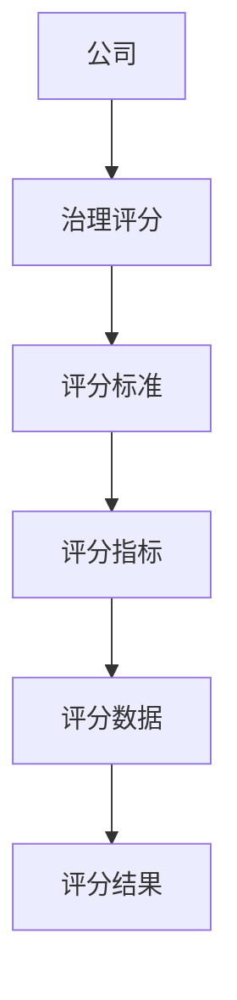
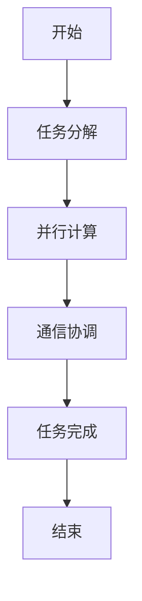
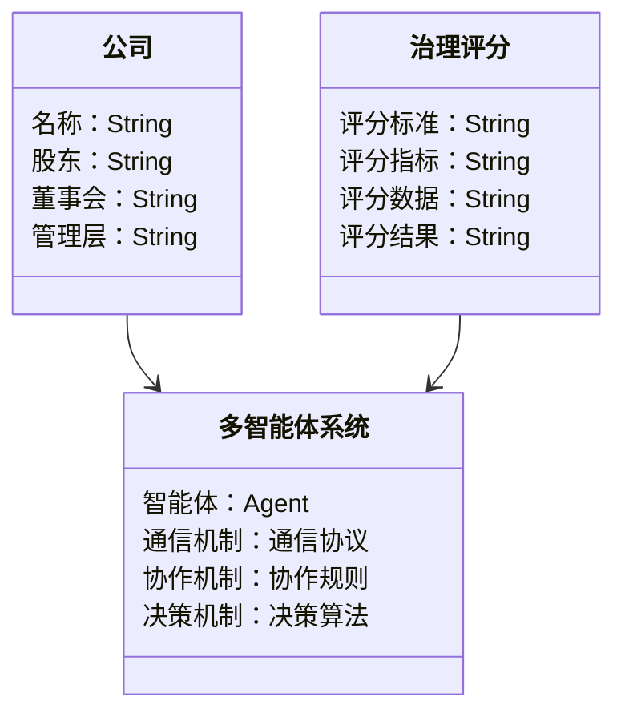
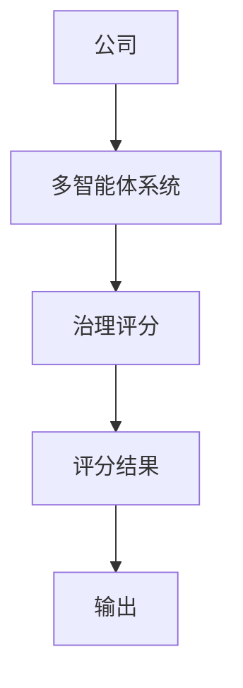
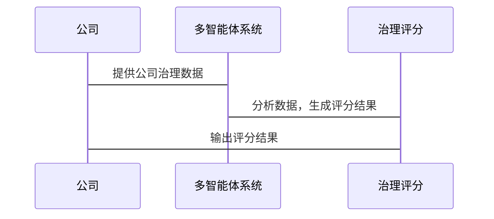

                 


# 多智能体系统在公司治理评分中的应用：量化管理质量

> 关键词：多智能体系统、公司治理评分、量化管理质量、分布式计算、协作机制、决策机制

> 摘要：本文探讨了多智能体系统在公司治理评分中的应用，分析了其核心原理、算法模型、系统架构以及实际案例，详细讲解了如何通过多智能体系统量化管理质量，优化公司治理结构。

---

# 第一部分: 多智能体系统与公司治理评分概述

## 第1章: 多智能体系统与公司治理评分的背景与概述

### 1.1 多智能体系统的基本概念

#### 1.1.1 多智能体系统的定义与特点

多智能体系统（Multi-Agent System, MAS）是由多个智能体（Agent）组成的分布式系统，这些智能体能够自主决策、协作完成任务，并通过通信实现信息共享。多智能体系统的特征包括：

- **自主性**：智能体能够独立决策。
- **反应性**：能够感知环境并做出实时反应。
- **协作性**：多个智能体协同完成复杂任务。
- **分布性**：系统由多个分布式智能体组成。

#### 1.1.2 多智能体系统的核心要素

多智能体系统的核心要素包括：

- **智能体**：具备感知、决策、行动能力的实体。
- **通信机制**：智能体之间的信息交互方式。
- **协作机制**：智能体协同工作的规则和策略。
- **任务模型**：描述任务目标和分解方法。

#### 1.1.3 多智能体系统在管理中的应用潜力

多智能体系统在管理中的潜力包括：

- **优化决策**：通过协作提高决策质量。
- **提高效率**：通过分布式计算减少资源浪费。
- **增强适应性**：能够快速响应环境变化。

### 1.2 公司治理评分的背景与意义

#### 1.2.1 公司治理的基本概念

公司治理是指公司内部和外部利益相关者之间的关系和权力分配，包括股东、董事会、管理层和员工等。

#### 1.2.2 公司治理评分的重要性

公司治理评分是衡量公司治理效率和效果的重要指标，有助于吸引投资者、提高公司信用评级和优化内部管理。

#### 1.2.3 公司治理评分的现状与挑战

当前，公司治理评分主要依赖人工评估，存在主观性高、效率低、成本高等问题。

### 1.3 多智能体系统与公司治理评分的结合

#### 1.3.1 多智能体系统在公司治理中的应用场景

- **风险评估**：通过多智能体系统实时监控公司风险。
- **决策优化**：智能体协作优化公司战略。
- **信息共享**：提高公司内部信息流通效率。

#### 1.3.2 公司治理评分的量化目标

- **量化公司治理效率**：通过多智能体系统量化公司治理的效率和效果。
- **优化公司治理结构**：通过协作优化公司治理结构。
- **提高公司治理透明度**：通过信息共享提高公司治理透明度。

#### 1.3.3 多智能体系统在评分中的优势

- **高效性**：通过分布式计算提高评估效率。
- **准确性**：通过协作机制提高评估准确性。
- **适应性**：能够快速响应环境变化。

### 1.4 本章小结

本章介绍了多智能体系统的基本概念和核心要素，分析了公司治理评分的重要性及其现状与挑战，探讨了多智能体系统在公司治理评分中的应用场景和优势。

---

# 第二部分: 多智能体系统的核心概念与联系

## 第2章: 多智能体系统的核心原理

### 2.1 多智能体系统的核心原理

#### 2.1.1 多智能体系统的通信机制

多智能体系统的通信机制包括：

- **消息传递**：通过消息传递实现智能体之间的信息共享。
- **协议设计**：设计统一的通信协议确保信息传递的准确性和高效性。

#### 2.1.2 多智能体系统的协作机制

多智能体系统的协作机制包括：

- **任务分配**：智能体根据自身能力和任务需求分配任务。
- **协调同步**：通过协调机制确保智能体协作的一致性。
- **冲突解决**：通过协商机制解决智能体之间的冲突。

#### 2.1.3 多智能体系统的决策机制

多智能体系统的决策机制包括：

- **分布式决策**：智能体根据本地信息做出决策。
- **集中式决策**：通过集中式决策系统统一制定决策。
- **混合式决策**：结合分布式和集中式决策的优点。

### 2.2 多智能体系统与公司治理评分的关系

#### 2.2.1 多智能体系统在评分中的角色

- **数据采集**：智能体负责采集公司治理相关数据。
- **数据分析**：通过协作分析数据，生成评分结果。
- **评分优化**：通过优化算法提高评分的准确性。

#### 2.2.2 多智能体系统如何影响公司治理

- **提高决策效率**：通过协作提高公司治理决策的效率。
- **增强透明度**：通过信息共享提高公司治理的透明度。
- **优化结构**：通过优化算法优化公司治理结构。

#### 2.2.3 多智能体系统与评分模型的结合

- **评分模型设计**：设计多智能体系统与评分模型的接口。
- **评分规则制定**：根据多智能体系统的特点制定评分规则。
- **评分结果输出**：通过多智能体系统输出评分结果。

### 2.3 多智能体系统的ER实体关系图



### 2.4 本章小结

本章详细讲解了多智能体系统的核心原理，分析了多智能体系统在公司治理评分中的角色和影响，通过ER实体关系图展示了多智能体系统与公司治理评分的关系。

---

# 第三部分: 多智能体系统的算法原理与数学模型

## 第3章: 多智能体系统的算法原理

### 3.1 多智能体系统的算法概述

#### 3.1.1 分布式计算的原理

- **任务分解**：将任务分解为多个子任务，分别由不同的智能体完成。
- **并行计算**：通过并行计算提高任务处理效率。
- **通信协调**：通过通信和协调机制确保任务的顺利进行。

#### 3.1.2 多智能体系统中的协作算法

- **协商算法**：智能体之间通过协商分配任务和资源。
- **同步算法**：确保智能体协作的一致性。
- **路由算法**：优化信息传递路径，减少通信延迟。

#### 3.1.3 多智能体系统的决策算法

- **分布式决策算法**：基于局部信息做出决策。
- **集中式决策算法**：通过集中式计算做出决策。
- **混合式决策算法**：结合分布式和集中式决策的优点。

### 3.2 多智能体系统的数学模型

#### 3.2.1 分布式计算模型

$$ \text{计算模型} = \text{任务分解} \times \text{并行计算} $$

#### 3.2.2 协作算法模型

$$ \text{协作算法} = \text{协商} + \text{同步} + \text{路由} $$

#### 3.2.3 决策算法模型

$$ \text{决策算法} = \text{分布式决策} + \text{集中式决策} $$

### 3.3 多智能体系统的算法流程



### 3.4 本章小结

本章详细讲解了多智能体系统的算法原理，分析了协作算法和决策算法的数学模型，并通过流程图展示了算法的执行流程。

---

# 第四部分: 系统分析与架构设计方案

## 第4章: 系统分析与架构设计方案

### 4.1 问题场景介绍

公司治理评分系统需要对多个公司进行评估，涉及大量数据的采集、分析和处理。传统的人工评估效率低、成本高，难以满足大规模评估的需求。

### 4.2 项目介绍

本项目旨在通过多智能体系统实现公司治理评分的自动化，提高评估效率和准确性。

### 4.3 系统功能设计

#### 4.3.1 领域模型



#### 4.3.2 系统架构设计



#### 4.3.3 系统接口设计

- **输入接口**：接收公司治理数据。
- **输出接口**：输出评分结果。
- **通信接口**：实现智能体之间的信息交互。

#### 4.3.4 系统交互设计



### 4.4 本章小结

本章分析了系统的问题场景，设计了系统的功能模块和架构，通过类图和序列图展示了系统的交互流程。

---

# 第五部分: 项目实战与案例分析

## 第5章: 项目实战

### 5.1 环境安装与配置

安装Python和相关库，例如`numpy`、`pandas`、`scikit-learn`等。

### 5.2 核心代码实现

#### 5.2.1 多智能体系统的实现

```python
class Agent:
    def __init__(self, name):
        self.name = name
        self.data = None
```

#### 5.2.2 通信机制的实现

```python
def communicate(agent1, agent2):
    agent2.data = agent1.data
```

#### 5.2.3 协作机制的实现

```python
def collaborate(agents):
    for agent in agents:
        agent.communicate(agents[0])
```

### 5.3 代码应用解读与分析

- **数据采集**：智能体采集公司治理数据。
- **数据分析**：多智能体系统协作分析数据。
- **评分生成**：生成评分结果并输出。

### 5.4 实际案例分析

以某公司为例，通过多智能体系统实现治理评分，分析评分结果并进行详细解读。

### 5.5 项目小结

总结项目实施的经验和教训，提出改进建议。

---

# 第六部分: 最佳实践与总结

## 第6章: 最佳实践

### 6.1 小结

多智能体系统在公司治理评分中的应用能够显著提高评估效率和准确性。

### 6.2 注意事项

- **数据质量**：确保数据的准确性和完整性。
- **系统安全性**：保护公司敏感信息。
- **算法优化**：不断优化算法提高评估效果。

### 6.3 拓展阅读

推荐相关书籍和论文，进一步学习多智能体系统和公司治理评分的知识。

---

# 作者

作者：AI天才研究院/AI Genius Institute & 禅与计算机程序设计艺术 /Zen And The Art of Computer Programming

---

通过以上内容，您可以根据实际需求，进一步扩展和完善文章的细节部分。

