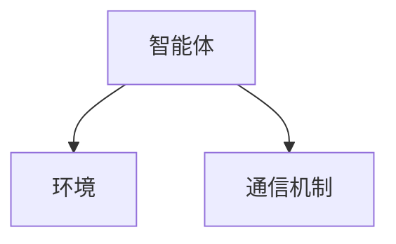
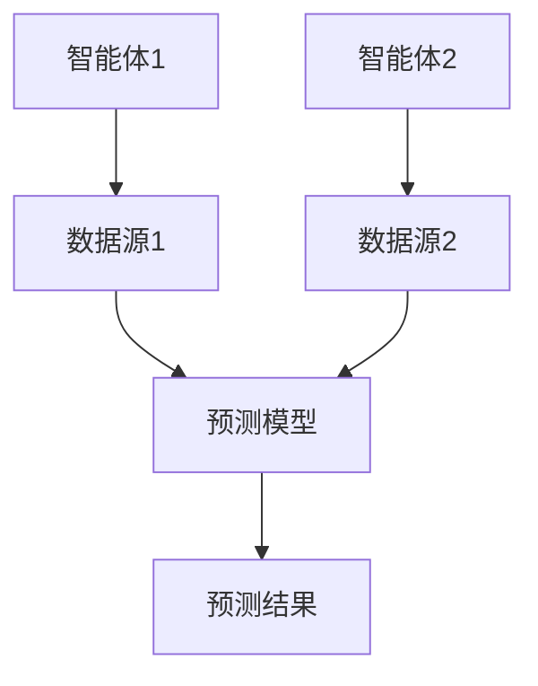
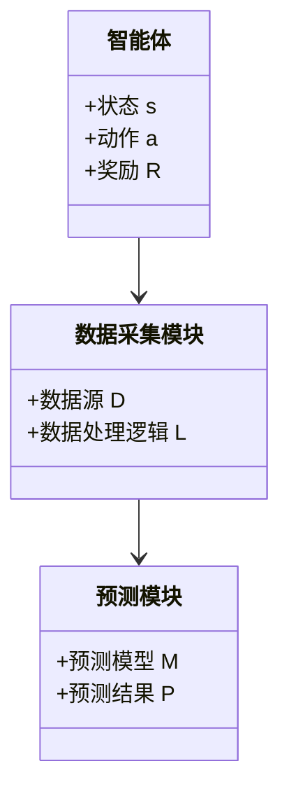
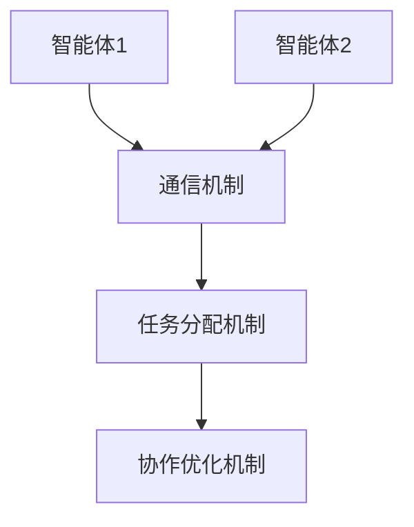

                 


# 多智能体系统在公司财务建模中的应用：提高预测准确性

## 关键词：多智能体系统, 财务建模, 预测准确性, 算法原理, 系统架构

## 摘要：  
本文探讨了多智能体系统（Multi-Agent System, MAS）在公司财务建模中的应用，重点分析了如何通过MAS的分布式计算、协作优化和自我适应能力来提高财务预测的准确性。文章首先介绍了MAS的基本概念和优势，然后从算法原理、系统架构、项目实战等多个维度详细阐述了MAS在财务建模中的具体应用，最后通过案例分析验证了MAS在提升预测准确性方面的有效性。

---

## 第1章: 多智能体系统与财务建模概述

### 1.1 多智能体系统的基本概念  
多智能体系统（MAS）是由多个智能体（Agent）组成的分布式系统，每个智能体都是具有计算能力、感知环境并能够自主决策的实体。MAS的核心特点包括：

1. **自主性**：智能体能够自主决策，无需外部干预。
2. **反应性**：智能体能够实时感知环境并做出响应。
3. **协作性**：多个智能体能够通过协作完成复杂任务。
4. **分布式性**：系统中的智能体分布在网络中，不存在集中控制节点。

### 1.2 公司财务建模的核心目标  
公司财务建模的主要目标是通过数学模型模拟公司的财务状况，帮助管理层进行决策。传统的财务建模方法通常依赖于单一模型，难以应对复杂多变的市场环境。MAS的优势在于其分布式计算能力和协作优化能力，能够更好地应对复杂的财务建模问题。

### 1.3 本章小结  
本章介绍了MAS的基本概念及其在财务建模中的应用背景，强调了MAS在提高财务预测准确性方面的潜力。

---

## 第2章: 多智能体系统的核心概念与联系

### 2.1 多智能体系统的结构与功能  
MAS的结构可以分为以下几个部分：

1. **智能体**：智能体是MAS的基本单元，负责执行具体任务。
2. **环境**：智能体与环境交互，感知环境并做出决策。
3. **通信机制**：智能体之间通过通信机制进行信息交换。

图1展示了MAS的基本结构：



### 2.2 多智能体系统的属性特征对比  
下表对比了MAS与其他分布式系统的关键属性：

| 特性         | 多智能体系统 | 分布式系统       |
|--------------|--------------|------------------|
| 结构         | 去中心化     | 去中心化或中心化 |
| 智能体       | 具有自主性   | 无自主性         |
| 通信         | 高频交互     | 低频交互         |

### 2.3 本章小结  
本章详细介绍了MAS的核心概念和结构，并通过对比分析突出了MAS的独特优势。

---

## 第3章: 多智能体系统在财务建模中的应用场景

### 3.1 财务预测中的多智能体系统应用  
在财务预测中，MAS可以通过以下方式提高预测准确性：

1. **分布式数据处理**：多个智能体分别处理不同数据源，提高计算效率。
2. **协作优化**：智能体之间通过协作优化预测模型，提高预测精度。

图2展示了MAS在财务预测中的协作流程：



### 3.2 风险评估中的多智能体系统应用  
在风险评估中，MAS可以通过以下方式降低风险：

1. **实时监控**：智能体实时监控市场变化，快速响应潜在风险。
2. **多维度分析**：多个智能体从不同角度分析风险，提高评估准确性。

### 3.3 决策支持中的多智能体系统应用  
在决策支持中，MAS可以通过以下方式辅助决策：

1. **多场景模拟**：智能体模拟不同场景下的财务表现，为决策提供支持。
2. **实时反馈**：智能体实时反馈决策结果，优化决策过程。

### 3.4 本章小结  
本章通过具体应用场景展示了MAS在财务建模中的优势，突出了其在提高预测准确性方面的潜力。

---

## 第4章: 多智能体系统算法原理

### 4.1 强化学习算法  
强化学习是一种通过智能体与环境交互来优化决策的算法。其基本原理如下：

1. **状态空间**：智能体感知环境状态。
2. **动作选择**：智能体根据当前状态选择动作。
3. **奖励机制**：环境对智能体的动作给予奖励或惩罚。

公式1展示了强化学习的基本模型：

$$ R = r(s, a) $$

其中，$R$ 表示奖励，$s$ 表示状态，$a$ 表示动作。

### 4.2 协作算法  
协作算法是一种通过智能体之间协作来优化系统性能的算法。其基本原理如下：

1. **任务分配**：智能体根据自身能力和环境状态分配任务。
2. **协作通信**：智能体之间通过通信机制共享信息。
3. **协同优化**：智能体协同优化系统性能。

公式2展示了协作算法的基本模型：

$$ P = p(s_1, s_2, ..., s_n) $$

其中，$P$ 表示系统性能，$s_i$ 表示智能体的状态。

### 4.3 其他相关算法  
除了强化学习和协作算法，MAS还可以采用其他算法，例如：

1. **遗传算法**：通过模拟生物进化过程优化系统性能。
2. **蚁群算法**：通过模拟蚂蚁觅食行为优化路径选择。

### 4.4 本章小结  
本章详细介绍了MAS中的主要算法及其原理，为后续系统设计奠定了理论基础。

---

## 第5章: 系统分析与架构设计方案

### 5.1 系统功能设计  
系统功能设计包括以下几个部分：

1. **数据采集模块**：采集财务数据。
2. **智能体协作模块**：实现智能体之间的协作。
3. **预测模块**：基于MAS进行财务预测。

图3展示了系统的功能设计：



### 5.2 系统架构设计  
系统的架构设计包括以下几个部分：

1. **通信机制**：实现智能体之间的通信。
2. **任务分配机制**：实现任务的分配与管理。
3. **协作优化机制**：实现系统的协作优化。

图4展示了系统的架构设计：



### 5.3 本章小结  
本章详细介绍了MAS的系统设计，为后续实现提供了理论支持。

---

## 第6章: 项目实战

### 6.1 环境搭建  
项目实战需要以下环境：

1. **编程语言**：Python
2. **框架**：使用强化学习框架（例如：OpenAI Gym）
3. **工具**：安装必要的库（例如：numpy, matplotlib）

### 6.2 核心实现  
以下是MAS在财务建模中的核心实现代码：

```python
class Agent:
    def __init__(self, state_space, action_space):
        self.state_space = state_space
        self.action_space = action_space
        self奖励 = 0

    def act(self, state):
        # 实现动作选择逻辑
        pass

    def learn(self, state, action, reward, next_state):
        # 实现强化学习算法
        pass

# 初始化智能体
agent = Agent(state_space, action_space)

# 进行预测
for _ in range(100):
    state = agent.act(current_state)
    reward = get_reward(state, action)
    agent.learn(state, action, reward, next_state)
```

### 6.3 案例分析  
以下是一个具体的案例分析：

1. **数据采集**：从多个数据源采集财务数据。
2. **智能体协作**：智能体协作优化预测模型。
3. **预测结果**：输出预测结果并进行分析。

### 6.4 本章小结  
本章通过具体项目实战展示了MAS在财务建模中的实际应用。

---

## 第7章: 总结与展望

### 7.1 本章小结  
本文详细探讨了多智能体系统在公司财务建模中的应用，通过理论分析和实际案例展示了MAS在提高预测准确性方面的潜力。

### 7.2 未来展望  
未来，随着人工智能技术的不断发展，MAS在财务建模中的应用将更加广泛。研究方向包括：

1. **算法优化**：进一步优化MAS的算法，提高预测准确性。
2. **系统扩展**：扩展MAS的应用场景，探索新的应用领域。

### 7.3 注意事项  
在实际应用中，需要注意以下几点：

1. **数据质量**：确保数据的准确性和完整性。
2. **系统安全性**：确保系统的安全性和稳定性。
3. **可解释性**：确保系统的可解释性，方便用户理解和使用。

### 7.4 拓展阅读  
推荐阅读以下书籍和论文：

1. 《Multi-Agent Systems: Algorithmic Foundations》
2. 《强化学习入门》

---

## 作者：AI天才研究院/AI Genius Institute & 禅与计算机程序设计艺术 /Zen And The Art of Computer Programming

