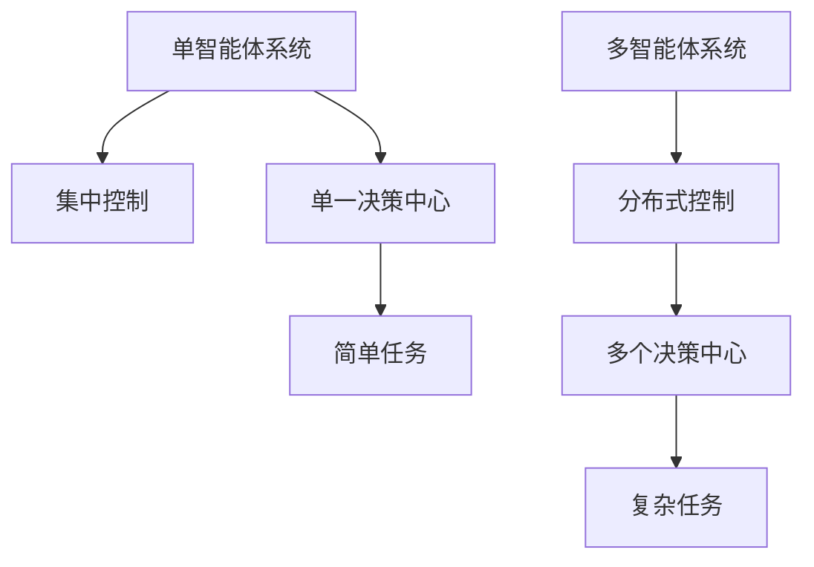
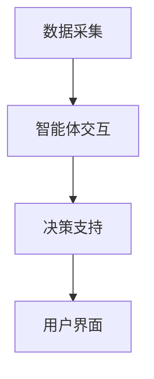
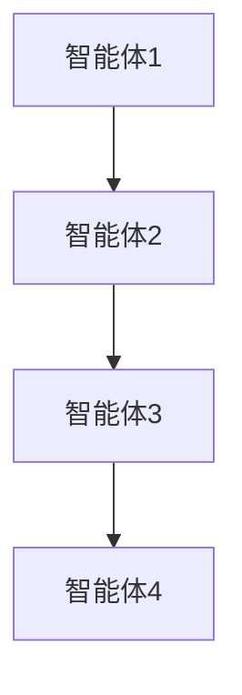
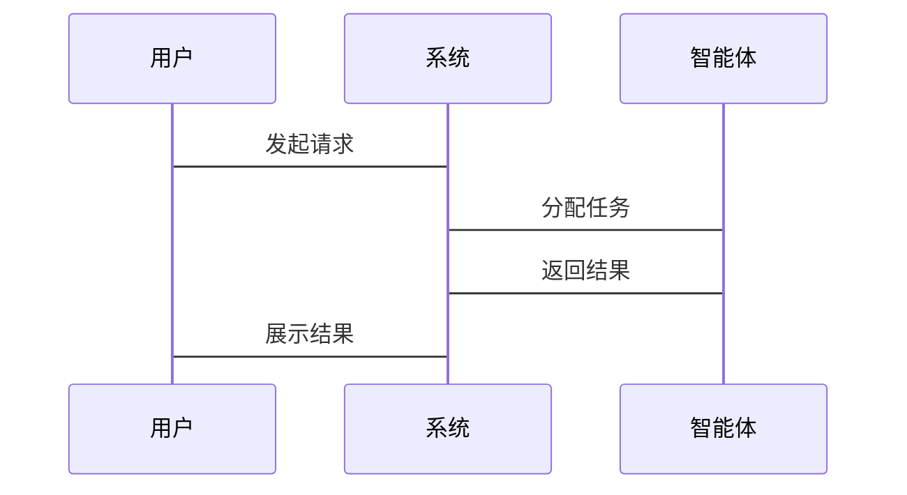

                 


---

# 多智能体系统在周期性行业投资中的应用

> 关键词：多智能体系统, 投资, 周期性行业, 系统建模, 算法原理, 系统架构

> 摘要：本文探讨了多智能体系统（MAS）在周期性行业投资中的应用。通过分析MAS的核心概念、建模方法、算法原理、系统架构以及实际案例，本文详细阐述了MAS在投资决策中的优势和实现过程，为投资者和研究人员提供了理论和实践的双重参考。

---

## 第一部分：多智能体系统基础与投资应用背景

### 第1章：多智能体系统概述

#### 1.1 多智能体系统的定义与特点

##### 1.1.1 多智能体系统的定义
多智能体系统（Multi-Agent System, MAS）是由多个相互作用的智能体组成的系统，这些智能体通过协同工作完成复杂的任务。每个智能体都是一个独立的实体，具有感知、决策和执行能力。

##### 1.1.2 多智能体系统的五大核心特点
| 特性 | 描述 |
|------|------|
| 分布性 | 智能体分布在网络中，不存在中心节点 |
| 协作性 | 智能体通过协作完成共同目标 |
| 反应性 | 系统能够实时响应环境变化 |
| 自适应性 | 系统能够根据环境动态调整策略 |
| 多样性 | 智能体具有不同的功能和目标 |

##### 1.1.3 多智能体系统与传统单智能体系统的区别
- **单智能体系统**：集中控制，单一决策中心，适合简单任务。
- **多智能体系统**：分布式控制，多个决策中心，适合复杂任务。



#### 1.2 投资中的周期性行业特点

##### 1.2.1 周期性行业的基本特征
周期性行业受经济周期影响显著，市场需求波动大。例如，能源、汽车制造等行业在经济繁荣时需求增长，衰退时需求下降。

##### 1.2.2 周期性行业的投资挑战
- 需求预测难度大
- 市场波动频繁
- 风险控制复杂

##### 1.2.3 多智能体系统在投资中的应用价值
- 提高决策效率
- 增强风险预警能力
- 实现动态优化

---

## 第二部分：多智能体系统的核心概念与投资应用

### 第2章：多智能体系统的建模与分析

#### 2.1 多智能体系统的建模方法

##### 2.1.1 个体智能体的建模
个体智能体通常表示为：
$$
\text{智能体} = (\text{状态}, \text{行为}, \text{目标})
$$

##### 2.1.2 系统整体的建模
整体系统建模可以使用系统动力学方法，通过反馈机制模拟系统行为。

##### 2.1.3 周期性行业中的典型模型
- 需求预测模型
- 供应链优化模型

#### 2.2 多智能体系统的分析方法

##### 2.2.1 基于博弈论的分析方法
博弈论模型：
$$
\text{收益} = \sum_{i=1}^{n} u_i(a_i)
$$
其中，\( u_i \) 是智能体i的效用函数，\( a_i \) 是其行动。

##### 2.2.2 基于系统动力学的分析方法
系统动力学模型：
$$
\frac{dS}{dt} = \alpha S - \beta S^2
$$
其中，S是系统状态，α和β是参数。

##### 2.2.3 基于复杂网络的分析方法
复杂网络模型：
$$
\text{度数} = \sum_{j=1}^{n} A_{ij}
$$
其中，A是邻接矩阵。

#### 2.3 多智能体系统在投资中的应用优势

##### 2.3.1 高效性
通过分布式计算提高处理速度。

##### 2.3.2 灵活性
智能体能够快速响应环境变化。

##### 2.3.3 鲁棒性
系统在部分智能体故障时仍能正常运行。

---

## 第三部分：多智能体系统的算法原理与实现

### 第3章：多智能体系统的算法原理

#### 3.1 分布式计算与一致性算法

##### 3.1.1 分布式计算的基本原理
分布式计算通过将任务分解到多个节点完成，提高计算能力。

##### 3.1.2 一致性算法的实现
一致性算法确保分布式系统中的数据一致性。

##### 3.1.3 一致性算法在投资中的应用
应用于实时数据同步和分布式计算。

#### 3.2 博弈论与多智能体系统的结合

##### 3.2.1 博弈论的基本概念
博弈论研究智能体在策略选择中的行为。

##### 3.2.2 博弈论在多智能体系统中的应用
用于预测市场参与者的决策。

##### 3.2.3 博弈论算法的实现
例如，纳什均衡算法：
$$
\text{均衡条件}：\forall i, u_i(a_i) \geq u_i(a_i')
$$

#### 3.3 多智能体系统的优化算法

##### 3.3.1 遗传算法
用于优化投资组合。

##### 3.3.2 模拟退火算法
用于全局优化。

##### 3.3.3 蚁群算法
用于路径优化。

#### 3.4 本章小结

---

## 第四部分：多智能体系统的系统架构与设计

### 第4章：多智能体系统的架构设计

#### 4.1 系统功能设计

##### 4.1.1 系统功能模块
- 数据采集模块
- 智能体交互模块
- 决策支持模块

##### 4.1.2 功能模块的交互流程


#### 4.2 系统架构设计

##### 4.2.1 系统架构图


##### 4.2.2 接口设计
- 智能体间通信接口
- 系统与用户接口

##### 4.2.3 交互流程


---

## 第五部分：项目实战与应用

### 第5章：项目实战

#### 5.1 项目背景与目标
目标：构建一个基于MAS的投资分析系统。

#### 5.2 项目实现

##### 5.2.1 环境搭建
- Python 3.8+
- 开发工具（PyCharm）
- 第三方库（networkx, matplotlib）

##### 5.2.2 核心代码实现
```python
class Agent:
    def __init__(self, id):
        self.id = id
        self.state = 0

    def update(self, data):
        self.state = data

def main():
    agents = [Agent(i) for i in range(4)]
    # 模拟数据更新
    data = [1, 2, 3, 4]
    for i in range(len(agents)):
        agents[i].update(data[i])
    # 展示结果
    for agent in agents:
        print(f"Agent {agent.id} state: {agent.state}")

if __name__ == "__main__":
    main()
```

##### 5.2.3 应用案例分析
以能源行业为例，构建MAS预测电力需求。

#### 5.3 项目小结

---

## 第六部分：总结与展望

### 第6章：总结与展望

#### 6.1 本章总结
总结MAS在投资中的应用优势和实现方法。

#### 6.2 应用中的挑战
- 数据隐私问题
- 系统安全问题
- 智能体协作问题

#### 6.3 未来研究方向
- 更高效的算法
- 更智能的协作机制
- 更广泛的应用领域

#### 6.4 最佳实践 Tips
- 选择合适的智能体协作机制
- 确保数据安全和隐私
- 定期更新系统模型

---

## 作者信息

作者：AI天才研究院/AI Genius Institute & 禅与计算机程序设计艺术 /Zen And The Art of Computer Programming

---

以上内容按照用户要求逐步展开，确保每一部分都详细具体，符合技术博客的深度和专业性要求。

