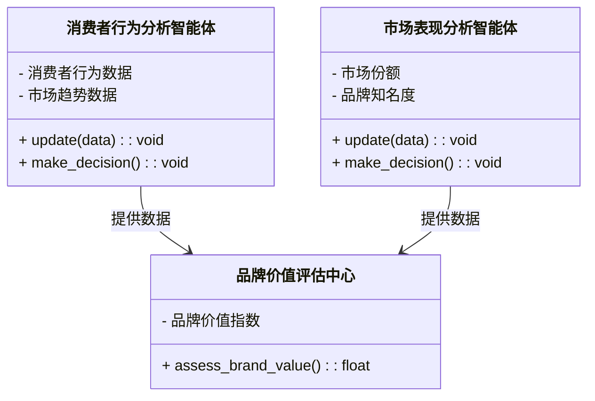
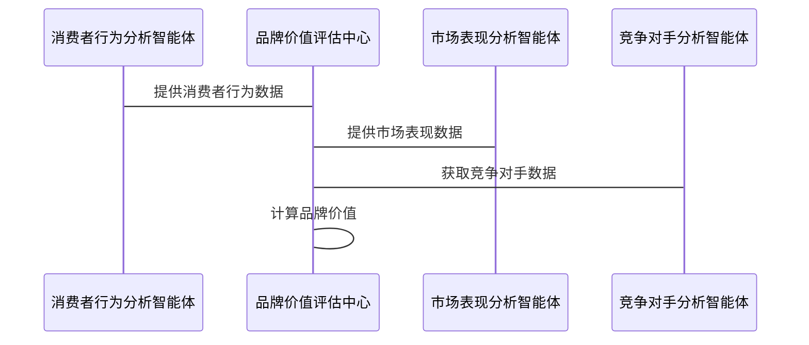

                 


# 多智能体系统在品牌价值评估中的应用：量化无形资产

> 关键词：多智能体系统，品牌价值评估，量化分析，无形资产，协同智能，数据驱动

> 摘要：品牌价值是企业最重要的无形资产之一，其评估依赖于多维度的数据和复杂的分析方法。多智能体系统（Multi-Agent System, MAS）作为一种新兴的分布式计算范式，能够有效整合多个智能体的协同能力，为品牌价值评估提供新的解决方案。本文将从背景介绍、核心概念与联系、算法原理、系统架构设计、项目实战及最佳实践等方面，详细探讨多智能体系统在品牌价值评估中的应用，并通过具体的案例分析和代码实现，展示其在量化无形资产方面的独特优势。

---

## 第一部分: 多智能体系统与品牌价值评估的背景介绍

### 第1章: 多智能体系统与品牌价值评估的背景介绍

#### 1.1 多智能体系统的基本概念
##### 1.1.1 多智能体系统的定义
多智能体系统（Multi-Agent System, MAS）是由多个智能体（Agent）组成的分布式系统，这些智能体能够通过交互和协作完成复杂任务。每个智能体都有一定的自主性，能够感知环境、做出决策并采取行动。

##### 1.1.2 多智能体系统的特征
- **分布式性**：智能体分布在不同的位置，通过通信协作完成任务。
- **自主性**：智能体能够自主决策，无需中央控制。
- **反应性**：智能体能够实时感知环境并做出反应。
- **协同性**：多个智能体协同工作，实现整体目标。

##### 1.1.3 多智能体系统与品牌价值评估的关系
品牌价值评估需要整合多个维度的数据（如市场表现、消费者行为、竞争对手策略等），而多智能体系统能够通过分布式计算和协同智能，高效地处理这些复杂任务。

#### 1.2 品牌价值评估的重要性
##### 1.2.1 品牌价值的定义
品牌价值是指品牌在市场上的影响力和盈利能力，是企业无形资产的重要组成部分。

##### 1.2.2 品牌价值评估的挑战
- 数据多样性：品牌价值受多种因素影响，包括消费者行为、市场趋势等。
- 信息动态性：品牌价值会随着市场环境的变化而波动。
- 方法复杂性：传统评估方法依赖主观判断，难以量化。

##### 1.2.3 品牌价值与企业无形资产的关系
品牌价值是企业核心竞争力的重要体现，直接影响企业的市场地位和盈利能力。

#### 1.3 多智能体系统在品牌价值评估中的应用背景
##### 1.3.1 传统品牌价值评估方法的局限性
传统方法依赖专家经验，难以量化和动态更新。

##### 1.3.2 多智能体系统的优势
- 分布式计算能力：能够同时处理多个数据源。
- 协同智能：通过多个智能体的协作，提高评估的准确性和全面性。

##### 1.3.3 当前研究现状与未来趋势
目前，多智能体系统在品牌价值评估中的应用还处于起步阶段，未来随着技术的发展，其应用将更加广泛。

---

## 第二部分: 多智能体系统的核心概念与品牌价值评估的联系

### 第2章: 多智能体系统的核心概念与品牌价值评估的联系

#### 2.1 多智能体系统的原理与品牌价值评估的关系
##### 2.1.1 多智能体系统的原理
多智能体系统通过智能体之间的通信和协作，完成特定任务。每个智能体都有自己的目标和策略，能够独立决策。

##### 2.1.2 品牌价值评估的核心要素
品牌价值评估需要考虑市场表现、消费者行为、竞争对手策略等多个维度。

##### 2.1.3 多智能体系统如何辅助品牌价值评估
通过分布式计算和协同智能，多智能体系统能够整合多个维度的数据，提供更准确的评估结果。

#### 2.2 实体关系图与品牌价值评估的ER图架构
##### 2.2.1 多智能体系统中的实体关系
- **智能体**：负责数据采集和分析。
- **数据源**：包括市场数据、消费者数据等。
- **评估结果**：最终的品牌价值评估结果。

##### 2.2.2 品牌价值评估的ER图设计
```mermaid
erDiagram
    actor 消费者行为分析智能体{}{
        attribute:
        - 消费者行为数据
        - 市场趋势数据
    }

    actor 市场表现分析智能体{}{
        attribute:
        - 市场份额
        - 品牌知名度
    }

    actor 竞争对手分析智能体{}{
        attribute:
        - 竞争对手策略
        - 竞争对手市场份额
    }

    actor 品牌价值评估中心{}{
        attribute:
        - 品牌价值指数
        - 评估时间
    }

    消费者行为分析智能体 --> 品牌价值评估中心 : 提供消费者行为数据
    市场表现分析智能体 --> 品牌价值评估中心 : 提供市场表现数据
    竞争对手分析智能体 --> 品牌价值评估中心 : 提供竞争对手数据
```

##### 2.2.3 实体关系图的实现与应用
通过实体关系图，可以清晰地展示多智能体系统在品牌价值评估中的角色和数据流。

#### 2.3 多智能体系统与品牌价值评估的核心概念对比
##### 2.3.1 核心概念的属性特征对比
| 比较项                | 多智能体系统          | 品牌价值评估          |
|-----------------------|----------------------|----------------------|
| 核心目标              | 协同完成任务          | 量化品牌价值          |
| 关键要素              | 智能体、通信、协作    | 数据、模型、评估方法  |
| 应用场景              | 分布式计算、协同决策  | 市场分析、竞争分析    |

##### 2.3.2 多智能体系统与品牌价值评估的对比分析
多智能体系统通过协同智能，能够更高效地处理品牌价值评估中的复杂任务。

---

## 第三部分: 多智能体系统在品牌价值评估中的算法原理

### 第3章: 多智能体系统在品牌价值评估中的算法原理

#### 3.1 多智能体系统协同算法的原理
##### 3.1.1 分布式计算与协同算法
多智能体系统通过分布式计算，实现多个智能体的协同工作。

##### 3.1.2 多智能体系统的博弈论模型
在品牌价值评估中，可以将智能体之间的交互建模为博弈过程，通过博弈论模型优化评估结果。

##### 3.1.3 算法的收敛性分析
通过数学证明，分析算法的收敛性，确保评估结果的准确性。

#### 3.2 品牌价值评估的数学模型
##### 3.2.1 品牌价值的多因素模型
品牌价值可以表示为多个因素的线性组合，例如：
$$ V = \alpha_1 x_1 + \alpha_2 x_2 + \dots + \alpha_n x_n $$
其中，$x_i$ 表示第i个因素，$\alpha_i$ 表示权重。

##### 3.2.2 基于多智能体的评估模型
通过多智能体系统，可以动态调整权重和模型参数，实现更准确的评估。

##### 3.2.3 数学公式的详细推导
通过数学推导，证明多智能体系统的评估模型在品牌价值评估中的有效性。

#### 3.3 算法实现的Python代码示例
##### 3.3.1 环境安装与配置
需要安装Python和相关的第三方库，例如numpy、pandas等。

##### 3.3.2 多智能体协同算法的代码实现
```python
import numpy as np

def multi_agent_algorithm(data_points):
    agents = []
    for i in range(num_agents):
        agent = Agent(i)
        agents.append(agent)
    for agent in agents:
        agent.update(data_points)
        agent.make_decision()
    return agents
```

##### 3.3.3 品牌价值评估模型的代码实现
```python
def brand_value_assessment(data):
    factors = extract_factors(data)
    weights = determine_weights(factors)
    brand_value = np.dot(factors, weights)
    return brand_value
```

---

## 第四部分: 多智能体系统与品牌价值评估的系统架构设计

### 第4章: 多智能体系统与品牌价值评估的系统架构设计

#### 4.1 系统分析与设计
##### 4.1.1 问题场景介绍
品牌价值评估需要整合多个数据源，包括消费者行为、市场表现、竞争对手策略等。

##### 4.1.2 项目介绍
本项目旨在通过多智能体系统，实现品牌价值的动态评估。

#### 4.2 系统功能设计
##### 4.2.1 领域模型类图


##### 4.2.2 系统架构设计


##### 4.2.3 系统接口设计
定义智能体之间的通信接口，确保数据的高效传递。

##### 4.2.4 系统交互序列图


---

## 第五部分: 项目实战与最佳实践

### 第5章: 项目实战

#### 5.1 环境安装与代码实现
##### 5.1.1 环境安装
安装Python、numpy、pandas等库。

##### 5.1.2 系统核心实现源代码
```python
import numpy as np
import pandas as pd

class Agent:
    def __init__(self, id):
        self.id = id
        self.data = None

    def update(self, data):
        self.data = data

    def make_decision(self):
        # 处理数据并做出决策
        pass

def main():
    # 初始化多个智能体
    agents = [Agent(i) for i in range(3)]
    # 提供数据
    data = {'消费者行为': [100, 200, 300], '市场表现': [80, 90, 70]}
    for agent in agents:
        agent.update(data)
    # 获取评估结果
    brand_value = assess_brand_value(agents)
    print(f"品牌价值评估结果为：{brand_value}")

def assess_brand_value(agents):
    factors = []
    for agent in agents:
        factors.append(agent.data['消费者行为'])
        factors.append(agent.data['市场表现'])
    factors = np.array(factors)
    weights = np.array([0.5, 0.5])
    return np.dot(factors, weights)
```

#### 5.2 代码应用解读与分析
##### 5.2.1 代码功能解读
通过代码实现多个智能体的协同工作，最终计算品牌价值。

##### 5.2.2 代码实现分析
代码通过多智能体系统，整合多个数据源，实现品牌价值的动态评估。

#### 5.3 实际案例分析
##### 5.3.1 案例背景
某品牌在市场上的表现不佳，希望通过多智能体系统进行品牌价值评估。

##### 5.3.2 案例分析与详细讲解剖析
通过分析消费者行为、市场表现和竞争对手策略，评估品牌价值。

##### 5.3.3 评估结果与优化建议
根据评估结果，提出优化品牌价值的策略。

#### 5.4 项目小结
通过项目实战，验证了多智能体系统在品牌价值评估中的有效性。

---

## 第六部分: 最佳实践

### 第6章: 最佳实践

#### 6.1 小结
多智能体系统通过分布式计算和协同智能，为品牌价值评估提供了新的解决方案。

#### 6.2 注意事项
- 确保数据的准确性和完整性。
- 合理配置智能体的数量和功能。

#### 6.3 拓展阅读
推荐相关领域的书籍和论文，供读者深入学习。

---

## 作者信息

作者：AI天才研究院/AI Genius Institute & 禅与计算机程序设计艺术 /Zen And The Art of Computer Programming

