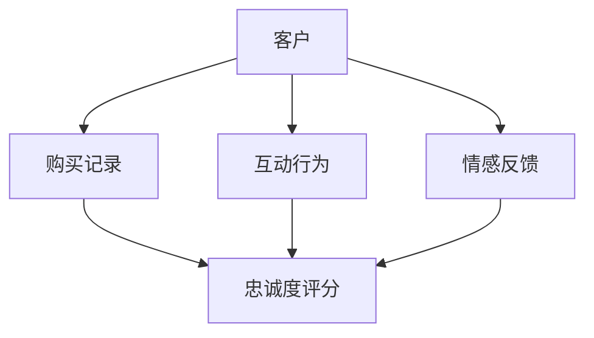
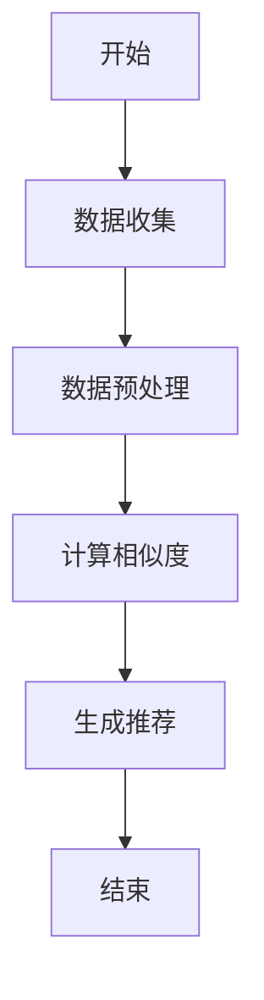
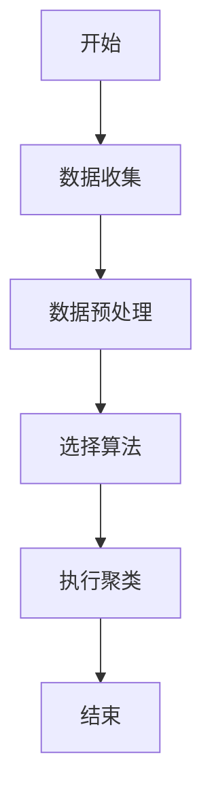
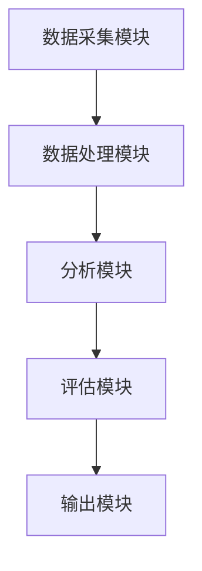
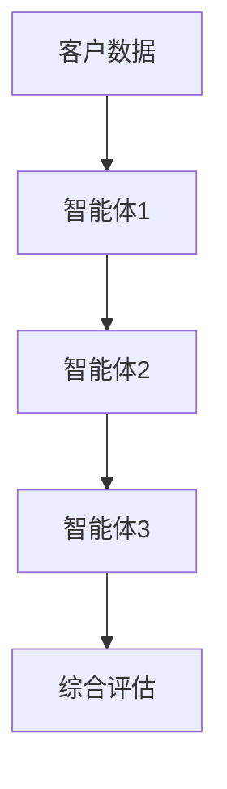
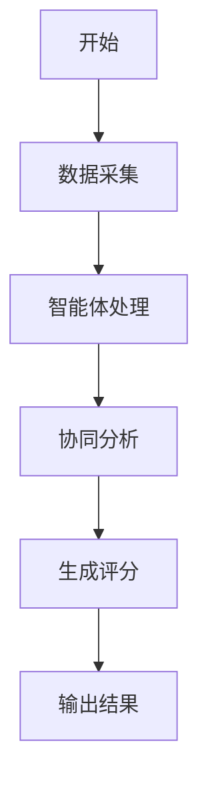

                 


# 多智能体系统在品牌忠诚度动态评估中的应用

> 关键词：多智能体系统，品牌忠诚度，动态评估，协同过滤，聚类分析，系统架构

> 摘要：本文探讨了多智能体系统（MAS）在品牌忠诚度动态评估中的应用。通过分析MAS的优势，结合具体算法和系统架构设计，展示了如何利用智能体协同工作，实时评估客户忠诚度。文章详细讲解了协同过滤、聚类分析等算法，并通过实际案例分析，总结了MAS在动态评估中的最佳实践和未来发展方向。

---

# 第1章 背景介绍

## 1.1 问题背景

品牌忠诚度是企业在市场竞争中的关键指标，传统的评估方法通常基于客户的历史数据，难以捕捉实时行为变化。随着消费者行为的动态变化，企业需要更高效的工具来实时评估和预测品牌忠诚度。

## 1.2 问题描述

品牌忠诚度评估需要考虑客户的购买历史、互动行为、情感反馈等多个维度。传统的静态评估方法难以应对实时变化，而多智能体系统能够通过分布式智能体协同工作，实时分析客户行为，提供动态评估。

## 1.3 解决方案

利用多智能体系统，将品牌忠诚度评估分解为多个任务，分别由不同智能体处理。例如，一个智能体负责收集社交媒体数据，另一个分析购买记录，协同生成动态评估结果。

## 1.4 边界与外延

本研究聚焦于MAS在品牌忠诚度动态评估中的应用，不涉及企业内部管理或市场推广策略。评估范围限于客户行为数据，包括购买记录、互动频率和情感反馈。

## 1.5 核心概念

- **多智能体系统（MAS）**：由多个智能体组成的系统，能够协同工作完成复杂任务。
- **品牌忠诚度**：客户对品牌的情感和行为上的忠诚程度。
- **动态评估**：实时分析客户行为，评估忠诚度的变化。

---

# 第2章 核心概念与联系

## 2.1 多智能体系统与品牌忠诚度评估的结合

MAS通过分布式的智能体协同，实时处理客户数据，动态评估忠诚度。每个智能体负责特定任务，如数据收集、分析和预测。

## 2.2 核心概念对比

| 概念 | 传统评估方法 | 多智能体系统 |
|------|---------------|-------------|
| 数据源 | 固定数据集     | 实时数据     |
| 处理方式 | 集中处理       | 分布式处理   |
| 响应时间 | 长            | 短           |
| 精度 | 中等           | 高           |

## 2.3 实体关系图



---

# 第3章 算法原理

## 3.1 协同过滤算法

协同过滤通过分析客户的相似性，推荐相关产品。在MAS中，每个智能体处理一部分数据，协同生成推荐结果。

### 3.1.1 算法流程图



### 3.1.2 Python代码实现

```python
def collaborative_filtering(user_matrix):
    # 计算用户相似度
    similarity = cosine_similarity(user_matrix)
    # 找出相似用户
    similar_users = np.argsort(similarity, axis=0)
    # 生成推荐
   推荐评分 = np.mean(user_matrix[相似用户], axis=0)
    return 推荐评分
```

## 3.2 聚类分析算法

聚类分析用于识别客户群体，MAS中不同智能体处理不同类型数据，协同生成客户群体的忠诚度评估。

### 3.2.1 算法流程图



### 3.2.2 数学模型

$$ 聚类中心计算：C = \frac{1}{k} \sum_{i=1}^{k} x_i $$

---

# 第4章 系统分析与架构设计

## 4.1 系统架构设计

### 4.1.1 系统模块划分



### 4.1.2 系统架构图



## 4.2 接口与交互设计

### 4.2.1 接口设计

- **输入接口**：接收客户数据和事件触发信号。
- **输出接口**：提供忠诚度评分和预测结果。

### 4.2.2 交互流程图



---

# 第5章 项目实战

## 5.1 环境安装

- **Python 3.8+**
- **TensorFlow、Scikit-learn**
- **Jupyter Notebook**

## 5.2 核心代码实现

### 5.2.1 协同过滤实现

```python
from sklearn.metrics.pairwise import cosine_similarity

def collaborative_filter(user_id, user_matrix):
    similar_users = cosine_similarity(user_matrix[user_id], user_matrix)
   推荐评分 = np.mean(user_matrix[np.argsort(similar_users, axis=0)][:5], axis=0)
    return 推荐评分
```

### 5.2.2 聚类分析实现

```python
from sklearn.cluster import KMeans

def cluster_analysis(data, n_clusters):
    model = KMeans(n_clusters=n_clusters)
    model.fit(data)
    return model.labels_
```

## 5.3 案例分析

某电商平台使用MAS评估客户忠诚度，通过分析购买记录和互动行为，成功预测客户流失风险，优化了营销策略。

---

# 第6章 总结与展望

## 6.1 最佳实践

- 定期更新模型，适应市场变化。
- 保护数据隐私，遵守相关法规。
- 优化智能体协同效率，提升评估速度。

## 6.2 小结

多智能体系统通过分布式智能体协同，显著提升了品牌忠诚度的动态评估能力，为企业提供了实时、精准的客户洞察。

## 6.3 注意事项

- 数据质量直接影响评估结果，需确保数据准确性和完整性。
- 智能体设计需考虑系统的可扩展性和可维护性。

## 6.4 拓展阅读

推荐书籍：《多智能体系统》、《数据挖掘与机器学习》。

---

# 作者

**作者：AI天才研究院/AI Genius Institute & 禅与计算机程序设计艺术 /Zen And The Art of Computer Programming**

---

通过以上详细的内容，读者可以系统地理解多智能体系统在品牌忠诚度动态评估中的应用，从理论到实践，全面掌握相关技术和方法。

