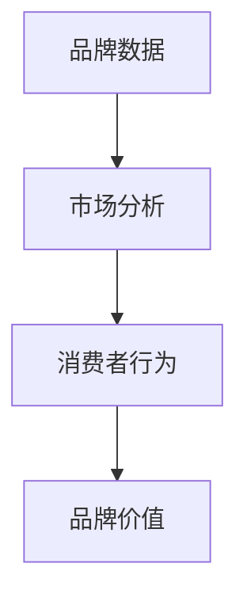

                 


# 多智能体系统在品牌资产评估中的应用：量化品牌价值

> 关键词：多智能体系统、品牌资产评估、品牌价值量化、分布式计算、协同机制、数学模型

> 摘要：本文探讨了多智能体系统在品牌资产评估中的应用，通过量化品牌价值，结合数学模型和算法原理，分析了多智能体系统的协同机制和应用场景。文章详细讲解了系统设计、架构实现和实际案例，为品牌价值评估提供了新的思路。

---

## 第一部分: 多智能体系统与品牌资产评估概述

### 第1章: 多智能体系统与品牌资产评估的背景介绍

#### 1.1 多智能体系统的定义与特点
- **多智能体系统的定义**：多智能体系统（Multi-Agent System, MAS）是由多个独立但协作的智能体组成的系统，每个智能体都有自己的目标和行为。
- **多智能体系统的核心特点**：
  - 分布式计算
  - 协作性
  - 自适应性
  - 响应性
- **多智能体系统的应用场景**：广泛应用于分布式计算、机器人协作、金融交易等领域。

#### 1.2 品牌资产评估的定义与挑战
- **品牌资产评估的定义**：品牌资产评估是对品牌价值的量化过程，涉及品牌知名度、市场影响力等多方面的评估。
- **品牌资产评估的挑战**：
  - 数据复杂性
  - 主观性与客观性的平衡
  - 动态变化的市场环境
- **品牌价值的量化意义**：量化品牌价值有助于企业制定战略决策，提升品牌竞争力。

### 第2章: 多智能体系统在品牌资产评估中的核心概念

#### 2.1 多智能体系统的实体关系分析
- **实体关系图（ER图）**：
  - 品牌、市场数据、消费者行为等实体之间的关系。
- **Mermaid流程图展示**：
  ```mermaid
  graph TD
    A[品牌] --> B[市场数据]
    B --> C[消费者行为]
    C --> D[品牌价值]
  ```

#### 2.2 多智能体系统的算法原理
- **分布式计算原理**：数据分布处理，减少计算负担。
- **协作机制**：智能体之间通过通信模块共享信息，实现协作。
- **信息共享与决策**：通过共享数据，优化品牌价值评估结果。

## 第二部分: 多智能体系统算法的数学模型与公式

### 第3章: 多智能体系统算法的数学模型与公式

#### 3.1 品牌价值量化模型
- **品牌价值公式**：
  $$ V = \sum_{i=1}^{n} w_i \cdot f_i $$
  - \( V \)：品牌总价值
  - \( w_i \)：第i个因素的权重
  - \( f_i \)：第i个因素的评估值
- **权重分配方法**：基于市场调研和数据分析，确定各因素权重。

#### 3.2 多智能体协同模型
- **协作方程**：
  $$ C = \sum_{j=1}^{m} c_j \cdot x_j $$
  - \( C \)：协同效果
  - \( c_j \)：第j个协作因素的系数
  - \( x_j \)：第j个协作因素的贡献值

## 第三部分: 系统分析与架构设计

### 第4章: 系统分析与架构设计

#### 4.1 项目背景与目标
- **项目背景**：随着市场竞争加剧，品牌价值评估变得复杂，传统方法难以应对。
- **项目目标**：利用多智能体系统，构建高效的品牌价值评估模型。

#### 4.2 系统功能设计
- **领域模型Mermaid类图**：
  ```mermaid
  classDiagram
    class 品牌 {
        名称
        知名度
        市场份额
    }
    class 市场数据 {
        行业趋势
        竞争对手信息
    }
    class 消费者行为 {
        偏好
        意见领袖
    }
    品牌 --> 市场数据
    品牌 --> 消费者行为
  ```

#### 4.3 系统架构设计
- **分层架构Mermaid图**：
  ```mermaid
  architecture
  Client
  -->
  Server
  -->
  Database
  -->
  Agent Nodes
  ```

## 第四部分: 项目实战与代码实现

### 第5章: 项目实战与代码实现

#### 5.1 环境安装与配置
- **开发环境安装**：Python、Jupyter Notebook、Mermaid工具
- **依赖库安装**：numpy、pandas、networkx

#### 5.2 核心算法实现
- **Python代码示例**：
  ```python
  def calculate_brand_value(data):
      weights = [0.4, 0.3, 0.2, 0.1]
      factors = [data['知名度'], data['市场份额'], data['行业趋势'], data['消费者偏好']]
      brand_value = sum(w * f for w, f in zip(weights, factors))
      return brand_value
  ```

#### 5.3 案例分析与结果解读
- **实际案例分析**：以某品牌为例，计算品牌价值。
- **结果解读**：展示计算结果并分析影响因素。

### 第6章: 最佳实践与总结

#### 6.1 最佳实践Tips
- **系统设计建议**：模块化设计，便于扩展。
- **实施中的注意事项**：数据质量和协作机制的优化。

#### 6.2 项目小结与展望
- **项目总结**：多智能体系统在品牌资产评估中的优势。
- **未来研究方向**：优化算法，提升评估精度。

#### 6.3 拓展阅读与资源推荐
- **推荐书籍**：《分布式系统：概念与设计》
- **在线资源链接**：相关论文和学术资源。

---

## 附录: Mermaid流程图示例



---

## 作者：AI天才研究院 & 禅与计算机程序设计艺术

---

通过以上结构，文章详细阐述了多智能体系统在品牌资产评估中的应用，从背景到实现，层层深入，为读者提供了全面的技术指导和实践参考。

