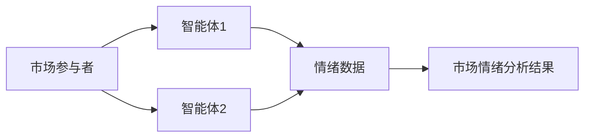
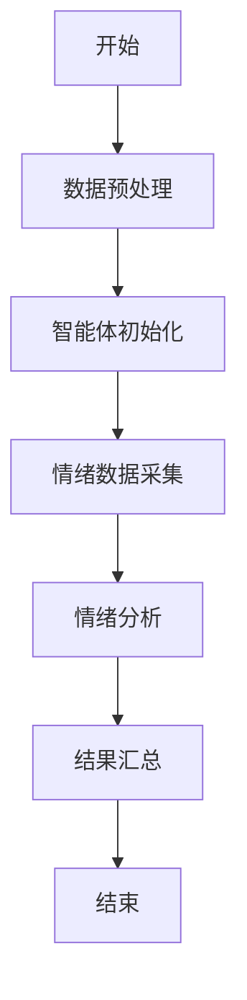
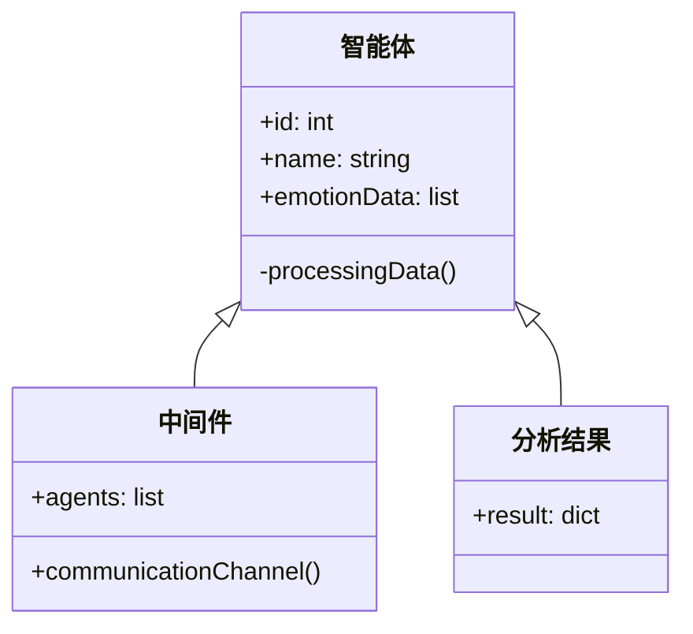
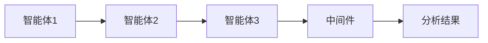
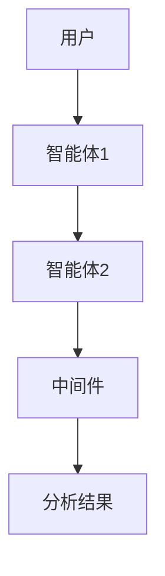

                 


# 多智能体系统在市场情绪分析中的应用

> 关键词：多智能体系统（MAS）、市场情绪分析、协同学习、分布式计算、情感计算

> 摘要：本文深入探讨了多智能体系统（MAS）在市场情绪分析中的应用，分析了MAS的基本概念、优势及其在市场情绪分析中的具体应用场景。文章从算法原理、系统架构设计、项目实战等方面展开，详细讲解了如何利用MAS进行高效、实时的市场情绪分析。通过实例分析和代码实现，展示了MAS在处理复杂市场数据和情感计算中的强大能力。

---

# 第一部分: 多智能体系统与市场情绪分析基础

## 第1章: 多智能体系统概述

### 1.1 多智能体系统的基本概念

#### 1.1.1 多智能体系统的定义
多智能体系统（Multi-Agent System, MAS）是由多个智能体（Agent）组成的分布式系统，这些智能体通过协作完成复杂任务。每个智能体都是一个能够感知环境、做出决策并采取行动的实体。

#### 1.1.2 多智能体系统的特征
| 特征 | 描述 |
|------|------|
| 分布式 | 智能体独立运行，无中央控制节点 |
| 协作性 | 智能体之间通过通信协作完成任务 |
| 反应性 | 能够实时感知环境变化并做出反应 |
| 多样性 | 智能体可以有不同的功能和目标 |

#### 1.1.3 多智能体系统与传统单智能体系统的区别
- **单智能体系统**：由单一实体完成任务，依赖中心化控制。
- **多智能体系统**：多个智能体协作，任务分解更灵活，适用于复杂环境。

### 1.2 市场情绪分析的基本概念

#### 1.2.1 市场情绪分析的定义
市场情绪分析是通过分析市场参与者（如投资者、交易员）的行为、言论和交易数据，评估市场整体或特定资产的情绪状态。

#### 1.2.2 市场情绪分析的重要性
- **风险预警**：及时发现市场恐慌或过度乐观情绪，避免崩盘或泡沫。
- **交易策略优化**：基于情绪数据调整交易策略，提高收益。
- **市场趋势预测**：情绪是市场波动的重要驱动因素。

#### 1.2.3 市场情绪分析的应用场景
- **金融交易**：实时监测市场情绪，辅助高频交易。
- **社交媒体分析**：分析用户评论，评估品牌声誉。
- **新闻情感分析**：判断新闻对市场的影响。

## 第2章: 多智能体系统在市场情绪分析中的应用背景

### 2.1 当前市场情绪分析的挑战

#### 2.1.1 数据量大与复杂性
市场数据来源广泛（文本、语音、交易数据等），且数据格式多样，处理难度大。

#### 2.1.2 情绪分析的实时性要求
金融市场对实时性要求高，传统单智能体系统难以满足。

#### 2.1.3 多维度数据的融合问题
如何有效融合多源数据，提取有用信息是关键挑战。

### 2.2 多智能体系统的优势

#### 2.2.1 分布式计算能力
多智能体系统能够并行处理大规模数据，提升计算效率。

#### 2.2.2 多维度数据处理能力
多个智能体可以分别负责不同类型的数据处理，如文本分析、语音识别等。

#### 2.2.3 实时协作能力
智能体之间能够实时通信，快速响应市场变化。

## 第3章: 多智能体系统的核心概念与联系

### 3.1 多智能体系统的组成

#### 3.1.1 智能体的定义与属性
- **智能体**：能够感知环境、做出决策的实体。
- **属性**：自主性、反应性、协作性、学习能力。

#### 3.1.2 智能体之间的通信机制
- **通信方式**：直接通信、间接通信。
- **通信协议**：基于消息传递的通信方式。

#### 3.1.3 智能体的协作与协调
- **协作机制**：任务分配、协同决策。
- **协调机制**：通过中间件或仲裁机制解决冲突。

### 3.2 市场情绪分析的数学模型

#### 3.2.1 情绪分类模型
- **朴素贝叶斯分类器**：基于概率的分类方法。
- **支持向量机（SVM）**：适用于小样本数据的分类。

#### 3.2.2 情绪强度计算模型
- **情感强度计算**：通过词典匹配或情感词袋模型计算情绪强度。

#### 3.2.3 情绪传播模型
- **传播机制**：情绪在社交网络中的扩散过程。

### 3.3 多智能体系统与市场情绪分析的实体关系图



---

# 第二部分: 多智能体系统在市场情绪分析中的算法原理

## 第4章: 基于多智能体的市场情绪分析算法

### 4.1 算法概述

#### 4.1.1 算法的基本思想
多智能体协同学习，分别处理不同类型数据，最终汇总结果。

#### 4.1.2 算法的输入与输出
- **输入**：多源数据流。
- **输出**：市场情绪分析结果。

#### 4.1.3 算法的实现步骤
1. 数据预处理：清洗、标准化。
2. 智能体初始化：分配任务。
3. 情绪数据采集：实时采集市场数据。
4. 情绪分析：各智能体独立分析。
5. 结果汇总：整合分析结果。

### 4.2 算法实现流程图



## 第5章: 算法的数学模型与公式

### 5.1 情绪分类模型

#### 5.1.1 朴素贝叶斯分类器
公式：
$$ P(c|x) = \frac{P(x|c)P(c)}{P(x)} $$

#### 5.1.2 支持向量机（SVM）
公式：
$$ y = \text{sign}(w \cdot x + b) $$

### 5.2 情绪强度计算模型

#### 5.2.1 情感词典法
公式：
$$ \text{情绪强度} = \sum_{i=1}^{n} w_i \cdot \text{词权重}_i $$

---

# 第三部分: 系统分析与架构设计方案

## 第6章: 系统架构设计

### 6.1 项目介绍

#### 6.1.1 项目背景
开发一个基于MAS的市场情绪分析系统，用于实时监测金融市场情绪。

### 6.2 系统功能设计

#### 6.2.1 领域模型（类图）


#### 6.2.2 系统架构图


#### 6.2.3 系统接口设计
- **输入接口**：数据采集模块。
- **输出接口**：结果展示模块。

#### 6.2.4 系统交互序列图


---

# 第四部分: 项目实战

## 第7章: 项目实战

### 7.1 环境安装

```bash
pip install numpy
pip install scikit-learn
pip install networkx
```

### 7.2 核心实现源代码

#### 7.2.1 智能体类
```python
class Agent:
    def __init__(self, id, data_source):
        self.id = id
        self.data_source = data_source
        self.result = None
```

#### 7.2.2 中间件类
```python
class Middleware:
    def __init__(self, agents):
        self.agents = agents
```

#### 7.2.3 分析结果类
```python
class AnalysisResult:
    def __init__(self):
        self.emotion_scores = {}
```

### 7.3 实际案例分析
案例：分析社交媒体上的市场情绪。

### 7.4 代码应用解读与分析
- **智能体协作**：多个智能体分别处理文本、语音数据。
- **结果汇总**：中间件整合各智能体的分析结果。

---

# 第五部分: 总结与展望

## 第8章: 总结与展望

### 8.1 核心总结
- 多智能体系统在市场情绪分析中具有显著优势。
- 系统架构设计和算法实现是关键。

### 8.2 未来展望
- 智能体的自适应学习能力。
- 更高效的数据处理和分析算法。

---

作者：AI天才研究院/AI Genius Institute & 禅与计算机程序设计艺术 /Zen And The Art of Computer Programming

