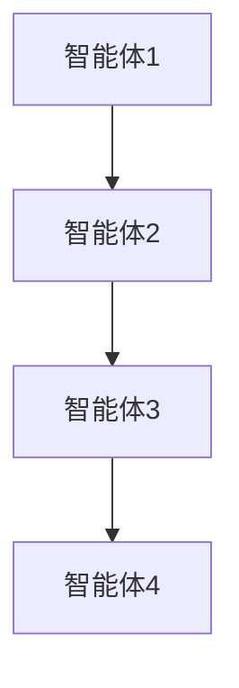
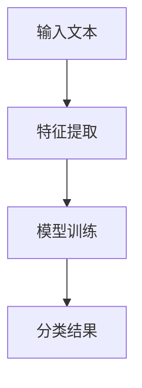
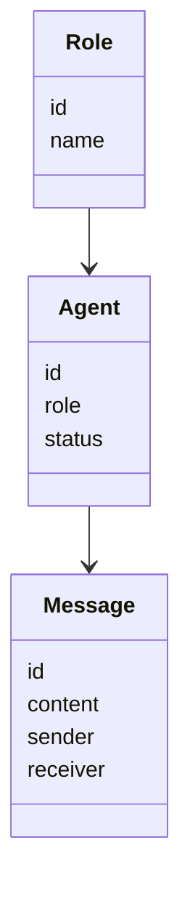
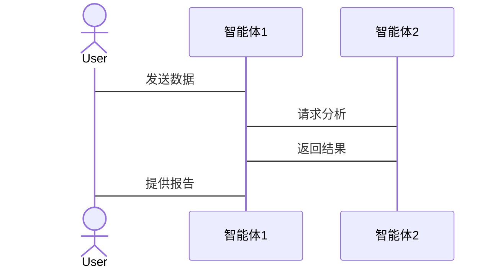

                 


# 多智能体系统在市场情绪分析中的应用：价值投资者的新工具

---

## 关键词：多智能体系统、市场情绪分析、价值投资、分布式计算、情感分类、协同推理

---

## 摘要：本文探讨了多智能体系统在市场情绪分析中的应用，揭示了其如何成为价值投资者的新工具。通过分析多智能体系统的原理、市场情绪分析的方法及其结合，展示了如何利用分布式计算和协同推理提升投资决策的准确性。文章还详细讲解了相关算法、系统架构和项目实战，为读者提供了深入的技术见解。

---

## 第一部分：背景介绍

### 第1章：多智能体系统与市场情绪分析概述

#### 1.1 多智能体系统的定义与特点

多智能体系统（Multi-Agent System, MAS）由多个智能体组成，每个智能体具备一定的自主性和协作能力。以下是其关键特点：

- **分布性**：多个智能体独立运作，共同完成任务。
- **协作性**：通过通信机制协同工作，优化整体性能。
- **反应性**：实时感知环境变化，动态调整行为。

**对比表：多智能体系统与单一智能体系统的属性对比**

| 属性         | 单一智能体系统       | 多智能体系统         |
|--------------|---------------------|----------------------|
| 结构         | 单点控制            | 分布式结构          |
| 可扩展性     | 有限                | 高                  |
| 稳定性       | 依赖单点            | 更高                 |
| 响应速度     | 可能较慢            | 更快                 |

**ER实体关系图：多智能体系统中的实体关系**

```mermaid
er
actor Role {
    id
    name
}
agent {
    id
    role_id
    status
}
message {
    id
    content
    sender_id
    receiver_id
}
agent -> role
agent -> message
message -> agent
```

#### 1.2 市场情绪分析的定义与重要性

市场情绪分析通过分析文本数据（如新闻、社交媒体）识别市场参与者的心理状态，帮助投资者预测市场行为。其重要性体现在：

- **情绪识别**：捕捉市场非理性波动。
- **投资决策支持**：辅助投资者做出更明智的投资选择。

#### 1.3 多智能体系统与市场情绪分析的结合

多智能体系统的分布式计算和协作能力为市场情绪分析提供了新思路。通过分解任务，多个智能体分别处理不同类型数据，最终协同得出整体市场情绪。

---

## 第二部分：核心概念与联系

### 第2章：多智能体系统的原理与实现

#### 2.1 多智能体系统的原理

多智能体系统通过通信机制协同工作，每个智能体负责特定任务。例如，一个智能体负责分析新闻标题，另一个分析社交媒体评论。

**多智能体系统的通信机制流程图**



#### 2.2 市场情绪分析的原理

市场情绪分析通常采用情感分类算法，如支持向量机（SVM）或神经网络。特征提取是关键步骤，常用TF-IDF提取关键词。

**情感分类算法的数学模型**

$$p(y|x) = \frac{p(x|y)p(y)}{p(x)}$$

其中，\(p(y|x)\)是后验概率，\(p(x|y)\)是似然，\(p(y)\)是先验概率，\(p(x)\)是边缘概率。

---

## 第三部分：算法原理

### 第3章：多智能体系统与市场情绪分析的算法实现

#### 3.1 情感分类算法

情感分类算法用于识别文本中的情感倾向。常用算法包括：

1. **基于机器学习的算法**：
   - 支持向量机（SVM）
   - 随机森林（Random Forest）

2. **基于深度学习的算法**：
   - 卷积神经网络（CNN）
   - 循环神经网络（RNN）

**情感分类算法的流程图**



#### 3.2 多智能体协作算法

多智能体协作算法通过分布式计算优化市场情绪分析。例如，每个智能体分析不同数据源，最终汇总结果。

**多智能体协作算法的数学模型**

$$p(\text{整体情绪}|x_1, x_2, ..., x_n) = \prod_{i=1}^{n} p(\text{情绪}|x_i)$$

---

## 第四部分：系统分析与架构设计

### 第4章：系统分析与架构设计方案

#### 4.1 项目介绍

本项目旨在开发一个多智能体系统，用于分析市场情绪，帮助价值投资者做出决策。

#### 4.2 系统功能设计

系统功能包括：

- 数据采集：从新闻网站、社交媒体等获取数据。
- 情感分析：对数据进行情感分类。
- 情绪汇总：生成整体市场情绪报告。

**系统功能类图**



#### 4.3 系统架构设计

系统采用分布式架构，每个智能体负责特定任务，通过通信机制协作。

**系统架构图**


#### 4.4 系统交互设计

系统交互流程包括数据采集、分析、汇总和反馈。

**系统交互序列图**



---

## 第五部分：项目实战

### 第5章：项目实战与分析

#### 5.1 环境安装

需要安装以下工具：

- Python 3.8+
- Scikit-learn
- NLTK
- Mermaid

#### 5.2 核心实现源代码

以下是情感分类算法的实现代码：

```python
from sklearn.feature_extraction.text import TfidfVectorizer
from sklearn.svm import SVC
from sklearn.pipeline import Pipeline

# 数据预处理
X = [...]  # 文本数据
y = [...]  # 标签

# 模型训练
model = Pipeline([
    ('tfidf', TfidfVectorizer()),
    ('svc', SVC())
])
model.fit(X, y)

# 预测
print(model.predict(["这是好的新闻"])[0])
```

---

## 第六部分：总结与展望

### 第6章：总结与展望

#### 6.1 总结

多智能体系统在市场情绪分析中的应用为价值投资者提供了新的工具。通过分布式计算和协同推理，系统能够更准确地捕捉市场情绪，辅助投资决策。

#### 6.2 展望

未来，随着技术的进步，多智能体系统在市场情绪分析中的应用将更加广泛。可能的发展方向包括引入更复杂的情感分析模型和优化多智能体系统的协作机制。

---

## 参考资料

- 《多智能体系统的原理与应用》
- 《市场情绪分析的算法与实践》
- 相关学术论文和研究报告

---

## 作者：AI天才研究院

---

**本文作者是AI天才研究院，专注于人工智能与计算机科学的研究与实践。如需转载请注明出处。**

