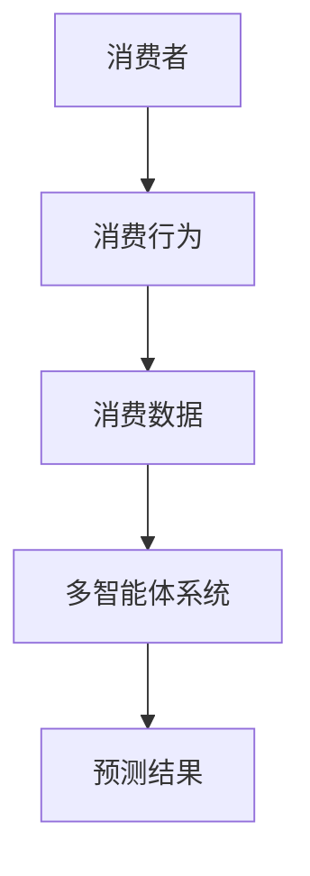
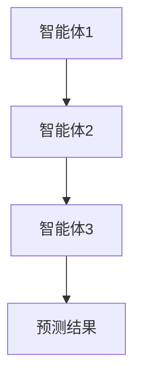
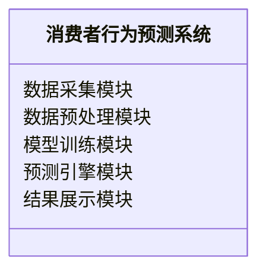
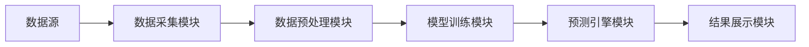
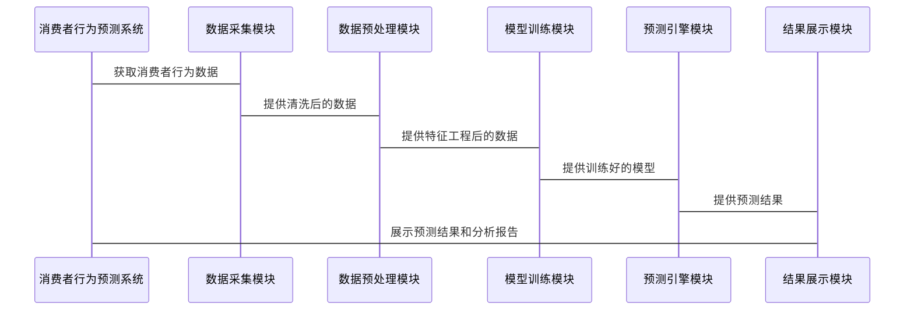

                 

# 多智能体系统在消费者行为预测中的应用：预判公司业绩

**关键词**：多智能体系统、消费者行为预测、公司业绩预测、人工智能、机器学习、数据挖掘

**摘要**：  
多智能体系统（Multi-Agent System, MAS）是一种分布式人工智能系统，由多个相互作用的智能体组成，能够协同完成复杂任务。在消费者行为预测中，多智能体系统能够通过分析海量数据，模拟消费者决策过程，从而帮助企业预判业绩。本文将从多智能体系统的原理出发，结合消费者行为预测的实际需求，探讨其在业绩预测中的应用，并通过案例分析展示其优势。

---

## 第一部分：多智能体系统与消费者行为预测基础

### 第1章：多智能体系统概述

#### 1.1 多智能体系统的基本概念
- **智能体的定义**：智能体是指具有感知环境、自主决策、执行任务能力的实体。它可以是一个软件程序、一个机器人，甚至是一个人类。
- **多智能体系统的定义**：多智能体系统是由多个智能体组成的分布式系统，智能体之间通过通信和协作完成共同目标。
- **多智能体系统的特点**：
  - 分布式：智能体独立运行，通过通信协作完成任务。
  - 协作性：智能体之间通过信息共享和协作提高整体性能。
  - 反应性：智能体能够实时感知环境变化并做出反应。

#### 1.2 消费者行为分析基础
- **消费者行为的定义**：消费者行为是指消费者在购买、使用和处置产品或服务的过程中表现出的所有行为。
- **消费者行为预测的挑战**：
  - 数据复杂性：消费者行为受到多种因素影响，如价格、产品特性、个人偏好等。
  - 非线性关系：消费者决策过程往往是复杂的非线性过程。
  - 动态变化：消费者行为会随市场环境变化而变化。
- **消费者行为与公司业绩的关系**：
  - 消费者行为直接影响销售、利润等财务指标。
  - 通过预测消费者行为，企业可以提前调整营销策略，优化资源配置。

#### 1.3 多智能体系统与消费者行为预测的关联
- **多智能体系统的优势**：
  - 分布式计算能力：多智能体系统能够处理海量数据，提高计算效率。
  - 协作能力：多个智能体可以分别负责不同的预测任务，提高预测精度。
  - 灵活性：智能体可以根据环境变化动态调整预测策略。
- **消费者行为预测的复杂性**：
  - 需要考虑多种影响因素，如市场环境、消费者心理等。
  - 数据量大、维度高，传统方法难以处理。
- **多智能体系统在预测中的应用前景**：
  - 通过多智能体协作，能够更准确地捕捉消费者行为的动态变化。
  - 多智能体系统可以实时更新预测模型，适应市场变化。

### 第2章：多智能体系统的核心概念与联系

#### 2.1 多智能体系统的原理
- **智能体的协作机制**：
  - 任务分配：智能体根据自身能力和环境信息，决定承担的任务。
  - 信息共享：智能体之间通过通信共享信息，提高整体预测能力。
  - 决策协调：智能体协作完成复杂决策任务。
- **多智能体系统的通信方式**：
  - 直接通信：智能体之间直接交换信息。
  - 间接通信：通过中间媒介传递信息。
- **多智能体系统的任务分配**：
  - 基于角色分配：根据智能体的能力和任务需求分配任务。
  - 基于动态分配：根据环境变化实时调整任务分配。

#### 2.2 消费者行为预测的模型构建
- **消费者行为预测的特征提取**：
  - 数据预处理：清洗、归一化、特征选择。
  - 特征工程：提取有用的特征，如用户行为特征、产品特征、市场特征。
- **消费者行为预测的数学模型**：
  - 基于机器学习的模型：如随机森林、支持向量机、神经网络。
  - 基于规则的模型：根据业务规则构建预测模型。
- **消费者行为预测的评价指标**：
  - 准确率：预测结果与实际结果的匹配程度。
  - 召回率：预测结果中正例的比例。
  - F1值：综合准确率和召回率的指标。

#### 2.3 多智能体系统与消费者行为预测的实体关系图

---

## 第二部分：多智能体系统在消费者行为预测中的算法原理

### 第3章：多智能体系统的协作算法

#### 3.1 多智能体协作算法
- **多智能体协作的基本流程**：
  1. 智能体感知环境：通过数据采集获取消费者行为数据。
  2. 信息共享：智能体之间通过通信共享数据和信息。
  3. 任务分配：根据任务需求和智能体能力分配预测任务。
  4. 协作预测：智能体协作完成消费者行为预测。
  5. 结果反馈：根据预测结果调整智能体行为。
- **多智能体协作的通信协议**：
  - 通信内容：数据、命令、状态信息。
  - 通信方式：基于消息队列、基于事件驱动。
- **多智能体协作的优化算法**：
  - 分布式优化算法：如分布式梯度下降。
  - 协作学习算法：如联邦学习。

#### 3.2 消费者行为预测的数学模型
- **基于多智能体的预测模型**：
  - 模型结构：多智能体协同预测，每个智能体负责部分特征的预测。
  - 模型优化：通过智能体协作优化预测模型参数。
- **模型的数学表达式**：
  $$ y = f(x_1, x_2, ..., x_n) $$
  其中，$y$ 是预测结果，$x_i$ 是输入特征。
- **模型的优化过程**：
  通过多智能体协作优化模型参数，提高预测精度。

#### 3.3 多智能体协作的流程图

---

## 第三部分：多智能体系统在消费者行为预测中的系统架构

### 第4章：系统架构设计

#### 4.1 系统功能设计
- **系统功能模块**：
  - 数据采集模块：采集消费者行为数据。
  - 数据预处理模块：清洗、归一化数据。
  - 模型训练模块：训练消费者行为预测模型。
  - 预测引擎模块：基于多智能体系统进行预测。
  - 结果展示模块：展示预测结果和分析报告。
- **系统功能设计的类图**

#### 4.2 系统架构设计
- **系统架构图**

#### 4.3 系统接口设计
- **接口描述**：
  - 数据采集接口：从数据库或API获取消费者行为数据。
  - 数据预处理接口：对数据进行清洗、归一化处理。
  - 模型训练接口：训练消费者行为预测模型。
  - 预测引擎接口：基于多智能体系统进行预测。
  - 结果展示接口：展示预测结果和分析报告。

#### 4.4 系统交互设计
- **系统交互序列图**

---

## 第四部分：多智能体系统在消费者行为预测中的项目实战

### 第5章：项目实战

#### 5.1 项目背景与目标
- **项目背景**：某电商平台希望通过预测消费者行为，优化营销策略，提高销售业绩。
- **项目目标**：
  - 构建基于多智能体系统的消费者行为预测模型。
  - 实现消费者行为预测系统的开发和部署。

#### 5.2 数据收集与预处理
- **数据收集**：
  - 数据来源：电商平台的用户行为数据、产品数据、市场数据。
  - 数据格式：结构化数据，如用户ID、浏览量、点击量、购买量等。
- **数据预处理**：
  - 数据清洗：处理缺失值、异常值。
  - 数据归一化：将数据标准化，便于模型训练。
  - 特征选择：提取关键特征，如用户活跃度、产品偏好等。

#### 5.3 模型训练与部署
- **模型训练**：
  - 使用多智能体系统进行消费者行为预测。
  - 模型选择：基于机器学习的模型，如随机森林、神经网络。
  - 模型训练：通过分布式计算优化模型参数。
- **模型部署**：
  - 将训练好的模型部署到预测引擎中。
  - 通过API接口提供预测服务。

#### 5.4 项目小结
- **项目成果**：
  - 成功构建了基于多智能体系统的消费者行为预测模型。
  - 实现了预测系统的开发和部署。
- **项目经验**：
  - 多智能体系统的协作能力显著提高了预测精度。
  - 系统的可扩展性和灵活性满足了实际需求。

---

## 第五部分：总结与展望

### 第6章：总结与展望

#### 6.1 总结
- **多智能体系统的优势**：
  - 分布式计算能力：提高计算效率。
  - 协作能力：提高预测精度。
  - 灵活性：适应市场变化。
- **消费者行为预测的价值**：
  - 优化企业营销策略。
  - 提高企业业绩预测能力。

#### 6.2 展望
- **未来研究方向**：
  - 提高多智能体系统的协作效率。
  - 优化消费者行为预测模型。
  - 探索多智能体系统在其他领域的应用。

---

## 作者信息

作者：AI天才研究院/AI Genius Institute & 禅与计算机程序设计艺术 /Zen And The Art of Computer Programming

---

**注意**：上述内容为完整的技术博客文章框架，具体内容需要根据实际数据和场景进行补充和完善。

