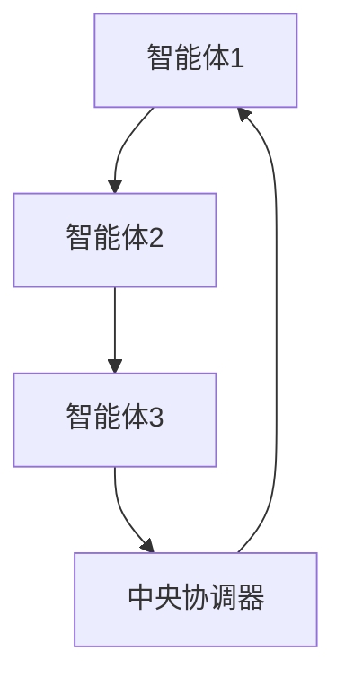
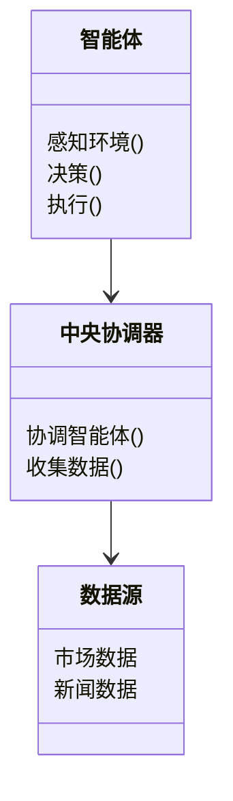
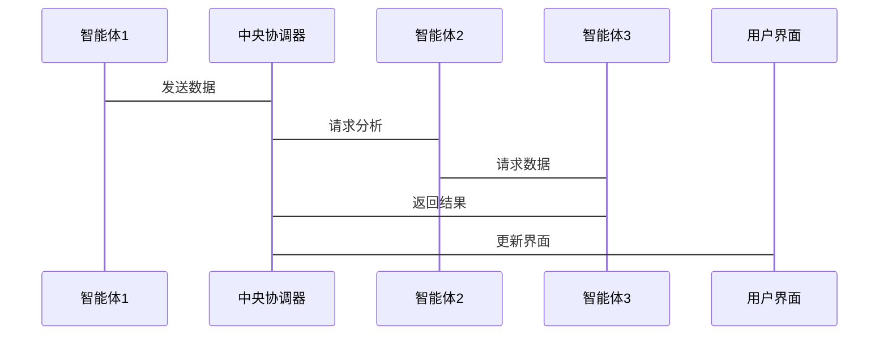

                 


# 多智能体系统在特殊情况投资中的应用：并购机会识别

**关键词：** 多智能体系统, 并购机会识别, 特殊情况投资, 协同学习, 异常检测, 投资决策

**摘要：**  
在金融投资领域，并购机会的识别是一个复杂且具有挑战性的任务。传统的投资分析方法依赖于人工判断和单点数据分析，难以应对市场中的不确定性和复杂性。多智能体系统（MAS）通过多个智能体的协同工作，能够高效地分析海量数据，识别潜在的并购机会。本文深入探讨多智能体系统在特殊情况投资中的应用，结合算法原理、系统架构和实际案例，详细分析其在并购机会识别中的优势和实现方法。

---

## 第一部分：引言

### 第1章：多智能体系统与并购机会识别概述

#### 1.1 多智能体系统的背景与概念
- **传统单智能体系统的局限性**：传统的投资分析系统通常依赖于单一算法或模型，难以处理复杂多变的市场环境。
- **多智能体系统的定义**：多智能体系统（MAS）由多个智能体组成，每个智能体具有一定的自主性、反应性和协同性，能够共同完成复杂任务。
- **MAS的核心特征**：
  - 分布式计算：智能体独立运行，通过通信协同完成任务。
  - 协同性：智能体之间通过信息共享和协作，提升整体性能。
  - 自适应性：能够根据环境变化动态调整行为。

#### 1.2 并购机会识别的背景与挑战
- **并购的定义与类型**：并购是指一家企业收购另一家企业的一部分或全部股权，分为友好并购、敌意并购等类型。
- **传统并购分析的局限性**：
  - 数据维度单一：传统分析依赖财务数据，忽视非结构化数据（如新闻、社交媒体）。
  - 计算复杂度高：复杂的数据关联和模式识别需要大量计算资源。
  - 人为因素影响：分析师的经验和判断可能影响结果。

#### 1.3 多智能体系统在并购机会识别中的作用
- **MAS的优势**：
  - 数据处理能力强：能够同时分析结构化和非结构化数据。
  - 并行计算：多个智能体协同工作，提高计算效率。
  - 知识互补：不同智能体专注于不同任务，提供全面的分析视角。
- **MAS的应用场景**：
  - 异常检测：识别市场中的异常波动，发现潜在的并购机会。
  - 数据关联分析：挖掘跨市场的关联性，预测并购可能性。
  - 协同学习：通过多智能体的协同，提升模型的准确性和鲁棒性。

---

## 第二部分：多智能体系统的核心概念与原理

### 第2章：多智能体系统的核心概念

#### 2.1 多智能体系统的定义与属性
- **智能体的定义**：智能体是具有感知环境、做出决策、执行动作能力的实体。
- **多智能体系统的属性对比**：

| 属性       | 单智能体系统               | 多智能体系统               |
|------------|---------------------------|---------------------------|
| 独立性     | 高度集中                   | 分散独立                   |
| 交互性     | 无                         | 强                         |
| 并行性     | 串行                       | 并行                       |
| 可扩展性   | 有限                       | 高                        |

- **MAS与传统系统的区别**：
  - MAS通过分布式计算提高效率，而传统系统依赖单一计算单元。
  - MAS通过智能体间的协同实现复杂任务，传统系统依赖中心化控制。

#### 2.2 多智能体系统的组成与关系
- **ER实体关系图**（Mermaid流程图）：
```mermaid
er
  entity 智能体 {
    类型: String
    状态: String
    行为: String
  }
  entity 环境 {
    数据源: String
    事件: String
  }
  智能体 --> 环境: 与环境交互
  智能体 --> 智能体: 协同工作
```

#### 2.3 多智能体系统的协同机制
- **协同方式**：
  - 通信：智能体之间通过消息传递共享信息。
  - 协调：通过协商达成一致行动。
  - 分布式决策：多个智能体共同参与决策过程。

---

## 第三部分：多智能体系统的算法原理

### 第3章：多智能体协同学习算法

#### 3.1 协同学习的基本原理
- **协同学习的定义**：多个学习器通过协同工作，共同完成学习任务。
- **MAS中的协同学习**：
  - 分布式学习：智能体各自学习，然后共享知识。
  - 联合学习：智能体共同参与学习过程，共同优化模型。

#### 3.2 协同学习算法的流程
- **协同学习流程图**（Mermaid流程图）：


#### 3.3 协同学习的数学模型
- **分布式学习模型**：
  $$ y_i = \sum_{j=1}^{n} w_{ij} x_j $$
  其中，$w_{ij}$ 是智能体i对特征j的权重。
- **联合学习模型**：
  $$ y = \sum_{i=1}^{m} w_i x_i $$
  其中，$w_i$ 是智能体i的权重，$x_i$ 是智能体i的特征。

---

## 第四部分：系统分析与架构设计

### 第4章：系统分析与架构设计

#### 4.1 项目背景
- **项目目标**：构建一个多智能体系统，用于识别潜在的并购机会。
- **项目范围**：涵盖数据采集、分析、预测和决策支持。

#### 4.2 系统功能设计
- **领域模型**（Mermaid类图）：


#### 4.3 系统架构设计
- **系统架构图**（Mermaid架构图）：


#### 4.4 系统接口设计
- **接口设计**：
  - 智能体间通信接口：定义消息格式和通信协议。
  - 用户界面接口：提供数据可视化和结果展示。

#### 4.5 系统交互设计
- **交互流程图**（Mermaid序列图）：


---

## 第五部分：项目实战

### 第5章：项目实战

#### 5.1 环境安装
- **所需工具**：
  - Python 3.8+
  - Mermaid CLI
  - Jupyter Notebook

#### 5.2 核心代码实现
- **数据采集模块**：
  ```python
  import requests
  def fetch_data(url):
      response = requests.get(url)
      return response.text
  ```
- **协同学习算法**：
  ```python
  def协同学习算法():
      智能体1 = 初始化智能体
      智能体2 = 初始化智能体
      中央协调器 = 初始化协调器
      中央协调器.协调智能体(智能体1, 智能体2)
      return 中央协调器.收集结果()
  ```

#### 5.3 案例分析
- **案例背景**：某科技公司潜在并购机会分析。
- **数据来源**：市场数据、新闻数据、社交媒体数据。
- **分析结果**：识别出某潜在目标公司，预测其并购价值。

#### 5.4 结果展示
- **可视化结果**：
  - 市场趋势图
  - 并购概率分布图
  - 关联分析图

---

## 第六部分：总结与展望

### 第6章：总结与展望

#### 6.1 小结
- 本文详细介绍了多智能体系统在并购机会识别中的应用，展示了其在数据处理、协同学习和系统架构方面的优势。

#### 6.2 注意事项
- 数据隐私和安全问题需严格把控。
- 智能体间的通信效率会影响整体性能。
- 系统的可扩展性和可维护性需在设计阶段充分考虑。

#### 6.3 拓展阅读
- 推荐阅读《Multi-Agent Systems》和《Financial Data Analysis with Python》。

---

**作者：AI天才研究院（AI Genius Institute） & 禅与计算机程序设计艺术（Zen And The Art of Computer Programming）**  
**版权声明：本博客文章版权归作者所有，转载请注明出处。**

