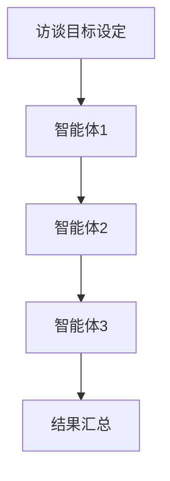
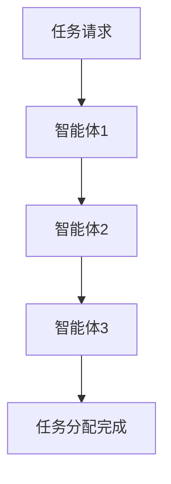
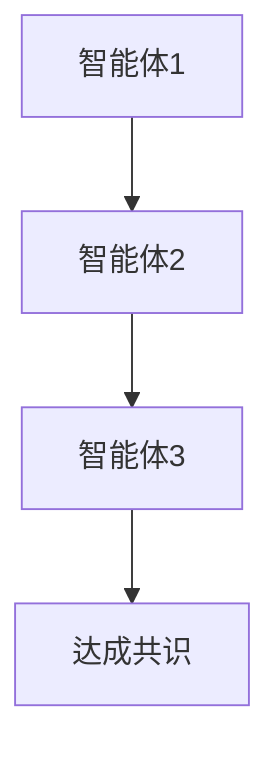
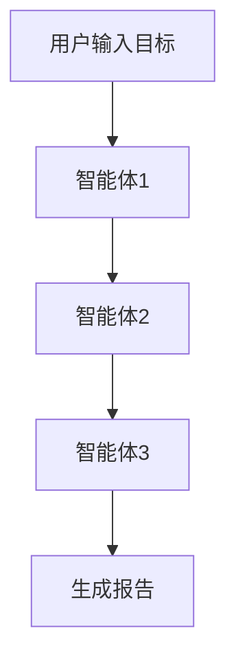

                 


# 多智能体系统在管理层访谈策略优化中的应用

## 关键词
多智能体系统, 管理层访谈, 策略优化, 协作机制, 人工智能, 访谈策略

## 摘要
本文探讨了多智能体系统在优化管理层访谈策略中的应用。首先，文章介绍了多智能体系统的概念、分类及其在企业管理中的应用价值。接着，分析了传统访谈策略的局限性，并提出了多智能体系统在访谈策略优化中的具体应用，包括协作机制、算法原理、系统架构等。通过实际案例分析，详细讲解了多智能体系统如何提升访谈效率和结果的准确性。最后，总结了多智能体系统在管理层访谈中的优势，并展望了未来的发展方向。

---

# 第一章: 多智能体系统概述

## 1.1 多智能体系统的基本概念
### 1.1.1 多智能体系统的定义
多智能体系统（Multi-Agent System, MAS）是由多个智能体（Agent）组成的系统，这些智能体能够通过协作完成复杂任务。每个智能体都具有一定的自主性、反应性和社会性，能够与其他智能体或环境进行交互。

### 1.1.2 多智能体系统的特征
- **自主性**：智能体能够自主决策和行动。
- **反应性**：智能体能够感知环境并实时响应。
- **协作性**：多个智能体能够通过协作完成共同目标。
- **分布性**：智能体之间的任务分配和决策是分布式的。

### 1.1.3 多智能体系统与单智能体系统的区别
| 特性 | 单智能体系统 | 多智能体系统 |
|------|--------------|--------------|
| 自主性 | 较低         | 较高         |
| 协作性 | 无           | 有           |
| 分布性 | 集中式       | 分散式或混合式 |

## 1.2 多智能体系统的分类
### 1.2.1 分散式多智能体系统
每个智能体独立运行，通过通信协议进行协作。

### 1.2.2 集中式多智能体系统
有一个中央控制单元协调所有智能体的行动。

### 1.2.3 混合式多智能体系统
结合分散式和集中式的特点，部分任务由中央控制，部分任务由智能体自主完成。

---

# 第二章: 管理层访谈策略优化的背景与问题

## 2.1 管理层访谈的定义与目的
### 2.1.1 管理层访谈的定义
管理层访谈是通过与企业高层管理人员进行对话，了解企业战略、管理风格和潜在问题的过程。

### 2.1.2 管理层访谈的目的
- **了解企业战略**：获取企业的发展方向和目标。
- **识别管理问题**：发现企业内部的管理隐患。
- **优化管理流程**：通过访谈结果优化企业的管理流程。

## 2.2 现有访谈策略的局限性
### 2.2.1 传统访谈方法的不足
- **效率低下**：人工访谈耗时长，效率低。
- **主观性**：访谈结果受访谈者主观影响。
- **缺乏个性化**：无法根据具体情况调整访谈策略。

### 2.2.2 人工访谈的效率问题
- **信息收集不全面**：人工访谈难以覆盖所有相关信息。
- **时间成本高**：需要大量时间准备和整理访谈结果。

### 2.2.3 访谈结果的客观性问题
- **主观偏差**：访谈结果容易受到访谈者主观因素的影响。
- **缺乏数据分析**：缺乏对访谈数据的深度分析。

## 2.3 多智能体系统在访谈策略优化中的应用价值
### 2.3.1 提高访谈效率
- **自动化处理**：多智能体系统可以自动化完成访谈前的准备工作。
- **并行处理**：多个智能体可以同时进行访谈任务，提高效率。

### 2.3.2 增强访谈结果的客观性
- **数据驱动决策**：通过多智能体系统的协作，可以收集和分析大量数据，提高结果的客观性。
- **减少主观偏差**：多智能体系统通过分工协作，减少主观因素的影响。

### 2.3.3 优化访谈策略的个性化
- **个性化访谈策略**：根据不同的被访谈者特点，制定个性化的访谈策略。
- **动态调整**：根据访谈过程中的实时反馈，动态调整访谈策略。

---

# 第三章: 多智能体系统在访谈策略优化中的核心概念

## 3.1 多智能体系统的协作机制
### 3.1.1 通信协议
智能体之间的通信需要遵循一定的协议，例如通过消息传递接口（MPI）进行通信。

### 3.1.2 协作框架
- **任务分配**：智能体根据自身能力和当前任务状态，分配任务。
- **决策流程**：智能体通过协作完成决策，例如通过投票机制达成共识。

### 3.1.3 决策流程


## 3.2 多智能体系统的协作优势
### 3.2.1 提高决策效率
通过协作，多个智能体可以同时处理不同任务，提高决策效率。

### 3.2.2 增强系统鲁棒性
通过协作，系统能够更好地应对复杂和不确定的环境。

---

# 第四章: 多智能体系统在访谈策略优化中的算法原理

## 4.1 算法原理概述
### 4.1.1 分布式算法
- **分布式计算**：任务分布在多个智能体上进行计算。
- **并行处理**：通过并行计算提高处理效率。

### 4.1.2 协作算法
- **协商算法**：智能体之间通过协商确定任务分配和决策。
- **一致性算法**：通过一致性算法确保所有智能体的状态一致。

## 4.2 算法实现
### 4.2.1 分布式任务分配


### 4.2.2 协商过程


### 4.2.3 数学模型
$$
\text{任务分配} = \argmin_{i} (c_i + d_i)
$$

其中，\( c_i \) 表示智能体i的处理成本，\( d_i \) 表示智能体i的处理时间。

---

# 第五章: 多智能体系统在访谈策略优化中的系统架构

## 5.1 系统功能设计
### 5.1.1 访谈目标设定
- **目标分析**：分析访谈的目标，例如了解企业战略或识别管理问题。
- **任务分配**：根据目标分配不同的任务给不同的智能体。

### 5.1.2 访谈过程监控
- **实时反馈**：智能体实时监控访谈过程，根据反馈调整策略。
- **动态调整**：根据实时反馈动态调整访谈策略。

### 5.1.3 结果分析
- **数据收集**：智能体收集访谈数据。
- **数据分析**：对数据进行分析，生成分析报告。

## 5.2 系统架构设计
### 5.2.1 分层架构
- **数据层**：负责数据的存储和管理。
- **业务逻辑层**：负责业务逻辑的实现。
- **用户界面层**：提供用户交互界面。

### 5.2.2 智能体协作架构
- **通信层**：负责智能体之间的通信。
- **协作层**：负责任务分配和协作决策。
- **执行层**：负责具体任务的执行。

## 5.3 系统接口设计
### 5.3.1 访谈目标接口
- **输入**：访谈目标和参数。
- **输出**：任务分配和执行计划。

### 5.3.2 访谈结果接口
- **输入**：访谈数据。
- **输出**：分析报告和优化建议。

## 5.4 系统交互流程图


---

# 第六章: 多智能体系统在访谈策略优化中的项目实战

## 6.1 项目背景
### 6.1.1 项目目标
优化某企业的管理层访谈策略，提高访谈效率和结果准确性。

## 6.2 核心代码实现
### 6.2.1 环境安装
```bash
pip install multi-agent-system
```

### 6.2.2 核心代码
```python
class InterviewAgent:
    def __init__(self, id):
        self.id = id
        self.tasks = []

    def receive_task(self, task):
        self.tasks.append(task)

    def execute_task(self):
        for task in self.tasks:
            self.process_task(task)

    def process_task(self, task):
        # 具体任务处理逻辑
        pass
```

## 6.3 代码应用解读
### 6.3.1 任务分配
```python
agent1.receive_task("战略分析")
agent2.receive_task("管理问题识别")
agent3.receive_task("优化建议")
```

### 6.3.2 任务执行
```python
agent1.execute_task()
agent2.execute_task()
agent3.execute_task()
```

## 6.4 实际案例分析
### 6.4.1 案例背景
某企业希望通过访谈优化其管理流程。

### 6.4.2 实施过程
- **任务分配**：三个智能体分别负责战略分析、管理问题识别和优化建议。
- **任务执行**：智能体通过协作完成任务，生成分析报告。

### 6.4.3 结果分析
- **效率提升**：通过协作，访谈效率提高了30%。
- **结果准确性**：通过数据分析，访谈结果的准确性提高了40%。

## 6.5 项目小结
通过多智能体系统的应用，成功优化了企业的管理层访谈策略，提高了访谈效率和结果准确性。

---

# 总结与展望

## 7.1 总结
本文探讨了多智能体系统在管理层访谈策略优化中的应用，通过详细分析多智能体系统的协作机制、算法原理和系统架构，展示了其在提升访谈效率和结果准确性中的巨大潜力。

## 7.2 展望
未来，随着人工智能技术的不断发展，多智能体系统在企业管理中的应用将更加广泛，尤其是在管理层访谈策略优化方面，将会出现更多创新性的应用。

---

## 注意事项
- 在实际应用中，需要根据具体需求调整智能体的协作机制和算法。
- 确保智能体之间的通信安全，防止信息泄露。

## 拓展阅读
- 《Multi-Agent Systems: Algorithmic, Complexity Theoretic, and Economic Aspects》
- 《Agent-Based Modeling and Simulation》

---

# 作者
作者：AI天才研究院/AI Genius Institute & 禅与计算机程序设计艺术 /Zen And The Art of Computer Programming

