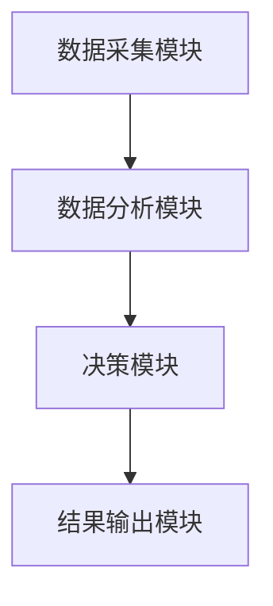
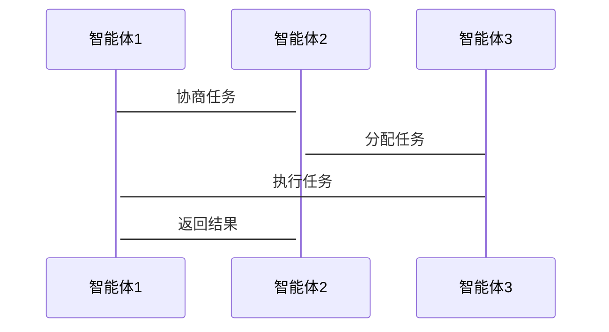

                 


# 多智能体系统在行业分析中的应用

> 关键词：多智能体系统、行业分析、协作机制、算法原理、系统架构

> 摘要：本文详细探讨了多智能体系统在行业分析中的应用，从基本概念到算法原理，再到系统架构和项目实战，全面解析多智能体系统如何在不同行业中发挥作用，提供理论与实践相结合的深度分析。

---

## 第1章: 多智能体系统概述

### 1.1 多智能体系统的定义与特点

#### 1.1.1 多智能体系统的定义
多智能体系统（Multi-Agent System, MAS）是由多个智能体组成的分布式系统，这些智能体能够自主决策、协作完成任务。智能体可以是软件程序、机器人或其他实体，通过交互完成复杂任务。

#### 1.1.2 多智能体系统的核心特点
- **自主性**：智能体能够自主决策。
- **反应性**：实时感知环境并做出反应。
- **协作性**：智能体之间能够协作完成任务。
- **分布式**：系统由多个独立组件组成，无中心控制点。

#### 1.1.3 多智能体系统与传统单智能体系统的区别
| 特性       | 多智能体系统                | 单智能体系统                |
|------------|-----------------------------|-----------------------------|
| 结构       | 分布式，多个智能体协作       | 集中式，单个智能体控制       |
| 可扩展性   | 高，易于扩展                | 低，扩展性差                |
| 故障容错   | 高，部分故障不影响整体       | 低，单点故障可能导致系统崩溃 |

### 1.2 多智能体系统的组成与结构

#### 1.2.1 智能体的基本组成
智能体由以下部分组成：
- **感知器**：感知环境输入。
- **推理器**：处理输入并做出决策。
- **执行器**：执行决策动作。
- **知识库**：存储智能体的知识和经验。

#### 1.2.2 多智能体系统的层次结构
多智能体系统的层次结构通常分为：
- **物理层**：智能体的物理实体。
- **逻辑层**：智能体的逻辑处理部分。
- **通信层**：智能体之间的通信机制。
- **协作层**：智能体协作完成任务的机制。

#### 1.2.3 多智能体系统的通信与协作机制
通信与协作机制是多智能体系统的核心。智能体之间通过消息传递、协商等方式协作，确保系统目标的实现。

### 1.3 多智能体系统的应用领域

#### 1.3.1 行业分析中的多智能体系统应用
在行业分析中，多智能体系统可以用于数据收集、模式识别、预测分析等任务，帮助企业在复杂环境中做出决策。

#### 1.3.2 其他领域的多智能体系统应用
多智能体系统在机器人、自动驾驶、分布式计算等领域也有广泛应用。

#### 1.3.3 多智能体系统在行业分析中的优势
- **高效性**：多智能体系统能够并行处理任务，提高效率。
- **智能性**：智能体能够自主学习和适应环境。
- **鲁棒性**：系统具有较强的容错能力，能够适应环境变化。

---

## 第2章: 多智能体系统的核心概念

### 2.1 多智能体系统的智能体模型

#### 2.1.1 智能体的定义与分类
智能体可以分为简单反射型、基于模型的反射型、目标驱动型和效用驱动型四种类型。

#### 2.1.2 智能体的属性与行为
智能体具有自主性、反应性、社会性等属性，并能够执行感知、推理、决策等行为。

#### 2.1.3 智能体的决策机制
智能体的决策机制包括基于规则的决策、基于模型的决策和基于效用的决策三种方式。

### 2.2 多智能体系统的协作机制

#### 2.2.1 协作的基本概念
协作是指多个智能体通过合作完成共同目标的过程。

#### 2.2.2 协作的实现方式
协作可以通过协商、任务分配、信息共享等方式实现。

#### 2.2.3 协作的挑战与解决方案
协作的挑战包括通信延迟、任务冲突、信息不一致等，可以通过优化通信协议、制定协作规则等方式解决。

### 2.3 多智能体系统的通信协议

#### 2.3.1 通信协议的定义
通信协议是智能体之间进行信息交换的规则和格式。

#### 2.3.2 常见的通信协议类型
常用的通信协议包括HTTP、MQTT、WebSocket等。

#### 2.3.3 通信协议的设计原则
通信协议设计应考虑实时性、可靠性和安全性，确保智能体之间高效、安全地通信。

---

## 第3章: 多智能体系统的算法原理

### 3.1 分布式计算算法

#### 3.1.1 分布式计算的基本原理
分布式计算通过将任务分解到多个节点上并行处理，提高计算效率。

#### 3.1.2 分布式计算的实现步骤
1. 任务分解：将任务分解为多个子任务。
2. 任务分配：将子任务分配给不同的节点。
3. 任务执行：各节点并行执行子任务。
4. 结果汇总：将各节点的结果汇总，得到最终结果。

#### 3.1.3 分布式计算的优缺点
- **优点**：提高计算效率，增强系统扩展性。
- **缺点**：存在通信延迟，增加系统复杂性。

### 3.2 协商算法

#### 3.2.1 协商算法的基本概念
协商算法是指智能体之间通过协商达成一致的算法。

#### 3.2.2 协商算法的实现流程
1. 初始化：智能体提出协商请求。
2. 交互：智能体之间交换信息，进行协商。
3. 达成一致：智能体达成一致，结束协商。
4. 执行：智能体根据协商结果执行任务。

#### 3.2.3 协商算法的应用案例
在金融行业，智能体可以通过协商算法分配交易任务，提高交易效率。

### 3.3 一致性算法

#### 3.3.1 一致性算法的定义
一致性算法是指确保分布式系统中数据一致性的算法。

#### 3.3.2 一致性算法的实现方式
常用的一致性算法包括Paxos算法、Raft算法等。

#### 3.3.3 一致性算法的优化策略
通过优化通信协议和减少同步次数，可以提高一致性算法的效率。

---

## 第4章: 多智能体系统的系统分析与架构设计

### 4.1 问题场景介绍

#### 4.1.1 行业分析的挑战
行业分析需要处理大量数据，且环境复杂多变，单靠单智能体系统难以高效完成任务。

#### 4.1.2 多智能体系统的解决方案
通过部署多智能体系统，可以高效地完成数据收集、分析和决策任务。

### 4.2 系统功能设计

#### 4.2.1 领域模型设计
领域模型包括数据采集模块、数据分析模块、决策模块等。

#### 4.2.2 功能模块设计
- **数据采集模块**：负责采集行业数据。
- **数据分析模块**：对数据进行分析和处理。
- **决策模块**：根据分析结果做出决策。

### 4.3 系统架构设计

#### 4.3.1 系统架构图


#### 4.3.2 系统交互设计


### 4.4 系统接口设计

#### 4.4.1 接口定义
系统接口包括数据采集接口、数据分析接口、决策接口等。

#### 4.4.2 接口实现
通过RESTful API实现系统接口的调用和交互。

---

## 第5章: 多智能体系统的项目实战

### 5.1 项目背景与目标

#### 5.1.1 项目背景
选择金融行业作为案例，分析多智能体系统在金融行业中的应用。

#### 5.1.2 项目目标
通过部署多智能体系统，提高金融行业的数据分析效率和决策能力。

### 5.2 系统核心实现

#### 5.2.1 环境安装
安装Python、Jupyter Notebook、Pandas、NumPy等工具。

#### 5.2.2 核心代码实现

##### 数据采集模块
```python
import requests
import json

def fetch_data(api_key):
    url = f"https://api.example.com/data?api_key={api_key}"
    response = requests.get(url)
    return json.loads(response.text)
```

##### 数据分析模块
```python
import pandas as pd
from sklearn import linear_model

def analyze_data(data):
    df = pd.DataFrame(data)
    model = linear_model.LinearRegression()
    model.fit(df[['feature1', 'feature2']], df['target'])
    return model.predict(df[['feature1', 'feature2']])
```

##### 决策模块
```python
def make_decision(predicted_value):
    if predicted_value > 100:
        return "Buy"
    elif predicted_value < 50:
        return "Sell"
    else:
        return "Hold"
```

#### 5.2.3 代码应用解读与分析
通过上述代码，智能体能够自主完成数据采集、分析和决策任务，实现高效协作。

### 5.3 案例分析与详细解读

#### 5.3.1 案例分析
在金融行业中，多智能体系统可以用于股票价格预测和交易决策。

#### 5.3.2 详细解读
通过数据分析模块，智能体能够预测股票价格走势，并通过决策模块做出买卖决策，帮助投资者实现盈利。

### 5.4 项目小结

#### 5.4.1 项目成果
成功部署多智能体系统，提高了金融行业的数据分析效率和决策能力。

#### 5.4.2 项目经验总结
多智能体系统的部署需要充分考虑智能体之间的协作机制和通信协议，确保系统高效运行。

---

## 第6章: 总结与展望

### 6.1 全文总结

#### 6.1.1 核心内容回顾
本文详细探讨了多智能体系统在行业分析中的应用，从基本概念到算法原理，再到系统架构和项目实战，全面解析了多智能体系统的优势和应用价值。

#### 6.1.2 本文的创新点
本文通过实际案例分析，展示了多智能体系统在金融行业中的具体应用，为读者提供了理论与实践相结合的深度分析。

### 6.2 未来展望

#### 6.2.1 当前研究的不足
当前研究主要集中在理论层面，实际应用中仍存在诸多挑战，如通信延迟、任务冲突等。

#### 6.2.2 未来的研究方向
未来的研究方向包括优化协作机制、提高系统智能化水平、增强系统容错能力等。

---

## 作者：AI天才研究院/AI Genius Institute & 禅与计算机程序设计艺术 /Zen And The Art of Computer Programming

---

本文通过对多智能体系统的详细分析，展示了其在行业分析中的广泛应用和巨大潜力，为读者提供了理论与实践相结合的深度分析，帮助读者更好地理解和应用多智能体系统。

