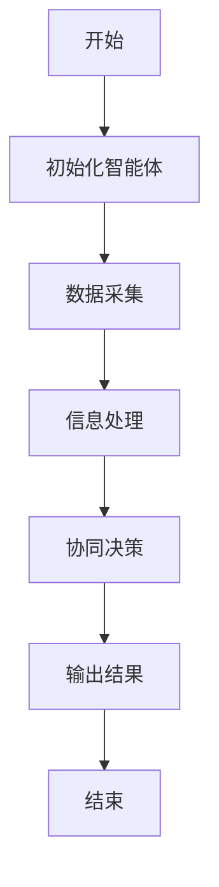
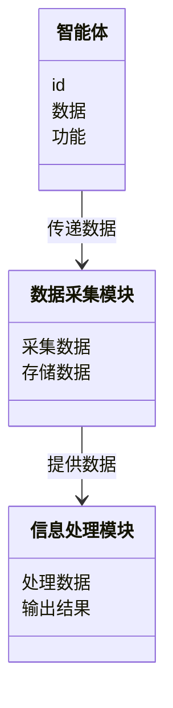
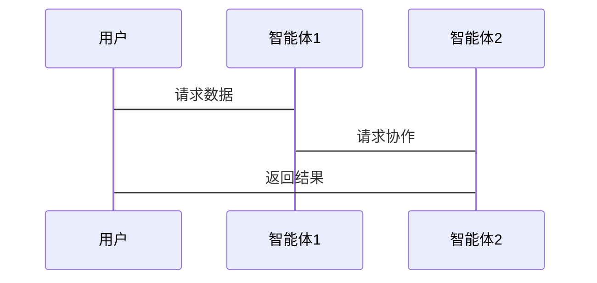

                 


# 多智能体系统在评估公司可持续发展能力中的应用

## 关键词：多智能体系统、可持续发展评估、企业绩效、协同决策、复杂系统建模

## 摘要
本文探讨了多智能体系统在公司可持续发展能力评估中的应用，分析了其在复杂问题建模、分布式决策和协同优化方面的优势，结合实际案例展示了其在企业绩效评估中的潜力。

---

# 第1章: 多智能体系统概述

## 1.1 多智能体系统的基本概念

### 1.1.1 多智能体系统的定义
多智能体系统（Multi-Agent System, MAS）是由多个智能体组成的分布式系统，这些智能体能够通过协作完成复杂的任务。每个智能体都具有自主性、反应性和社会性等特征。

### 1.1.2 多智能体系统的核心特征
- **自主性**：智能体能够自主决策。
- **反应性**：能够感知环境并实时响应。
- **社会性**：智能体之间可以通信和协作。

### 1.1.3 多智能体系统分类与应用场景
多智能体系统可以分为松耦合和紧耦合两类，广泛应用于机器人、分布式计算、博弈论等领域。

## 1.2 可持续发展评估的定义与框架

### 1.2.1 可持续发展的基本概念
可持续发展是指满足当前需求的同时，不损害后代满足其需求的能力。

### 1.2.2 可持续发展评估的指标体系
包括环境、经济和社会三个维度的指标。

### 1.2.3 可持续发展评估的挑战与方法
评估过程复杂，涉及多个利益相关方，需要综合分析。

## 1.3 多智能体系统在可持续发展评估中的应用背景

### 1.3.1 可持续发展评估的复杂性
需要考虑多方面因素，数据来源多样。

### 1.3.2 多智能体系统的优势与适用性
能够处理分布式决策和协作优化问题。

### 1.3.3 当前研究与应用现状
研究主要集中在算法优化和应用场景拓展。

---

# 第2章: 多智能体系统的核心概念与联系

## 2.1 多智能体系统的核心原理

### 2.1.1 分布式智能与协作机制
通过通信协议实现信息共享和协同决策。

### 2.1.2 通信协议与信息交换
定义了智能体之间的交互规则和数据格式。

### 2.1.3 协同决策与任务分配
智能体根据环境信息共同制定决策。

## 2.2 可持续发展评估的核心要素

### 2.2.1 环境因素
包括碳排放、资源消耗等指标。

### 2.2.2 经济因素
涉及成本、收益等经济指标。

### 2.2.3 社会因素
关注员工满意度、社会责任等。

## 2.3 多智能体系统与可持续发展评估的关联

### 2.3.1 多智能体系统如何支持可持续发展评估
通过分布式计算和协作优化提高评估效率。

### 2.3.2 可持续发展评估对多智能体系统的需求
需要多智能体系统的协同能力和数据处理能力。

## 2.4 核心概念对比表格

| **属性**       | **多智能体系统**               | **可持续发展评估**            |
|----------------|-------------------------------|-----------------------------|
| 目标           | 协同决策和复杂问题求解         | 评估企业可持续发展能力       |
| 核心要素       | 智能体、通信协议、协作机制     | 环境、经济、社会指标         |
| 优势           | 分布式计算、动态适应性         | 综合性、系统性               |

## 2.5 ER实体关系图

```mermaid
er
    entity 多智能体系统 {
        id
        智能体类型
        功能模块
    }
    entity 可持续发展评估 {
        id
        评估指标
        数据来源
    }
    多智能体系统 -->> 可持续发展评估: 提供数据支持
```

---

# 第3章: 多智能体系统在可持续发展评估中的算法原理

## 3.1 多智能体协作算法

### 3.1.1 分布式一致性算法
确保多个智能体之间的数据一致性。

### 3.1.2 协同决策算法
基于环境信息进行决策。

### 3.1.3 任务分配算法
根据智能体能力和任务需求进行分配。

## 3.2 可持续发展评估的数学模型

### 3.2.1 综合评估模型
将环境、经济和社会指标进行加权求和。

$$ S = \sum_{i=1}^{n} w_i x_i $$

### 3.2.2 多目标优化模型
在多个目标之间寻找平衡点。

### 3.2.3 网络流模型
用于资源分配和优化。

## 3.3 算法流程图



---

# 第4章: 系统分析与架构设计

## 4.1 项目场景介绍
一个公司需要评估其可持续发展能力，使用多智能体系统进行数据采集和分析。

## 4.2 系统功能设计

### 4.2.1 功能模块
- 数据采集模块
- 信息处理模块
- 协同决策模块
- 输出模块

### 4.2.2 领域模型类图



## 4.3 系统架构设计

### 4.3.1 架构图


## 4.4 系统接口设计
定义智能体之间的通信接口和数据格式。

## 4.5 系统交互设计

### 4.5.1 序列图



---

# 第5章: 项目实战

## 5.1 环境安装
安装必要的软件和库，如Python、Django框架等。

## 5.2 系统核心实现

### 5.2.1 核心代码
```python
class Agent:
    def __init__(self, id):
        self.id = id
        self.data = {}

    def collect_data(self):
        # 数据采集逻辑
        pass

    def process_data(self):
        # 数据处理逻辑
        pass
```

## 5.3 实际案例分析
分析一个公司的数据，展示多智能体系统如何优化其可持续发展评估。

---

# 第6章: 最佳实践与小结

## 6.1 实施中的注意事项
确保数据安全和智能体之间的通信稳定。

## 6.2 未来研究方向
探索更高效的算法和新的应用场景。

## 6.3 总结与展望
多智能体系统在可持续发展评估中具有广阔的应用前景，未来将更加智能化和高效化。

---

作者：AI天才研究院/AI Genius Institute & 禅与计算机程序设计艺术 /Zen And The Art of Computer Programming

