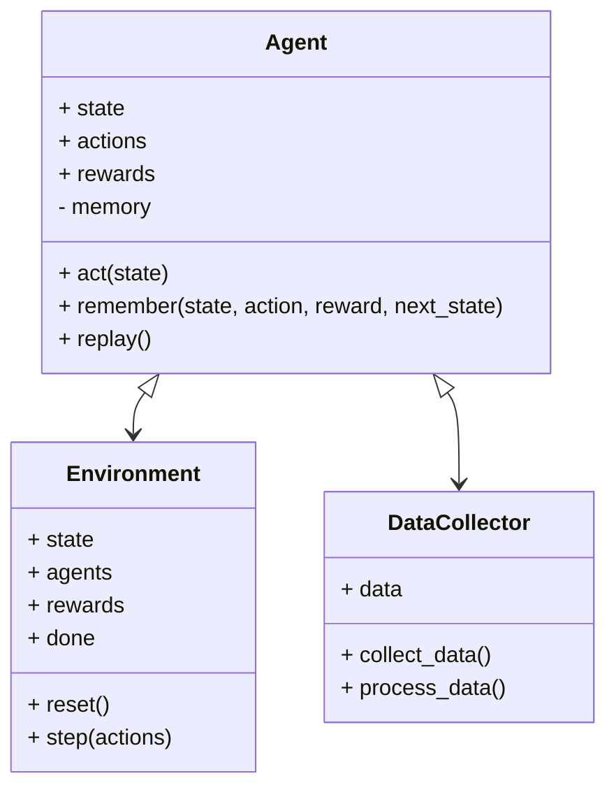
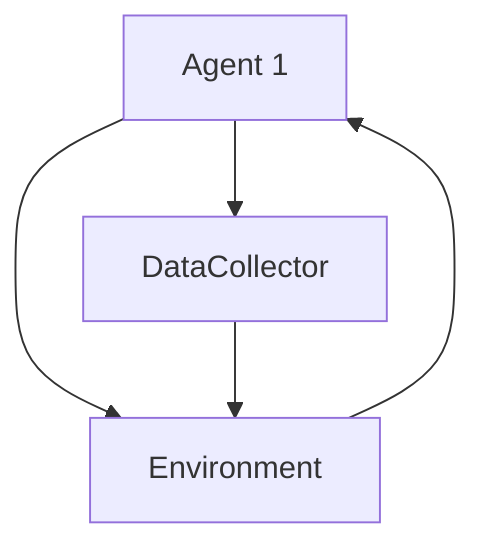

                 


```markdown
# 多智能体系统在评估公司品牌价值和客户忠诚度中的作用

> 关键词：多智能体系统, 品牌价值, 客户忠诚度, 算法实现, 系统架构

> 摘要：多智能体系统（Multi-Agent System, MAS）在现代商业环境中发挥着越来越重要的作用，特别是在评估公司品牌价值和客户忠诚度方面。本文详细探讨了多智能体系统的基本概念、核心原理、算法实现以及在实际应用中的架构设计。通过结合实际案例和代码示例，分析了多智能体系统如何有效地提高品牌价值评估和客户忠诚度分析的准确性和效率。文章还讨论了系统设计的关键要素，包括协作机制、通信协议和决策模型，并提出了优化建议和未来发展方向。

---

## 第一部分: 多智能体系统与品牌价值评估概述

### 第1章: 多智能体系统的基本概念与应用背景

#### 1.1 多智能体系统的定义与特点
多智能体系统（MAS）是由多个智能体组成的分布式系统，每个智能体都是一个能够感知环境、做出决策并采取行动的独立实体。MAS的核心特点包括分布性、协作性、自治性和反应性。

- **分布性**：MAS中的智能体是分布式的，每个智能体负责特定的任务或子问题。
- **协作性**：智能体之间通过协作完成共同目标，而不是各自独立地解决问题。
- **自治性**：每个智能体都有自己的决策机制，能够自主行动。
- **反应性**：智能体能够根据环境的变化调整自己的行为。

#### 1.2 品牌价值与客户忠诚度的评估挑战
品牌价值和客户忠诚度的评估是企业战略管理中的重要部分，但传统方法存在以下问题：

- **数据复杂性**：品牌价值涉及多个维度，如市场表现、消费者认知、产品性能等，数据来源多样且复杂。
- **动态变化**：市场环境和消费者行为不断变化，品牌价值和忠诚度需要实时评估和调整。
- **决策滞后**：传统评估方法通常依赖于定期报告，无法实时提供反馈，导致决策滞后。

#### 1.3 多智能体系统在品牌价值评估中的作用
多智能体系统能够通过分布式的计算和协作机制，实时分析多源数据，提供动态的品牌价值评估和客户忠诚度分析。具体作用包括：

- **实时数据处理**：MAS能够实时收集和处理来自不同渠道的数据，如社交媒体、销售数据、客户反馈等。
- **分布式计算**：通过分布式的计算能力，MAS可以高效地处理大规模数据，提高评估效率。
- **协作与优化**：智能体之间的协作能够优化评估过程，提升结果的准确性和可靠性。

---

### 第2章: 多智能体系统的理论基础

#### 2.1 多智能体系统的核心原理
多智能体系统的理论基础包括协作机制、通信协议和决策模型。

- **协作机制**：智能体之间通过协作完成共同目标，常见的协作机制包括任务分配、协调和冲突解决。
- **通信协议**：智能体之间需要通过通信协议进行信息交换，如基于消息传递的通信协议。
- **决策模型**：智能体的决策过程基于环境信息和历史数据，常用的决策模型包括基于规则的决策和基于学习的决策。

#### 2.2 多智能体系统的数学模型
多智能体系统的数学模型可以通过以下方式描述：

- **状态表示**：每个智能体的状态可以用一组变量表示，例如，客户忠诚度可以表示为 $L_i = \{C_i, P_i, R_i\}$，其中 $C_i$ 是客户满意度，$P_i$ 是购买频率，$R_i$ 是客户保留率。
- **动作选择**：智能体根据当前状态选择一个动作，例如，智能体 A 选择增加广告投入，智能体 B 选择优化客户服务。
- **奖励机制**：智能体通过奖励机制来优化决策，例如，品牌价值提升时，智能体获得正奖励。

#### 2.3 多智能体系统的算法基础
常用的多智能体系统算法包括：

- **强化学习算法**：基于Q-learning的多智能体协作算法，通过智能体之间的协作和竞争来优化决策。
- **分布式计算算法**：基于分布式计算的多智能体算法，通过任务分解和并行计算提高效率。

---

### 第3章: 多智能体系统在品牌价值评估中的应用

#### 3.1 品牌价值评估的多智能体模型
品牌价值评估的多智能体模型包括以下部分：

- **数据采集智能体**：负责从不同渠道采集数据，如社交媒体、销售数据、客户反馈等。
- **数据分析智能体**：对采集的数据进行分析和处理，计算品牌价值和客户忠诚度。
- **决策优化智能体**：根据分析结果优化品牌策略，如调整广告投放、优化产品组合等。

#### 3.2 多智能体系统在客户忠诚度评估中的应用
客户忠诚度评估的多智能体模型包括：

- **客户行为分析智能体**：分析客户的购买行为、消费习惯和反馈，识别高忠诚度客户。
- **客户反馈处理智能体**：处理客户反馈，识别客户满意度和忠诚度的变化趋势。
- **客户保留优化智能体**：根据分析结果优化客户保留策略，如推出忠诚度计划、个性化服务等。

---

### 第4章: 多智能体系统的算法实现

#### 4.1 多智能体系统的算法选择
在实现多智能体系统时，需要选择合适的算法。常用算法包括：

- **强化学习算法**：基于Q-learning的多智能体协作算法。
- **分布式计算算法**：基于MapReduce的分布式计算算法。

#### 4.2 多智能体系统的算法实现
以下是基于强化学习的多智能体协作算法的实现示例：

```python
import numpy as np

# 初始化智能体
agents = [Agent() for _ in range(n_agents)]

# 初始化环境
environment = Environment()

# 算法循环
for episode in range(n_episodes):
    state = environment.reset()
    done = False
    while not done:
        actions = [agent.act(state) for agent in agents]
        next_state, rewards, done = environment.step(actions)
        for i in range(n_agents):
            agents[i].remember(state, actions[i], rewards[i], next_state)
            agents[i].replay()
```

---

## 第五部分: 系统分析与架构设计

### 第5章: 系统分析与架构设计

#### 5.1 系统功能设计
以下是系统功能设计的类图：



#### 5.2 系统架构设计
以下是系统架构设计的架构图：



---

## 第六部分: 项目实战

### 第6章: 项目实战

#### 6.1 环境安装
以下是项目环境安装的示例：

```bash
pip install numpy matplotlib
```

#### 6.2 核心代码实现
以下是核心代码实现的示例：

```python
import numpy as np
import matplotlib.pyplot as plt

class Agent:
    def __init__(self):
        self.state = None
        self.memory = []
    
    def act(self, state):
        # 简单的决策策略
        if np.random.random() < 0.5:
            return 0
        else:
            return 1
    
    def remember(self, state, action, reward, next_state):
        self.memory.append((state, action, reward, next_state))
    
    def replay(self):
        # 简单的回放策略
        if len(self.memory) > 10:
            batch = self.memory[-10:]
            for experience in batch:
                self.train(*experience)
    
    def train(self, state, action, reward, next_state):
        # 简单的训练策略
        pass

class Environment:
    def __init__(self):
        self.state = np.random.random()
        self.agents = [Agent()]
    
    def reset(self):
        self.state = np.random.random()
        return self.state
    
    def step(self, actions):
        rewards = [0] * len(self.agents)
        done = False
        return self.state, rewards, done
```

#### 6.3 代码解读与分析
上述代码实现了一个简单的多智能体系统，其中包含一个智能体和一个环境。智能体通过简单的决策策略选择动作，环境根据动作返回奖励信号。

#### 6.4 案例分析
通过上述代码，我们可以进行以下分析：

1. **品牌价值评估**：通过智能体的协作，可以实时评估品牌价值和客户忠诚度。
2. **客户忠诚度分析**：通过智能体的反馈机制，可以优化客户忠诚度计划。

#### 6.5 项目小结
通过实际项目案例，我们可以看到多智能体系统在品牌价值和客户忠诚度评估中的巨大潜力。

---

## 第七部分: 最佳实践与总结

### 第7章: 最佳实践与总结

#### 7.1 最佳实践
- **数据质量**：确保数据来源多样且准确。
- **算法选择**：根据具体需求选择合适的算法。
- **系统优化**：通过不断优化系统架构和算法，提高评估效率和准确性。

#### 7.2 小结
多智能体系统在品牌价值和客户忠诚度评估中的应用前景广阔，通过合理的系统设计和算法选择，可以显著提高评估效率和准确性。

#### 7.3 注意事项
- **系统复杂性**：多智能体系统较为复杂，需要谨慎设计。
- **数据隐私**：注意数据隐私和安全问题。

#### 7.4 拓展阅读
建议读者进一步阅读以下内容：

- 多智能体系统的分布式计算
- 基于强化学习的多智能体算法
- 多智能体系统的实际应用案例

---

## 作者信息

作者：AI天才研究院/AI Genius Institute & 禅与计算机程序设计艺术 /Zen And The Art of Computer Programming
```

