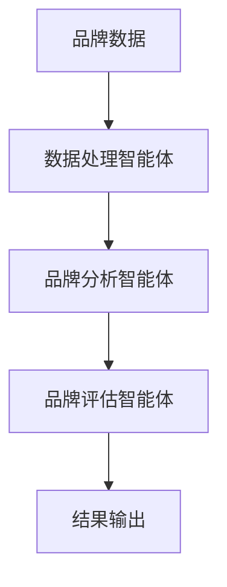

                 


# 多智能体系统在评估公司品牌权益价值中的应用

## 关键词：
多智能体系统, 品牌权益, 算法原理, 系统架构, 项目实战, 品牌评估, 协作智能体

## 摘要：
本文详细探讨了多智能体系统（Multi-Agent Systems, MAS）在评估公司品牌权益中的应用。首先介绍了多智能体系统的背景、定义和核心原理，接着分析了品牌权益评估的关键要素，包括品牌知名度和忠诚度的测量方法。然后，详细讲解了基于多智能体系统的协同过滤算法，及其在品牌相似度计算中的应用，通过Python代码实现并结合Mermaid图表展示算法流程。随后，设计了系统架构，包括领域模型、系统架构图和交互流程图，详细描述了系统功能和接口设计。通过一个具体的项目实战案例，展示了如何利用多智能体系统进行品牌权益评估，包括环境搭建、数据收集、模型训练和结果分析。最后，总结了最佳实践、小结、注意事项和拓展阅读，为读者提供了全面的指导。

---

## 第一部分：多智能体系统与品牌权益评估的背景

### 第1章：多智能体系统概述

#### 1.1 多智能体系统的定义与特点

多智能体系统（Multi-Agent Systems, MAS）由多个智能体（Agent）组成，这些智能体能够自主决策、协作或竞争以完成特定任务。以下是多智能体系统的核心特点：

- **自主性**：智能体能够自主决策，无需外部干预。
- **反应性**：智能体能够实时感知环境并做出反应。
- **协作性**：智能体之间可以通过协作完成复杂任务。
- **分布式性**：智能体分布在不同的位置，通过通信完成任务。

#### 1.2 品牌权益评估的定义与重要性

品牌权益是企业在市场中建立的无形资产，包括品牌知名度、品牌忠诚度和品牌联想等。准确评估品牌权益对企业的市场决策至关重要，尤其是在竞争激烈的市场环境中。

---

### 第2章：多智能体系统在品牌权益评估中的核心概念

#### 2.1 多智能体系统的智能体模型

智能体模型是多智能体系统的核心，以下是几种常见的智能体模型：

- **反应式智能体**：基于当前感知做出反应。
- **认知式智能体**：具备推理和规划能力，能够预测未来状态。
- **协作式智能体**：能够与其他智能体协作完成任务。

#### 2.2 多智能体系统的协同机制

协同机制是多智能体系统中智能体协作完成任务的关键。以下是常见的协同机制：

- **基于承诺的协作**：智能体通过承诺特定行为来实现协作。
- **基于合同的协作**：智能体通过签订合同来明确责任和义务。
- **基于市场的协作**：智能体通过市场机制进行资源分配和协作。

---

## 第二部分：多智能体系统在品牌权益评估中的应用

### 第3章：基于多智能体系统的协同过滤算法

协同过滤是一种常用的品牌相似度计算方法，以下是其算法流程：

1. **数据收集**：收集品牌相关的数据，如品牌知名度、忠诚度等。
2. **相似度计算**：使用余弦相似度计算品牌之间的相似度。
3. **推荐生成**：基于相似度推荐相关品牌。

以下是一个协同过滤算法的Python实现示例：

```python
import numpy as np

def calculate_similarity(matrix):
    # 计算余弦相似度
    similarity = np.zeros(len(matrix))
    for i in range(len(matrix)):
        for j in range(i+1, len(matrix)):
            similarity[i][j] = np.dot(matrix[i], matrix[j]) / (np.linalg.norm(matrix[i]) * np.linalg.norm(matrix[j]))
    return similarity
```

---

### 第4章：多智能体系统的架构设计

#### 4.1 系统架构图

以下是多智能体系统在品牌权益评估中的架构图：



---

## 第三部分：项目实战与案例分析

### 第5章：项目实战

#### 5.1 环境安装

以下是项目环境安装步骤：

1. **安装Python**：确保安装了Python 3.8或更高版本。
2. **安装依赖库**：使用以下命令安装所需库：
   ```bash
   pip install numpy matplotlib scikit-learn
   ```

#### 5.2 核心实现

以下是协同过滤算法的核心实现代码：

```python
from sklearn.metrics.pairwise import cosine_similarity

def main():
    # 假设brand_data是一个包含品牌特征的矩阵
    brand_data = np.array([[1, 2, 3], [4, 5, 6], [7, 8, 9]])
    similarity_matrix = cosine_similarity(brand_data)
    print(similarity_matrix)

if __name__ == "__main__":
    main()
```

---

### 第6章：案例分析

通过一个具体案例，展示多智能体系统在品牌权益评估中的应用。例如，假设我们有三个品牌A、B、C，我们可以通过协同过滤算法计算它们之间的相似度，并评估它们的品牌权益。

---

## 第四部分：总结与展望

### 第7章：总结与展望

多智能体系统在品牌权益评估中的应用具有广阔前景。通过智能体的协作和算法优化，可以更准确地评估品牌价值。未来，随着人工智能技术的进步，多智能体系统在品牌评估中的应用将更加智能化和高效化。

---

## 结束语

多智能体系统为品牌权益评估提供了新的思路和方法。通过本文的详细介绍，读者可以深入了解多智能体系统的核心原理和应用实践，为实际项目提供了有力的技术支持。

---

## 作者

作者：AI天才研究院/AI Genius Institute & 禅与计算机程序设计艺术 /Zen And The Art of Computer Programming

---

感谢您的阅读！希望本文能为您提供有价值的信息和启发。

