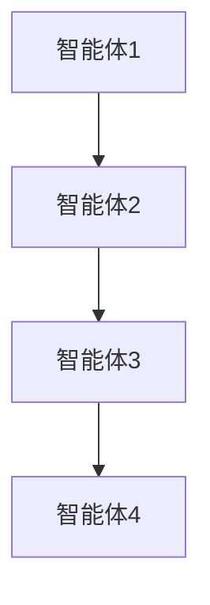
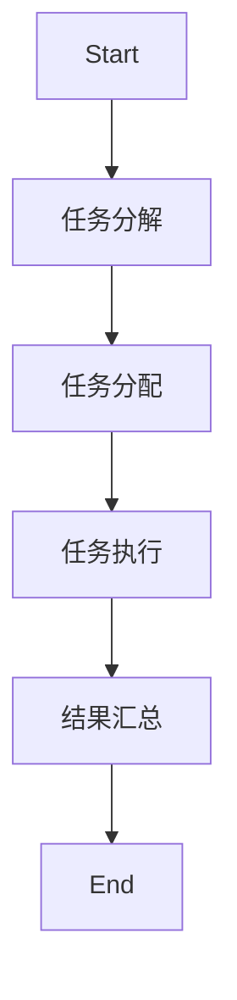
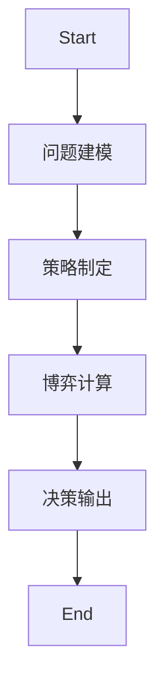
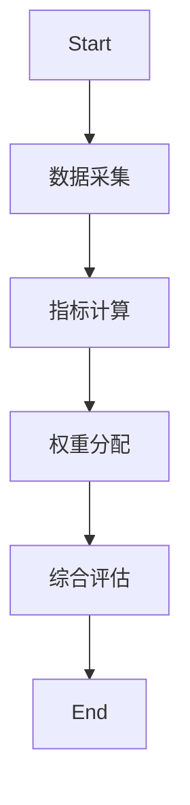
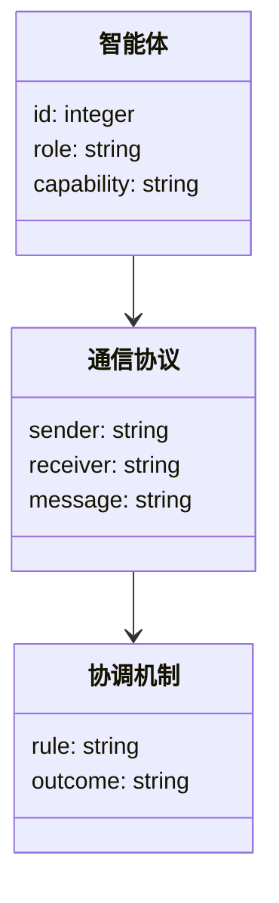
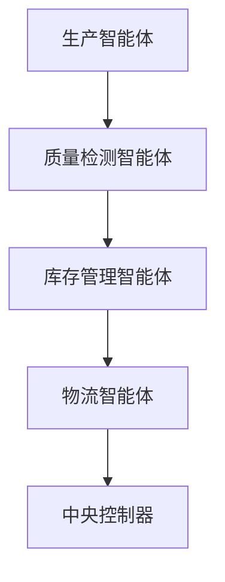
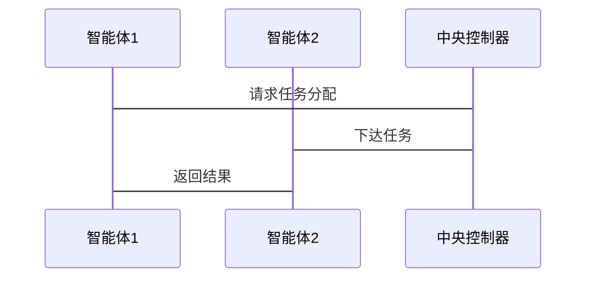

                 


# 多智能体系统在评估公司数字化转型能力中的应用

## 关键词：多智能体系统、数字化转型、企业能力评估、系统架构、算法原理

## 摘要：  
本文探讨了多智能体系统（MAS）在评估公司数字化转型能力中的应用。通过分析多智能体系统的理论基础、算法原理和系统架构，结合实际案例，本文展示了如何利用MAS来优化企业的数字化转型策略。文章详细介绍了多智能体系统的核心概念、系统架构设计、算法实现及其在实际项目中的应用，为企业的数字化转型提供了新的思路和方法。

---

# 第1章：数字化转型与多智能体系统概述

## 1.1 数字化转型的背景与挑战

### 1.1.1 数字化转型的定义与目标  
数字化转型是指通过技术手段（如大数据、人工智能、云计算等）对企业业务模式、流程、文化等进行全面改造，以提升企业的竞争力和适应性。其目标是实现业务的智能化、自动化和高效化。

### 1.1.2 数字化转型中的关键问题  
企业在数字化转型中常面临以下问题：  
1. 业务流程复杂，难以优化。  
2. 数据孤岛问题，数据无法有效整合。  
3. 传统系统与新技术的兼容性问题。  
4. 人才与技术的双重挑战。  

### 1.1.3 多智能体系统在数字化转型中的作用  
多智能体系统（MAS）通过多个智能体的协同工作，能够高效地解决上述问题。MAS能够在复杂环境中实现任务分解、协同决策和资源优化，为企业数字化转型提供技术支持。

## 1.2 多智能体系统的定义与特点

### 1.2.1 多智能体系统的定义  
多智能体系统是指由多个智能体组成的系统，这些智能体能够通过通信和协作完成复杂任务。

### 1.2.2 多智能体系统的分类与特点  
多智能体系统可以分为以下几类：  
1. **分布式 MAS**：智能体分布在不同的地理位置，通过网络通信协作。  
2. **集中式 MAS**：智能体通过中央控制器进行协调。  
3. **混合式 MAS**：结合分布式和集中式的特点。  

### 1.2.3 多智能体系统与单智能体系统的区别  
| 特性                | 单智能体系统          | 多智能体系统          |  
|---------------------|----------------------|----------------------|  
| 智能体数量          | 单个智能体          | 多个智能体          |  
| 通信方式          | 无通信或单向通信    | 支持双向通信        |  
| 任务处理方式      | 独立完成任务        | 协作完成任务        |  

---

# 第2章：多智能体系统的核心概念与联系

## 2.1 多智能体系统的基本原理

### 2.1.1 智能体的定义与特征  
智能体（Agent）是指具有感知环境、自主决策和执行任务能力的实体。其主要特征包括：  
1. **自主性**：智能体能够自主决策。  
2. **反应性**：能够根据环境变化调整行为。  
3. **社会性**：能够与其他智能体协作。  

### 2.1.2 多智能体系统中的通信与协调  
通信与协调是多智能体系统的核心机制，主要包括：  
1. **通信协议**：定义智能体之间的信息交换方式。  
2. **协调机制**：确保智能体协同工作，避免冲突。  

### 2.1.3 多智能体系统的组织与结构  
多智能体系统的组织结构可以分为以下几种：  
1. **层次结构**：智能体按层次分布，高层智能体协调低层智能体。  
2. **网状结构**：智能体之间直接通信，无明确层次划分。  

## 2.2 多智能体系统中的关键概念对比

### 2.2.1 智能体类型对比表  
| 类型         | 定义                           | 特点                           |  
|--------------|--------------------------------|--------------------------------|  
| 责任分担型   | 智能体根据职责分工协作       | 每个智能体负责特定任务         |  
| 基于角色型   | 智能体根据角色动态分配任务   | 角色可以根据任务需求变化       |  
| 基于能力型   | 智能体根据能力自动分配任务   | 自动识别智能体的能力           |  

### 2.2.2 通信协议对比图  


---

# 第3章：多智能体系统的算法原理

## 3.1 多智能体系统中的分布式计算

### 3.1.1 分布式计算的定义与特点  
分布式计算是指多个智能体在不同节点上协同完成任务的计算方式。其特点包括：  
1. **并行性**：任务可以并行执行。  
2. **容错性**：部分节点故障不影响整体任务。  

### 3.1.2 分布式计算的实现流程  


### 3.1.3 分布式计算的数学模型  
任务分解的数学模型可以表示为：  
$$ T = \sum_{i=1}^{n} t_i $$  
其中，\( T \) 表示总任务量，\( t_i \) 表示每个智能体的任务量。

---

## 3.2 多智能体系统的协调机制

### 3.2.1 协调机制的定义与分类  
协调机制是指智能体之间为完成共同目标而采取的协同方式。主要分类包括：  
1. **基于规则的协调**：通过预定义规则进行协调。  
2. **基于博弈论的协调**：通过模拟博弈过程实现最优决策。  

### 3.2.2 博弈论协调的实现流程  


### 3.2.3 博弈论协调的数学公式  
纳什均衡的定义公式为：  
$$ \text{策略组合} (s_1, s_2, ..., s_n) \text{ 是纳什均衡，当对于所有 } i, u_i(s_i, s_{-i}) \geq u_i(s'_i, s_{-i}) $$  

---

## 3.3 多智能体系统的评估能力算法

### 3.3.1 评估能力的算法原理  
评估能力的算法主要是通过智能体的性能指标（如响应时间、准确率等）进行综合评估。  

### 3.3.2 评估能力的实现流程  


### 3.3.3 评估能力的数学公式  
综合评估的公式可以表示为：  
$$ S = \sum_{i=1}^{m} w_i \cdot s_i $$  
其中，\( S \) 表示综合评分，\( w_i \) 表示指标 \( i \) 的权重，\( s_i \) 表示指标 \( i \) 的评分。

---

# 第4章：多智能体系统的系统分析与架构设计

## 4.1 系统分析

### 4.1.1 问题场景介绍  
本文以一家中型制造企业的数字化转型为例，分析其在生产流程优化中的应用。  

### 4.1.2 项目介绍  
项目目标：通过多智能体系统优化企业的生产流程，提升效率和产品质量。  

## 4.2 系统功能设计

### 4.2.1 领域模型设计  


### 4.2.2 系统架构设计  


### 4.2.3 系统接口设计  
系统接口主要包括：  
1. 智能体间的通信接口。  
2. 中央控制器的管理接口。  

### 4.2.4 系统交互流程  


---

## 4.3 系统实现

### 4.3.1 环境安装  
安装Python和相关库（如`numpy`、`pandas`、`matplotlib`）。  

### 4.3.2 核心实现代码  
```python
class Agent:
    def __init__(self, id, role):
        self.id = id
        self.role = role

    def communicate(self, other):
        # 模拟通信
        return f"{self.role}_{self.id}通信成功"
```

### 4.3.3 算法实现代码  
```python
import numpy as np

def nash_equilibrium(players, strategies):
    # 简单实现纳什均衡判断
    pass
```

---

# 第5章：项目实战

## 5.1 环境安装与配置

### 5.1.1 安装依赖  
安装所需的Python库和框架。  

### 5.1.2 配置开发环境  
配置IDE和开发工具。  

## 5.2 系统核心实现

### 5.2.1 智能体通信实现  
实现智能体之间的通信协议。  

### 5.2.2 协调机制实现  
实现基于规则的协调机制。  

## 5.3 系统测试与优化

### 5.3.1 功能测试  
测试各模块的功能是否正常。  

### 5.3.2 性能优化  
优化系统性能，提升处理效率。  

---

# 第6章：最佳实践与总结

## 6.1 最佳实践

### 6.1.1 系统设计中的注意事项  
- 明确智能体的职责和权限。  
- 确保通信协议的安全性和可靠性。  

### 6.1.2 项目实施中的注意事项  
- 分阶段实施，逐步优化。  
- 注重团队协作和知识共享。  

## 6.2 小结

### 6.2.1 多智能体系统的优势  
- 高效性：任务分解和并行处理。  
- 灵活性：适应复杂环境的变化。  

## 6.3 注意事项

### 6.3.1 系统维护  
定期更新智能体和通信协议。  

### 6.3.2 安全性  
确保系统免受网络攻击。  

## 6.4 拓展阅读

### 6.4.1 推荐书籍  
1. 《Multi-Agent Systems: Algorithmic, Complexity, and Reasoning》  
2. 《Enterprise Application Architecture》  

---

# 附录

## 附录A：术语表

- 多智能体系统（MAS）：由多个智能体组成的系统。  
- 智能体（Agent）：具有自主决策能力的实体。  
- 纳什均衡：博弈论中的一个概念，表示最优策略组合。  

## 附录B：参考文献

1. Russell, S., & Norvig, P. (2010). *Artificial Intelligence: A Modern Approach*.  
2. Wooldridge, M. (2002). *An Introduction to Multi-Agent Systems*.  

---

# 作者：AI天才研究院 & 禅与计算机程序设计艺术

