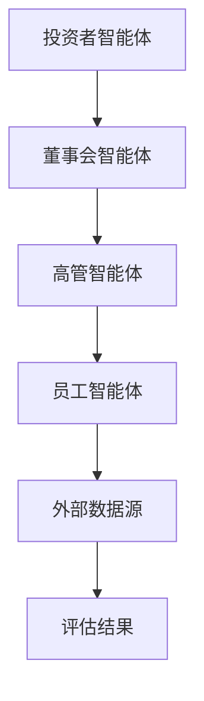
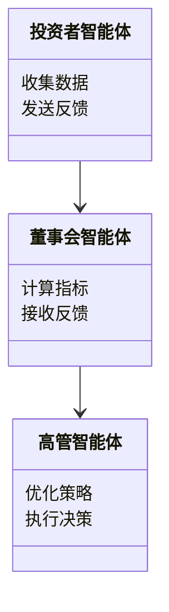

                 


# 多智能体系统在评估公司治理和ESG因素中的应用

## 关键词：多智能体系统、公司治理、ESG评估、分布式计算、多目标优化

## 摘要：  
随着全球对企业治理和可持续发展的关注日益增加，多智能体系统（Multi-Agent System, MAS）因其分布式计算、协作决策和自适应学习等特性，成为评估公司治理和ESG（环境、社会、治理）因素的重要工具。本文将从多智能体系统的概念出发，结合其在公司治理和ESG评估中的具体应用，详细探讨其技术原理、算法实现、系统架构以及实际案例，为读者提供全面的理论与实践指导。

---

## 第一部分：多智能体系统与公司治理概述

### 第1章：多智能体系统的基本概念

#### 1.1 多智能体系统的定义与特点

##### 1.1.1 多智能体系统的定义
多智能体系统（Multi-Agent System, MAS）是由多个智能体（Agent）组成的分布式系统，这些智能体通过通信、协作和协调完成复杂的任务。每个智能体都有自己的目标、知识和行为规则，能够感知环境并做出决策。

##### 1.1.2 多智能体系统的五大核心特点
1. **分布式性**：智能体分布在不同的位置，独立运行。
2. **协作性**：智能体之间通过协作完成共同目标。
3. **自主性**：每个智能体能够自主决策，无需外部干预。
4. **动态性**：环境和任务可能动态变化，系统需具备适应性。
5. **复杂性**：多个智能体的交互可能导致系统复杂性增加。

##### 1.1.3 多智能体系统与传统单智能体系统的区别
| 属性         | 单智能体系统                     | 多智能体系统                     |
|--------------|----------------------------------|----------------------------------|
| 决策方式     | 单点决策                        | 分布式决策                      |
| 信息处理     | 中央化                          | 分布式                          |
| 系统复杂性   | 较低                            | 较高                            |
| 应用场景     | 简单任务                        | 复杂任务                        |

---

#### 1.2 公司治理的基本概念

##### 1.2.1 公司治理的定义与内涵
公司治理是指通过公司章程、制度和机制，确保公司有效运作、合规经营和利益相关者权益得到保护的管理过程。其核心目标是实现公司价值最大化和风险最小化。

##### 1.2.2 公司治理的三大核心要素
1. **股权结构**：股东的权益分配和权力结构。
2. **董事会与高管**：董事会的组成和职责，高管的决策和执行能力。
3. **内部控制与合规**：公司内部的监督机制和合规流程。

##### 1.2.3 公司治理与企业绩效的关系
公司治理的优劣直接影响企业绩效。良好的治理能够提升企业透明度、降低风险，进而增强投资者信心和企业价值。

---

#### 1.3 ESG因素的基本概念

##### 1.3.1 ESG的定义与内涵
ESG（Environmental, Social, Governance）是衡量企业环境表现、社会责任和公司治理的重要指标。它不仅关注企业的财务表现，还关注其对环境、社会和治理的影响。

##### 1.3.2 ESG的三大核心维度
1. **环境（E）**：企业的碳排放、资源利用效率和环保措施。
2. **社会（S）**：企业的社会责任、员工权益和社区贡献。
3. **治理（G）**：企业的合规性、董事会结构和管理层透明度。

##### 1.3.3 ESG与企业可持续发展的关系
ESG是企业可持续发展的关键指标，能够帮助企业在长期发展中实现经济、社会和环境的平衡。

---

### 第2章：多智能体系统在公司治理中的应用背景

#### 2.1 当前公司治理面临的挑战

##### 2.1.1 传统公司治理的局限性
传统公司治理依赖于中心化的决策机制，容易受到信息不对称、利益冲突和权力滥用的影响。

##### 2.1.2 数字化转型对治理能力的要求
随着企业数字化转型的推进，公司治理需要更加智能化、数据化和分布式，以应对复杂多变的市场环境。

##### 2.1.3 多智能体系统在治理中的潜在价值
多智能体系统能够通过分布式计算和协作决策，提升公司治理的透明度和效率，同时降低人为干预带来的风险。

---

## 第二部分：多智能体系统与ESG评估的结合

### 第3章：多智能体系统在ESG评估中的应用

#### 3.1 多智能体系统在ESG评估中的优势

##### 3.1.1 分布式计算能力
多智能体系统能够从多个数据源获取信息，进行分布式计算和分析，避免单点故障。

##### 3.1.2 多目标优化能力
ESG评估涉及多个维度的优化，多智能体系统能够通过协商和协作实现多目标优化。

##### 3.1.3 自适应学习能力
多智能体系统能够根据环境变化自适应调整评估策略，提升评估的动态性和准确性。

---

#### 3.2 多智能体系统在ESG评估中的应用场景

##### 3.2.1 数据采集与处理
多智能体系统可以从不同渠道（如企业报告、新闻媒体、社交媒体）采集ESG相关数据，并通过分布式计算进行清洗和预处理。

##### 3.2.2 指标计算与权重分配
通过多智能体协作，系统可以计算不同ESG指标的权重，并根据企业实际情况动态调整评估标准。

##### 3.2.3 结果分析与反馈优化
多智能体系统能够对评估结果进行分析，并根据反馈优化评估模型，提升评估的准确性和实用性。

---

### 第4章：多智能体系统在公司治理中的实际案例

#### 4.1 多智能体系统在某企业ESG评估中的应用

##### 4.1.1 系统架构设计
使用Mermaid绘制系统架构图，展示各个智能体的职责和交互流程。



##### 4.1.2 系统功能实现
通过Python代码实现多智能体系统的核心功能，包括数据采集、指标计算和结果反馈。

```python
class Agent:
    def __init__(self, role):
        self.role = role
        self.data = {}

    def collect_data(self):
        pass

    def compute_indicator(self):
        pass

    def send_feedback(self):
        pass

class ESG_Evaluator(Agent):
    def __init__(self, role):
        super().__init__(role)
        self.weights = {}

    def compute_indicator(self):
        for metric in self.data:
            self.weights[metric] = self.data[metric] * 0.3 + ...  # 示例计算

    def send_feedback(self):
        # 将评估结果发送给投资者智能体
        pass

# 示例实现
investor_agent = InvestorAgent("investor")
board_agent = BoardAgent("board")
executive_agent = ExecutiveAgent("executive")

investor_agent.collect_data()
board_agent.compute_indicator()
executive_agent.send_feedback()
```

---

## 第三部分：多智能体系统的算法原理与实现

### 第5章：多智能体系统的算法原理

#### 5.1 分布式计算算法

##### 5.1.1 分布式计算的核心思想
分布式计算通过将任务分解为多个子任务，分配给不同的智能体执行，最终汇总结果。

##### 5.1.2 分布式计算的实现步骤
1. **任务分解**：将问题分解为多个子任务。
2. **任务分配**：将子任务分配给不同的智能体。
3. **子任务执行**：每个智能体独立执行分配的任务。
4. **结果汇总**：将所有子任务的结果汇总，得到最终结果。

##### 5.1.3 分布式计算的优缺点
| 优点         | 缺点         |
|--------------|--------------|
| 高效性       | 复杂性       |
| 可扩展性     | 依赖性       |

---

#### 5.2 协商与决策算法

##### 5.2.1 协商算法的核心思想
协商算法通过智能体之间的通信和协商，达成一致的决策。

##### 5.2.2 协商算法的实现步骤
1. **初始化**：设置智能体的初始状态和目标。
2. **通信**：智能体之间交换信息，协商达成一致。
3. **决策**：基于协商结果，做出决策。
4. **执行**：将决策结果执行。

##### 5.2.3 协商算法的数学模型
$$
\text{协商结果} = \argmax_{x} \sum_{i=1}^{n} w_i x_i
$$
其中，\(w_i\) 是智能体 \(i\) 的权重，\(x_i\) 是智能体 \(i\) 的偏好。

---

## 第四部分：系统架构设计与实现

### 第6章：系统架构设计

#### 6.1 问题场景介绍
本系统旨在通过多智能体技术，实现对公司治理和ESG因素的智能化评估。

#### 6.2 系统功能设计

##### 6.2.1 领域模型设计
使用Mermaid类图展示系统中各智能体的职责和交互关系。



---

## 结语

通过多智能体系统的应用，公司治理和ESG评估的效率和准确性得到了显著提升。未来，随着技术的不断发展，多智能体系统将在企业治理和可持续发展领域发挥更大的作用。

---

## 作者信息

作者：AI天才研究院/AI Genius Institute  
邮箱：info@ait Genius.com  
网址：https://www.zhihu.com/columns/

