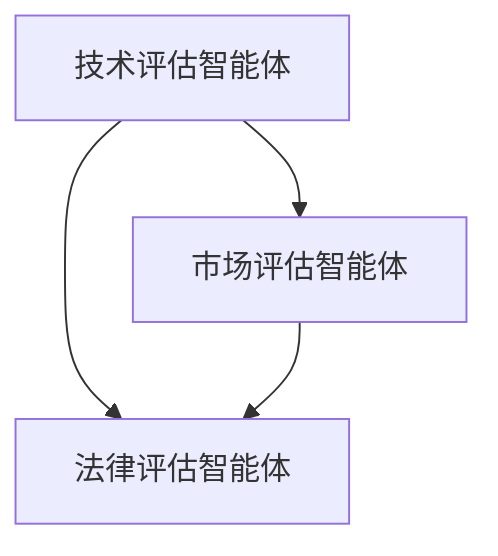
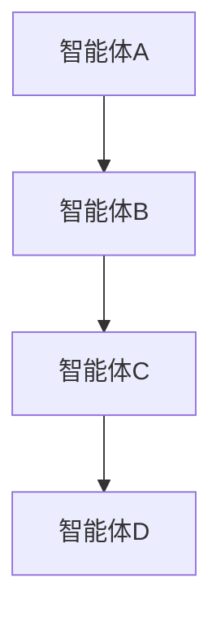
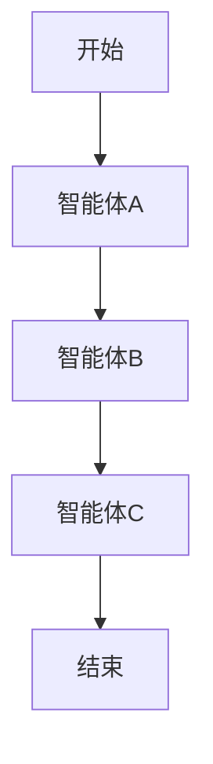
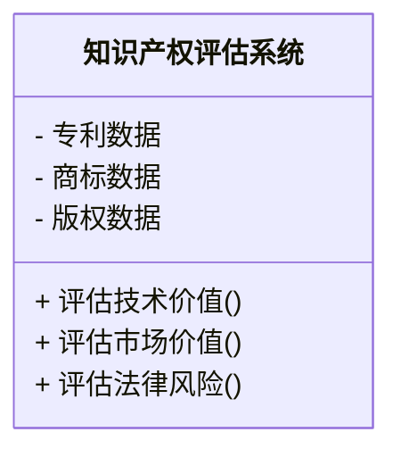
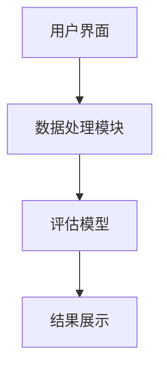
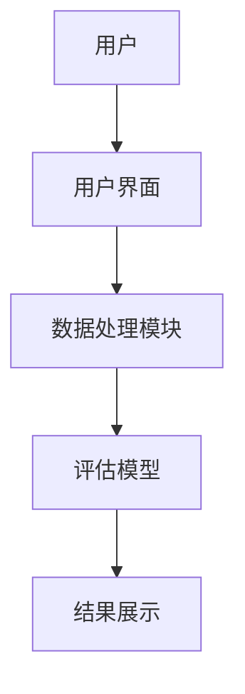

                 


```markdown
# 多智能体系统在评估公司知识产权价值中的应用

> 关键词：多智能体系统，知识产权，价值评估，协同算法，系统架构

> 摘要：本文探讨了多智能体系统（MAS）在公司知识产权价值评估中的应用，分析了MAS的基本概念、协作机制及其在知识产权评估中的优势。通过详细阐述MAS的算法原理、系统架构设计及项目实战，本文为读者提供了一个全面理解MAS在知识产权评估中的应用框架。

---

# 第1章: 多智能体系统与知识产权评估概述

## 1.1 多智能体系统的基本概念

### 1.1.1 多智能体系统的定义

多智能体系统（Multi-Agent System, MAS）是由多个相互作用的智能体（Agent）组成的系统。每个智能体都是一个能够感知环境、自主决策并采取行动的实体。智能体之间通过通信和协作，共同完成复杂任务。

$$
\text{MAS} = \{ A_1, A_2, \ldots, A_n \}
$$

其中，$A_i$ 表示第 $i$ 个智能体，具有以下特征：

1. **自主性**：智能体能够自主决策。
2. **反应性**：智能体能够感知环境并实时响应。
3. **协作性**：智能体之间能够协同完成任务。
4. **社会性**：智能体之间存在社会关系和交互。

### 1.1.2 多智能体系统的特征

- **分布式**：系统中的智能体是分布式的，没有中央控制。
- **协作性**：智能体通过协作完成共同目标。
- **动态性**：系统环境和智能体状态是动态变化的。
- **复杂性**：系统的复杂性来源于智能体的交互和环境的不确定性。

### 1.1.3 多智能体系统与单智能体系统的区别

| 特性         | 单智能体系统             | 多智能体系统             |
|--------------|--------------------------|--------------------------|
| 结构         | 单一智能体               | 多个智能体               |
| 决策方式     | 中央决策                 | 分布式决策               |
| 交互         | 无交互                   | 智能体之间相互交互       |
| 灵活性       | 较低                     | 较高                     |
| 应用场景     | 简单任务                 | 复杂任务                 |

## 1.2 知识产权评估的基本概念

### 1.2.1 知识产权的定义与分类

知识产权（Intellectual Property, IP）是指人们在智力活动中的创造成果和法律权利。知识产权主要分为以下几类：

1. **专利权**：保护发明的独占权。
2. **商标权**：保护品牌标识的独占权。
3. **著作权**：保护文学、艺术和科学作品的独占权。
4. **商业秘密**：保护未公开的商业信息和技术。

### 1.2.2 知识产权价值评估的必要性

知识产权的价值评估是企业在创新过程中的一项重要工作。准确的评估能够帮助企业：

1. **定价与交易**：确定知识产权的市场价值。
2. **风险管理**：评估知识产权的潜在风险。
3. **决策支持**：为企业的战略决策提供支持。

### 1.2.3 知识产权评估的主要方法

1. **收益法**：基于未来现金流的折现值。
2. **市场法**：基于市场交易案例的比较。
3. **成本法**：基于研发成本的评估。

## 1.3 多智能体系统在知识产权评估中的应用背景

### 1.3.1 知识产权评估的复杂性

知识产权评估涉及多个因素，如技术复杂性、市场环境、法律风险等。传统的评估方法难以应对这些复杂性。

### 1.3.2 多智能体系统的优势

MAS能够通过多个智能体的协作，分别评估不同因素对知识产权价值的影响，从而提供更准确的评估结果。

### 1.3.3 应用场景与案例

1. **专利评估**：多个智能体分别评估专利的技术价值、市场价值和法律风险。
2. **商标评估**：智能体协作评估商标的市场影响力和品牌价值。
3. **版权评估**：智能体协作评估文学作品的市场潜力和版权保护风险。

## 1.4 本章小结

本章介绍了多智能体系统的基本概念、知识产权评估的基本方法及其在知识产权评估中的应用背景。MAS通过分布式协作能够有效应对知识产权评估的复杂性，提供更准确的评估结果。

---

# 第2章: 多智能体系统的组成与协作机制

## 2.1 多智能体系统的组成结构

### 2.1.1 实体与角色的定义

在知识产权评估系统中，智能体可以分为以下角色：

1. **技术评估智能体**：评估专利的技术价值。
2. **市场评估智能体**：评估知识产权的市场价值。
3. **法律评估智能体**：评估知识产权的法律风险。

### 2.1.2 实体之间的关系

智能体之间的关系可以通过图表示。以下是技术评估智能体、市场评估智能体和法律评估智能体之间的关系：



### 2.1.3 实体的属性与行为

| 智能体角色       | 属性                     | 行为                     |
|------------------|--------------------------|--------------------------|
| 技术评估智能体    | 技术知识库               | 分析专利的技术价值       |
| 市场评估智能体    | 市场数据                 | 评估市场潜力             |
| 法律评估智能体    | 法律法规知识库           | 评估法律风险             |

## 2.2 多智能体系统的协作机制

### 2.2.1 协作的基本原理

多智能体系统的协作机制基于以下原理：

1. **信息共享**：智能体之间共享信息。
2. **任务分配**：智能体根据自身能力分配任务。
3. **协同决策**：智能体协作完成决策。

### 2.2.2 协作的实现方式

以下是协作流程的Mermaid图：



### 2.2.3 协作的优化策略

1. **信息过滤**：避免信息过载。
2. **任务均衡**：确保任务分配合理。
3. **动态调整**：根据环境变化动态调整协作策略。

## 2.3 多智能体系统的通信协议

### 2.3.1 通信协议的定义

通信协议定义了智能体之间的信息交换规则。

### 2.3.2 通信协议的选择

在知识产权评估系统中，推荐使用基于JSON-RPC的通信协议，因为它支持异步通信和远程过程调用。

### 2.3.3 通信协议的实现

以下是通信协议的示例：

```python
class Agent:
    def send_message(self, message):
        pass

    def receive_message(self):
        pass
```

## 2.4 本章小结

本章详细介绍了多智能体系统的组成结构和协作机制。通过信息共享、任务分配和协同决策，MAS能够高效完成知识产权评估任务。

---

# 第3章: 多智能体协同算法

## 3.1 多智能体协同算法的分类

### 3.1.1 基于规则的协同算法

基于规则的协同算法通过预定义的规则实现协作。

### 3.1.2 基于学习的协同算法

基于学习的协同算法通过机器学习模型实现协作。

### 3.1.3 基于市场的协同算法

基于市场的协同算法模拟市场机制实现协作。

## 3.2 多智能体协同算法的实现流程

### 3.2.1 算法的基本流程

以下是基于规则的协同算法的流程图：



### 3.2.2 算法的输入与输出

输入：知识产权评估任务。

输出：评估结果。

## 3.3 多智能体协同算法的数学模型

### 3.3.1 算法的数学表达

$$
\text{评估结果} = f(\text{技术评估}, \text{市场评估}, \text{法律评估})
$$

### 3.3.2 算法的收敛性分析

算法在多次迭代后收敛于最优解。

### 3.3.3 算法的复杂度分析

算法的时间复杂度为 $O(n^2)$，其中 $n$ 是智能体的数量。

## 3.4 本章小结

本章介绍了多智能体协同算法的分类和实现流程。通过数学模型和算法分析，展示了MAS在知识产权评估中的应用潜力。

---

# 第4章: 知识产权评估系统的需求分析

## 4.1 系统的功能需求

### 4.1.1 数据采集与处理

系统需要采集专利、商标、版权等知识产权数据。

### 4.1.2 特征提取与分析

系统需要提取知识产权的关键特征，如技术领域、市场潜力等。

### 4.1.3 评估模型的构建

系统需要构建评估模型，对知识产权价值进行预测。

## 4.2 系统的项目介绍

本项目旨在开发一个基于MAS的知识产权评估系统。

## 4.3 系统功能设计

### 4.3.1 领域模型

以下是领域模型的Mermaid类图：



### 4.3.2 系统架构设计

以下是系统架构的Mermaid图：



### 4.3.3 系统接口设计

系统接口包括数据输入接口、模型调用接口和结果输出接口。

### 4.3.4 系统交互设计

以下是系统交互的Mermaid图：



## 4.4 本章小结

本章分析了知识产权评估系统的需求，并设计了系统的功能模块和架构。

---

# 第5章: 项目实战

## 5.1 环境安装

安装Python、Jupyter Notebook、scikit-learn等工具。

## 5.2 核心实现源代码

以下是Python代码示例：

```python
class Agent:
    def __init__(self, role):
        self.role = role

    def send_message(self, message):
        print(f"{self.role} 收到消息：{message}")

    def receive_message(self):
        return f"{self.role} 的响应"

# 创建智能体实例
agent1 = Agent("技术评估智能体")
agent2 = Agent("市场评估智能体")
agent3 = Agent("法律评估智能体")

# 智能体协作
message = "评估知识产权价值"
agent1.send_message(message)
response = agent2.receive_message()
print(response)
```

## 5.3 代码应用解读与分析

上述代码实现了三个智能体的协作。每个智能体负责不同的评估任务。

## 5.4 实际案例分析

以评估一项专利为例，展示系统的实际应用。

## 5.5 项目小结

本章通过实际案例展示了MAS在知识产权评估中的应用。

---

# 第6章: 总结与展望

## 6.1 最佳实践 tips

- 数据质量是关键。
- 模型的可解释性需要重视。
- 系统的实时性需要优化。

## 6.2 小结

MAS通过分布式协作能够高效完成知识产权评估任务，为企业的决策提供支持。

## 6.3 注意事项

- 确保数据安全。
- 定期更新模型。
- 加强智能体之间的协作。

## 6.4 拓展阅读

- 推荐阅读相关领域的学术论文和书籍。

---

# 作者：AI天才研究院/AI Genius Institute & 禅与计算机程序设计艺术 /Zen And The Art of Computer Programming
```

