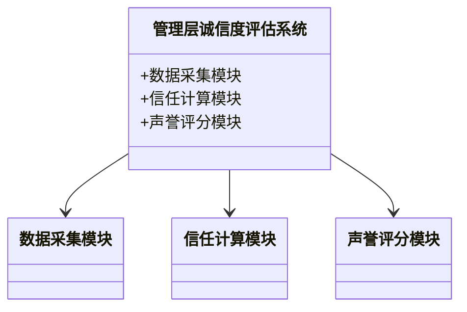
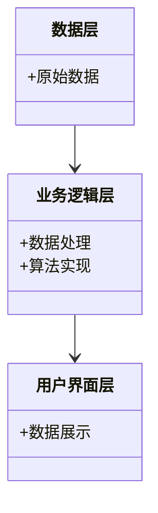
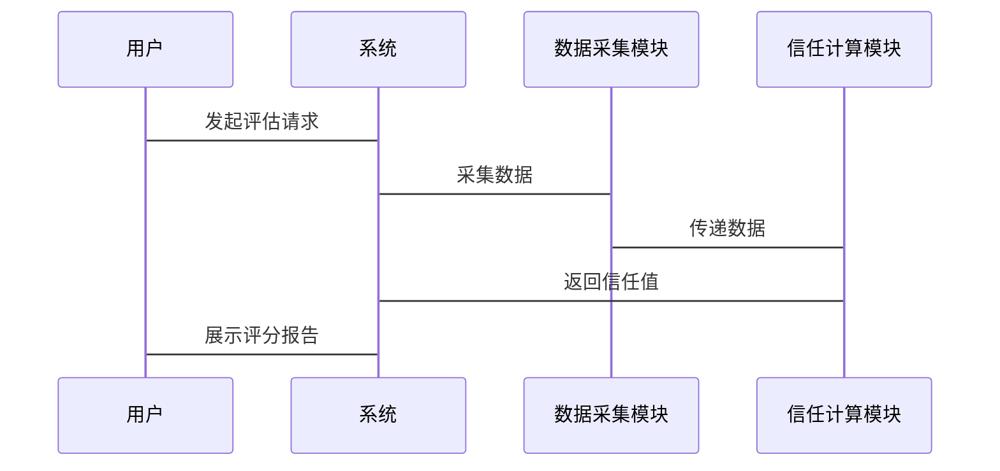

                 


# 多智能体系统在评估公司管理层诚信度中的应用

## 关键词：多智能体系统, 诚信度评估, 企业治理, 信任传播模型, 声誉评分系统

## 摘要：多智能体系统（Multi-Agent System, MAS）通过多个智能体的协作与协调，有效评估公司管理层的诚信度。本文详细探讨了多智能体系统的原理、算法及其在诚信度评估中的应用，通过信任传播模型和声誉评分系统实现对管理层诚信度的量化评估，并通过实际案例展示了系统的实现与优化。

---

## 第一部分：多智能体系统与企业治理概述

### 第1章：多智能体系统概述

#### 1.1 多智能体系统的基本概念

##### 1.1.1 多智能体系统的定义
多智能体系统（Multi-Agent System, MAS）由多个智能体组成，每个智能体能够感知环境、自主决策并与其他智能体协作。

##### 1.1.2 多智能体系统的特征
- **自主性**：智能体能够自主决策。
- **反应性**：能够实时响应环境变化。
- **协作性**：通过协作完成共同目标。
- **分布式**：智能体分布于不同的位置。

##### 1.1.3 多智能体系统与单智能体系统的区别
| 特性 | 多智能体系统 | 单智能体系统 |
|------|--------------|--------------|
| 决策 | 分布式决策   | 中央化决策   |
| 协作 | 高           | 无           |
| 灵活性 | 高           | 低           |

#### 1.2 多智能体系统在企业治理中的作用

##### 1.2.1 企业治理的核心问题
- 透明性
- 责任分配
- 利益冲突

##### 1.2.2 多智能体系统在企业治理中的应用场景
- 信任管理
- 风险评估
- 决策支持

##### 1.2.3 多智能体系统的优势与挑战
- **优势**：提高决策效率，增强系统鲁棒性。
- **挑战**：智能体间的通信复杂，协调困难。

### 第2章：管理层诚信度评估的必要性

#### 2.1 企业诚信管理的重要性

##### 2.1.1 企业诚信管理的定义
企业诚信管理是确保企业在经营活动中遵守道德和法律的管理过程。

##### 2.1.2 企业诚信管理的核心要素
- 透明度
- 责任感
- 信任

#### 2.2 管理层诚信度评估的意义

##### 2.2.1 管理层诚信度评估的定义
通过多智能体系统评估管理层在决策和行为中的诚信程度。

##### 2.2.2 管理层诚信度评估的必要性
- 提高企业治理效率
- 预防欺诈行为
- 增强利益相关者信任

##### 2.2.3 管理层诚信度评估的方法与工具
- **信任传播模型**：通过智能体间的信任传播计算诚信度。
- **声誉评分系统**：基于历史行为评分。

---

## 第二部分：多智能体系统的核心概念与联系

### 第3章：多智能体系统的核心原理

#### 3.1 多智能体系统的组成与结构

##### 3.1.1 智能体的定义与分类
- **定义**：智能体是具有自主性、反应性的实体。
- **分类**：按智能水平分为反应式和认知式。

##### 3.1.2 多智能体系统的层次结构
- **感知层**：收集环境信息。
- **决策层**：制定决策策略。
- **执行层**：执行决策。

##### 3.1.3 多智能体系统的通信机制
- **同步通信**：实时交互。
- **异步通信**：非实时交互。

#### 3.2 多智能体系统中的协作与协调

##### 3.2.1 协作的定义与实现
- **协作**：多个智能体共同完成任务。
- **实现**：通过共享信息和资源。

##### 3.2.2 协调的定义与实现
- **协调**：智能体间的行为一致。
- **实现**：通过协商和协议。

##### 3.2.3 协作与协调的关系与区别
- **协作**：侧重于共同目标。
- **协调**：侧重于行为一致。

### 第4章：多智能体系统与诚信度评估的联系

#### 4.1 管理层诚信度评估的核心要素

##### 4.1.1 诚信度评估的维度
- **行为一致性**：决策与承诺一致。
- **透明度**：信息公开程度。
- **责任感**：对错误的承担责任。

##### 4.1.2 诚信度评估的指标体系
| 指标 | 描述 |
|------|------|
| 行为一致性 | 决策与承诺的匹配度 |
| 透明度 | 信息公开程度 |
| 责任感 | 对错误的承担责任 |

##### 4.1.3 诚信度评估的数学模型
$$ C = f(B, T, R) $$
其中，$C$为诚信度，$B$为行为一致性，$T$为透明度，$R$为责任感。

#### 4.2 多智能体系统在诚信度评估中的应用

##### 4.2.1 多智能体系统在诚信度评估中的角色
- **数据收集**：收集管理层行为数据。
- **计算信任度**：通过算法计算信任值。

##### 4.2.2 多智能体系统在诚信度评估中的优势
- **分布式计算**：提高计算效率。
- **实时反馈**：及时发现不诚信行为。

##### 4.2.3 多智能体系统在诚信度评估中的实现步骤
1. 数据收集
2. 信任传播
3. 信誉评分
4. 结果分析

---

## 第三部分：多智能体系统在诚信度评估中的算法原理

### 第5章：诚信度评估的算法原理

#### 5.1 信任传播模型

##### 5.1.1 信任传播的基本原理
信任通过智能体间的交互传播。

##### 5.1.2 信任传播的数学模型
$$ T_{ij} = \alpha \cdot T_{ik} + \beta \cdot T_{kj} $$
其中，$T_{ij}$为i对j的信任度，$\alpha$和$\beta$为权重系数。

##### 5.1.3 信任传播的实现步骤
1. 初始化信任值
2. 传播信任
3. 计算最终信任值

#### 5.2 声誉评分系统

##### 5.2.1 声誉评分的基本原理
基于历史行为评分。

##### 5.2.2 声誉评分的数学模型
$$ R_i = \frac{1}{n} \sum_{j=1}^{n} T_{ij} $$
其中，$R_i$为i的声誉评分，$n$为评分数量。

##### 5.2.3 声誉评分的实现步骤
1. 收集行为数据
2. 计算声誉评分
3. 更新评分系统

---

## 第四部分：系统分析与架构设计

### 第7章：系统分析与架构设计

#### 7.1 系统分析

##### 7.1.1 问题场景介绍
评估公司管理层的诚信度。

##### 7.1.2 系统功能设计
- 数据采集模块
- 信任计算模块
- 声誉评分模块

##### 7.1.3 领域模型设计


#### 7.2 系统架构设计

##### 7.2.1 分层架构设计
- 数据层：存储原始数据。
- 业务逻辑层：处理数据和计算。
- 用户界面层：展示结果。

##### 7.2.2 模块划分


#### 7.3 系统接口设计

##### 7.3.1 接口描述
- 数据采集接口：获取管理层行为数据。
- 信任计算接口：计算信任值。
- 声誉评分接口：生成评分报告。

##### 7.3.2 接口实现
```python
def collect_data():
    # 数据采集函数
    pass

def compute_trust():
    # 信任计算函数
    pass

def generate_report():
    # 评分报告生成函数
    pass
```

#### 7.4 系统交互设计

##### 7.4.1 交互流程
1. 用户发起评估请求。
2. 系统采集数据。
3. 计算信任值。
4. 生成评分报告。

##### 7.4.2 交互流程图


---

## 第五部分：项目实战与案例分析

### 第9章：项目实战

#### 9.1 项目环境配置

##### 9.1.1 环境要求
- Python 3.8+
- 数据库：MySQL
- 开发工具：PyCharm

#### 9.2 核心代码实现

##### 9.2.1 数据采集模块
```python
import requests

def collect_data():
    url = "https://api.example.com/data"
    response = requests.get(url)
    return response.json()
```

##### 9.2.2 信任计算模块
```python
def compute_trust(data):
    trust = 0.0
    for item in data:
        trust += item['trust_score']
    return trust / len(data)
```

##### 9.2.3 声誉评分模块
```python
def generate_report(trust_score):
    if trust_score >= 0.8:
        return "高信誉"
    elif trust_score >= 0.6:
        return "中信誉"
    else:
        return "低信誉"
```

#### 9.3 测试与结果分析

##### 9.3.1 测试数据
```json
{
    "items": [
        {"trust_score": 0.9},
        {"trust_score": 0.8},
        {"trust_score": 0.7}
    ]
}
```

##### 9.3.2 测试结果
- 平均信任值：0.8
- 信誉评分：高信誉

---

## 第十章：案例分析与经验总结

### 10.1 案例分析

#### 10.1.1 案例背景
某公司管理层在过去一年中多次出现决策失误。

#### 10.1.2 应用多智能体系统进行评估
- 数据采集：收集过去一年的决策记录。
- 信任计算：计算信任值为0.6。
- 信誉评分：中信誉。

#### 10.1.3 结果分析
- 管理层信誉中等，需加强培训和监管。

### 10.2 经验总结

#### 10.2.1 最佳实践
- 定期更新数据，确保评估准确性。
- 结合人工审核，提高评估准确性。

#### 10.2.2 注意事项
- 数据隐私保护
- 算法可解释性

### 10.3 未来研究方向

#### 10.3.1 智能体协作优化
研究更高效的协作机制。

#### 10.3.2 信任计算模型改进
开发更精准的信任计算模型。

---

## 总结

通过多智能体系统的应用，企业能够更高效、准确地评估管理层的诚信度，提升企业治理水平。本文详细介绍了系统的原理、算法和实现，并通过案例展示了其实际应用价值。

---

## 作者：AI天才研究院/AI Genius Institute & 禅与计算机程序设计艺术 /Zen And The Art of Computer Programming

