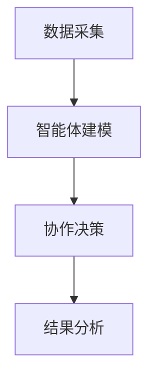
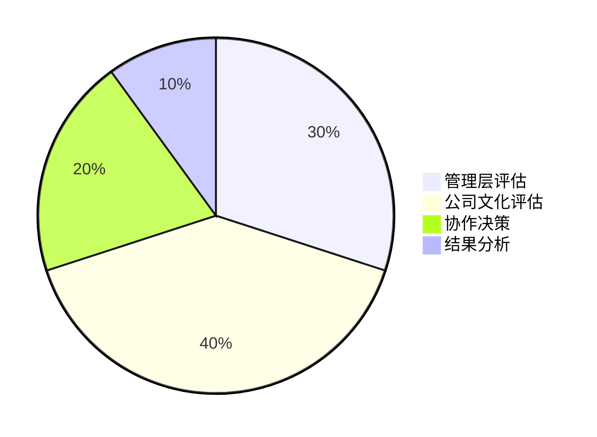

                 


# 多智能体系统在评估管理层质量和公司文化中的应用

> 关键词：多智能体系统，管理层评估，公司文化，分布式计算，组织行为建模，决策支持

> 摘要：本文探讨了多智能体系统（MAS）在评估管理层质量和公司文化中的应用。通过分析多智能体系统的核心原理、算法设计、系统架构和实际案例，本文展示了如何利用MAS技术实现对管理层能力和公司文化的智能化评估。文章从背景介绍、核心概念、算法原理到系统设计和项目实战，逐步深入，为读者提供了全面的视角。

---

## 第1章: 多智能体系统概述

### 1.1 多智能体系统的定义与特点

#### 1.1.1 多智能体系统的定义
多智能体系统（Multi-Agent System，MAS）是由多个智能体（Agent）组成的分布式系统，这些智能体能够通过协作完成复杂的任务。每个智能体都是一个独立的实体，具有感知环境、自主决策和行动的能力。

#### 1.1.2 多智能体系统的核心特点
- **自主性**：每个智能体能够独立决策和行动。
- **反应性**：智能体能够实时感知环境并做出反应。
- **协作性**：智能体之间可以通过通信和协作完成共同目标。
- **分布性**：系统中的智能体分布在不同的位置，具有分布式计算的特点。

#### 1.1.3 多智能体系统与传统单智能体系统的区别
传统的单智能体系统依赖于中心化的决策机制，而多智能体系统通过去中心化的协作实现任务目标。MAS能够处理复杂、动态的环境，适合应用于需要分布式计算和协作的场景。

### 1.2 多智能体系统的应用场景

#### 1.2.1 分布式计算与协作
MAS在分布式计算中的应用广泛，例如分布式任务分配、资源调度和协作优化。

#### 1.2.2 组织行为模拟
MAS可以模拟组织中的行为模式，例如员工协作、领导决策等。

#### 1.2.3 管理决策支持
通过MAS，管理者可以进行实时决策支持，优化资源配置和战略规划。

---

## 第2章: 管理层质量与公司文化评估的背景

### 2.1 管理层质量评估的挑战

#### 2.1.1 传统评估方法的局限性
传统的管理层评估方法依赖于主观判断，存在数据不足、难以量化等问题。

#### 2.1.2 数据驱动评估的优势
数据驱动的评估方法可以通过收集和分析大量数据，提供客观、量化的评估结果。

#### 2.1.3 多智能体系统在评估中的潜在价值
MAS可以通过模拟和建模，提供动态、实时的评估结果，帮助管理者更好地理解管理层的行为和能力。

### 2.2 公司文化评估的核心要素

#### 2.2.1 公司文化的定义与分类
公司文化是指组织中共享的价值观、信念和行为方式。常见的分类包括以结果为导向、以过程为导向等。

#### 2.2.2 公司文化对组织绩效的影响
公司文化可以直接影响员工的士气、创造力和团队合作，从而影响组织的绩效。

#### 2.2.3 文化评估的关键指标
文化评估的关键指标包括员工满意度、创新性、协作性等。

---

## 第3章: 多智能体系统在管理评估中的应用潜力

### 3.1 多智能体系统在管理层评估中的优势

#### 3.1.1 分布式决策模拟
MAS可以模拟管理层在不同情境下的决策过程，帮助评估其能力。

#### 3.1.2 多维度数据整合
MAS可以整合来自不同来源的数据，提供全面的评估结果。

#### 3.1.3 动态行为建模
MAS可以建模管理层的动态行为，捕捉其在复杂环境中的反应和决策。

### 3.2 多智能体系统在公司文化评估中的创新

#### 3.2.1 文化传播与影响建模
MAS可以模拟文化在组织中的传播和影响过程，帮助管理者更好地理解文化动态。

#### 3.2.2 组织行为的实时反馈
MAS可以通过实时数据分析，提供组织行为的反馈，帮助管理者调整文化管理策略。

#### 3.2.3 文化演变的预测分析
MAS可以预测文化在不同情境下的演变趋势，为组织的长期发展提供支持。

---

## 第4章: 多智能体系统的核心原理

### 4.1 多智能体系统的通信与协作

#### 4.1.1 智能体间通信机制
智能体之间的通信可以通过消息传递或共享数据库实现。

#### 4.1.2 协作任务分配算法
协作任务分配算法包括基于优先级的分配和基于资源约束的分配。

#### 4.1.3 冲突解决策略
冲突解决策略包括协商、仲裁和妥协等方法。

### 4.2 多智能体系统的决策机制

#### 4.2.1 分布式决策模型
分布式决策模型包括基于本地信息的决策和基于全局信息的决策。

#### 4.2.2 协作决策算法
协作决策算法包括投票机制、协商机制和共识算法。

#### 4.2.3 动态调整策略
动态调整策略包括基于反馈的调整和基于预测的调整。

---

## 第5章: 算法原理与实现

### 5.1 基于多智能体的决策算法

#### 5.1.1 分布式任务分配算法
分布式任务分配算法的伪代码如下：

```python
def distributed_task_allocation(agents, tasks):
    for agent in agents:
        agent.request = receive_task(tasks)
        agent.state = allocate_task(request)
    return agents' states
```

#### 5.1.2 协作决策算法
协作决策算法的伪代码如下：

```python
def collaborative_decision(agents, problem):
    for agent in agents:
        agent.proposal = propose_solution(problem)
        agent.vote = vote(proposal)
    consensus = reach_consensus(proposals, votes)
    return consensus
```

### 5.2 公司文化评估的数学模型

#### 5.2.1 基于MAS的文化传播模型
文化传播模型的数学表达式为：

$$ C(t+1) = C(t) + \sum_{i=1}^{n} (I_i \cdot I_i') $$

其中，$C(t)$ 表示时间 $t$ 时的文化程度，$I_i$ 表示第 $i$ 个智能体的影响程度。

#### 5.2.2 基于博弈论的文化评估模型
博弈论模型的数学表达式为：

$$ V = \max_{i} \sum_{j} \alpha_{ij} \cdot s_j $$

其中，$V$ 表示文化价值，$\alpha_{ij}$ 表示第 $i$ 个智能体对第 $j$ 个文化的权重，$s_j$ 表示第 $j$ 个文化的得分。

---

## 第6章: 系统分析与架构设计

### 6.1 系统功能设计

#### 6.1.1 功能模块划分
系统功能模块包括数据采集、智能体建模、协作决策和结果分析。

#### 6.1.2 系统功能流程图
以下是系统功能流程图的Mermaid图：



### 6.2 系统架构设计

#### 6.2.1 系统架构图
以下是系统架构图的Mermaid图：



---

## 第7章: 项目实战

### 7.1 项目环境配置

#### 7.1.1 环境要求
需要安装Python 3.8及以上版本，安装必要的库如`numpy`、`pandas`和`scikit-learn`。

#### 7.1.2 数据集准备
数据集包括管理层行为数据和公司文化数据。

### 7.2 核心代码实现

#### 7.2.1 分布式任务分配
```python
import numpy as np

def distributed_task_allocation(agents, tasks):
    allocated_tasks = np.zeros(len(tasks))
    for i, agent in enumerate(agents):
        if agent.request:
            allocated_tasks[i] = 1
    return allocated_tasks
```

#### 7.2.2 协作决策算法
```python
from sklearn.metrics import accuracy_score

def collaborative_decision(agents, problem):
    proposals = [agent.propose_solution(problem) for agent in agents]
    consensus = []
    for proposal in proposals:
        votes = sum(1 for agent in agents if agent.vote(proposal))
        if votes > len(agents) / 2:
            consensus.append(proposal)
    return consensus
```

### 7.3 案例分析与解读

#### 7.3.1 案例背景
某公司希望通过MAS评估其管理层的质量和公司文化。

#### 7.3.2 实施过程
1. 数据采集：收集管理层行为数据和公司文化数据。
2. 智能体建模：构建管理层和员工的智能体模型。
3. 协作决策：模拟管理层在不同情境下的决策过程。
4. 结果分析：评估管理层质量和公司文化。

#### 7.3.3 结果解读
通过MAS评估，公司发现管理层在协作决策中存在一定的冲突，建议加强沟通和培训。

---

## 第8章: 最佳实践与总结

### 8.1 最佳实践

#### 8.1.1 数据质量的重要性
确保数据的准确性和完整性，是MAS评估的基础。

#### 8.1.2 系统设计的可扩展性
系统设计应具有良好的扩展性，以适应组织的变化。

#### 8.1.3 智能体协作的透明性
智能体协作过程应保持透明，便于管理和调整。

### 8.2 项目小结

#### 8.2.1 项目总结
通过MAS技术，可以实现对管理层质量和公司文化的智能化评估，提高评估的准确性和效率。

#### 8.2.2 项目成果
项目成果包括MAS评估模型、协作决策算法和实际案例分析。

### 8.3 注意事项

#### 8.3.1 数据隐私问题
在数据采集和处理过程中，需注意保护数据隐私。

#### 8.3.2 智能体设计的合理性
智能体设计需合理，确保其行为符合实际需求。

#### 8.3.3 系统维护与更新
系统需定期维护和更新，以适应新的需求和环境。

### 8.4 未来展望

#### 8.4.1 技术发展
未来，MAS技术将更加智能化和分布式，支持更复杂的评估场景。

#### 8.4.2 应用拓展
MAS技术将在更多领域得到应用，如智能城市、医疗健康等。

---

## 作者：AI天才研究院 & 禅与计算机程序设计艺术

本文作者是AI天才研究院（AI Genius Institute）和“禅与计算机程序设计艺术”（Zen And The Art of Computer Programming）的团队，致力于探索人工智能与计算机科学的深度结合，推动技术的创新与应用。

