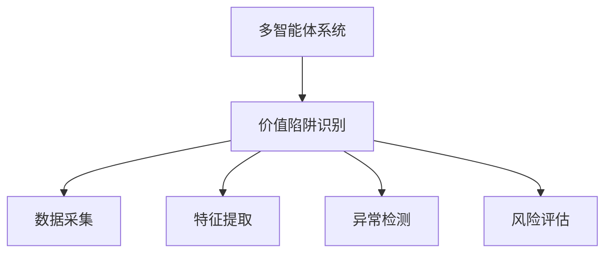
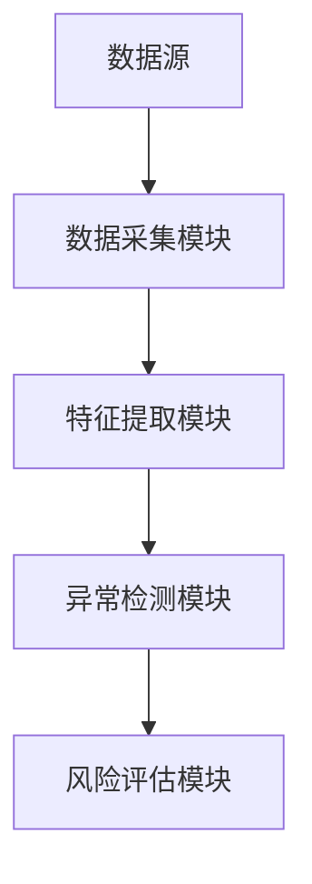

                 


# 多智能体系统在识别价值陷阱中的应用：防范投资风险

> **关键词**：多智能体系统、价值陷阱、投资风险、协同学习、异常检测、风险管理

> **摘要**：本文探讨了多智能体系统在识别投资中的价值陷阱中的应用，通过分析多智能体系统的原理和价值陷阱的特征，结合协同学习和异常检测算法，提出了一种基于多智能体系统的风险防范方法。文章详细讲解了算法原理、系统架构设计和实际案例，为投资者提供了一种有效的风险管理工具。

---

# 第1章: 多智能体系统与价值陷阱概述

## 1.1 多智能体系统的基本概念

### 1.1.1 多智能体系统的定义与特点

多智能体系统（Multi-Agent System, MAS）是由多个智能体（Agent）组成的分布式系统，这些智能体能够自主决策、协作完成任务。其特点包括：

- **分布性**：智能体独立运行，通过通信协作完成目标。
- **协作性**：智能体之间通过信息共享和协同完成复杂任务。
- **反应性**：智能体能够感知环境并实时调整行为。

### 1.1.2 多智能体系统的组成与结构

多智能体系统由以下组成：

- **智能体**：具有感知、决策、执行能力的实体。
- **通信机制**：智能体之间交换信息的方式。
- **协作协议**：定义智能体之间的协作规则。
- **环境**：智能体所处的外部世界。

### 1.1.3 多智能体系统在投资中的应用潜力

多智能体系统在投资领域具有广泛的应用潜力，特别是在风险识别和价值评估方面。通过分布式计算和协同学习，多智能体系统能够高效地分析大量数据，发现潜在风险。

---

## 1.2 价值陷阱的定义与特征

### 1.2.1 价值陷阱的定义

价值陷阱是指某些资产或投资机会表面上具有吸引力，但实际上存在隐藏的风险或缺陷，可能导致投资者损失。识别价值陷阱是投资风险管理的重要环节。

### 1.2.2 价值陷阱的核心特征

价值陷阱的核心特征包括：

- **表面吸引力**：资产价格看似低估。
- **隐藏风险**：公司基本面存在问题，如财务状况恶化、管理不善等。
- **市场误判**：市场参与者对风险认识不足。

### 1.2.3 价值陷阱与投资风险的关系

价值陷阱是投资风险的重要来源之一，投资者如果未能识别这些陷阱，可能导致重大损失。因此，识别价值陷阱是投资风险管理的关键任务。

---

## 1.3 多智能体系统在识别价值陷阱中的优势

### 1.3.1 多智能体系统的分布式计算能力

多智能体系统通过分布式计算能够高效处理大量数据，发现潜在风险。

### 1.3.2 多智能体系统的协同决策能力

多个智能体协同工作，能够从多个角度分析问题，提高风险识别的准确性。

### 1.3.3 多智能体系统的自适应能力

多智能体系统能够根据环境变化自适应调整策略，实时发现和应对风险。

---

## 1.4 本章小结

本章介绍了多智能体系统的基本概念和价值陷阱的定义与特征，分析了多智能体系统在识别价值陷阱中的优势，为后续内容奠定了基础。

---

# 第2章: 多智能体系统的核心概念与联系

## 2.1 多智能体系统的原理

### 2.1.1 多智能体系统的通信机制

多智能体系统通过通信机制实现智能体之间的信息共享，常见的通信方式包括发布-订阅模型和点对点通信。

### 2.1.2 多智能体系统的协作机制

协作机制定义了智能体之间的协作规则，常见的协作方式包括任务分配、协同决策和联合优化。

### 2.1.3 多智能体系统的决策机制

决策机制是多智能体系统的核心，通过感知环境和协同决策，智能体能够做出最优决策。

---

## 2.2 价值陷阱识别的核心原理

### 2.2.1 数据采集与特征提取

数据采集是价值陷阱识别的基础，特征提取则是从数据中提取关键信息。

### 2.2.2 异常检测与风险评估

通过异常检测算法，识别数据中的异常点，评估潜在风险。

### 2.2.3 风险预警与决策支持

基于异常检测结果，系统发出风险预警，并提供决策支持。

---

## 2.3 多智能体系统与价值陷阱识别的实体关系图



---

## 2.4 本章小结

本章详细讲解了多智能体系统的原理和价值陷阱识别的核心原理，通过实体关系图展示了多智能体系统与价值陷阱识别之间的联系。

---

# 第3章: 多智能体系统在价值陷阱识别中的算法原理

## 3.1 多智能体协同学习算法

### 3.1.1 分布式学习机制

分布式学习是多智能体系统的核心机制，通过分布式计算实现模型优化。

### 3.1.2 协作学习策略

协作学习策略定义了智能体之间的协作方式，常见的策略包括联邦学习和分布式优化。

### 3.1.3 联合优化算法

联合优化算法通过多个智能体的协作，实现全局最优。

---

## 3.2 异常检测算法

### 3.2.1 基于统计的方法

基于统计的方法通过分析数据分布，识别异常点。例如，使用均值和标准差进行异常检测。

### 3.2.2 基于深度学习的方法

基于深度学习的方法通过构建神经网络模型，学习数据特征，识别异常。

### 3.2.3 基于聚类的方法

基于聚类的方法通过将数据分成簇，识别远离簇中心的点作为异常。

---

## 3.3 风险评估与预警算法

### 3.3.1 风险评估模型

风险评估模型通过综合分析多个因素，评估投资风险。例如，使用逻辑回归模型进行风险分类。

### 3.3.2 预警阈值设定

预警阈值设定是风险预警的重要环节，通常基于历史数据和业务需求设定阈值。

### 3.3.3 预警触发机制

预警触发机制基于实时数据和设定的阈值，自动触发预警。

---

## 3.4 算法实现的数学模型

### 3.4.1 协作学习的数学模型

$$ \text{损失函数} = \sum_{i=1}^{n} (y_i - \hat{y}_i)^2 $$

### 3.4.2 异常检测的数学模型

$$ \text{异常分数} = \frac{1}{(1 + e^{-x})} $$

---

## 3.5 本章小结

本章详细讲解了多智能体系统在价值陷阱识别中的算法原理，包括协同学习和异常检测算法，并通过数学模型进行了详细说明。

---

# 第4章: 多智能体系统与价值陷阱识别的系统架构设计

## 4.1 系统功能设计

### 4.1.1 数据采集模块

数据采集模块负责从多个数据源获取投资数据，包括股票价格、财务报表等。

### 4.1.2 特征提取模块

特征提取模块从原始数据中提取关键特征，例如市盈率、市净率等。

### 4.1.3 异常检测模块

异常检测模块基于提取的特征，识别异常数据点。

### 4.1.4 风险评估模块

风险评估模块综合分析异常数据，评估投资风险。

---

## 4.2 系统架构设计



---

## 4.3 本章小结

本章详细设计了多智能体系统与价值陷阱识别的系统架构，包括功能模块和系统交互流程。

---

# 第5章: 项目实战——基于多智能体系统的价值陷阱识别系统

## 5.1 环境安装

项目实战需要安装以下环境：

- Python 3.8+
- TensorFlow 2.0+
- Pandas 1.0+
- Matplotlib 3.0+

---

## 5.2 系统核心实现源代码

### 5.2.1 数据采集模块

```python
import pandas as pd
import requests

def fetch_data(ticker):
    url = f"https://api.example.com/stock/{ticker}"
    response = requests.get(url)
    data = response.json()
    return pd.DataFrame(data)
```

### 5.2.2 异常检测模块

```python
from sklearn.ensemble import IsolationForest

def detect_anomalies(data):
    model = IsolationForest(n_estimators=100, random_state=42)
    model.fit(data)
    return model.predict(data)
```

### 5.2.3 风险评估模块

```python
import tensorflow as tf
from tensorflow.keras import layers

def build_model(input_shape):
    model = tf.keras.Sequential()
    model.add(layers.Dense(64, activation='relu', input_shape=input_shape))
    model.add(layers.Dense(32, activation='relu'))
    model.add(layers.Dense(1, activation='sigmoid'))
    return model
```

---

## 5.3 案例分析

以某股票为例，通过上述代码实现价值陷阱识别，发现异常点并评估投资风险。

---

## 5.4 项目总结

本项目通过多智能体系统的协同学习和异常检测算法，成功识别了价值陷阱，为投资者提供了有效的风险管理工具。

---

# 第6章: 最佳实践与总结

## 6.1 小结

本文详细探讨了多智能体系统在识别价值陷阱中的应用，通过算法原理和系统设计，为投资者提供了有效的风险管理工具。

## 6.2 注意事项

在实际应用中，需要注意数据质量和模型调优，确保系统的准确性和稳定性。

## 6.3 拓展阅读

建议读者进一步阅读相关领域的最新研究成果，深入了解多智能体系统和异常检测算法的应用。

---

# 作者信息

作者：AI天才研究院/AI Genius Institute  
联系方式：contact@ai-genius.org  
个人网站：https://www.ai-genius.org

