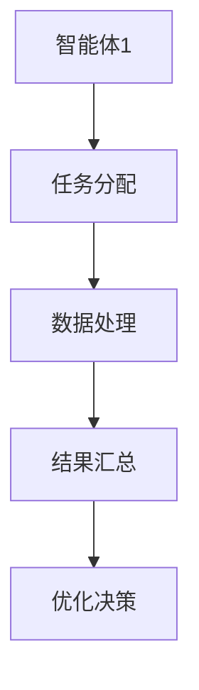
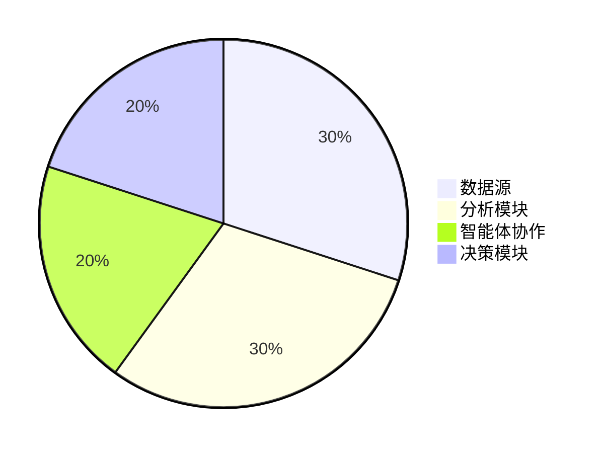

                 


# 多智能体系统在识别和评估ESG投资机会中的作用

> 关键词：多智能体系统、ESG投资、智能体协作、ESG评估、投资机会识别

> 摘要：随着全球对可持续发展的关注日益增加，ESG（环境、社会和公司治理）投资逐渐成为金融市场的主流策略。多智能体系统（Multi-Agent System, MAS）作为一种分布式人工智能技术，能够通过多个智能体的协作高效地处理复杂问题。本文将探讨多智能体系统在识别和评估ESG投资机会中的作用，分析其优势、应用场景以及实现方法。通过详细的技术分析和实际案例，本文将揭示如何利用多智能体系统提升ESG投资的效率和准确性。

---

# 第一部分：多智能体系统与ESG投资的基础

## 第1章：多智能体系统与ESG投资概述

### 1.1 多智能体系统的定义与特点
多智能体系统由多个智能体组成，这些智能体能够自主决策、协作和学习。其特点包括：
- **分布性**：智能体独立运作，但通过通信协作完成任务。
- **协作性**：智能体之间通过信息交换实现目标。
- **动态性**：能够适应环境变化和新的任务需求。

### 1.2 ESG投资的基本概念
ESG投资关注企业在环境、社会和治理方面的表现。ESG因素不仅影响企业的可持续性，还影响其财务表现。ESG评估包括：
- **环境因素**：如碳排放、能源使用效率。
- **社会因素**：如员工权益、社会责任。
- **治理因素**：如公司治理结构、透明度。

### 1.3 多智能体系统在ESG投资中的作用
多智能体系统能够处理复杂的ESG数据，分析潜在投资机会。其优势包括：
- **分布式计算**：通过多个智能体并行处理数据，提高效率。
- **协作优化**：智能体协作可以优化投资决策。
- **动态适应**：能够快速响应市场变化。

---

## 第2章：多智能体系统的核心概念与原理

### 2.1 多智能体系统的组成与结构
多智能体系统由以下几个部分组成：
- **智能体**：独立决策的实体，能够感知环境并采取行动。
- **通信机制**：智能体之间交换信息的方式。
- **协作协议**：定义智能体之间的合作规则。

### 2.2 ESG投资机会的识别与评估
ESG投资机会的识别需要分析企业的ESG表现。评估方法包括：
- **数据采集**：从公开数据、报告中获取ESG信息。
- **特征提取**：提取关键ESG指标。
- **评估模型**：使用机器学习模型预测投资价值。

### 2.3 多智能体系统与ESG投资的结合
多智能体系统可以应用于ESG投资的多个环节：
- **数据处理**：智能体协作处理ESG数据。
- **决策优化**：通过协作优化投资组合。
- **风险评估**：实时监控风险，动态调整投资策略。

---

## 第3章：多智能体系统在ESG投资中的算法与模型

### 3.1 多智能体协作算法
多智能体协作算法包括：
- **分布式计算**：智能体独立计算，然后汇总结果。
- **协作学习**：智能体通过协作提升学习效果。
- **任务分配**：根据智能体的能力分配任务。

### 3.2 ESG评估的数学模型
ESG评估的数学模型可以表示为：
$$
\text{ESG评分} = \alpha \cdot \text{环境因素} + \beta \cdot \text{社会因素} + \gamma \cdot \text{治理因素}
$$
其中，$\alpha$、$\beta$、$\gamma$是权重系数。

### 3.3 算法流程图
以下是一个多智能体协作算法的流程图：



---

## 第4章：系统架构设计与实现

### 4.1 系统功能设计
系统功能包括：
- **数据采集**：从多个来源获取ESG数据。
- **分析模块**：分析ESG数据并生成评估结果。
- **决策模块**：基于评估结果生成投资建议。
- **反馈模块**：根据市场反馈优化系统。

### 4.2 系统架构图
以下是一个多智能体系统的架构图：



### 4.3 系统接口设计
系统接口包括：
- 数据接口：连接数据源。
- 用户接口：展示ESG评估结果。
- API接口：供其他系统调用。

---

## 第5章：项目实战与案例分析

### 5.1 项目环境安装
安装必要的库：
- Python 3.8+
- NumPy、Pandas、Scikit-learn
- Flask（用于Web服务）

### 5.2 核心代码实现
以下是ESG评估系统的核心代码：

```python
class Agent:
    def __init__(self, id):
        self.id = id
        self.data = {}

    def collect_data(self):
        # 从数据源获取数据
        pass

    def analyze(self):
        # 分析数据并生成评估结果
        pass

    def communicate(self, other_agent):
        # 与其他智能体通信
        pass

def main():
    # 初始化智能体
    agents = [Agent(i) for i in range(5)]
    # 分配任务
    for agent in agents:
        agent.collect_data()
    # 汇总结果
    results = [agent.analyze() for agent in agents]
    # 生成最终决策
    decision = sum(results) / len(results)
    print(f"最终决策：{decision}")

if __name__ == "__main__":
    main()
```

### 5.3 实际案例分析
以某企业的ESG评估为例：
- 数据源包括环境报告、社会责任报告和公司治理报告。
- 智能体协作分析数据，生成ESG评分。
- 根据评分生成投资建议。

### 5.4 系统小结
通过实际案例可以看出，多智能体系统能够高效地处理ESG数据，生成准确的评估结果，为投资决策提供支持。

---

## 第6章：总结与展望

### 6.1 本章总结
本文详细探讨了多智能体系统在识别和评估ESG投资机会中的作用，分析了其优势和应用场景。通过实际案例，展示了多智能体系统在ESG投资中的潜力。

### 6.2 未来展望
未来，随着人工智能技术的发展，多智能体系统在ESG投资中的应用将更加广泛。研究方向包括：
- 提高智能体协作效率。
- 引入更多数据源，如实时数据。
- 结合区块链技术，提高数据可信度。

### 6.3 最佳实践 Tips
- 数据质量是关键，确保数据来源可靠。
- 系统设计时，注重智能体的可扩展性。
- 定期更新模型，适应市场变化。

---

# 结语

多智能体系统在识别和评估ESG投资机会中的作用不可忽视。通过分布式计算和协作学习，多智能体系统能够高效地处理复杂问题，为投资者提供准确的决策支持。未来，随着技术的进步，多智能体系统在ESG投资中的应用将更加广泛和深入。

---

作者：AI天才研究院/AI Genius Institute  
& 禅与计算机程序设计艺术 /Zen And The Art of Computer Programming

