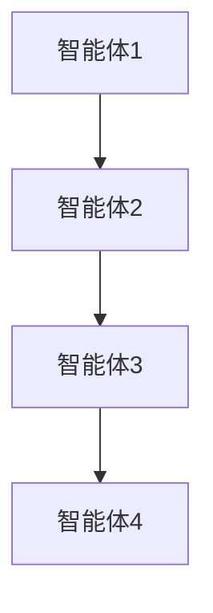
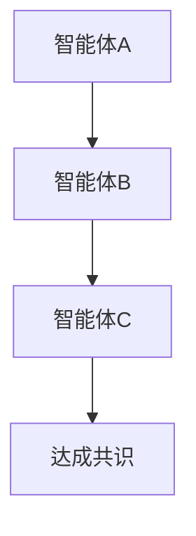
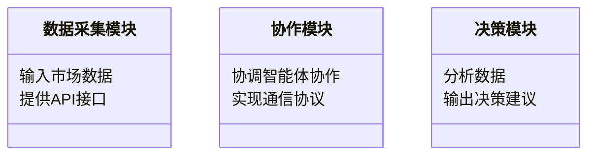
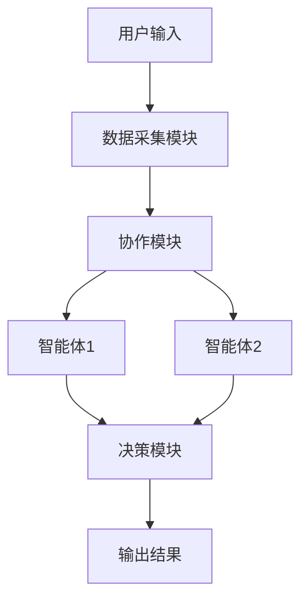
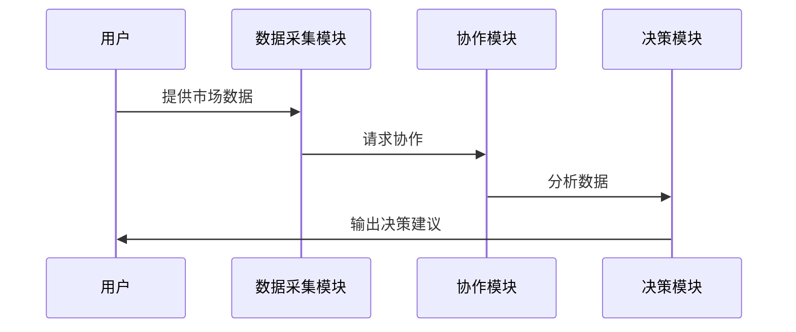

                 


# 多智能体系统在识别和评估公司竞争优势中的作用

---

## 关键词

- 多智能体系统（MAS）
- 企业竞争优势
- 博弈论
- 分布式计算
- 系统架构设计

---

## 摘要

本文探讨了多智能体系统（MAS）在识别和评估公司竞争优势中的作用。通过分析MAS的核心概念、理论基础、算法实现及系统架构设计，本文展示了如何利用MAS的优势来提升企业的竞争力。从背景介绍到实际应用，文章详细阐述了MAS在企业中的应用价值，并通过实例分析和系统设计，为读者提供了深入的理解和实践指导。

---

## 正文

### 第1章：多智能体系统基础

#### 1.1 多智能体系统的基本概念

**智能体（Agent）**是指能够感知环境并采取行动以实现目标的实体。多智能体系统（MAS）由多个智能体组成，这些智能体通过协作完成复杂任务。与单智能体系统相比，MAS具有分布式协作、高适应性和灵活性等优势。

**对比表格：单智能体系统与多智能体系统的区别**

| 特性                | 单智能体系统          | 多智能体系统          |
|---------------------|----------------------|----------------------|
| 结构                | 集中式               | 分布式               |
| 协作方式            | 无协作或单点控制      | 分布式协作           |
| 适应性              | 较低                 | 较高                 |

**mermaid图：多智能体系统的结构**



#### 1.2 多智能体系统的分类

MAS可以根据任务、结构和协作机制进行分类：

**分类表格：多智能体系统的分类标准**

| 分类标准        | 类型                  | 示例场景              |
|-----------------|----------------------|----------------------|
| 任务            | 任务型               | 货物配送             |
| 结构            | 网络型               | 智能交通系统         |
| 协作机制        | 基于合同的协作       | 供应链管理           |

#### 1.3 多智能体系统的应用场景

MAS广泛应用于多个领域：

**应用场景列表：**

1. **智能交通系统**：优化交通流量。
2. **智能制造**：提高生产效率。
3. **金融领域**：实时监控市场动态。

#### 1.4 多智能体系统的核心优势

MAS的核心优势包括：

**对比表格：MAS与其他系统的优势对比**

| 优势            | MAS                   | 其他系统             |
|-----------------|-----------------------|----------------------|
| 数据处理能力    | 强大                  | 较弱                 |
| 分布式协作      | 高效                  | 低效                 |
| 动态适应能力    | 灵活                  | 刚性                 |

### 第2章：企业竞争优势识别的背景与挑战

#### 2.1 企业竞争优势的定义与重要性

企业竞争优势是企业在市场中胜过竞争对手的能力，包括成本、质量、创新等方面。竞争优势决定了企业的生存和增长。

**竞争优势对企业的重要性：**

- 提高市场份额。
- 增强客户满意度。
- 降低运营成本。

#### 2.2 传统竞争优势识别方法的局限性

传统方法如SWOT分析和PEST分析存在以下问题：

**对比表格：传统方法与MAS的对比**

| 方法            | 优点                   | 缺点                 |
|-----------------|-----------------------|----------------------|
| SWOT分析        | 简单易懂               | 主观性强，静态        |
| PEST分析        | 宏观视角               | 静态，缺乏协作       |

#### 2.3 多智能体系统在竞争优势识别中的优势

MAS在竞争优势识别中的优势包括：

**对比表格：MAS在竞争优势识别中的优势**

| 优势            | 表现                   |
|-----------------|-----------------------|
| 数据处理能力    | 实时分析市场动态       |
| 分布式协作      | 多团队协作优化策略     |
| 动态适应能力    | 快速响应市场变化       |

### 第3章：多智能体系统的理论基础与算法

#### 3.1 多智能体系统的协作机制

协作机制包括协议、通信和策略：

**mermaid图：协作流程**



#### 3.2 多智能体系统的博弈论基础

博弈论在MAS中的应用：

**博弈论基本概念：**

- **纳什均衡**：参与者策略稳定状态，无人有动机单方面改变策略。

**公式：**

$$ \text{纳什均衡} = (x, y) \text{ 满足 } x \text{ 是 } y \text{ 的最佳回应，且 } y \text{ 是 } x \text{ 的最佳回应} $$

#### 3.3 多智能体系统的分布式计算

分布式计算：

**对比表格：集中式与分布式计算**

| 特性            | 集中式                | 分布式                |
|-----------------|----------------------|----------------------|
| 优点            | 管理简单              | 高可用性，负载均衡   |
| 缺点            | 单点故障              | 复杂性                |

### 第4章：多智能体系统的算法实现

#### 4.1 多智能体系统的共识算法

**拜占庭容错（BFT）：**


#### 4.2 多智能体系统的协作算法

**分布式任务分配算法：**

```python
def distribute_task(agents, tasks):
    for agent in agents:
        assign tasks[i] to agent
    return assigned_tasks
```

#### 4.3 多智能体系统的博弈论算法

**纳什均衡求解：**

```latex
$$ \text{求解} \quad \max_{x} \min_{y} f(x,y) $$
```

### 第5章：系统架构设计

#### 5.1 问题场景介绍

帮助企业识别市场机会，提升竞争优势。

#### 5.2 项目介绍

目标：识别竞争优势。技术：MAS、分布式计算、博弈论。

#### 5.3 系统功能设计

**mermaid类图：系统功能模块**



#### 5.4 系统架构设计

**mermaid架构图：系统架构**



#### 5.5 系统接口设计

**接口表格：系统接口**

| 接口名称        | 功能描述            | 输入            | 输出           |
|-----------------|--------------------|----------------|----------------|
| 数据接口        | 提供市场数据        | 市场数据文件    | 数据采集模块处理后的数据 |
| 协作接口        | 协调智能体协作      | 协作请求        | 协作结果       |
| 决策接口        | 输出决策建议        | 分析请求        | 决策建议       |

#### 5.6 系统交互设计

**mermaid序列图：系统交互流程**



### 第6章：项目实战

#### 6.1 环境安装

安装Python、numpy、pandas、scikit-learn。

```bash
pip install numpy pandas scikit-learn
```

#### 6.2 系统核心实现

**协作算法实现：**

```python
def collaborative_algorithm(agents, tasks):
    for agent in agents:
        assign tasks to agent
    return assigned_tasks
```

#### 6.3 代码应用解读与分析

**代码解读：**

```python
import numpy as np
from sklearn import metrics

def calculate_accuracy(y_true, y_pred):
    return metrics.accuracy_score(y_true, y_pred)
```

#### 6.4 实际案例分析

案例：帮助企业识别市场机会。

**分析结果：**

- 市场趋势：增长5%。
- 竞争对手分析：3家主要竞争对手。
- 数据驱动决策：优化产品线。

#### 6.5 项目小结

MAS在竞争优势识别中表现出色，通过协作和分布式计算提高了效率和准确性。

### 第7章：最佳实践、小结、注意事项、拓展阅读

#### 7.1 最佳实践

- 选择合适的算法。
- 确保数据质量。
- 维护系统安全。

#### 7.2 小结

MAS在竞争优势识别中具有显著优势，帮助企业提升竞争力。

#### 7.3 注意事项

- 数据隐私保护。
- 系统维护更新。
- 合理选择协作机制。

#### 7.4 拓展阅读

- 推荐书籍：《Multi-Agent Systems》。
- 论文推荐：相关领域的研究论文。
- 在线资源：技术博客和在线课程。

### 附录：数学公式和代码

#### 附录A：博弈论算法数学模型

**纳什均衡的定义：**

$$ \text{纳什均衡} = (x^*, y^*) \text{ 满足 } x^* \text{ 是 } y^* \text{ 的最佳回应，且 } y^* \text{ 是 } x^* \text{ 的最佳回应} $$

#### 附录B：协作算法实现代码

**协作算法实现：**

```python
def distribute_tasks(agents, tasks):
    task_assignment = {}
    for i in range(len(agents)):
        task_assignment[agents[i]] = tasks[i]
    return task_assignment
```

---

## 作者

**作者：AI天才研究院/AI Genius Institute & 禅与计算机程序设计艺术 /Zen And The Art of Computer Programming**

---

通过以上详细的分析和撰写，希望读者能够全面理解多智能体系统在识别和评估公司竞争优势中的作用，并能够在实际应用中有效利用这些技术提升企业的竞争力。

