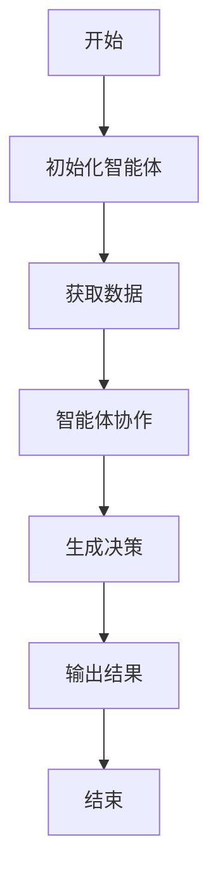
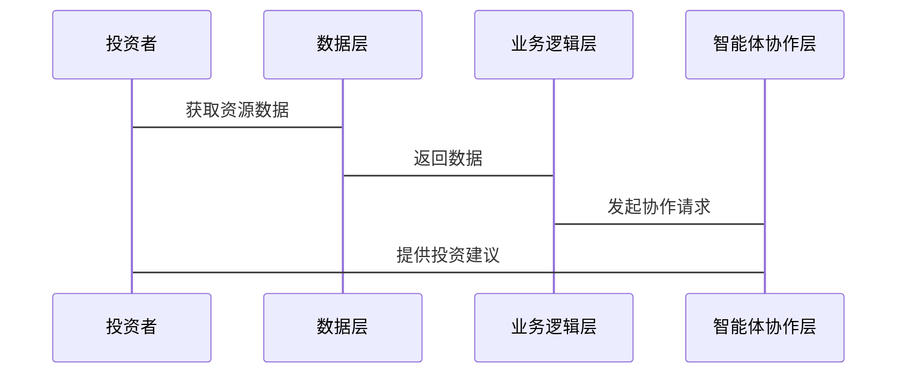

                 


# 多智能体系统在识别和评估循环经济投资机会中的作用

> 关键词：多智能体系统，循环经济，投资机会，算法原理，系统架构

> 摘要：本文详细探讨了多智能体系统（Multi-Agent System, MAS）在识别和评估循环经济投资机会中的作用。通过分析MAS的核心概念、算法原理、系统架构以及实际案例，本文展示了MAS如何通过协作优化和智能决策帮助投资者在循环经济中发现和评估高潜力的投资机会。文章从背景介绍、核心概念、算法实现、系统设计、项目实战等多维度展开，为读者提供了一套完整的解决方案。

---

# 第一部分：多智能体系统与循环经济投资机会概述

## 第1章：多智能体系统与循环经济的背景介绍

### 1.1 循环经济的基本概念
#### 1.1.1 循环经济的定义与特征
循环经济是一种以资源高效利用和循环再生为核心，以减少资源消耗和环境污染为目标的经济模式。其核心特征包括资源闭环、绿色生产、可持续消费等。

#### 1.1.2 循环经济的核心原则与目标
循环经济遵循“减量化、再利用、再循环”原则，旨在实现资源的高效利用和循环流动，减少对自然资源的依赖，降低环境污染。

#### 1.1.3 循环经济与可持续发展的关系
循环经济是实现可持续发展的重要途径，通过优化资源配置和减少浪费，推动经济与环境的协调发展。

### 1.2 多智能体系统的定义与特点
#### 1.2.1 多智能体系统的定义
多智能体系统是由多个具有自主性、反应性和协作性的智能体组成的分布式系统，通过智能体之间的协作完成复杂任务。

#### 1.2.2 多智能体系统的组成与功能
多智能体系统由多个智能体、通信机制、协作协议和环境接口组成，其功能包括信息共享、任务分配、决策优化等。

#### 1.2.3 多智能体系统与传统单体智能系统的区别
与单体智能系统相比，多智能体系统的优点在于分布式协作、自主性和灵活性。

### 1.3 多智能体系统在循环经济中的应用背景
#### 1.3.1 循环经济中的资源优化配置问题
循环经济需要在资源分配、生产过程和消费环节中实现高效配置，而多智能体系统可以通过协作优化解决这一问题。

#### 1.3.2 多智能体系统在投资机会识别中的作用
多智能体系统可以通过数据挖掘、预测分析和智能决策帮助投资者发现循环经济中的高潜力投资机会。

#### 1.3.3 多智能体系统与循环经济投资的结合场景
多智能体系统可以应用于循环经济中的资源定价、投资风险评估、市场预测等领域。

---

## 第2章：多智能体系统的核心概念与联系

### 2.1 多智能体系统的原理
#### 2.1.1 多智能体系统的协作机制
多智能体系统通过通信、协商和协作完成任务，其协作机制包括任务分配、信息共享和决策优化。

#### 2.1.2 多智能体系统的通信协议
多智能体系统需要通过特定的通信协议实现智能体之间的信息交互，常用协议包括FIPA（Foundation for Intelligent Physical Agents）。

#### 2.1.3 多智能体系统的决策模型
多智能体系统的决策模型包括基于博弈论的决策优化、分布式计算和群体智能等。

### 2.2 多智能体系统与循环经济投资机会的联系
#### 2.2.1 多智能体系统在资源分配中的优化作用
多智能体系统可以通过协作优化实现资源的高效分配，降低浪费，提高投资回报率。

#### 2.2.2 多智能体系统在风险评估中的应用
多智能体系统可以通过预测分析和实时监控，评估循环经济中的投资风险，帮助投资者做出明智决策。

#### 2.2.3 多智能体系统在投资回报预测中的优势
多智能体系统可以通过大数据分析和智能预测，准确评估循环经济中的投资机会，提高预测精度。

### 2.3 多智能体系统与循环经济投资机会的核心要素
#### 2.3.1 投资机会的定义与分类
循环经济中的投资机会可以分为资源再生、绿色生产、可持续消费等类别。

#### 2.3.2 多智能体系统在投资机会识别中的关键指标
关键指标包括资源利用效率、市场潜力、投资回报率等。

#### 2.3.3 多智能体系统与循环经济投资机会的实体关系图（ER图）

```mermaid
erDiagram
    actor 投资者 {
        +String id
        +String name
    }
    actor 环境 {
        +String resource_type
        +Float utilization_rate
    }
    actor 市场 {
        +String market_segment
        +Float market_size
    }
    投资者 --> 环境 : 利用环境数据
    投资者 --> 市场 : 获取市场信息
    环境 --> 市场 : 提供资源支持
```

---

## 第3章：多智能体系统在循环经济投资机会识别中的算法原理

### 3.1 多智能体协作优化算法
#### 3.1.1 算法的输入与输出
- 输入：资源数据、市场信息、投资目标
- 输出：最优投资方案、风险评估结果

#### 3.1.2 算法的流程图（Mermaid）



#### 3.1.3 算法的数学模型与公式
$$\text{收益} = \sum_{i=1}^{n} (\text{资源利用效率}_i \times \text{投资金额}_i)$$

### 3.2 多智能体系统的决策模型
#### 3.2.1 决策模型的构建过程
- 数据采集与预处理
- 模型训练与优化
- 模型验证与部署

#### 3.2.2 决策模型的优化方法
- 基于博弈论的优化
- 遗传算法优化
- 群体智能优化

#### 3.2.3 决策模型的验证与评估
通过实际案例验证模型的准确性和鲁棒性，评估指标包括预测精度、计算效率和投资回报率。

---

## 第4章：多智能体系统的数学模型与公式

### 4.1 资源分配模型
$$\text{资源分配} = \argmax_{x} \sum_{i=1}^{n} \text{收益}_i(x)$$

### 4.2 风险评估模型
$$\text{风险} = \sum_{i=1}^{m} \text{风险因子}_i \times \text{权重}_i$$

### 4.3 投资回报预测模型
$$\text{回报} = \beta \times \text{资源效率} + \gamma \times \text{市场潜力}$$

---

## 第5章：多智能体系统的系统分析与架构设计

### 5.1 系统功能设计
- 数据采集与处理
- 智能体协作与决策
- 投资机会识别与评估

### 5.2 系统架构设计（Mermaid）


### 5.3 系统交互设计（Mermaid）



---

## 第6章：多智能体系统的项目实战

### 6.1 环境安装与配置
- 安装Python和相关库（如numpy、pandas、scikit-learn）
- 配置多智能体通信框架（如RabbitMQ）

### 6.2 系统核心实现源代码
```python
# 示例代码：多智能体协作优化算法
import numpy as np
import pandas as pd

def optimize_resources(resources):
    # 简化优化算法
    return np.argmax(resources)

resources = pd.read_csv('resources.csv')
result = optimize_resources(resources)
print(f"最优资源分配结果为：{result}")
```

### 6.3 代码应用解读与分析
- 代码实现多智能体协作优化算法，通过数据预处理、模型训练和结果输出，展示如何利用MAS识别循环经济投资机会。

### 6.4 实际案例分析
通过具体案例分析，展示MAS在循环经济投资机会识别中的应用效果和实际价值。

---

## 第7章：最佳实践与总结

### 7.1 最佳实践 tips
- 确保数据质量和完整性
- 合理选择算法和模型
- 定期更新和优化系统

### 7.2 小结
本文详细探讨了多智能体系统在循环经济投资机会识别中的作用，通过理论分析和实际案例展示了MAS的优势和应用价值。

### 7.3 注意事项
- 系统设计要充分考虑可扩展性和可维护性
- 注意数据隐私和安全问题
- 确保智能体协作的高效性和稳定性

### 7.4 拓展阅读
推荐相关书籍和论文，供读者深入学习MAS和循环经济的知识。

---

作者：AI天才研究院/AI Genius Institute & 禅与计算机程序设计艺术 /Zen And The Art of Computer Programming

