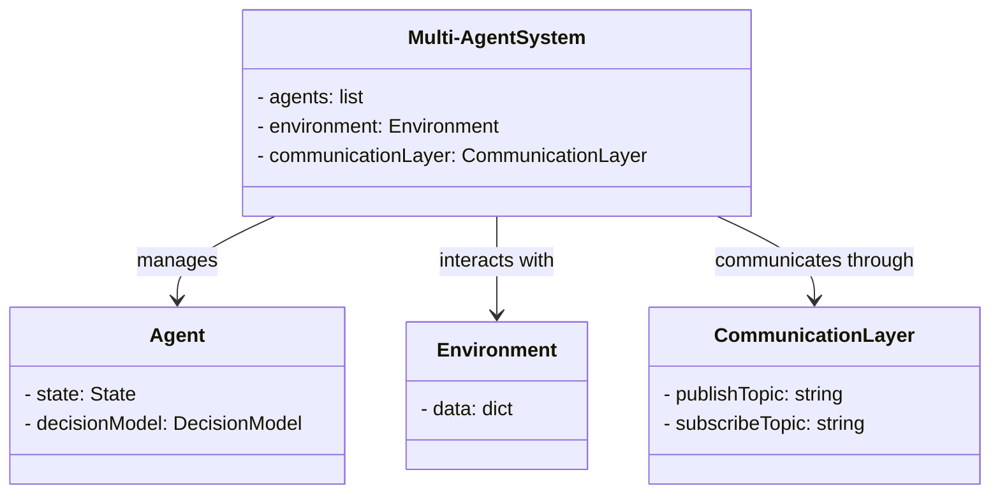
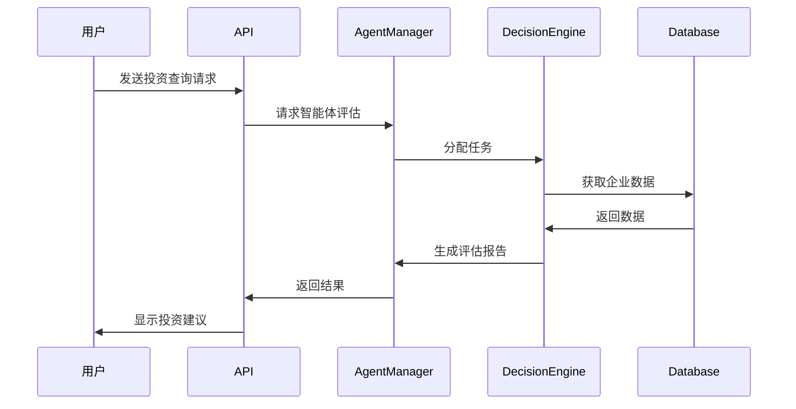

                 


# 多智能体系统在识别和评估社会责任投资机会中的作用

## 关键词：多智能体系统、社会责任投资、投资机会识别、可持续性评估、伦理评估

## 摘要

本文探讨了多智能体系统（MAS）在社会责任投资（SRI）中的应用，分析了MAS如何通过分布式决策、博弈论模型和伦理评估帮助识别和评估SRI机会。文章从MAS的基本原理、算法、系统架构到实际案例进行了详细分析，展示了MAS在提升投资决策中的优势和挑战。

---

## 正文

### 第1章：多智能体系统与社会责任投资概述

#### 1.1 多智能体系统的定义与特点

多智能体系统由多个智能体组成，每个智能体能够感知环境、自主决策并与其他智能体协作。MAS的关键特点包括分布式性、自主性、反应性和社会性。智能体之间的通信通过消息传递实现，一致性算法如Raft用于协调决策。

#### 1.2 社会责任投资的概念与重要性

社会责任投资（SRI）关注环境、社会和公司治理（ESG）因素，旨在实现财务回报与社会价值的统一。随着可持续发展理念的普及，SRI在金融市场中的份额持续增长，成为投资者的重要策略。

#### 1.3 多智能体系统在社会责任投资中的作用

MAS在SRI中的优势包括分布式计算能力、高效的信息处理和多维度评估。MAS能够整合多源数据，评估企业的ESG表现，识别潜在投资机会，并提供优化的投资组合建议。

---

### 第2章：多智能体系统的原理

#### 2.1 多智能体系统的结构与通信机制

MAS的结构由智能体、通信层和环境组成。智能体通过通信层传递信息，采用一致性算法确保决策一致性。通信机制包括发布-订阅模式和点对点通信，确保高效信息交换。

#### 2.2 多智能体系统的决策模型

分布式决策模型通过局部信息进行决策，博弈论模型模拟智能体之间的竞争与合作。联合决策优化算法如分布式A*用于复杂环境中的路径规划，Nash均衡确保决策的稳定性。

#### 2.3 伦理与可持续性评估

伦理评估方法如社会价值评分法用于衡量企业行为，可持续性评估模型基于生命周期分析。MAS通过多维度分析，生成全面的评估报告，指导投资决策。

---

### 第3章：多智能体系统的算法与数学模型

#### 3.1 分布式计算与多智能体算法

分布式A*算法通过局部信息进行路径规划，Distributed Value Iteration用于价值评估。算法代码如下：

```python
def distributed_a_star(start, goal):
    # 初始化各智能体状态
    agents = [start]
    visited = set()
    while agents:
        new_agents = []
        for agent in agents:
            if agent == goal:
                return True
            neighbors = get_neighbors(agent)
            for neighbor in neighbors:
                if neighbor not in visited:
                    new_agents.append(neighbor)
                    visited.add(neighbor)
        agents = new_agents
    return False
```

#### 3.2 博弈论模型与多智能体系统

博弈论模型中，Nash均衡确保智能体策略的稳定性。例如，两个智能体在市场中的博弈可以用以下模型表示：

$$
\text{Nash均衡} = (x, y) \mid x \text{是} y \text{的最佳响应}, y \text{是} x \text{的最佳响应}
$$

#### 3.3 投资机会评估模型

投资机会评估模型结合ESG指标，使用数学模型进行评分。例如，企业ESG评分为：

$$
\text{ESG评分} = \alpha \cdot E + \beta \cdot S + \gamma \cdot G
$$

其中，α、β、γ为权重系数，E、S、G分别为环境、社会和治理指标。

---

### 第4章：系统架构与设计

#### 4.1 系统功能设计

系统功能模块包括数据采集、智能体协作、评估分析和投资建议生成。类图如下：



#### 4.2 系统架构设计

系统架构采用分布式结构，包括数据层、业务逻辑层和应用层。架构图如下：

```mermaid
containerDiagram

Container Multi-AgentSystem {
    Component DataLayer {
        Database
        DataProcessing
    }
    Component BusinessLogic {
        AgentManager
        DecisionEngine
    }
    Component Application {
        UI
        API
    }
}
```

#### 4.3 系统接口与交互设计

用户与系统交互的流程如下：



---

### 第5章：项目实战

#### 5.1 环境安装

安装必要的工具和库：

```bash
pip install numpy pandas scikit-learn tensorflow
```

#### 5.2 核心代码实现

实现投资机会评估的代码：

```python
import numpy as np
import pandas as pd

def calculate_esg_score(enterprise_data):
    # 数据预处理
    df = pd.DataFrame(enterprise_data)
    # 计算各指标的加权评分
    weights = np.array([0.4, 0.3, 0.3])
    scores = np.dot(df.values, weights)
    return scores.max()
```

#### 5.3 实际案例分析

以某公司为例，分析其ESG表现：

1. 收集公司数据，包括环境、社会和治理指标。
2. 计算ESG评分，识别投资机会。
3. 生成投资建议，指导投资决策。

---

### 第6章：案例分析与总结

#### 6.1 案例分析

分析某公司的ESG指标，评估其投资价值。通过MAS模型，生成详细的投资建议，包括风险和收益分析。

#### 6.2 总结与展望

总结MAS在SRI中的应用优势，包括高效性、准确性和全面性。展望未来，MAS将在SRI中发挥更大作用，推动可持续投资的发展。

---

## 作者

作者：AI天才研究院 & 禅与计算机程序设计艺术

