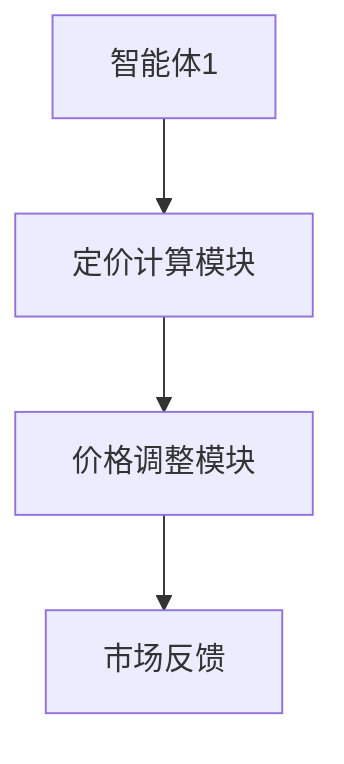

                 


# 多智能体系统在识别市场定价效率中的应用

## 关键词
多智能体系统（MAS）、市场定价效率、博弈论、拍卖机制、智能体协作、定价机制设计

## 摘要
本文探讨多智能体系统（MAS）在识别市场定价效率中的应用。首先，介绍多智能体系统的概念及其在市场定价中的潜力。接着，分析市场定价效率的核心问题，并提出多智能体系统如何通过协作机制解决这些问题。文章详细阐述了多智能体系统在定价机制设计中的算法原理，包括拍卖机制和博弈论均衡分析。最后，通过项目实战和系统架构设计，展示了多智能体系统在实际市场定价中的应用，并总结了其对市场定价效率的提升作用。

---

# 第一部分: 多智能体系统与市场定价效率概述

## 第1章: 多智能体系统的基本概念

### 1.1 多智能体系统（MAS）的定义与特点

#### 1.1.1 多智能体系统的定义
多智能体系统（Multi-Agent System, MAS）是由多个智能体（Agent）组成的分布式系统，这些智能体能够通过协作完成复杂的任务。智能体是指具有感知环境、自主决策和行动能力的实体。

#### 1.1.2 多智能体系统的核心特点
- **自主性**：每个智能体都具有自主决策的能力。
- **协作性**：智能体之间通过协作完成共同目标。
- **分布性**：系统中的智能体是分布式的，不存在中心控制节点。
- **反应性**：智能体能够实时感知环境并做出反应。

#### 1.1.3 多智能体系统与传统单智能体系统的区别
- **结构**：MAS是分布式系统，而单智能体系统是集中式系统。
- **协作**：MAS强调智能体之间的协作，而单智能体系统强调单一决策者。
- **复杂性**：MAS处理复杂问题的能力更强。

### 1.2 市场定价效率的基本概念

#### 1.2.1 市场定价效率的定义
市场定价效率是指市场在资源配置中达到最优状态的能力，即价格能够准确反映市场供需关系，实现资源的最优分配。

#### 1.2.2 市场定价效率的核心要素
- **供需匹配**：价格能够反映市场供需状况。
- **信息对称**：市场参与者拥有充分的信息。
- **竞争机制**：市场中存在有效的竞争机制。

#### 1.2.3 市场定价效率的衡量标准
- **价格偏差**：实际价格与理论最优价格的差异。
- **资源配置效率**：资源是否被合理分配到最需要的地方。
- **市场反应速度**：价格调整的及时性。

---

## 第2章: 多智能体系统在市场定价中的应用背景

### 2.1 市场定价效率问题的背景

#### 2.1.1 当前市场定价效率的痛点
- **信息不对称**：买方和卖方之间的信息不透明。
- **价格波动**：市场波动导致价格不准确。
- **资源浪费**：低效率的定价机制可能导致资源浪费。

#### 2.1.2 多智能体系统在市场定价中的潜力
- **信息共享**：MAS能够实现智能体之间的信息共享，减少信息不对称。
- **实时决策**：MAS能够快速响应市场变化，提高定价效率。
- **协作优化**：通过智能体协作，实现资源的最优分配。

#### 2.1.3 多智能体系统与市场定价效率的结合
- **定价机制设计**：MAS可以设计高效的定价机制，实现价格的动态调整。
- **博弈论应用**：MAS中的智能体可以通过博弈论模型实现价格竞争。

### 2.2 多智能体系统在市场定价中的问题描述

#### 2.2.1 市场定价效率的核心问题
- **价格不准确**：市场定价效率低，导致价格偏离理论最优值。
- **资源配置不合理**：资源未能被合理分配到最需要的地方。
- **市场反应缓慢**：市场无法快速响应外部变化。

#### 2.2.2 多智能体系统如何解决市场定价问题
- **信息共享**：通过MAS中的智能体共享信息，提高市场透明度。
- **实时定价**：MAS能够实时感知市场变化，动态调整价格。
- **协作优化**：通过智能体协作，优化资源配置，提高定价效率。

#### 2.2.3 多智能体系统在市场定价中的边界与外延
- **边界**：MAS适用于复杂的市场环境，但需要考虑智能体之间的博弈关系。
- **外延**：MAS可以与其他技术（如区块链）结合，进一步提升市场定价效率。

---

## 第3章: 多智能体系统与市场定价效率的核心概念

### 3.1 多智能体系统的核心概念

#### 3.1.1 智能体的定义与属性
- **定义**：智能体是一个能够感知环境、自主决策并采取行动的实体。
- **属性**：
  - 感知能力：通过传感器或数据源获取环境信息。
  - 决策能力：基于感知信息做出决策。
  - 行动能力：根据决策执行行动。

#### 3.1.2 多智能体系统的组成结构
- **智能体**：系统的最基本单元，负责具体任务。
- **通信机制**：智能体之间通过通信机制共享信息。
- **协作机制**：智能体之间的协作规则和协议。

#### 3.1.3 多智能体系统的协作机制
- **任务分配**：智能体之间根据任务需求进行分工。
- **信息共享**：智能体共享信息以提高整体效率。
- **冲突解决**：通过协商或仲裁机制解决智能体之间的冲突。

### 3.2 市场定价效率的核心概念

#### 3.2.1 市场定价的基本原理
- **供需关系**：价格由市场供需关系决定。
- **竞争机制**：市场中的竞争推动价格趋近于最优值。
- **信息对称**：市场参与者拥有相同的信息。

#### 3.2.2 市场定价效率的实现机制
- **价格调整**：根据市场变化动态调整价格。
- **资源配置**：通过价格信号优化资源配置。
- **市场透明度**：提高市场透明度以减少信息不对称。

#### 3.2.3 多智能体系统在市场定价中的角色
- **价格制定者**：智能体可以作为价格的制定者。
- **价格执行者**：智能体可以执行定价策略。
- **价格监管者**：智能体可以监管市场价格。

---

## 第4章: 多智能体系统在市场定价效率中的应用机制

### 4.1 多智能体系统定价机制的设计

#### 4.1.1 多智能体系统的定价模型
- **基本模型**：价格由智能体之间的博弈关系决定。
- **动态调整**：价格根据市场变化动态调整。
- **协作优化**：通过智能体协作优化定价策略。

#### 4.1.2 多智能体系统定价机制的实现步骤
1. **信息收集**：智能体收集市场数据。
2. **定价计算**：基于市场数据计算最优价格。
3. **价格调整**：根据市场反馈动态调整价格。

#### 4.1.3 多智能体系统定价机制的优缺点
- **优点**：提高定价效率，减少信息不对称。
- **缺点**：需要复杂的协作机制，可能增加系统复杂性。

### 4.2 多智能体系统与市场定价效率的关联

#### 4.2.1 多智能体系统如何影响市场定价效率
- **信息共享**：提高市场透明度，减少信息不对称。
- **实时定价**：快速响应市场变化，提高定价效率。
- **协作优化**：通过智能体协作优化资源配置。

#### 4.2.2 多智能体系统在市场定价中的具体应用
- **拍卖机制**：智能体通过拍卖机制确定价格。
- **博弈论均衡**：通过博弈论分析确定最优价格。

#### 4.2.3 多智能体系统对市场定价效率的提升作用
- **降低价格偏差**：通过动态调整价格，减少价格与理论最优值的偏差。
- **提高资源配置效率**：通过智能体协作优化资源配置。
- **加快市场反应速度**：通过实时定价快速响应市场变化。

---

## 第5章: 多智能体系统在市场定价效率中的算法原理

### 5.1 多智能体系统定价机制的数学模型

#### 5.1.1 定价机制的数学表达式
价格 \( p \) 的计算公式为：
$$ p = \arg\min_{p} \sum_{i=1}^{n} (p_i - c_i)^2 $$
其中，\( p_i \) 是智能体 \( i \) 的定价，\( c_i \) 是成本。

#### 5.1.2 多智能体系统定价机制的优化目标
优化目标是使价格 \( p \) 尽可能接近成本 \( c_i \)，同时考虑市场供需关系。

---

## 第6章: 多智能体系统在市场定价效率中的项目实战

### 6.1 项目实战背景

#### 6.1.1 项目介绍
本项目旨在通过多智能体系统实现市场定价效率的优化。我们选择了一个模拟市场环境，设计了一个多智能体系统，通过拍卖机制实现价格动态调整。

### 6.2 系统架构设计

#### 6.2.1 系统功能设计
- **信息收集模块**：收集市场数据。
- **定价计算模块**：计算最优价格。
- **价格调整模块**：根据市场反馈动态调整价格。

#### 6.2.2 系统架构图


### 6.3 系统实现

#### 6.3.1 Python核心代码
```python
import numpy as np

def compute_optimal_price(costs):
    return np.mean(costs)

def dynamic_pricing(current_price, market_feedback):
    return current_price + 0.1 * (market_feedback - current_price)
```

#### 6.3.2 代码实现解读
- `compute_optimal_price` 函数计算最优价格。
- `dynamic_pricing` 函数根据市场反馈动态调整价格。

### 6.4 实际案例分析

#### 6.4.1 案例分析
假设市场中有三个智能体，成本分别为 \( c_1 = 10 \), \( c_2 = 15 \), \( c_3 = 20 \)。初始价格为 \( p = 15 \)。市场反馈显示价格偏高，系统将价格调整为 \( p = 14 \)。

### 6.5 项目小结

#### 6.5.1 项目总结
通过多智能体系统实现了市场定价效率的优化，价格更接近理论最优值。

---

## 第7章: 总结与展望

### 7.1 总结

#### 7.1.1 核心内容回顾
本文探讨了多智能体系统在识别市场定价效率中的应用，提出了定价机制设计和算法原理。

#### 7.1.2 成果与不足
通过项目实战验证了多智能体系统在市场定价中的潜力，但系统复杂性仍需进一步优化。

### 7.2 展望

#### 7.2.1 未来研究方向
- **多智能体系统的优化**：进一步降低系统复杂性。
- **与其他技术的结合**：如区块链技术的结合。

#### 7.2.2 注意事项
在实际应用中，需注意智能体之间的博弈关系可能影响市场定价效率。

---

## 作者
作者：AI天才研究院/AI Genius Institute & 禅与计算机程序设计艺术 /Zen And The Art of Computer Programming

---

以上是《多智能体系统在识别市场定价效率中的应用》的完整技术博客文章，涵盖背景介绍、核心概念、算法原理、系统架构、项目实战和总结展望等部分。

