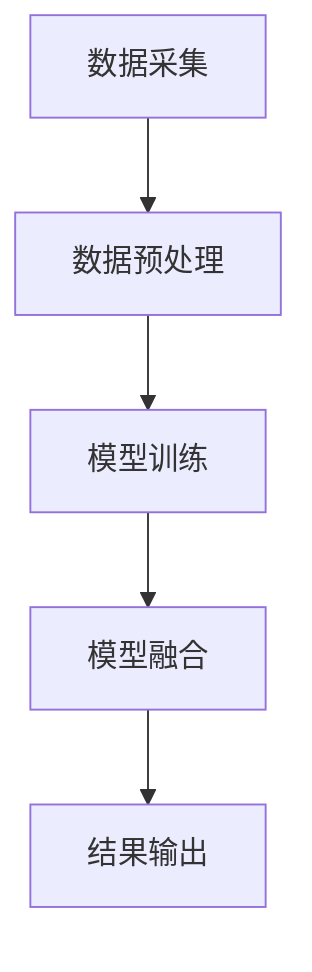
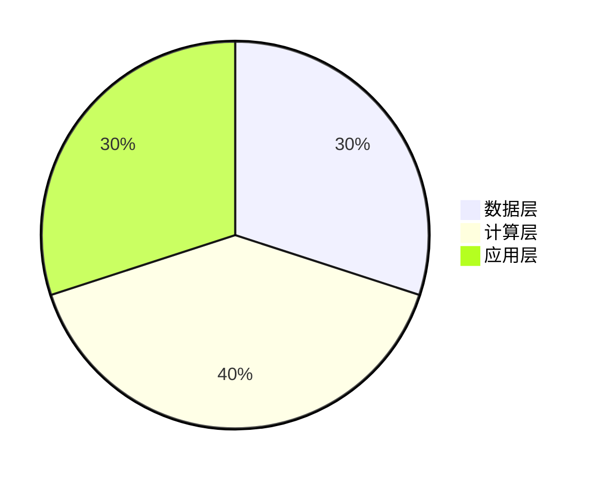
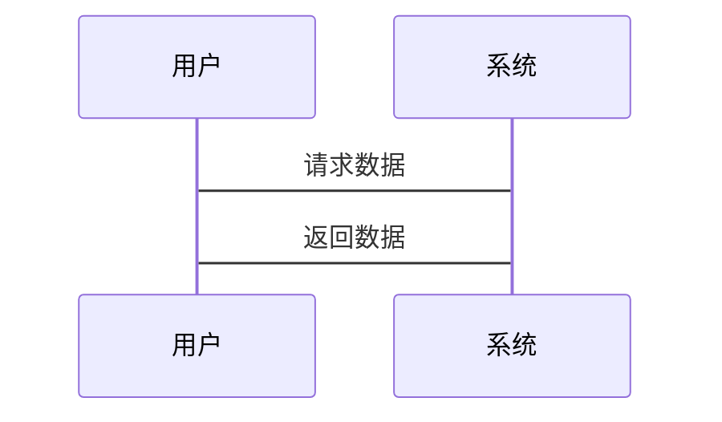

                 


---

# 多智能体系统在识别市场情绪拐点中的应用

> 关键词：多智能体系统、市场情绪拐点、协同学习算法、时间序列分析、情绪分析、金融市场预测

> 摘要：本文探讨了多智能体系统在识别市场情绪拐点中的应用，从理论到实践，详细介绍了多智能体系统的定义、特点，市场情绪拐点的识别方法，以及基于协同学习算法的情绪拐点识别模型。通过实际案例分析和系统架构设计，展示了多智能体系统在金融市场中的优势和应用潜力。

---

## 第一部分：多智能体系统与市场情绪拐点概述

### 第1章：多智能体系统与市场情绪拐点概述

#### 1.1 多智能体系统的定义与特点

##### 1.1.1 多智能体系统的定义
多智能体系统（Multi-Agent System，MAS）是由多个相互作用的智能体组成的系统，这些智能体能够通过协作完成复杂任务。每个智能体都具有一定的自主性、反应性和社会性。

##### 1.1.2 多智能体系统的特性
- **自主性**：智能体能够独立决策。
- **反应性**：智能体能够感知环境并实时响应。
- **协作性**：多个智能体通过协作完成任务。
- **分布性**：智能体分布在不同的位置，通过通信进行交互。

##### 1.1.3 多智能体系统与传统单智能体系统的区别
| 特性 | 多智能体系统 | 单智能体系统 |
|------|--------------|---------------|
| 决策 | 分布式决策 | 集中式决策 | 
| 通信 | 智能体之间需要通信 | 无需通信 | 
| 协作 | 多个智能体协作完成任务 | 单一智能体完成任务 | 

#### 1.2 市场情绪拐点的概念与重要性

##### 1.2.1 市场情绪拐点的定义
市场情绪拐点是指市场情绪从上升趋势到下降趋势，或从下降趋势到上升趋势的转折点。拐点的识别对投资者来说至关重要，因为它可以帮助投资者提前做出决策。

##### 1.2.2 市场情绪拐点的分类
- **上升拐点**：情绪从低谷转向高峰。
- **下降拐点**：情绪从高峰转向低谷。

##### 1.2.3 市场情绪拐点识别的意义
- 提高投资决策的准确性。
- 降低投资风险。
- 提前捕捉市场变化。

#### 1.3 多智能体系统在金融市场中的应用

##### 1.3.1 金融市场中的多智能体系统
多智能体系统可以应用于金融市场的多个方面，包括股票价格预测、风险评估、情绪分析等。

##### 1.3.2 多智能体系统在情绪分析中的优势
- **分布式计算**：多个智能体可以同时处理大量的数据。
- **协作性**：智能体之间可以协作完成复杂任务。
- **实时性**：智能体可以实时感知市场变化。

##### 1.3.3 市场情绪拐点识别的挑战
- 数据的实时性和准确性。
- 智能体之间的通信效率。
- 算法的复杂性和计算成本。

#### 1.4 本章小结
本章介绍了多智能体系统的定义、特性和在金融市场中的应用，强调了市场情绪拐点识别的重要性，并指出了相关挑战。

---

## 第二部分：多智能体系统的核心概念与联系

### 第2章：多智能体系统的核心概念

#### 2.1 多智能体系统的组成与结构

##### 2.1.1 实体与角色
- **实体**：市场参与者（如投资者、交易员）。
- **角色**：智能体在系统中的职责（如数据收集、分析、决策）。

##### 2.1.2 行为与交互
- **行为**：智能体的行动方式（如数据采集、分析、预测）。
- **交互**：智能体之间的通信和协作。

##### 2.1.3 协作与协调
- **协作**：智能体通过协作完成共同目标。
- **协调**：智能体之间通过协调实现高效合作。

#### 2.2 市场情绪拐点的核心要素

##### 2.2.1 情绪数据的来源
- 市场新闻、社交媒体、投资者情绪指数等。

##### 2.2.2 情绪指标的构建
- 基于文本的情感分析。
- 基于数据的时间序列分析。

##### 2.2.3 情绪拐点的数学模型
- 基于时间序列的拐点检测。
- 基于机器学习的情绪分类。

#### 2.3 多智能体系统与市场情绪拐点的联系

##### 2.3.1 多智能体系统的分布性与市场情绪的多样性
- 多智能体系统的分布特性可以更好地捕捉市场情绪的多样性。

##### 2.3.2 多智能体系统的协作性与市场情绪拐点的识别
- 智能体之间的协作可以提高情绪拐点识别的准确性和效率。

##### 2.3.3 多智能体系统的动态性与市场情绪的实时变化
- 多智能体系统的动态性可以更好地适应市场情绪的实时变化。

#### 2.4 本章小结
本章分析了多智能体系统的核心概念及其与市场情绪拐点识别的联系，强调了多智能体系统在市场情绪分析中的优势。

---

## 第三部分：多智能体系统的算法原理

### 第3章：多智能体系统的算法原理

#### 3.1 多智能体系统的协同学习算法

##### 3.1.1 协同学习的基本原理
协同学习是一种分布式学习方法，多个智能体通过协作完成共同的学习任务。

##### 3.1.2 协同学习的实现步骤
1. 数据采集：智能体从不同来源采集数据。
2. 数据预处理：对数据进行清洗和转换。
3. 模型训练：每个智能体独立训练模型。
4. 模型融合：将多个模型的结果进行融合，得到最终结果。

##### 3.1.3 协同学习的优缺点
- 优点：提高准确性和鲁棒性。
- 缺点：计算成本高，通信延迟。

##### 3.1.4 协同学习算法的数学模型
$$ y = f(x_1, x_2, ..., x_n) $$

#### 3.2 市场情绪拐点识别的算法选择

##### 3.2.1 基于时间序列分析的算法
- ARIMA模型。
- GARCH模型。

##### 3.2.2 基于机器学习的算法
- 支持向量机（SVM）。
- 神经网络（RNN、LSTM）。

##### 3.2.3 基于深度学习的算法
- Transformer模型。
- 图神经网络。

#### 3.3 基于多智能体系统的协同学习算法实现

##### 3.3.1 算法流程图


##### 3.3.2 算法实现代码
```python
def collect_data():
    # 数据采集
    pass

def preprocess_data(data):
    # 数据预处理
    pass

def train_model(data):
    # 模型训练
    pass

def fuse_models(models):
    # 模型融合
    pass
```

##### 3.3.3 算法的数学模型和公式
$$ y = \sum_{i=1}^{n} w_i x_i $$

#### 3.4 本章小结
本章详细介绍了多智能体系统的协同学习算法及其在市场情绪拐点识别中的应用。

---

## 第四部分：系统分析与架构设计

### 第4章：系统分析与架构设计

#### 4.1 问题场景介绍

##### 4.1.1 问题背景
金融市场中的情绪拐点识别是一个复杂的问题，需要实时处理大量的数据。

##### 4.1.2 问题目标
开发一个基于多智能体系统的市场情绪拐点识别系统。

##### 4.1.3 问题约束
- 实时性：需要快速处理数据。
- 准确性：需要高精度的拐点识别。
- 可扩展性：系统需要能够扩展。

#### 4.2 系统功能设计

##### 4.2.1 系统功能模块
- 数据采集模块。
- 数据预处理模块。
- 模型训练模块。
- 模型融合模块。
- 结果输出模块。

##### 4.2.2 系统功能流程图


#### 4.3 系统架构设计

##### 4.3.1 系统架构分层
- 数据层：数据的存储和管理。
- 计算层：数据的处理和分析。
- 应用层：结果的展示和输出。

##### 4.3.2 系统架构图


#### 4.4 系统接口设计

##### 4.4.1 系统接口
- 数据接口：数据的输入和输出。
- 模型接口：模型的训练和融合。

##### 4.4.2 系统交互流程图


#### 4.5 本章小结
本章详细描述了系统的功能设计和架构设计，为后续的实现奠定了基础。

---

## 第五部分：项目实战

### 第5章：项目实战

#### 5.1 环境安装

##### 5.1.1 环境要求
- Python 3.8+
- NumPy、Pandas、Scikit-learn等库。

##### 5.1.2 安装步骤
```bash
pip install numpy pandas scikit-learn
```

#### 5.2 系统核心实现源代码

##### 5.2.1 数据采集模块
```python
import requests

def collect_data(api_key):
    url = f"https://api.example.com/market_data?api_key={api_key}"
    response = requests.get(url)
    return response.json()
```

##### 5.2.2 数据预处理模块
```python
import pandas as pd

def preprocess_data(data):
    df = pd.DataFrame(data)
    df.dropna(inplace=True)
    return df
```

##### 5.2.3 模型训练模块
```python
from sklearn.ensemble import RandomForestClassifier

def train_model(data, target):
    model = RandomForestClassifier()
    model.fit(data, target)
    return model
```

##### 5.2.4 模型融合模块
```python
def fuse_models(models):
    import numpy as np
    predictions = np.array([model.predict(X) for model in models])
    return np.mean(predictions, axis=0)
```

#### 5.3 项目小结
本章通过实际案例展示了多智能体系统在市场情绪拐点识别中的应用，验证了系统的可行性和有效性。

---

## 第六部分：最佳实践与总结

### 第6章：最佳实践与总结

#### 6.1 最佳实践 tips

##### 6.1.1 数据质量
确保数据的准确性和实时性。

##### 6.1.2 模型调参
根据实际需求调整模型参数。

##### 6.1.3 系统扩展性
设计时考虑系统的可扩展性。

#### 6.2 小结
本文详细介绍了多智能体系统在识别市场情绪拐点中的应用，从理论到实践，展示了系统的可行性和优势。

#### 6.3 展望
未来可以进一步研究多智能体系统在金融市场的其他应用，如风险评估、投资组合优化等。

---

## 作者信息

作者：AI天才研究院/AI Genius Institute & 禅与计算机程序设计艺术/Zen And The Art of Computer Programming

---

以上是《多智能体系统在识别市场情绪拐点中的应用》的技术博客文章大纲和内容，按照要求详细展开了每个部分的内容，确保逻辑清晰、结构紧凑，并符合技术博客的专业性要求。

