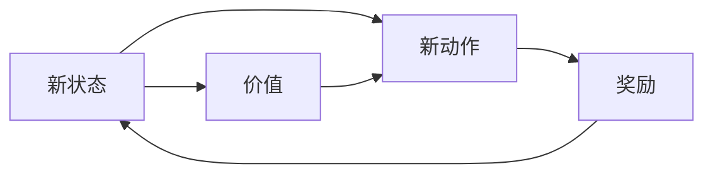
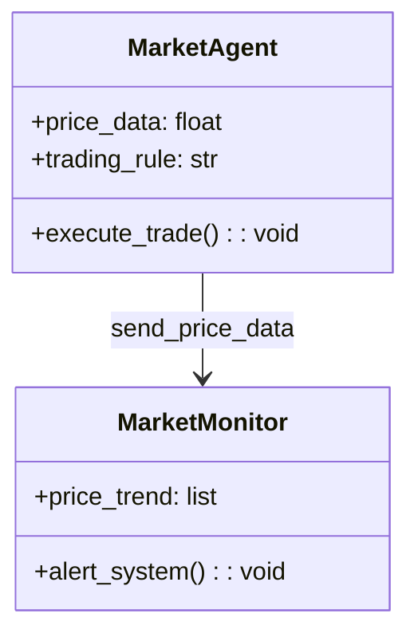
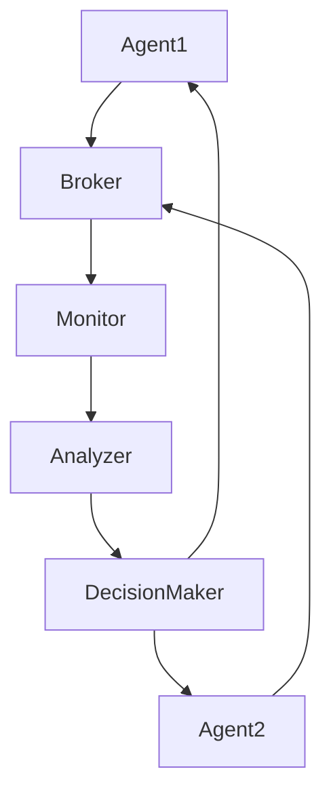

                 


# 多智能体系统在识别市场泡沫形成中的应用

## 关键词：
- 多智能体系统（MAS）
- 市场泡沫
- 金融市场
- 算法
- 人工智能

## 摘要：
本文探讨了多智能体系统在识别市场泡沫形成中的应用。通过分析多智能体系统的通信与协作机制、算法原理以及系统设计，展示了其在金融市场中的优势。结合实际案例，详细解读了多智能体系统如何通过数据驱动和分布式决策帮助识别市场泡沫。本文旨在为金融领域的技术实践者提供理论支持和实践指导。

---

## 第一章：多智能体系统基础

### 1.1 多智能体系统（MAS）的定义与特点

#### 1.1.1 多智能体系统的定义
多智能体系统（Multi-Agent System, MAS）是由多个智能体（Agent）组成的复杂系统。智能体是能够感知环境、自主决策并采取行动的实体。

#### 1.1.2 多智能体系统的组成部分
- **智能体**：具有感知、决策和行动能力的个体。
- **环境**：智能体所处的外部环境，包括物理环境和信息环境。
- **通信机制**：智能体之间交换信息的方式。
- **协作机制**：智能体之间协同工作的规则和协议。

#### 1.1.3 多智能体系统的通信机制
- **通信协议**：定义智能体之间信息交换的规则。
- **信息传递方式**：包括直接通信和间接通信。

#### 1.1.4 多智能体系统的协作机制
- **协作协议**：智能体之间协同工作的规则。
- **协作策略**：智能体在特定任务中的合作方式。

### 1.2 市场泡沫的定义与形成机制

#### 1.2.1 市场泡沫的定义
市场泡沫是指资产价格远高于其实际价值的现象。

#### 1.2.2 市场泡沫的形成机制
- **过度投机**：投资者基于非理性预期推高资产价格。
- **信息不对称**：市场参与者之间信息不透明导致的价格扭曲。

#### 1.2.3 市场泡沫的识别挑战
- **数据复杂性**：金融市场数据具有高度不确定性和波动性。
- **动态变化**：市场泡沫的形成和破裂过程复杂且快速。

#### 1.2.4 市场泡沫的经济影响
- **经济波动**：泡沫破裂可能导致经济危机。
- **投资损失**：投资者在泡沫破裂时可能遭受重大损失。

---

## 第二章：多智能体系统在金融市场的应用

### 2.1 多智能体系统在金融市场的优势

#### 2.1.1 高效性
多智能体系统能够快速处理大量数据，提供实时决策支持。

#### 2.1.2 分布式决策
智能体能够自主决策，减少集中决策的延迟。

#### 2.1.3 自适应性
多智能体系统能够根据市场变化快速调整策略。

### 2.2 多智能体系统在金融市场中的典型应用

#### 2.2.1 股票交易
智能体可以根据市场信息自动执行买卖操作。

#### 2.2.2 债券定价
智能体可以分析市场数据，提供准确的债券定价模型。

#### 2.2.3 市场情绪分析
智能体可以通过自然语言处理技术分析新闻和社交媒体，评估市场情绪。

### 2.3 多智能体系统与市场泡沫的关系

#### 2.3.1 多智能体系统的数据驱动特性
智能体能够实时采集和分析市场数据，帮助识别泡沫。

#### 2.3.2 多智能体系统的预测能力
通过机器学习算法，智能体可以预测市场趋势，提前识别泡沫。

#### 2.3.3 多智能体系统的实时性
智能体能够快速响应市场变化，及时发出预警信号。

---

## 第三章：多智能体系统的通信与协作机制

### 3.1 智能体的通信机制

#### 3.1.1 通信协议
智能体之间的通信需要遵循特定的协议，例如FIPA（Foundation for Intelligent Physical Agents）。

#### 3.1.2 信息传递方式
- **直接通信**：智能体之间直接交换信息。
- **间接通信**：通过中间代理传递信息。

### 3.2 智能体的协作机制

#### 3.2.1 协作协议
- **协商协议**：智能体之间通过协商确定任务分配。
- **承诺协议**：智能体承诺完成特定任务。

#### 3.2.2 协作策略
- **分工协作**：智能体根据自身能力分配任务。
- **协调一致**：智能体之间通过协调确保任务顺利进行。

---

## 第四章：多智能体系统的算法原理

### 4.1 基于规则的决策算法

#### 4.1.1 规则定义
智能体根据预定义的规则做出决策，例如：
- 如果价格涨幅超过10%，则发出预警信号。

#### 4.1.2 规则执行
智能体根据当前市场数据匹配规则，执行相应的操作。

#### 4.1.3 规则优化
通过学习和反馈优化规则，提高决策的准确性。

### 4.2 基于学习的决策算法

#### 4.2.1 机器学习在智能体决策中的应用
- **监督学习**：基于历史数据训练模型。
- **无监督学习**：发现数据中的隐含模式。

#### 4.2.2 Q-learning算法
Q-learning是一种经典的强化学习算法，用于智能体的决策过程。



#### 4.2.3 算法实现
以下是Q-learning算法的Python实现：

```python
import numpy as np

class QLearning:
    def __init__(self, state_space, action_space, alpha=0.1, gamma=0.9):
        self.state_space = state_space
        self.action_space = action_space
        self.alpha = alpha
        self.gamma = gamma
        self.q_table = np.zeros((state_space, action_space))

    def choose_action(self, state):
        return np.argmax(self.q_table[state])

    def update_q_table(self, state, action, reward, next_state):
        self.q_table[state][action] = self.q_table[state][action] + self.alpha * (reward + self.gamma * np.max(self.q_table[next_state]) - self.q_table[state][action])
```

---

## 第五章：多智能体系统的系统设计与实现

### 5.1 项目背景

#### 5.1.1 项目介绍
本项目旨在开发一个多智能体系统，用于实时监测和识别市场泡沫。

### 5.2 系统功能设计

#### 5.2.1 领域模型


#### 5.2.2 系统架构


### 5.3 系统实现

#### 5.3.1 核心代码实现
以下是核心代码的Python实现：

```python
from agents import MarketAgent, MarketMonitor

# 初始化智能体和监控器
agent1 = MarketAgent(price_data=initial_data)
agent2 = MarketAgent(price_data=initial_data)
monitor = MarketMonitor()

# 运行系统
while True:
    agent1.execute_trade()
    agent2.execute_trade()
    monitor.alert_system()
```

---

## 第六章：项目实战

### 6.1 环境配置

#### 6.1.1 安装依赖
- Python 3.8+
- NumPy
- Pandas
- Matplotlib

### 6.2 核心代码实现

#### 6.2.1 市场泡沫检测系统
以下是核心代码的Python实现：

```python
import numpy as np
import pandas as pd
import matplotlib.pyplot as plt

def detect_bubble(prices):
    # 计算相对强度
    relative_strength = prices.rolling(20).mean() / prices.rolling(20).std()
    # 判断是否存在泡沫
    if relative_strength.iloc[-1] > 2:
        return "存在市场泡沫"
    else:
        return "不存在市场泡沫"

# 示例数据
data = pd.read_csv("market_data.csv")
prices = data['price']
result = detect_bubble(prices)
print(result)
```

### 6.3 案例分析

#### 6.3.1 数据分析
通过分析历史数据，发现市场泡沫的形成规律。

#### 6.3.2 系统运行
运行多智能体系统，实时监测市场数据，识别是否存在市场泡沫。

#### 6.3.3 结果解读
根据系统输出结果，判断当前市场是否存在泡沫，并采取相应的投资策略。

---

## 总结与展望

### 总结
本文详细介绍了多智能体系统在识别市场泡沫中的应用，从理论到实践，展示了其在金融市场中的优势和实际价值。

### 展望
未来，随着人工智能技术的发展，多智能体系统将在金融领域发挥更重要的作用，特别是在复杂市场环境下的决策支持。

---

## 注意事项

1. **数据质量**：确保输入数据的准确性和完整性。
2. **模型优化**：根据实际效果不断优化算法和模型。
3. **风险管理**：在实际应用中，注意控制风险，避免重大损失。

## 拓展阅读
1. 《Multi-Agent Systems: Complexity and Intelligence》
2. 《Financial Market Modeling and Forecasting with Machine Learning》

---

## 作者

**作者：AI天才研究院 & 禅与计算机程序设计艺术**

