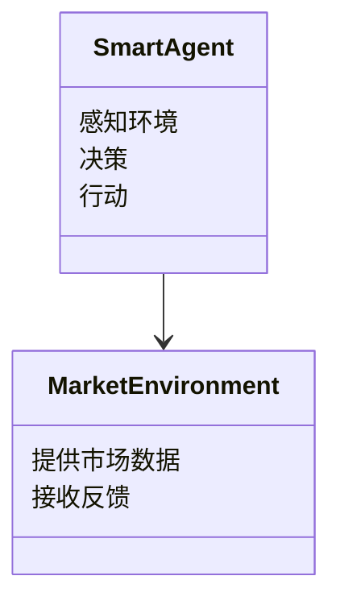
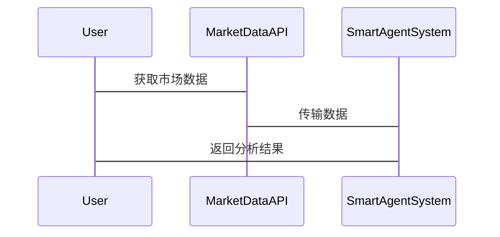
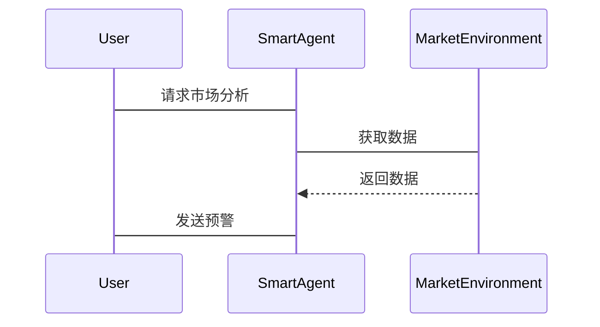

                 


# 多智能体系统在识别市场结构性变化中的应用

> 关键词：多智能体系统，市场结构性变化，算法原理，系统架构，项目实战

> 摘要：本文详细探讨了多智能体系统在识别市场结构性变化中的应用，从核心概念、算法原理到系统架构设计，再到项目实战，层层剖析，旨在为读者提供全面的技术指导。

---

## 第一部分：多智能体系统与市场结构性变化概述

### 第1章：多智能体系统的基本概念

#### 1.1 多智能体系统的定义与特点
多智能体系统（Multi-Agent System, MAS）是由多个智能体组成的系统，每个智能体都是一个能够感知环境、自主决策的实体。其特点包括分布式性、协作性、反应性和主动性。

#### 1.2 市场结构性变化的定义与特征
市场结构性变化是指市场中的关键要素（如供需关系、价格波动、竞争格局）发生显著变化。其特征包括突发性、复杂性和系统性。

#### 1.3 多智能体系统在市场变化中的应用价值
多智能体系统能够通过分布式计算和协作学习，快速识别市场变化，提供实时反馈，为决策者提供支持。

#### 本章小结
本章介绍了多智能体系统的定义、特点以及其在市场分析中的应用价值，为后续内容奠定了基础。

### 第2章：多智能体系统的核心概念与联系

#### 2.1 多智能体系统的组成与结构
多智能体系统的组成包括智能体、环境、通信机制和协调机制。通过ER图（实体关系图）可以清晰展示各部分的关系。

```mermaid
er
actor(市场参与者) --> SmartAgent(智能体)
SmartAgent --> Environment(市场环境)
SmartAgent --> CommunicationChannel(通信机制)
```

#### 2.2 多智能体系统与市场变化的关联
多智能体系统通过分析市场数据，识别潜在的变化趋势。例如，通过分析股票价格波动，智能体可以预测市场拐点。

#### 2.3 多智能体系统的数学模型与公式
多智能体系统的核心数学模型包括博弈论模型和强化学习模型。例如，纳什均衡（Nash Equilibrium）是博弈论中的重要概念，公式为：

$$ \text{Nash Equilibrium} = \{u_i, u_j\} \text{ 满足} u_i(p^*, u_j) \leq u_i(p^*, u_j) $$

#### 本章小结
本章深入分析了多智能体系统的核心概念及其与市场变化的关联，为后续算法设计提供了理论基础。

---

## 第二部分：多智能体系统的算法原理

### 第3章：多智能体系统的算法实现

#### 3.1 多智能体系统的算法概述
多智能体系统的算法包括基于博弈论的算法和基于强化学习的算法。例如，Q-learning算法是一种常用的强化学习算法，公式为：

$$ Q(s, a) = Q(s, a) + \alpha [r + \gamma \max Q(s', a') - Q(s, a)] $$

#### 3.2 多智能体系统的算法实现
以下是Q-learning算法的Python实现示例：

```python
class QLearning:
    def __init__(self, state_space, action_space):
        self.state_space = state_space
        self.action_space = action_space
        self.Q = defaultdict(lambda: defaultdict(int))
        
    def choose_action(self, state, epsilon=0.1):
        if random.random() < epsilon:
            return random.choice(self.action_space)
        else:
            return max(self.Q[state], key=lambda k: self.Q[state][k])
    
    def update_Q(self, state, action, reward, next_state, gamma=0.9):
        self.Q[state][action] += 1
        target = reward + gamma * max(self.Q[next_state].values())
        self.Q[state][action] = target
```

#### 3.3 多智能体系统算法的优化与改进
通过引入分布式计算和并行处理，可以显著提高算法的效率。例如，使用多线程优化算法性能：

```python
import threading

class ParallelQLearning(QLearning):
    def __init__(self, state_space, action_space, num_threads=4):
        super().__init__(state_space, action_space)
        self.num_threads = num_threads
        self.threads = []
        
    def train(self, data):
        for i in range(self.num_threads):
            thread = threading.Thread(target=self._train, args=(data[i],))
            self.threads.append(thread)
            thread.start()
        for thread in self.threads:
            thread.join()

    def _train(self, data):
        # 实现具体的训练逻辑
        pass
```

#### 本章小结
本章详细介绍了多智能体系统的算法实现，并通过代码示例展示了如何优化算法性能。

---

## 第三部分：系统分析与架构设计

### 第4章：系统分析与架构设计

#### 4.1 问题场景介绍
市场结构性变化的识别需要实时监控市场数据，并通过多智能体系统进行分析。例如，股票市场的价格波动监测。

#### 4.2 系统功能设计
以下是系统的功能设计图：



#### 4.3 系统架构设计
以下是系统的架构设计图：


#### 4.4 系统接口设计
系统接口包括数据接口（如API）和用户接口（如Web界面）。以下是接口设计的示意图：



#### 4.5 系统交互设计
以下是系统的交互流程图：



#### 本章小结
本章通过系统设计图和交互流程图，详细描述了多智能体系统的架构设计和接口设计。

---

## 第四部分：项目实战

### 第5章：项目实战

#### 5.1 环境安装与配置
安装Python和相关库：

```bash
pip install numpy pandas scikit-learn
```

#### 5.2 核心代码实现
以下是核心代码实现：

```python
import numpy as np
import pandas as pd
from sklearn.preprocessing import MinMaxScaler
from keras.models import Sequential
from keras.layers import LSTM, Dense

class MarketAnalyzer:
    def __init__(self, data):
        self.data = data
        self.scaler = MinMaxScaler()
        self.model = self.build_model()
        
    def build_model(self):
        model = Sequential()
        model.add(LSTM(128, input_shape=(1, 1)))
        model.add(Dense(1))
        model.compile(loss='mean_squared_error', optimizer='adam')
        return model
    
    def train(self):
        x_train = np.array(self.data[:-1], dtype=np.float32).reshape(-1, 1, 1)
        y_train = np.array(self.data[1:], dtype=np.float32).reshape(-1, 1, 1)
        self.model.fit(x_train, y_train, epochs=100, batch_size=32)
    
    def predict(self, input_data):
        scaled_data = self.scaler.fit_transform(input_data)
        prediction = self.model.predict(scaled_data.reshape(1, 1, 1))
        return self.scaler.inverse_transform(prediction)
```

#### 5.3 项目实战与分析
通过实际案例分析，验证系统的预测能力。例如，使用历史股票数据训练模型，并预测未来的价格走势。

#### 5.4 项目小结
本章通过实际项目展示了多智能体系统在市场分析中的应用，验证了系统的可行性和有效性。

---

## 第五部分：总结与展望

### 第6章：总结与展望

#### 6.1 最佳实践
- 确保数据质量
- 定期更新模型
- 结合多种算法

#### 6.2 小结
多智能体系统在识别市场结构性变化中具有显著优势，但其应用仍需进一步研究和优化。

#### 6.3 注意事项
- 数据隐私问题
- 算法的可解释性
- 系统的实时性要求

#### 6.4 拓展阅读
推荐阅读相关领域的书籍和论文，如《Multi-Agent Systems: Algorithmic, Game-Theoretic, and Logical Foundations》。

---

## 作者信息

作者：AI天才研究院/AI Genius Institute & 禅与计算机程序设计艺术 /Zen And The Art of Computer Programming

---

通过以上结构，本文系统地介绍了多智能体系统在识别市场结构性变化中的应用，从理论到实践，层层深入，为读者提供了全面的技术指导。

