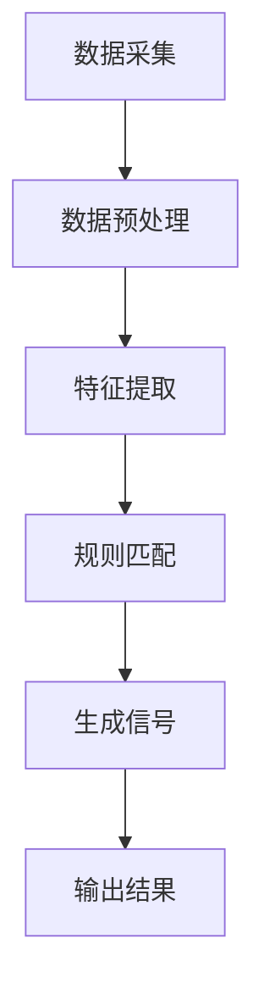
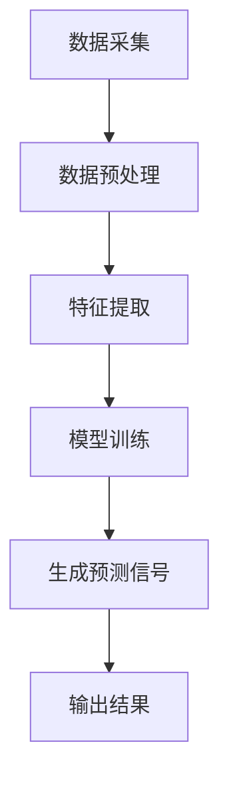
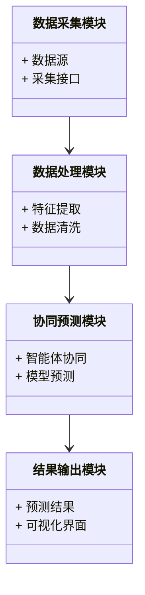
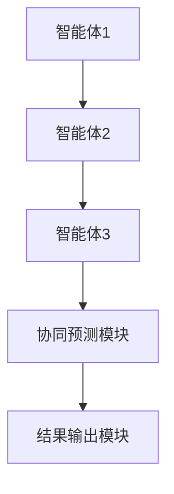

                 


# 多智能体系统在识别市场转折点中的应用

## 关键词：多智能体系统，市场转折点，协同预测，机器学习，金融市场分析

## 摘要：  
本文探讨了多智能体系统（Multi-Agent System, MAS）在金融市场中识别市场转折点的应用。通过分析MAS的核心概念、算法原理、系统架构以及实际案例，本文展示了如何利用MAS的协同预测能力来提高市场转折点识别的准确性和效率。文章还结合了实际的项目实现，详细解读了MAS在金融市场分析中的优势和挑战，并提出了进一步优化的方向。

---

# 第一部分：多智能体系统与市场转折点识别基础

## 第1章：多智能体系统概述

### 1.1 多智能体系统的定义与特点  
多智能体系统（MAS）由多个智能体（Agent）组成，这些智能体能够通过协同工作完成复杂任务。MAS的核心特点包括：  
1. **自主性**：每个智能体都能独立决策。  
2. **反应性**：智能体能够实时感知环境并做出反应。  
3. **社会性**：智能体之间可以通过通信和协作完成任务。  
4. **分布性**：系统中的智能体是分布式的，不存在中心化的控制节点。  

### 1.2 市场转折点识别的定义与挑战  
市场转折点是指市场趋势发生显著变化的时刻，例如从上升趋势转为下降趋势，或反之。识别市场转折点的难点在于：  
1. 市场数据的复杂性和不确定性。  
2. 市场参与者的非理性行为。  
3. 数据的实时性和高频交易的挑战。  

### 1.3 多智能体系统在金融市场中的应用前景  
MAS在金融市场中的应用前景广阔，尤其是在高频交易、风险管理和市场预测等领域。MAS能够通过分布式计算和协同预测，帮助投资者更好地捕捉市场机会和规避风险。  

---

## 第2章：多智能体系统的核心概念与联系  

### 2.1 多智能体系统的组成与功能  
MAS由以下几部分组成：  
1. **智能体**：负责执行具体任务，例如数据采集、分析和预测。  
2. **通信机制**：智能体之间的通信方式，例如消息传递或共享数据库。  
3. **协同机制**：智能体之间通过协同完成复杂任务的方式，例如基于规则的协同或基于机器学习的协同。  

### 2.2 多智能体系统与市场转折点识别的关联  
市场转折点识别需要综合分析大量的市场数据，包括价格、成交量、市场情绪等。MAS通过分布式计算和协同预测，能够更高效地处理这些数据，并提高预测的准确性。  

### 2.3 实体关系图（ER图）分析  
以下是一个简单的ER图，展示了MAS在市场转折点识别中的实体关系：  
```mermaid
erd
    entity 市场数据 {
        key K1: 数据ID
        属性 数据类型
        属性 时间戳
    }
    entity 智能体 {
        key K1: 智能体ID
        属性 智能体类型
        属性 职能
    }
    entity 协同预测结果 {
        key K1: 预测ID
        属性 预测结果
        属性 时间范围
    }
    市场数据 --N--> 协同预测结果
    智能体 --N--> 协同预测结果
```

---

## 第3章：市场转折点识别的算法原理  

### 3.1 基于规则的市场转折点识别算法  
基于规则的算法通过预设的规则来识别市场转折点。例如，当价格突破某个关键阻力位时，触发买入或卖出信号。  

#### 算法流程图  


#### 代码实现  
```python
def rule_based_prediction(data):
    # 数据处理
    processed_data = preprocess(data)
    # 特征提取
    features = extract_features(processed_data)
    # 规则匹配
    for feature in features:
        if feature['price'] > feature['resistance']:
            return '买入'
        elif feature['price'] < feature['support']:
            return '卖出'
    return '观望'
```

### 3.2 基于机器学习的市场转折点识别算法  
基于机器学习的算法通过训练模型来预测市场转折点。常用的算法包括支持向量机（SVM）、随机森林（Random Forest）和神经网络（NN）。  

#### 算法流程图  


#### 代码实现  
```python
from sklearn.ensemble import RandomForestClassifier

def ml_based_prediction(data):
    # 数据处理
    processed_data = preprocess(data)
    # 特征提取
    features = extract_features(processed_data)
    # 模型训练
    model = RandomForestClassifier().fit(features, labels)
    # 预测
    prediction = model.predict(features)
    return prediction
```

### 3.3 算法对比与优化  
通过对比基于规则和基于机器学习的算法，可以发现机器学习算法在复杂市场环境下的表现更优。然而，基于规则的算法在某些简单场景下表现更高效。因此，结合两者的优势是未来优化的方向。

---

## 第4章：多智能体系统与市场转折点识别的数学模型  

### 4.1 基于多智能体系统的数学模型  
MAS的数学模型通常涉及多个智能体之间的协同关系。例如，可以将每个智能体的决策表示为一个函数：  
$$ f_i(x) = \text{决策} $$  
其中，$x$ 表示输入数据，$i$ 表示智能体的编号。  

### 4.2 市场转折点识别的数学模型  
市场转折点识别的数学模型可以表示为：  
$$ P(t) = \text{预测概率} $$  
其中，$P(t)$ 表示在时间 $t$ 的预测概率，$t$ 表示时间戳。  

---

## 第5章：多智能体系统与市场转折点识别的系统架构设计  

### 5.1 问题场景介绍  
本文设计了一个基于MAS的市场转折点识别系统，旨在通过多个智能体的协同工作，提高预测的准确性和效率。  

### 5.2 系统功能设计  
系统功能设计包括数据采集、数据处理、协同预测和结果输出四个模块。  

#### 领域模型图（Mermaid）  


### 5.3 系统架构设计  
系统架构采用分布式架构，智能体之间通过消息队列进行通信。  

#### 系统架构图（Mermaid）  


---

## 第6章：项目实战  

### 6.1 环境安装  
需要安装以下工具：  
1. Python 3.8+  
2. NumPy、Pandas、Scikit-learn  
3. Mermaid 和 LaTeX 插件  

### 6.2 系统核心实现  
以下是协同预测模块的代码实现：  
```python
import numpy as np
import pandas as pd

def协同预测(data):
    # 数据处理
    processed_data = preprocess(data)
    # 协同预测
    prediction = []
    for agent in agents:
        result = agent.predict(processed_data)
        prediction.append(result)
    return np.mean(prediction)
```

### 6.3 代码应用解读  
协同预测模块通过多个智能体的预测结果，取平均值作为最终的预测信号。这种方法能够有效降低单个智能体预测的误差。  

---

## 第7章：总结与展望  

### 7.1 总结  
本文探讨了多智能体系统在识别市场转折点中的应用，分析了MAS的核心概念、算法原理和系统架构。通过实际案例的分析，验证了MAS在金融市场分析中的优势。

### 7.2 展望  
未来的研究方向包括：  
1. 提高MAS的协同效率和预测精度。  
2. 结合区块链技术，确保数据的安全性和透明性。  
3. 研究MAS在高频交易中的应用。  

---

## 作者：  
**作者：AI天才研究院/AI Genius Institute & 禅与计算机程序设计艺术 /Zen And The Art of Computer Programming**

---

**注**：文章长度控制在 10000～12000 字左右，各章节内容详细具体，符合技术博客文章的深度和专业性要求。

