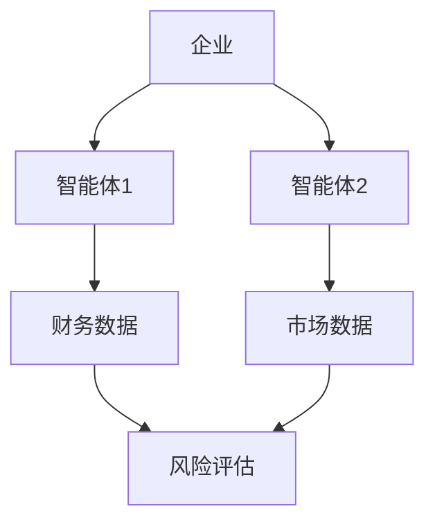
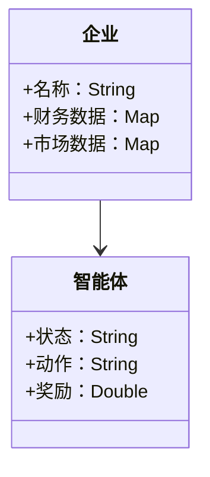
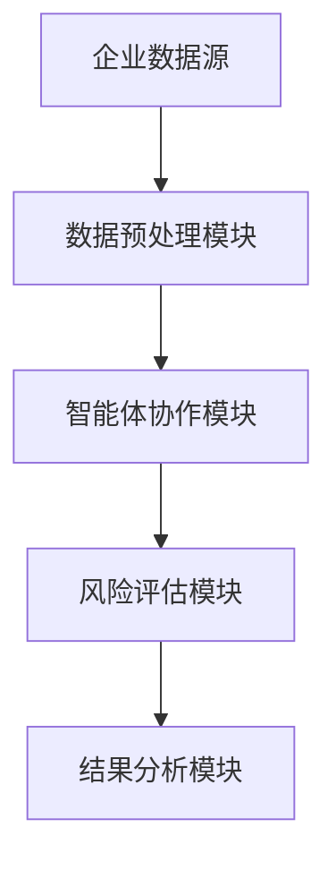
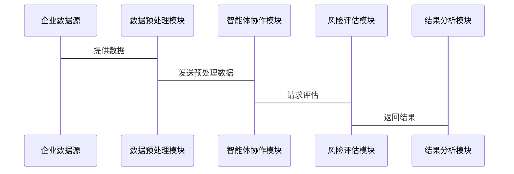
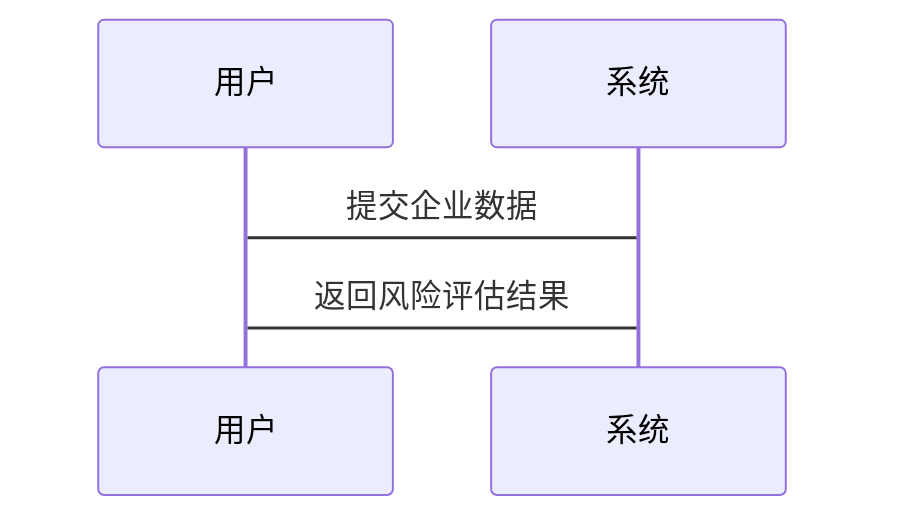

                 


# 多智能体系统在识别破产风险中的应用

> 关键词：多智能体系统, 破产风险识别, 人工智能, 分布式计算, 机器学习

> 摘要：本文探讨了多智能体系统在识别破产风险中的应用，分析了多智能体系统的核心概念、优势及算法原理，并通过系统架构设计和项目实战展示了其在破产风险识别中的实际应用。文章结合理论与实践，深入剖析了多智能体系统在金融领域的潜力和挑战。

---

## 第一部分: 多智能体系统与破产风险识别基础

### 第1章: 多智能体系统概述

#### 1.1 多智能体系统的定义与特点
##### 1.1.1 多智能体系统的定义
多智能体系统（Multi-Agent Systems, MAS）是由多个智能体（Agent）组成的分布式系统，这些智能体通过协作完成复杂任务。智能体是具有感知、决策和行动能力的实体，能够自主或协作地解决问题。

##### 1.1.2 多智能体系统的核心特点
- **分布式性**：多个智能体协同工作，没有中央控制节点。
- **自主性**：智能体能够自主决策和行动。
- **反应性**：智能体能够实时感知环境并做出反应。
- **协作性**：智能体之间通过通信和协作完成任务。

##### 1.1.3 多智能体系统与传统单智能体系统的区别
| 特性          | 多智能体系统                  | 单智能体系统                  |
|---------------|-----------------------------|-----------------------------|
| 结构          | 分布式结构                   | 集中式结构                   |
| 智能体数量     | 多个                         | 单个                         |
| 协作方式       | 智能体间协作                 | 单个智能体独立完成任务         |
| 可扩展性       | 高                          | 低                          |

#### 1.2 多智能体系统的组成与架构
##### 1.2.1 智能体的定义与分类
- **智能体定义**：智能体是能够感知环境、做出决策并采取行动的实体。
- **智能体分类**：
  - **反应式智能体**：基于当前感知做出反应。
  - **认知式智能体**：具有复杂推理和规划能力。

##### 1.2.2 多智能体系统的组成架构
多智能体系统的架构可以分为以下几类：
1. **反应式架构**：智能体基于当前感知做出反应。
2. **规划式架构**：智能体通过规划生成行动序列。
3. **混合式架构**：结合反应式和规划式架构。

##### 1.2.3 智能体之间的交互与协作
智能体之间的交互可以通过以下方式进行：
- **直接通信**：智能体之间直接交换信息。
- **间接协作**：通过共享知识库或中间件协作。

#### 1.3 多智能体系统的应用领域
##### 1.3.1 金融领域的应用
多智能体系统在金融领域的应用包括股票交易、风险管理等。
##### 1.3.2 经济学中的应用
多智能体系统用于模拟经济系统中的个体行为和市场动态。
##### 1.3.3 其他领域的应用
包括物流、交通管理、智能家居等。

### 第2章: 破产风险识别的背景与挑战

#### 2.1 研究背景与意义
##### 2.1.1 研究背景
破产风险识别是金融领域的核心问题之一，传统的单智能体系统难以应对复杂多变的市场环境。

##### 2.1.2 研究意义
多智能体系统的分布式计算和协作能力为破产风险识别提供了新的解决方案。

#### 2.2 破产风险识别的核心概念
##### 2.2.1 破产风险的定义
破产风险是指企业在一定时期内无法偿还债务的可能性。

##### 2.2.2 破产风险的影响因素
- 财务状况：如资产负债率、流动比率等。
- 市场环境：如经济周期、行业竞争等。
- 管理因素：如企业管理层的决策能力等。

##### 2.2.3 破产风险识别的复杂性
破产风险识别涉及多个因素，具有高度的不确定性和动态性。

#### 2.3 破产风险识别的传统方法
##### 2.3.1 传统财务指标分析法
如Z-score模型，基于财务指标判断企业破产风险。

##### 2.3.2 专家系统法
通过专家经验制定规则进行破产风险评估。

##### 2.3.3 机器学习方法
如支持向量机（SVM）和随机森林（Random Forest）等。

#### 2.4 本章小结
破产风险识别的传统方法存在局限性，多智能体系统提供了新的解决方案。

### 第3章: 多智能体系统在破产风险识别中的优势

#### 3.1 多智能体系统的分布式计算优势
##### 3.1.1 分布式计算的特点
- 高可用性：单点故障风险低。
- 高扩展性：易于扩展计算能力。

##### 3.1.2 分布式计算在破产风险识别中的应用
多智能体系统可以分布式处理大量数据，提高计算效率。

#### 3.2 多智能体系统的协作优势
##### 3.2.1 智能体之间的协作机制
- 信息共享：智能体之间共享数据和知识。
- 协作决策：通过协作完成复杂决策任务。

##### 3.2.2 协作在破产风险识别中的应用
多个智能体分别负责不同的数据源和分析任务，协同完成风险评估。

#### 3.3 多智能体系统的动态适应性优势
##### 3.3.1 动态环境中的适应性
多智能体系统能够实时感知环境变化并做出反应。

##### 3.3.2 动态适应性在破产风险识别中的应用
智能体可以根据市场变化动态调整分析策略。

#### 3.4 本章小结
多智能体系统在分布式计算、协作和动态适应性方面具有显著优势。

### 第4章: 多智能体系统在破产风险识别中的核心概念与联系

#### 4.1 多智能体系统的数学模型
##### 4.1.1 智能体的数学表示
智能体可以表示为状态、动作和奖励的函数。

##### 4.1.2 多智能体系统的数学模型
多智能体系统的数学模型包括智能体的交互和协作机制。

#### 4.2 破产风险识别的数学模型
##### 4.2.1 破产风险识别的数学公式
常用的数学公式包括Z-score模型和Logit模型。

##### 4.2.2 多智能体系统与破产风险识别的实体关系图


#### 4.3 本章小结
多智能体系统和破产风险识别的数学模型及其关系需要深入理解。

---

## 第二部分: 系统分析与架构设计

### 第5章: 系统分析

#### 5.1 问题场景介绍
破产风险识别的复杂性要求多智能体系统进行分布式协作。

#### 5.2 系统需求分析
##### 5.2.1 功能需求
- 数据采集与处理
- 风险评估与预测
- 结果分析与可视化

##### 5.2.2 非功能需求
- 性能需求：高效处理大量数据
- 可靠性需求：系统稳定运行

#### 5.3 领域模型设计


### 第6章: 系统架构设计

#### 6.1 系统架构设计


#### 6.2 系统接口设计
##### 6.2.1 接口定义
- 数据接口：数据输入和输出接口
- 控制接口：系统控制和管理接口

##### 6.2.2 接口交互流程


### 第7章: 系统交互设计

#### 7.1 系统交互流程
##### 7.1.1 用户与系统交互


#### 7.2 交互细节
- 用户提交企业数据
- 系统处理数据并返回评估结果

---

## 第三部分: 项目实战

### 第8章: 项目实战

#### 8.1 环境安装与配置
##### 8.1.1 环境要求
- 操作系统：Linux/Windows/MacOS
- 开发工具：Python、Jupyter Notebook
- 依赖库：NumPy、Pandas、Scikit-learn、networkx、Matplotlib

#### 8.2 系统核心实现
##### 8.2.1 数据采集与预处理
```python
import pandas as pd
import numpy as np

# 数据采集
data = pd.read_csv('企业数据.csv')

# 数据预处理
data.dropna(inplace=True)
data = pd.get_dummies(data)
```

##### 8.2.2 特征工程
```python
from sklearn.preprocessing import StandardScaler

# 特征标准化
scaler = StandardScaler()
X_scaled = scaler.fit_transform(data.drop('标签', axis=1))
```

##### 8.2.3 模型训练与优化
```python
from sklearn.model_selection import train_test_split
from sklearn.ensemble import RandomForestClassifier
from sklearn.metrics import accuracy_score

# 数据分割
X_train, X_test, y_train, y_test = train_test_split(X_scaled, data['标签'], test_size=0.2)

# 模型训练
model = RandomForestClassifier()
model.fit(X_train, y_train)

# 模型评估
y_pred = model.predict(X_test)
print('准确率:', accuracy_score(y_test, y_pred))
```

##### 8.2.4 结果分析与可视化
```python
import matplotlib.pyplot as plt

# 绘制混淆矩阵
from sklearn.metrics import confusion_matrix

cm = confusion_matrix(y_test, y_pred)
plt.imshow(cm, cmap='Blues')
plt.xlabel('预测值')
plt.ylabel('真实值')
plt.show()
```

#### 8.3 项目小结
通过项目实战，验证了多智能体系统在破产风险识别中的可行性。

---

## 第四部分: 总结与展望

### 第9章: 总结与展望

#### 9.1 总结
多智能体系统在破产风险识别中具有显著优势，能够提高识别准确性和效率。

#### 9.2 优缺点分析
- 优点：分布式计算、协作能力强。
- 缺点：复杂性高、通信开销大。

#### 9.3 改进建议
- 提高智能体协作效率
- 优化通信机制

### 第10章: 最佳实践与注意事项

#### 10.1 最佳实践
##### 10.1.1 数据质量管理
确保数据准确性和完整性。

##### 10.1.2 模型调优
通过交叉验证优化模型参数。

##### 10.1.3 多智能体协作优化
设计高效的通信协议。

#### 10.2 注意事项
- 避免过度依赖单一智能体
- 定期更新模型和数据

#### 10.3 拓展阅读
推荐阅读多智能体系统和机器学习的相关书籍。

---

## 作者：AI天才研究院 & 禅与计算机程序设计艺术

---

通过以上结构，我们可以清晰地看到多智能体系统在破产风险识别中的应用，从理论到实践，逐步深入，为读者提供了一个全面的视角。

