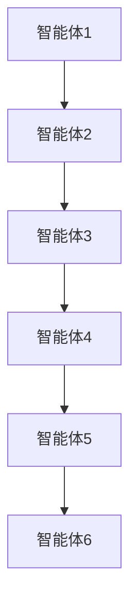
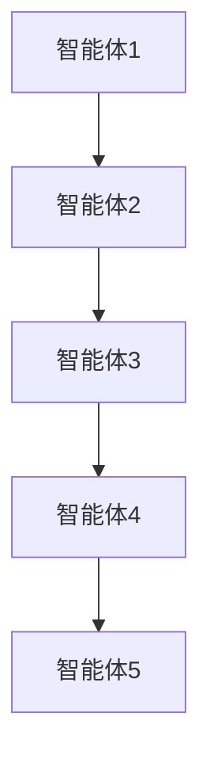
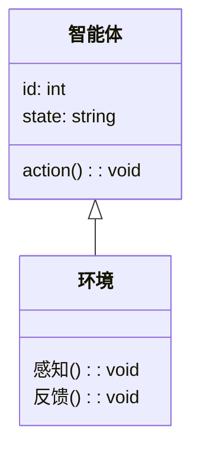
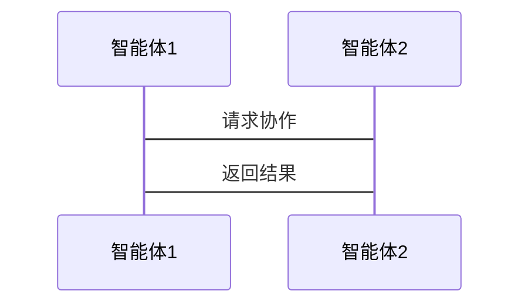

                 


# 多智能体系统在识别行业转型和颠覆性创新中的作用

> 关键词：多智能体系统，行业转型，颠覆性创新，人工智能，分布式计算，系统架构

> 摘要：本文探讨了多智能体系统在识别行业转型和颠覆性创新中的核心作用。通过分析多智能体系统的定义、特点及其在不同行业中的应用，本文揭示了其如何通过分布式计算和智能协同推动创新。文章详细介绍了多智能体系统的算法原理、系统架构设计以及实际案例，展示了其在金融、医疗、物流等行业的广泛应用。最后，本文总结了多智能体系统的优势，并展望了其未来发展方向。

---

# 第一部分: 多智能体系统与行业转型概述

## 第1章: 多智能体系统概述

### 1.1 多智能体系统的基本概念

#### 1.1.1 多智能体系统的定义
多智能体系统（Multi-Agent Systems, MAS）是由多个智能体（Agent）组成的分布式系统，这些智能体能够通过协同工作完成复杂的任务。与传统的单智能体系统相比，MAS具有更高的灵活性和适应性。

#### 1.1.2 多智能体系统的特征
多智能体系统具有以下关键特征：
1. **分布性**：智能体分布在网络中，每个智能体负责特定的任务。
2. **自治性**：每个智能体能够自主决策，无需中央控制。
3. **协作性**：智能体之间通过通信和协调完成共同目标。
4. **反应性**：系统能够实时响应环境变化。

#### 1.1.3 多智能体系统与相关概念的对比
以下是多智能体系统与其他相关概念的对比：

| 概念                | 特点                                                                 |
|---------------------|----------------------------------------------------------------------|
| 单智能体系统         | 中央控制，单一决策中心                                           |
| 分布式系统           | 资源分布，任务分担，但缺乏智能性                                   |
| 人工智能             | 包括机器学习、自然语言处理等技术，但不特指多智能体结构             |

### 1.2 多智能体系统的应用背景

#### 1.2.1 行业转型的背景与趋势
随着技术的进步， industries are undergoing significant transformations, driven by digitalization and智能化。多智能体系统在这一过程中扮演着关键角色。

#### 1.2.2 颠覆性创新的定义与特点
颠覆性创新是指通过引入新技术或新的商业模式，彻底改变行业格局。多智能体系统通过其分布式和协作特性，为颠覆性创新提供了技术基础。

#### 1.2.3 多智能体系统在行业转型中的作用
多智能体系统通过以下方式推动行业转型：
1. **提高效率**：通过分布式计算和协作优化流程。
2. **增强决策能力**：智能体能够实时分析数据，提供更精准的决策支持。
3. **支持创新**：多智能体系统为新的商业模式和技术应用提供了可能性。

---

## 第2章: 多智能体系统的核心概念与联系

### 2.1 多智能体系统的组成部分

#### 2.1.1 智能体的定义与分类
**智能体**是指能够感知环境并采取行动以实现目标的实体。根据功能和行为，智能体可以分为以下几类：

| 类型         | 描述                                                                 |
|--------------|----------------------------------------------------------------------|
| 反应式智能体   | 根据当前环境输入做出反应，没有内部状态                               |
| 规划式智能体   | 基于目标和规划采取行动，具有内部状态和规划能力                       |
| 学习式智能体   | 通过机器学习算法不断优化自身的决策能力                             |

#### 2.1.2 智能体之间的关系
智能体之间的关系可以通过以下表格对比：

| 关系类型       | 描述                                                                 |
|----------------|----------------------------------------------------------------------|
| 协作关系       | 智能体之间通过协作完成共同目标                                       |
| 竞争关系       | 智能体之间存在竞争，争夺资源或目标                                     |
| 中立关系       | 智能体之间无直接交互，独立完成任务                                     |

#### 2.1.3 多智能体系统的整体架构
多智能体系统的整体架构可以通过以下Mermaid图表示：



---

## 第3章: 多智能体系统的算法原理

### 3.1 分布式计算与共识算法

#### 3.1.1 分布式计算的基本原理
分布式计算是指在多台计算设备之间分配计算任务。其核心思想是通过协作完成复杂任务。

#### 3.1.2 共识算法的实现
共识算法是多智能体系统中确保所有智能体达成一致的重要机制。以下是基于Paxos算法的共识流程：


以下是Python实现的Paxos算法示例：

```python
def paxos_algorithm(proposers, acceptors):
    for proposer in proposers:
        for acceptor in acceptors:
            acceptor.receive Proposal(proposer.propose())
    return acceptors.get_agreement()
```

### 3.2 协作与协调算法

#### 3.2.1 协作算法的实现
以下是基于分布式协作的算法流程图：



以下是协作算法的数学模型：

$$
\text{协作成功} = \sum_{i=1}^{n} \text{智能体}_i \text{的状态} \times \text{权重}_i
$$

---

## 第4章: 多智能体系统的系统架构设计

### 4.1 系统功能设计

#### 4.1.1 领域模型设计
以下是领域模型的类图：



#### 4.1.2 系统架构设计
以下是系统架构设计的Mermaid图：


#### 4.1.3 接口设计
以下是接口设计的Mermaid序列图：



---

## 第5章: 多智能体系统的项目实战

### 5.1 环境安装

#### 5.1.1 系统环境
- 操作系统：Linux/Windows/MacOS
- 开发工具：Python/Java/JavaScript
- 库依赖：networkx, numpy, matplotlib

### 5.2 系统核心实现

#### 5.2.1 核心代码实现

以下是多智能体系统的Python实现代码：

```python
class Agent:
    def __init__(self, id):
        self.id = id
        self.state = "idle"
    
    def act(self, environment):
        if environment.signal:
            self.state = "active"
            return self.id
        else:
            return None

def main():
    agents = [Agent(i) for i in range(1, 6)]
    environment = Environment()
    environment.activate(agents)

if __name__ == "__main__":
    main()
```

---

## 第6章: 总结与展望

### 6.1 总结

多智能体系统通过其分布式和协作特性，为行业转型和颠覆性创新提供了强大的技术支持。本文详细探讨了多智能体系统的定义、算法原理、系统架构以及实际应用。

### 6.2 展望

未来，多智能体系统将与人工智能、大数据等技术深度融合，进一步推动行业创新。特别是在金融、医疗和物流等领域，多智能体系统将发挥更大的作用。

---

作者：AI天才研究院/AI Genius Institute & 禅与计算机程序设计艺术 /Zen And The Art of Computer Programming

