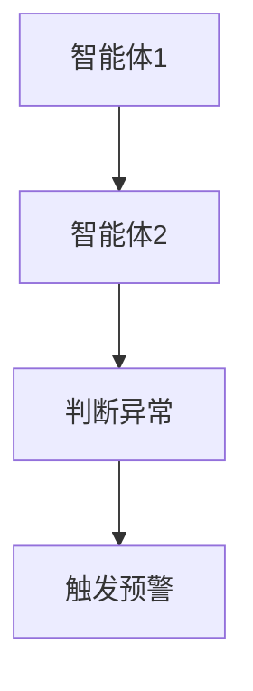
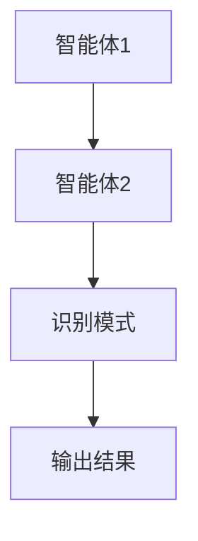
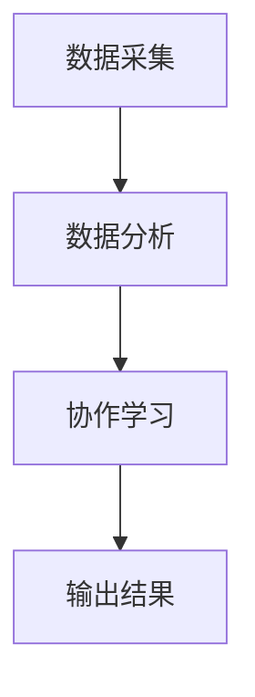

                 


# 多智能体系统在识别行业颠覆性创新中的应用

**关键词**：多智能体系统（MAS）、颠覆性创新、创新识别、智能体协作、系统架构

**摘要**：  
本文探讨了多智能体系统在识别行业颠覆性创新中的应用，分析了多智能体系统的核心概念、颠覆性创新的特征，以及两者结合的优势。通过详细讲解算法原理、系统架构设计和实际案例，展示了如何利用多智能体系统来提高颠覆性创新的识别能力。本文还提供了具体的代码实现和系统设计，帮助读者更好地理解和应用相关技术。

---

## 目录

1. [多智能体系统与颠覆性创新概述](#多智能体系统与颠覆性创新概述)
2. [多智能体系统的基本概念](#多智能体系统的基本概念)
3. [颠覆性创新的定义与特征](#颠覆性创新的定义与特征)
4. [多智能体系统与颠覆性创新的关系](#多智能体系统与颠覆性创新的关系)
5. [多智能体系统在颠覆性创新识别中的算法与模型](#多智能体系统在颠覆性创新识别中的算法与模型)
6. [多智能体系统在颠覆性创新识别中的系统架构](#多智能体系统在颠覆性创新识别中的系统架构)
7. [项目实战：基于MAS的颠覆性创新识别系统](#项目实战基于MAS的颠覆性创新识别系统)
8. [总结与展望](#总结与展望)

---

## 1. 多智能体系统与颠覆性创新概述

### 1.1 多智能体系统的基本概念

#### 1.1.1 多智能体系统的定义
多智能体系统（Multi-Agent System，MAS）是由多个智能体（Agent）组成的分布式系统，这些智能体能够通过通信和协作完成复杂的任务。智能体是具有感知、决策、执行和学习能力的实体，可以是软件程序、机器人或其他智能设备。

#### 1.1.2 多智能体系统的组成要素
- **智能体**：具备自主性、反应性、协作性和学习能力。
- **通信机制**：智能体之间的信息交换方式，如消息传递、状态共享。
- **协调机制**：确保多个智能体协同工作的规则和协议。
- **任务分配**：智能体根据环境动态分配任务的机制。

#### 1.1.3 多智能体系统的分类与特点
- **结构化MAS**：任务明确，智能体之间有严格的分工。
- **非结构化MAS**：任务模糊，智能体需要动态协作。
- **混合MAS**：结合结构化和非结构化的特点。

---

### 1.2 多智能体系统的原理与机制

#### 1.2.1 智能体的自主性与协作性
智能体具有自主决策能力，能够独立完成任务。协作性是指多个智能体通过通信和协调完成共同目标。

#### 1.2.2 多智能体系统的通信与协调机制
- **通信**：智能体之间通过消息传递或共享状态进行信息交换。
- **协调**：通过协商或协议确保智能体的行为一致。

#### 1.2.3 多智能体系统的任务分配与决策
- **任务分配**：根据智能体的能力和环境需求动态分配任务。
- **决策机制**：基于感知信息和协作结果做出决策。

---

## 2. 颠覆性创新的定义与特征

### 2.1 颠覆性创新的背景与概念

#### 2.1.1 颠覆性创新的定义
颠覆性创新是指一种全新的技术、商业模式或产品，能够彻底改变行业现状，取代现有市场领导者。

#### 2.1.2 颠覆性创新与渐进式创新的区别
| 特性 | 颠覆性创新 | 渐进式创新 |
|------|------------|------------|
| 影响 | 根本性改变 | 微小改进 |
| 市场 | 新市场或替代现有市场 | 现有市场 |

#### 2.1.3 颠覆性创新的典型特征
- **技术突破性**：采用新技术或新方法。
- **商业模式创新**：改变传统的商业模式。
- **市场冲击力**：对现有市场产生重大影响。

---

### 2.2 颠覆性创新的识别与预测

#### 2.2.1 颠覆性创新的识别方法
- **基于数据的识别**：通过数据分析发现潜在的创新趋势。
- **基于智能体的识别**：利用MAS的分布式感知能力识别异常信号。

#### 2.2.2 颠覆性创新的预测模型
- **时间序列分析**：预测未来趋势。
- **机器学习模型**：利用历史数据训练模型。

#### 2.2.3 颠覆性创新的影响评估
- **经济影响**：评估创新对行业和市场的经济影响。
- **社会影响**：评估创新对社会和用户的影响。

---

## 3. 多智能体系统在颠覆性创新识别中的应用

### 3.1 多智能体系统在创新识别中的优势

#### 3.1.1 多智能体系统的分布式感知能力
MAS能够从多个角度感知环境信息，发现潜在的创新信号。

#### 3.1.2 多智能体系统的协作学习能力
多个智能体通过协作学习，能够更快速地识别创新趋势。

#### 3.1.3 多智能体系统的动态适应性
MAS能够根据环境变化动态调整识别策略。

---

### 3.2 多智能体系统在颠覆性创新识别中的应用场景

#### 3.2.1 行业颠覆性创新的早期识别
- 通过MAS分析市场数据，发现潜在的颠覆性创新。

#### 3.2.2 市场趋势的预测与分析
- 利用MAS预测市场趋势，辅助企业制定战略。

#### 3.2.3 竞争对手行为的预测与应对
- 分析竞争对手的行为，制定应对策略。

---

## 4. 多智能体系统在颠覆性创新识别中的算法与模型

### 4.1 基于多智能体系统的创新识别算法

#### 4.1.1 基于MAS的异常检测算法
- **算法原理**：通过MAS协作发现数据中的异常点。
- **流程图**：


#### 4.1.2 基于MAS的模式识别算法
- **算法原理**：利用MAS的协作能力识别数据中的模式。
- **流程图**：


#### 4.1.3 基于MAS的事件驱动模型
- **算法原理**：基于事件驱动的MAS协作模型。

---

### 4.2 多智能体系统的数学模型与公式

#### 4.2.1 多智能体系统的状态空间模型
$$ S = \{s_1, s_2, ..., s_n\} $$
其中，$s_i$ 表示第 $i$ 个智能体的状态。

#### 4.2.2 多智能体系统的协作决策模型
$$ D = \argmax_{d} \sum_{i=1}^{n} w_i d_i $$
其中，$w_i$ 是第 $i$ 个智能体的权重，$d_i$ 是第 $i$ 个智能体的决策。

#### 4.2.3 多智能体系统的动态博弈模型
$$ V = \max_{i} \min_{j} v_{ij} $$

---

## 5. 多智能体系统在颠覆性创新识别中的系统架构

### 5.1 系统架构设计

#### 5.1.1 系统功能模块划分
- 数据采集模块：采集市场数据。
- 数据分析模块：分析数据，识别创新信号。
- 协作学习模块：智能体协作学习，优化识别算法。

#### 5.1.2 系统数据流设计
- 数据从外部输入，经过数据采集模块处理后，传输到数据分析模块。
- 数据分析模块输出结果，供协作学习模块优化。

#### 5.1.3 系统通信协议设计
- 使用RESTful API进行智能体之间的通信。

---

### 5.2 系统架构的Mermaid图



---

## 6. 项目实战：基于MAS的颠覆性创新识别系统

### 6.1 项目背景

#### 6.1.1 项目介绍
本项目旨在利用MAS识别科技行业的颠覆性创新。

---

### 6.2 系统实现

#### 6.2.1 环境安装
```bash
pip install numpy matplotlib scikit-learn
```

#### 6.2.2 核心实现
```python
class Agent:
    def __init__(self, id):
        self.id = id
        self.data = []

    def collect_data(self, data):
        self.data.append(data)

    def analyze(self):
        # 简单的异常检测算法
        return max(self.data) > threshold

# 初始化智能体
agents = [Agent(i) for i in range(5)]
threshold = 100

# 收集数据
for agent in agents:
    agent.collect_data(random.randint(0, 200))

# 分析数据
for agent in agents:
    result = agent.analyze()
    if result:
        print(f"Agent {agent.id}检测到异常！")
```

---

## 7. 总结与展望

### 7.1 总结
本文详细介绍了多智能体系统在识别行业颠覆性创新中的应用，通过理论分析和实际案例展示了MAS的优势和潜力。

### 7.2 展望
未来，随着人工智能技术的发展，MAS在颠覆性创新识别中的应用将更加广泛，算法也将更加复杂和高效。

---

**作者**：AI天才研究院 & 禅与计算机程序设计艺术

---

这篇文章通过详细的理论分析和实际案例，全面介绍了多智能体系统在识别行业颠覆性创新中的应用，为读者提供了丰富的知识和实践指导。

