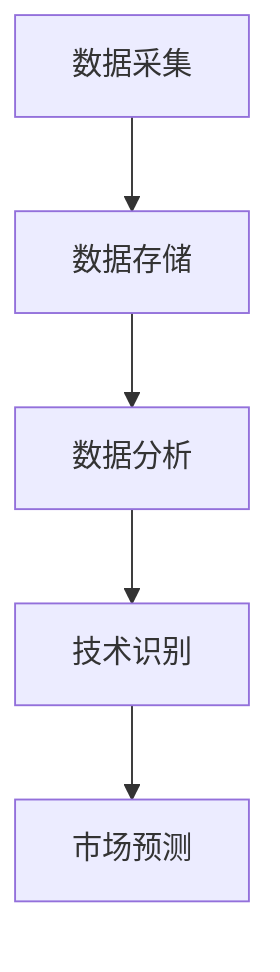
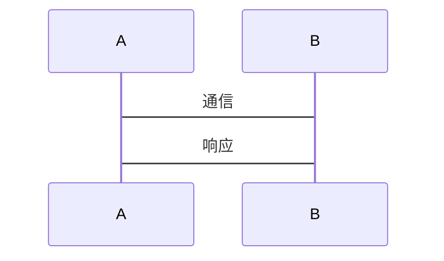

                 


# 多智能体系统在识别行业颠覆性技术中的应用

> 关键词：多智能体系统, 行业颠覆性技术, 技术识别, 系统架构, 应用案例

> 摘要：本文探讨了多智能体系统在识别行业颠覆性技术中的应用，详细分析了多智能体系统的核心概念、颠覆性技术的识别方法以及两者结合的实际应用场景。通过案例分析和系统设计，展示了多智能体系统在技术预测和行业变革中的潜力。

---

## 第一部分: 多智能体系统基础

### 第1章: 多智能体系统概述

#### 1.1 多智能体系统的定义与特点

**1.1.1 多智能体系统的定义**

多智能体系统（Multi-Agent System, 简称MAS）是由多个智能体（Agent）组成的系统，这些智能体能够通过交互协作完成复杂任务。智能体是指具有感知环境、自主决策和行动能力的实体。

**1.1.2 多智能体系统的核心特点**

- **分布式智能**：多个智能体协同工作，避免单点故障。
- **自主性**：每个智能体都能自主决策。
- **反应性**：智能体能够实时响应环境变化。
- **协作性**：智能体之间通过通信和协作完成共同目标。

**1.1.3 多智能体系统与单智能体系统的区别**

| 特性         | 单智能体系统                     | 多智能体系统                     |
|--------------|----------------------------------|----------------------------------|
| 智能体数量   | 1                               | 多                               |
| 分布式计算   | 集中式                         | 分布式                         |
| 系统复杂性   | 较低                            | 较高                            |

**1.1.4 多智能体系统的组成与架构**

- **智能体**：系统的基本单元，具备感知、决策和行动能力。
- **通信机制**：智能体之间交互的通道，如消息传递。
- **协作协议**：智能体协作的规则，如一致性协议。

**1.1.5 多智能体系统的应用场景**

- **分布式计算**：利用多智能体系统的分布式特性处理大规模数据。
- **机器人协作**：多个机器人协同完成任务，如工业自动化。
- **分布式系统**：多个节点协作完成任务，如云计算中的资源分配。

**1.1.6 本章小结**

本章介绍了多智能体系统的定义、特点、组成和应用场景，为后续内容打下基础。

---

## 第二部分: 行业颠覆性技术识别方法

### 第2章: 行业颠覆性技术的定义与特征

#### 2.1 行业颠覆性技术的定义

颠覆性技术是指能够从根本上改变行业现状的技术，通常以低性能但高创新的方式进入市场，逐步取代现有技术。

#### 2.2 行业颠覆性技术的特征

- **低成本**：颠覆性技术通常以较低成本进入市场。
- **高创新性**：具有创新性，能够改变行业规则。
- **渐进式发展**：从边缘市场逐渐扩展到主流市场。

#### 2.3 行业颠覆性技术的识别方法

- **早期信号检测**：通过市场数据和专利分析发现新技术。
- **技术评估**：评估技术的创新性和可行性。
- **市场预测**：预测技术对市场的潜在影响。

#### 2.4 行业颠覆性技术的案例分析

- **数字货币对传统金融的颠覆**：比特币通过区块链技术改变了传统金融体系。
- **人工智能对传统行业的颠覆**：AI技术改变了医疗、教育、制造等多个行业。
- **5G技术对通信行业的颠覆**：5G技术推动了通信技术的升级，改变了物联网和智能家居的发展。

---

## 第三部分: 多智能体系统在颠覆性技术识别中的应用

### 第3章: 多智能体系统在颠覆性技术识别中的核心作用

#### 3.1 多智能体系统在颠覆性技术识别中的优势

- **分布式协作**：多个智能体协同工作，提高识别效率。
- **实时感知**：智能体能够实时感知市场变化，快速响应。
- **自我学习**：智能体具备学习能力，能够优化识别算法。

#### 3.2 多智能体系统识别颠覆性技术的流程

1. **数据采集**：智能体收集市场数据，如专利、论文、新闻等。
2. **特征提取**：提取数据中的技术特征，如关键词、技术领域等。
3. **技术评估**：评估技术的创新性和可行性。
4. **市场预测**：预测技术对市场的潜在影响。

#### 3.3 多智能体系统识别颠覆性技术的算法设计

**3.3.1 算法原理**

颠覆性技术识别算法基于多智能体系统，通过分布式协作和实时感知，对市场数据进行分析和预测。

**3.3.2 算法实现**

使用Python实现多智能体系统识别颠覆性技术的算法：

```python
class Agent:
    def __init__(self, id):
        self.id = id
        self.data = []

    def collect_data(self):
        # 收集市场数据
        pass

    def analyze(self):
        # 分析数据，识别颠覆性技术
        pass

    def communicate(self, other_agent):
        # 与其他智能体通信
        pass

class Multi-AgentSystem:
    def __init__(self, agents):
        self.agents = agents

    def run(self):
        for agent in self.agents:
            agent.collect_data()
            agent.analyze()
            agent.communicate()
```

---

## 第四部分: 多智能体系统在行业颠覆性技术识别中的实际应用

### 第4章: 多智能体系统在行业中的应用案例

#### 4.1 案例分析: 多智能体系统在金融行业的应用

- **应用场景**：识别金融市场的颠覆性技术，如数字货币。
- **实现细节**：多个智能体协同工作，实时监控市场数据，识别潜在的颠覆性技术。

#### 4.2 案例分析: 多智能体系统在医疗行业的应用

- **应用场景**：识别医疗领域的颠覆性技术，如AI诊断工具。
- **实现细节**：智能体通过分析医学文献和临床数据，识别创新技术。

#### 4.3 案例分析: 多智能体系统在制造行业的应用

- **应用场景**：识别制造业的颠覆性技术，如工业4.0。
- **实现细节**：智能体通过分析生产数据和市场趋势，预测技术发展。

---

## 第五部分: 系统架构与实现

### 第5章: 多智能体系统架构设计

#### 5.1 系统设计概述

- **领域模型**：设计系统的功能模块，如数据采集、分析、通信等。
- **架构设计**：采用分层架构，包括数据层、逻辑层、通信层。

#### 5.2 系统架构图



#### 5.3 接口设计

- **数据接口**：智能体之间的数据通信接口。
- **通信接口**：智能体之间的通信协议接口。

#### 5.4 交互序列图



---

## 第六部分: 挑战与未来展望

### 第6章: 当前应用中的挑战

#### 6.1 数据隐私问题

多智能体系统在识别颠覆性技术时，需要处理大量敏感数据，如何保护数据隐私是一个挑战。

#### 6.2 计算资源限制

多智能体系统的运行需要大量的计算资源，如何在资源有限的情况下高效运行是另一个挑战。

#### 6.3 系统集成问题

多智能体系统需要与现有系统集成，如何确保兼容性和稳定性是需要解决的问题。

### 第7章: 未来展望

#### 7.1 技术创新

未来，多智能体系统将更加智能化，能够自主学习和优化识别算法。

#### 7.2 应用拓展

多智能体系统将在更多行业得到应用，如教育、交通、能源等。

#### 7.3 系统优化

通过算法优化和硬件升级，多智能体系统的性能将得到进一步提升。

---

## 附录

### 附录A: 参考文献

- [1] 多智能体系统理论与应用.
- [2] 行业颠覆性技术识别方法.

### 附录B: 工具与资源

- [1] Python编程环境.
- [2] 多智能体系统开发框架.

---

## 作者

作者：AI天才研究院/AI Genius Institute & 禅与计算机程序设计艺术 /Zen And The Art of Computer Programming

---

**注**：以上内容仅为目录大纲和部分章节内容的示例，实际撰写时需要根据具体要求扩展每个章节的内容。

